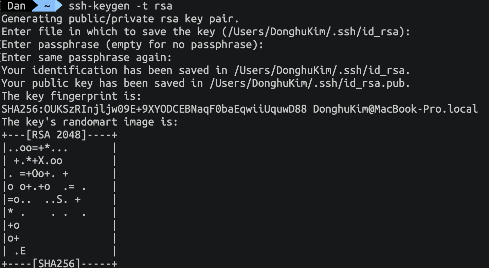

OCI-CLI는 Oracle Cloud Infrastructure 관리 기능을 제공하는 CLI 도구로 본 포스트에서는 OCI-CLI를 설치하고 구성하는 방법에 대해서 설명합니다.  

> 본 블로그의 모든 포스트는 **macOS** 환경에서 테스트 및 작성되었습니다.  


# 설치
먼저 터미널을 열고 다음과 같이 입력해서 OCI-CLI를 설치합니다.

MacOS, Linux, and Unix
```
bash -c "$(curl -L https://raw.githubusercontent.com/oracle/oci-cli/master/scripts/install/install.sh)"
```

Windows (관리자 모드로 Powershell 콘솔을 열고 실행)
```
Set-ExecutionPolicy RemoteSigned

powershell -NoProfile -ExecutionPolicy Bypass -Command "iex ((New-Object System.Net.WebClient).DownloadString('https://raw.githubusercontent.com/oracle/oci-cli/master/scripts/install/install.ps1'))"
```

설치 진행하면 설치 경로를 입력하라고 나오는데, Default로 설치해도 되지만, 필자의 경우는 다음과 같이 경로를 지정해서 설치했습니다.
```
* /Users/{name}/Software/oracle/oci-cli
* /Users/{name}/oracle/oci-cli-bin
* /Users/{name}/oracle/oci-cli-bin/oci-cli-scripts
```

설치가 끝나면 bash_profile에 다음과 같은 내용이 추가됩니다.
```
[[ -e "/Users/DonghuKim/Software/oracle/oci-cli/lib/oracle-cli/lib/python3.6/site-packages/oci_cli/bin/oci_autocomplete.sh" ]] && source "/Users/DonghuKim/Software/oracle/oci-cli/lib/oracle-cli/lib/python3.6/site-packages/oci_cli/bin/oci_autocomplete.sh"
 
export PATH=/Users/DonghuKim/oracle/oci-cli-bin:$PATH
```

# 설정
다음과 같이 입력하고 실행합니다.
```
oci setup config
```

oci setup을 위해 몇가지 정보가 필요합니다.  
첫 번째는 oci config 저장 위치입니다. 기본 경로로 지정했습니다.
```
/Users/{name}/.oci
```

두 번째는 User OCID와 Tenancy OCID가 필요합니다.  
Oracle Cloud Console에서 본인 계정에 대한 OCID와 Tenancy OCID를 확인한 후 동일하게 입력합니다.

User OCID


Tenancy OCID


세 번째는 OCI 사용자 계정에 OCI API를 사용하기 위한 Public Key를 입력해야 합니다.

ssh-keygen으로 생성합니다.
```
ssh-keygen -t rsa
```


Public Key의 내용을 복사해서 OCI Console의 API Key에 Public Key를 등록합니다.


OCI-CLI 설치 및 환경 구성이 모두 끝났습니다.  
다음에는 oci-cli를 활용해서 Oracle Object Storage에 파일을 업로드 하는 부분에 대해서 포스팅 하도록 하겠습니다.