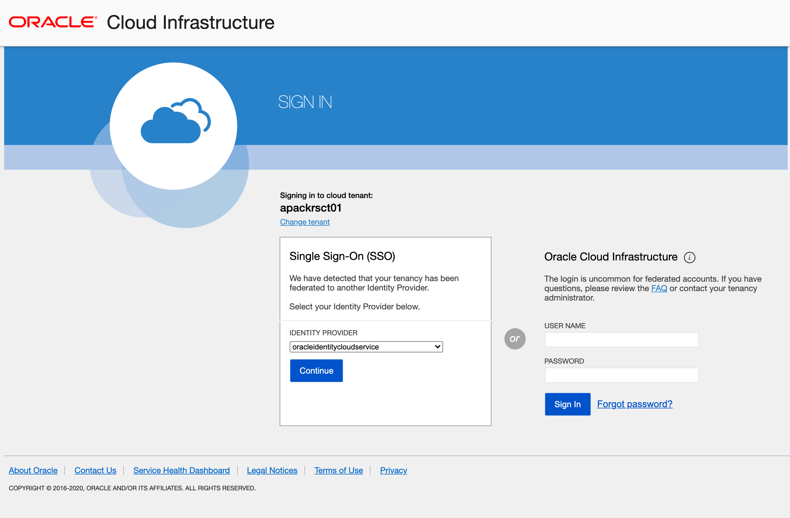
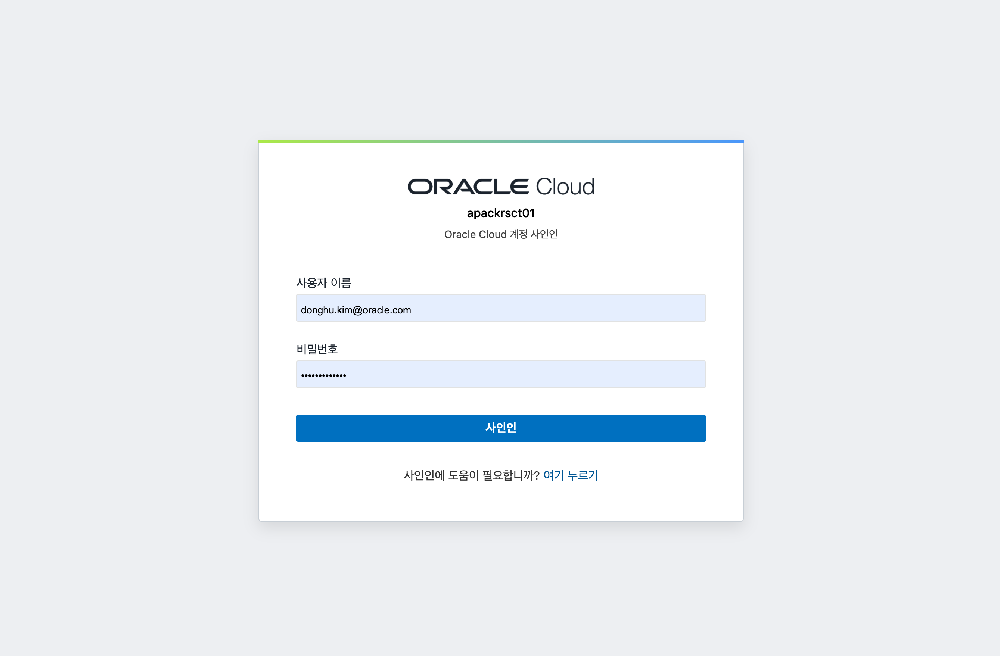
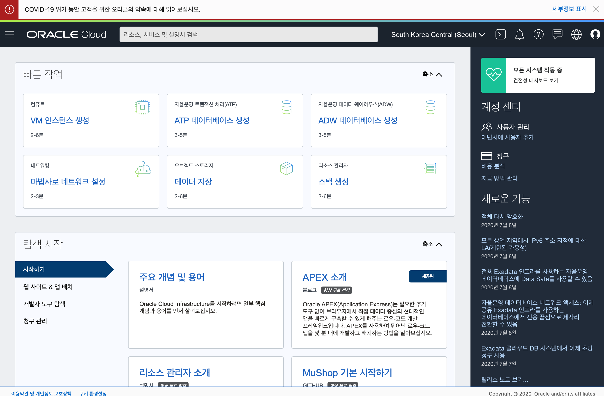
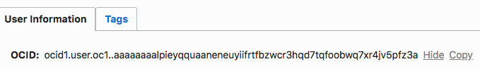
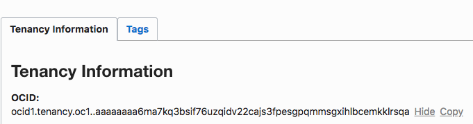
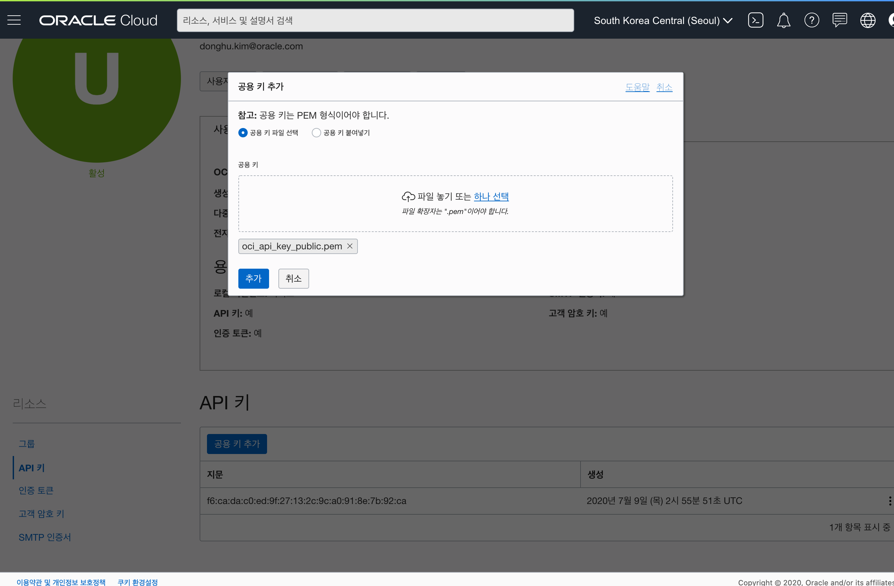

OCI-CLI는 Oracle Cloud Infrastructure 관리 기능을 제공하는 CLI 도구입니다.  
이번 포스팅에서는 OCI-CLI를 설치하고 구성하는 방법에 대해서 살펴보도록 하겠습니다.

> 본 블로그의 모든 포스트는 **macOS** 환경에서 테스트 및 작성되었습니다.  

### 설치
먼저 터미널을 열고 다음과 같이 입력해서 OCI-CLI를 설치합니다.  
Windows는 Powershell 에서 실행합니다.

MacOS, Linux, and Unix
```
bash -c "$(curl -L https://raw.githubusercontent.com/oracle/oci-cli/master/scripts/install/install.sh)"
```

Windows (관리자 모드로 Powershell 콘솔을 열고 실행)
```
Set-ExecutionPolicy RemoteSigned

powershell -NoProfile -ExecutionPolicy Bypass -Command "iex ((New-Object System.Net.WebClient).DownloadString('https://raw.githubusercontent.com/oracle/oci-cli/master/scripts/install/install.ps1'))"
```

설치가 시작되면 설치 경로를 입력하라고 나오는데, 기본 경로로 설치합니다. (계속해서 엔터)  
설치가 완료되면 bash_profile에 다음과 같은 내용이 추가됩니다.  
macOS 환경 기준이므로, Windows의 경우는 확인이 필요합니다.
```
[[ -e "/Users/DonghuKim/Software/oracle/oci-cli/lib/oracle-cli/lib/python3.6/site-packages/oci_cli/bin/oci_autocomplete.sh" ]] && source "/Users/DonghuKim/Software/oracle/oci-cli/lib/oracle-cli/lib/python3.6/site-packages/oci_cli/bin/oci_autocomplete.sh"
 
export PATH=/Users/DonghuKim/oracle/oci-cli-bin:$PATH
```

### 설정
oci 설치가 완료되면 Oracle Cloud 연결을 위한 정보를 셋업해야 합니다.  
아래 명령어를 실행합니다.

```
oci setup config
```

oci setup을 위해 몇가지 정보가 필요합니다.  
첫 번째는 oci config 저장 위치입니다. 기본 위치로 선택 (엔터)
```
/Users/{name}/.oci
```

두 번째는 User OCID와 Tenancy OCID가 필요합니다. 이 정보는 OCI Console에 로그인하여 확인합니다. 먼저 OCI에 로그인합니다. 아래 URL을 통해서 Seoul Region으로 접속합니다. 
```
https://console.ap-seoul-1.oraclecloud.com
```

OCI Tenancy 이름을 입력하고 Continue 클릭


Single Sign-On (SSO) 아래 Continue 버튼 클릭


사용자 이름과 비밀번호 입력 후 사인인 버튼 클릭


OCI Console Home


User OCID와 Tenancy OCID는 다음과 같이 확인할 수 있습니다.

User OCID
> 우측 상단 사용자 아이콘 클릭 -> 프로파일 밑 사용자 아이디 선택 (oracleidentitycloudservice로 시작) -> OCID 복사 -> terminal에 입력 후 엔터



Tenancy OCID
> 우측 상단 사용자 아이콘 클릭 -> Tenancy 선택 -> OCID 복사 -> terminal에 입력 후 엔터



Region  
> ap-seoul-1

마지막으로 API Signing RSA key 생성을 위해 Y 를 입력 후 엔터를 입력합니다.
생성된 Public Key의 내용을 복사해서 OCI Console의 API Key에 Public Key를 등록합니다.

API Key 등록
> 우측 사용자 아이콘 클릭 -> 좌측 API 키 선택 -> 공용 키 파일 선택 (~/.oci/oci_api_key_public.pem) -> 추가



ocicli 테스트
> oci os ns get

여기까지 OCI-CLI 설치 및 환경 구성을 모두 마쳤습니다.  
OCI-CLI를 통해서 간단하게는 Oracle Object Storage에 파일을 업로드 하는 것을 포함해서, 전반적인 Infra 관리를 할 수 있습니다.