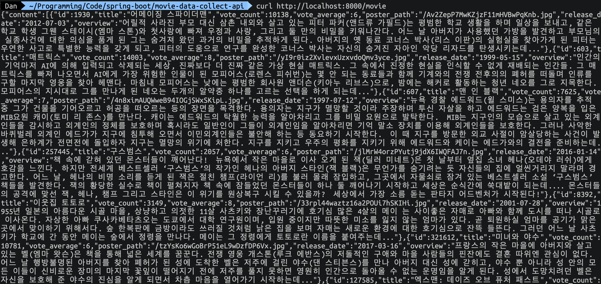

이전 포스트에서는 Spring Boot에서 Oracle DB연동을 위한 Hikari Connection Pool 설정하였습니다.  
이번에는 Spring JPA에서 Oracle DB의 데이터를 조회하는 부분을 살펴보겠습니다.

> 본 블로그의 모든 포스트는 **macOS** 환경에서 테스트 및 작성되었습니다.  

# Table 생성

먼저 Oracle DB에 테이블을 하나 생성합니다.
```sql
CREATE TABLE MOVIE (
    ID NUMBER NOT NULL,
    TITLE VARCHAR2(100),
    VOTE_COUNT NUMBER,
    VOTE_AVERAGE VARCHAR2(10),
    POSTER_PATH VARCHAR2(100),
    RELEASE_DATE VARCHAR2(10),
    OVERVIEW VARCHAR2(4000),
    CONSTRAINT MOVIE_PK PRIMARY KEY (ID)
)
```

데이터를 몇개 만들어볼까요?
```sql
Insert into MOVIE (ID,TITLE,VOTE_COUNT,VOTE_AVERAGE,POSTER_PATH,OVERVIEW,RELEASE_DATE) values (1930,'어메이징 스파이더맨',10138,6.5,'/Av2ZepP7MwKZjzF11mHVBwPqKnb.jpg','어릴적 사라진 부모 대신 삼촌 내외와 살고 있는 피터 파커(앤드류 가필드)는 평범한 학교 생활을 하며 일상을 보내고, 같은 학교 학생 그웬 스테이시(엠마 스톤)와 첫사랑에 빠져 우정과 사랑, 그리고 둘 만의 비밀을 키워나간다. 어느 날 아버지가 사용했던 가방을 발견하고 부모님의 실종사건에 대한 의심을 품게 된 그는 숨겨져 왔던 과거의 비밀을 추적하게 된다. 아버지의 옛 동료 코너스 박사(리스 이판)의 실험실을 찾아가게 된 피터는 우연한 사고로 특별한 능력을 갖게 되고, 피터의 도움으로 연구를 완성한 코너스 박사는 자신의 숨겨진 자아인 악당 리자드를 탄생시키는데...','2012-07-03');
Insert into MOVIE (ID,TITLE,VOTE_COUNT,VOTE_AVERAGE,POSTER_PATH,OVERVIEW,RELEASE_DATE) values (603,'매트릭스',14003,8.1,'/yI9r0iz2XvlevxUzxvdoQmv3yce.jpg','인간의 기억마저 AI에 의해 입력되고 삭제되는 세상, 진짜보다 더 진짜 같은 가상 현실 매트릭스. 그 속에서 진정한 현실을 인식할 수 없게 재배되는 인간들. 그 매트릭스를 빠져 나오면서 AI에게 가장 위험한 인물이 된 모피어스(로렌스 피쉬번)는 몇 안 되는 동료들과 함께 기계와의 전쟁 전후의의 폐허를 떠돌며 인류를 구할 마지막 영웅을 찾아 헤맨다. 마침내 모피어스는 낮에는 평범한 회사원 앤더슨(키아누 리브스)으로, 밤에는 해커로 활동하는 청년 네오를 그로 지목한다. 모피어스의 지시대로 그를 만나게 된 네오는 두개의 알약중 하나를 고르는 선택을 하게 되는데...','1999-05-15');
Insert into MOVIE (ID,TITLE,VOTE_COUNT,VOTE_AVERAGE,POSTER_PATH,OVERVIEW,RELEASE_DATE) values (607,'맨 인 블랙',7625,7,'/4n8ximAUQWweB94IOGjSWxSKipL.jpg','뉴욕 경찰 에드워드(윌 스미스)는 용의자를 추적 중 그가 건물을 기어오르고 허공을 떠오르는 등의 장면을 목격한다. 용의자는 지구가 멸망할 것이라 주장하며 투신 자살을 하고 에드워드는 검은 양복을 입은 MIB요원 캐이(토미 리 존스)를 만난다. 캐이는 에드워드의 탁월한 능력을 알아차리고 그를 비밀 요원으로 발탁한다.  MIB는 지구인의 모습으로 살고 있는 외계인들을 감시하고 외계인의 정체를 보호하며 혹시라도 일반인이 그들이 외계인임을 알아차리면 기억 말소 장치를 이용해 외계인들을 보호한다. 그러나 사악한 바퀴벌레 외계인 에드가가 지구에 침투해 오면서 이민외계인들은 불안해 하는 등 동요하기 시작한다.  이 때 지구를 방문한 외교 사절이 암살당하는 사건이 발생해 은하계가 전면전에 돌입하자 지구는 멸망의 위기에 처한다. 지구를 지키고 우주의 평화를 지키기 위해 에드워드와 케이는 에드가와의 결전을 준비하는데...','1997-07-12');
Insert into MOVIE (ID,TITLE,VOTE_COUNT,VOTE_AVERAGE,POSTER_PATH,OVERVIEW,RELEASE_DATE) values (257445,'구스범스',2057,6.2,'/jlMrW4orzPYutj9jdX6IWQFAJ7n.jpg','책 속에 갇혀 있던 몬스터들이 깨어난다!  뉴욕에서 작은 마을로 이사 오게 된 잭(딜러 미네트)은 첫 날부터 옆집 소녀 헤나(오데야 러쉬)에게 호감을 느낀다. 하지만 전세계 베스트셀러 ‘구스범스’의 작가인 헤나의 아버지 스타인(잭 블랙)은 무언가를 숨기려는 듯 자신들의 집에 얼씬거리지 말라며 경고한다. 어느 날, 헤나의 비명 소리를 듣게 된 잭은 절친 챔프(라이언 리)를 불러 몰래 잠입하고, 그곳에서 자물쇠로 잠겨 있는 베스트셀러 소설 ‘구스범스’ 책들을 발견한다. 잭의 황당한 실수로 책이 펼쳐지자 책 속에 잠들었던 몬스터들이 하나 둘 깨어나기 시작하고 세상은 순식간에 쑥대밭이 되는데.... 몬스터들의 공격에 맞선 잭, 헤나, 챔프 그리고 스타인은 이 위기를 원상복구 시킬 수 있을까?  세상에서 가장 소름 돋는 판타지 어드벤처가 시작된다!','2016-01-14');
Insert into MOVIE (ID,TITLE,VOTE_COUNT,VOTE_AVERAGE,POSTER_PATH,OVERVIEW,RELEASE_DATE) values (8392,'이웃집 토토로',3149,8.1,'/33rpl44waztz16a2POUi7hSKIHi.jpg','1955년 일본의 아름다운 시골 마을, 상냥하고 의젓한 11살 사츠키와 장난꾸러기에 호기심 많은 4살의 메이 는 사이좋은 자매로 아빠와 함께 도시를 떠나 시골로 이사온다. 자상한 아빠 쿠사카베타츠오는 도쿄에서 대학 연구원이며, 입원 중이지만 따뜻한 미소를 잃지 않는 엄마가 있다. 곧 퇴원하실 엄마를 공기가 맑은 곳에서 맞이하기 위해서다. 숲 한복판에 금방이라도 쓰러질 것처럼 낡은 집을 보며 자매는 새로운 환경에 대한 호기심으로 잔뜩 들뜬다. 그러던 어느 날 사츠키가 학교에 간 동안 메이는 숲에서 정령을 만나다. 메이는 그 정령에게 토토로란 이름을 붙여주는데...','2001-07-28');
Insert into MOVIE (ID,TITLE,VOTE_COUNT,VOTE_AVERAGE,POSTER_PATH,OVERVIEW,RELEASE_DATE) values (321612,'미녀와 야수',10781,6.9,'/tzYsKo6wGoBrP51eL9wDzfDP6Vx.jpg','프랑스의 작은 마을에 아버지와 살고 있는 벨(엠마 왓슨)은 책을 통해 넓은 세계를 꿈꾼다. 전쟁 영웅 개스톤(루크 에반스)의 저돌적인 구애와 마을 사람들의 핀잔에도 결혼 따위엔 관심이 없다. 어느 날 행방불명된 아버지를 찾아 폐허가 된 성에 도착한 벨은 저주에 걸린 야수(댄 스티븐스)를 만나 아버지 대신 성에 갇히고, 야수 뿐 아니라 성 안의 모든 이들이 신비로운 장미의 마지막 꽃잎이 떨어지기 전에 저주를 풀지 못하면 영원히 인간으로 돌아올 수 없는 운명임을 알게 된다. 성에서 도망치려던 벨은 자신을 보호해 준 야수의 진심을 알게 되면서 차츰 마음을 열어가기 시작하는데...','2017-03-16');
Insert into MOVIE (ID,TITLE,VOTE_COUNT,VOTE_AVERAGE,POSTER_PATH,OVERVIEW,RELEASE_DATE) values (127585,'엑스맨: 데이즈 오브 퓨처 패스트',9779,7.5,'/iHavwS2sqjTlR146SCTGcvAMlaZ.jpg','돌연변이들을 멸종시키기 위해 제작된 로봇 센티넬이 인간들까지 모조리 말살하는 2023년. 인류의 종말이 코앞에 닥친 상황에서 프로페서X(패트릭 스튜어트)와 매그니토(이안 매켈런)는 과거를 통해 미래의 운명을 바꾸고자 한다. 울버린(휴 잭맨)은 트라스크(피터 딘클리지)가 센티넬을 개발하는 것을 막기 위해 1973년으로 보내진다. 1973년의 찰스(제임스 맥어보이)는 절망에 빠진 채 행크 맥코이(니콜라스 홀트)와 함께 은둔 생활을 하고 있고, 에릭(마이클 파스빈더)은 케네디 대통령 암살 용의자로 붙잡혀 펜타곤 지하 깊숙한 곳에 위치한 수용소에 갇혀 있다.','2014-05-22');
Insert into MOVIE (ID,TITLE,VOTE_COUNT,VOTE_AVERAGE,POSTER_PATH,OVERVIEW,RELEASE_DATE) values (166428,'드래곤 길들이기 3',1473,7.6,'/tR7qCJvVql0OQ42TzE1T6GUxjsI.jpg','바이킹 족장으로 거듭난 히컵과 그의 영원한 친구 투슬리스가 누구도 찾지 못했던 드래곤의 파라다이스 히든월드를 찾아 떠나는 마지막 모험을 담은 스펙터클 액션 어드벤처','2019-01-30');
Insert into MOVIE (ID,TITLE,VOTE_COUNT,VOTE_AVERAGE,POSTER_PATH,OVERVIEW,RELEASE_DATE) values (495925,'도라에몽: 진구의 보물섬',9,6.8,'/nWe3eY9YZC2EG5PFwIAENiqay4J.jpg','보물을 찾기로 결심한 진구는 도라에몽의 ‘보물찾기 지도’로 수수께끼 섬을 발견한다.  ‘노진구올라호’를 타고 보물섬으로 향하던 도라에몽과 친구들은 해적에게 습격 당하고 이슬이까지 납치되고 마는데…  우연히 바다에서 표류하던 소년 플록과 앵무새 퀴즈를 만나 보물섬의 비밀에 대해 알게 된다! 과연 캡틴도라와 친구들은 수수께끼 섬에 잠든 환상의 보물을 찾을 수 있을까?','2018-08-15');
Insert into MOVIE (ID,TITLE,VOTE_COUNT,VOTE_AVERAGE,POSTER_PATH,OVERVIEW,RELEASE_DATE) values (287947,'샤잠!',948,7.3,'/sPZxApU8d90Czd11S60UqOhuP9R.jpg','솔로몬의 지혜, 헤라클레스의 힘, 아틀라스의 체력, 제우스의 권능, 아킬레스의 용기, 머큐리의 스피드까지 우연히 슈퍼 파워를 얻게 된 소년. 자신의 능력을 깨닫고 악당을 물리치는 슈퍼히어로로 다시 태어난다! 주문을 외쳐라, ‘샤잠’!','2019-04-03');
Insert into MOVIE (ID,TITLE,VOTE_COUNT,VOTE_AVERAGE,POSTER_PATH,OVERVIEW,RELEASE_DATE) values (299537,'캡틴 마블',3832,7.2,'/jWd9tWuoDPN561r7vp4ekngEe7f.jpg','1995년, 공군 파일럿 시절의 기억을 잃고 크리족 전사로 살아가던 캐럴 댄버스(브리 라슨)가 지구에 불시착한다. 쉴드 신참 요원 닉 퓨리(사무엘 L. 잭슨)에게 발견되어 팀을 이룬 그들은 지구로 향하는 더 큰 위협을 감지하고 힘을 합쳐 전쟁을 끝내야 하는데…','2019-03-06');
Insert into MOVIE (ID,TITLE,VOTE_COUNT,VOTE_AVERAGE,POSTER_PATH,OVERVIEW,RELEASE_DATE) values (329996,'덤보',832,6.7,'/ffiqLwHHHRKXs6cXKj0278qPi8H.jpg','몸보다 훨씬 큰 귀를 가지고 태어나, 뒤뚱거리는 모습으로 서커스단의 웃음거리가 된 ‘덤보’. 어느 날 왕년의 서커스 스타 ‘홀트(콜린 파렐)’와 그의 아이들, 밀리와 조가 ’덤보’가 하늘을 날 수 있다는 것을 알게 되고, 유능한 사업가 ‘반데비어(마이클 키튼)’가 ‘덤보’를 스타로 만들기 위해 접근한다. 매력적인 공중 곡예사 ‘콜레트(에바 그린)’와 함께 하늘을 날게 된 ‘덤보’는 그의 친구들과 함께 환상적인 쇼를 둘러싼 어둠의 비밀을 발견하게 되는데…','2019-03-27');
Insert into MOVIE (ID,TITLE,VOTE_COUNT,VOTE_AVERAGE,POSTER_PATH,OVERVIEW,RELEASE_DATE) values (299536,'어벤져스: 인피니티 워',12647,8.3,'/kmP6viwzcEkZeoi1LaVcQemcvZh.jpg','타노스(조시 브롤린)는 6개의 인피니티 스톤을 획득해 신으로 군림하려 한다. 그것은 곧 인류의 절반을 학살해 우주의 균형을 맞추겠다는 뜻. 타노스는 닥터 스트레인지(베네딕트 컴버배치)가 소유한 타임 스톤, 비전(폴 베타니)의 이마에 박혀 있는 마인드 스톤을 차지하기 위해 지구를 침략한다. 아이언맨(로버트 다우니 주니어)과 스파이더맨(톰 홀랜드)은 가디언즈 오브 갤럭시의 멤버들과 타노스를 상대한다. 지구에선 캡틴 아메리카(크리스 에반스), 완다(엘리자베스 올슨), 블랙 위도우(스칼렛 요한슨), 블랙 팬서(채드윅 보스먼) 등이 비전을 지키기 위해 뭉친다.','2018-04-26');
```

테이블 구조와 동일한 Spring Entity Class를 하나 만들겠습니다.
```java
package com.movie.repository.entity;

import java.io.Serializable;

import javax.persistence.Column;
import javax.persistence.Entity;
import javax.persistence.Id;
import javax.persistence.Table;

@Entity
@Table(name = "MOVIE")
public class Movie implements Serializable {
    @Column(name = "ID")
    @Id
    private int id;

    @Column(name = "TITLE")
    private String title;

    @Column(name = "VOTE_COUNT")
    private int vote_count;

    @Column(name = "VOTE_AVERAGE")
    private String vote_average;

    @Column(name = "POSTER_PATH")
    private String poster_path;

    @Column(name = "RELEASE_DATE")
    private String release_date;

    @Column(name = "OVERVIEW")
    private String overview;

    public int getId() {
        return this.id;
    }

    public void setId(int id) {
        this.id = id;
    }

    public Movie id(int id) {
        this.id = id;
        return this;
    }

    public String getTitle() {
        return this.title;
    }

    public void setTitle(String title) {
        this.title = title;
    }

    public Movie title(String title) {
        this.title = title;
        return this;
    }

    public int getVote_count() {
        return this.vote_count;
    }

    public void setVote_count(int vote_count) {
        this.vote_count = vote_count;
    }

    public Movie vote_count(int vote_count) {
        this.vote_count = vote_count;
        return this;
    }

    public String getVote_average() {
        return this.vote_average;
    }

    public void setVote_average(String vote_average) {
        this.vote_average = vote_average;
    }

    public Movie vote_average(String vote_average) {
        this.vote_average = vote_average;
        return this;
    }

    public String getPoster_path() {
        return this.poster_path;
    }

    public void setPoster_path(String poster_path) {
        this.poster_path = poster_path;
    }

    public Movie poster_path(String poster_path) {
        this.poster_path = poster_path;
        return this;
    }

    public String getRelease_date() {
        return this.release_date;
    }

    public void setRelease_date(String release_date) {
        this.release_date = release_date;
    }

    public Movie release_date(String release_date) {
        this.release_date = release_date;
        return this;
    }

    public String getOverview() {
        return this.overview;
    }

    public void setOverview(String overview) {
        this.overview = overview;
    }

    public Movie overview(String overview) {
        this.overview = overview;
        return this;
    }
}
```

다음은 JpaRepository를 확장해서 MovieRepository interface를 작성합니다.
```java
package com.movie.repository.jpa;

import com.movie.repository.entity.Movie;

import org.springframework.data.jpa.repository.JpaRepository;
import org.springframework.stereotype.Repository;

@Repository
public interface MovieRepository extends JpaRepository<Movie, Integer> {
}
```

JpaRepository의 findAll과 findById를 사용할 겁니다. 호출하기 위한 Controller를 작성합니다.  
Autowired로 MovieRepository를 주입한 후 Spring Pageable을 통해서 Paging이 되는 findAll 메소드와 id를 Path Parameter로 갖는 findMovieById 메소드를 작성합니다.  
Pageable을 사용하게 되면, findAll에서 페이징을 가능하게 해줍니다. 파라미터는 page, size, sort가 가능합니다.  
각각 /movie 와 /movie/{id} 로 호출되며, JSON으로 결과가 반환됩니다.
```java
package com.movie.controller;

import java.util.Optional;

import com.movie.repository.entity.Movie;
import com.movie.repository.jpa.MovieRepository;

import org.slf4j.Logger;
import org.slf4j.LoggerFactory;
import org.springframework.beans.factory.annotation.Autowired;
import org.springframework.boot.SpringApplication;
import org.springframework.data.domain.Page;
import org.springframework.data.domain.Pageable;
import org.springframework.web.bind.annotation.PathVariable;
import org.springframework.web.bind.annotation.RequestMapping;
import org.springframework.web.bind.annotation.RequestMethod;
import org.springframework.web.bind.annotation.ResponseBody;
import org.springframework.web.bind.annotation.RestController;

@RestController
public class MovieCollectController {
    @Autowired
    MovieRepository movieRepository;

    Logger logger = LoggerFactory.getLogger(MovieCollectController.class);

    @RequestMapping(value = "/movie", method = RequestMethod.GET)
    public Page<Movie> findMovies(Pageable pageable) throws Exception {
        Page<Movie> movie = movieRepository.findAll(pageable);
        return movie;
    }

    @RequestMapping(value = "/movie/{id}", method = RequestMethod.GET)
    @ResponseBody
    public Optional<Movie> findMovieById(@PathVariable(value = "id") int id) throws Exception {
        Optional<Movie> movie = movieRepository.findById(id);

        return movie;
    }

    public static void main(String[] args) {
        SpringApplication.run(MovieCollectController.class, args);
    }
}
```

테스트
```
curl http://localhost:8000/movie

curl http://localhost:8000/movie?size=10

curl http://localhost:8000/movie/1930
```

결과
