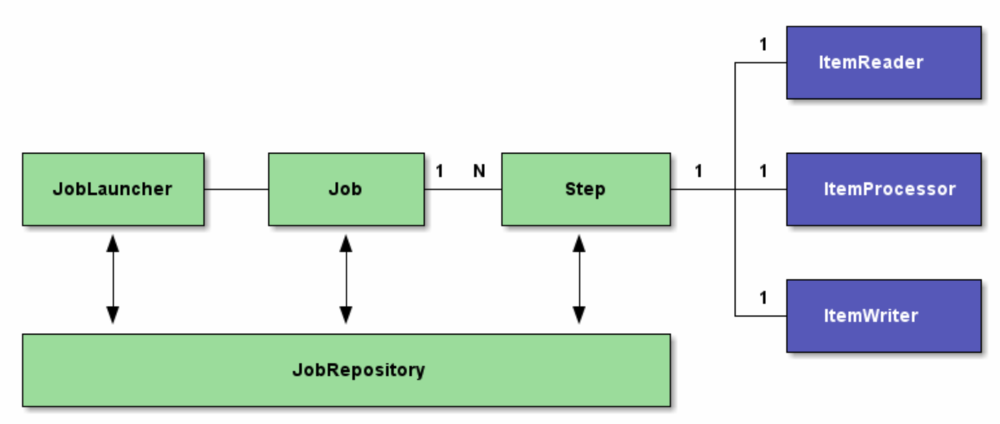

[Spring Boot에서 Oracle ADW 연동](archivers/spring-boot-rest-batch-adw-1)에 이어서 이번에는 Spring Batch와 REST Client를 활용해서 전국 부동산 실거래 데이터를 Open API를 통해서 수집하는 내용을 정리한 포스트입니다.

> 본 블로그의 모든 포스트는 **macOS** 환경에서 테스트 및 작성되었습니다.  

# 오픈 API
오픈 API는 국토교통부에서 제공하는 Open API를 활용했습니다. 공공 데이터 포털에서도 제공합니다.
공공 데이터 포털에 로그인 한 후에 API 사용을 위한 service key를 발급받으면, 개발 환경에서 일 1,000번의 트랜잭션까지 사용 가능합니다.
```
https://www.data.go.kr/dataset/3050988/openapi.do
```

필자가 사용한 API는 국토교통부 실거래가 API 중에서 아파트, 단독/다가구, 연립다세대 3가지 입니다.
3개의 REST API URL과 Service Key는 application.properties 에 다음과 같이 설정했습니다.
```properties
# 발급받은 서비스 키
open.api.public.data.servicekey={발급받은 서비스 키}
# 아파트 실거래 정보 조회
open.api.public.data.apttrade.url=http://openapi.molit.go.kr:8081/OpenAPI_ToolInstallPackage/service/rest/RTMSOBJSvc/getRTMSDataSvcAptTrade
# 단독/다가구 실거래 정보 조회
open.api.public.data.housetrade.url=http://openapi.molit.go.kr:8081/OpenAPI_ToolInstallPackage/service/rest/RTMSOBJSvc/getRTMSDataSvcSHTrade
# 연립다세대 실거래 정보 조회
open.api.public.data.mentiontrade.url=http://openapi.molit.go.kr:8081/OpenAPI_ToolInstallPackage/service/rest/RTMSOBJSvc/getRTMSDataSvcRHTrade
```

# 배치 시나리오
시나리오는 3개의 Open API를 병렬로 호출해서 가져온 JSON 데이터를 Oracle ADW에 있는 3개의 테이블에 적재하는 내용의 시나리오 입니다.

# Spring Batch Config
여러가지 설정 옵션이 있겠지만, 여기서는 application.properties에 두가지 부분만 설정했습니다.  
initialize-schema는 always로 할 경우 연결된 DB에 Batch job 이력을 저장할 테이블이 없을 경우 자동으로 생성하게 됩니다.  
job.enabled 는 true일 경우 서버 기동 시 Job이 실행되는데, 여기서는 REST 서비스로 노출해서 외부에서 실행되도록 개발할 예정이라 false로 설정했습니다.

```properties
spring.batch.initialize-schema=always
spring.batch.job.enabled=false
```

# Spring Batch 구성
Spring Batch에서는 크게 Job을 실행하기 위한 JobLauncher와 Job, 그리고 하나의 Job에서 구동되는 Step이 다수 연결됩니다. 여기에 하나의 Step을 처리하기 위해 Reader, Processor, Writer를 사용할 수 있습니다. 물론 Step에서 tasklet을 사용할 수 있지만, 여기서는 Reader, Processor, Writer를 사용했습니다.  
동작은 JobLauncher에서 지정한 Job을 실행합니다. 해당 Job에서는 여러개의 Step을 병렬 혹은 직렬로 실행하게 됩니다. 각 Step에서는 데이터 소스(여기서는 Open API)에서 정보를 가져오는 Reader, 데이터를 Writer로 넘기기 전에 특정 작업을 할 수 있는 Processor, 마지막으로 타겟 데이터 소스(여기서는 ADW)로 저장하기 위한 Writer로 가 실행됩니다.  



<Spring Batch Architecture - 참고 : https://dzone.com/articles/spring-batch>

# Spring Batch 구성
우선 Spring REST Client를 통해서 3개의 Open API를 호출하여 데이터를 가져오는 Reader를 3개 생성합니다. 3개의 Reader가 가져오는 데이터와 호출하는 Open API만 다르기 때문에 아파트에 대한 실거래 정보를 가져오는 부분만 설명합니다. 아래는 아파트 실거래 정보를 가져오는 Reader에 대한 전체 코드입니다. ItemReader를 구현했습니다.  

> Reader, Processor, Writer는 기본은 애플리케이션 영역에서 Singleton입니다.  
하지만, Step 단위로 인스턴스화 할 수 있는데 @StepScope를 사용하면 가능합니다.  

## Spring Batch Reader
> 사실 Reader에서 StepScope를 사용 했는데, 뒤에 보면 알겠지만, Step을 정의하는 부분에 Chunk 사이즈를 1로 지정했습니다. Chunk 사이즈가 1 이상이라면 Step내의 Reader, Processor, Writer가 해당 Chunk 사이즈 단위로 트랜잭션이 일어나는데, 만약 StepScope를 지정하지 않은 상태라면 모든 Reader, Processor, Writer가 애플리케이션 레벨에서 Singleton으로 동작하면서 각 멤버의 데이터를 침해해 꼬이는 현상이 발생하더군요. 따라서, @StepScope를 주게되면 각각이 Step 단위로 인스턴스화되기 때문에 이런 현상이 사라집니다. 물론 @StepScope를 사용하지 않고 Chunk 사이즈를 1로 해도 이슈가 사라집니다. 여기서는 Chunk 사이즈도 1이고 @StepScope도 설정했는데, 이 경우는 어차피 하나의 Step 관련 인스턴스만 생성되기 때문에 Singleton으로 동작하는 것과 동일합니다. 

> addressSiGuJpaRepository가 있습니다. 제공되는 Open API는 법정동 코드가 필요한데요. 이 코드는 현재 [행정표준코드관리시스템](https://www.code.go.kr/stdcode/regCodeL.do)에서 파일 형태로 제공하고 있습니다. 이 데이터를 DB화 해서 전국 법정동 코드를 조회하는 역할을 addressSiGuJpaRepository가 합니다.

> 요약하면, 한번의 Reader에서는 먼저 모든 법정동 코드를 가져오고 각 법정동 코드(e.g. 삼성동)와 계약일자(년/월)를 Open API의 파라미터로 전달해서 가져온 데이터를 Writer로 넘기는데, 이게 1번의 트랜잭션이 됩니다.
Reader 내의 read 메소드에서 전국 법정동 코드를 가져오고, Array에 담은 상태에서 하나씩 빼와 fetchAptTradeDTOFromAPI 메소드로 코드를 전달하고 이 메소드 안에서 restTemplate을 통해 Open API를 호출해서 결과를 Processor 혹은 Writer로 넘기는 구조입니다. REST 반환되는 데이터가 없을 경우 null을 반환하면 Job이 끝나버리기 때문에 getDummyAptTrade에서 더미 데이터를 반환하도록 했습니다. 

```java
package com.oracle.adw.batch.RealEstateTrade.reader;

import java.io.IOException;
import java.net.URI;
import java.util.ArrayList;
import java.util.List;

import com.fasterxml.jackson.core.type.TypeReference;
import com.fasterxml.jackson.databind.JsonNode;
import com.fasterxml.jackson.databind.ObjectMapper;
import com.oracle.adw.batch.RealEstateTrade.dto.AptTradeDTO;
import com.oracle.adw.repository.entity.Korea_Address_Sigu;
import com.oracle.adw.repository.jpa.AddressSiGuJpaRepository;

import org.slf4j.Logger;
import org.slf4j.LoggerFactory;
import org.springframework.batch.core.configuration.annotation.StepScope;
import org.springframework.batch.item.ItemReader;
import org.springframework.beans.factory.annotation.Autowired;
import org.springframework.beans.factory.annotation.Value;
import org.springframework.context.annotation.Configuration;
import org.springframework.http.ResponseEntity;
import org.springframework.web.client.RestTemplate;

@Configuration
@StepScope
public class RESTRealEstateAptTradeReader implements ItemReader<List<AptTradeDTO>> {

    @Autowired
    private AddressSiGuJpaRepository addressSiGuJpaRepository;

    @Value("${open.api.public.data.servicekey}")
    private String serviceKey;

    @Value("${open.api.public.data.apttrade.url}")
    private String resturl;

    private RestTemplate restTemplate;
    private int nextAddressSiGuIndex;
    private List<Korea_Address_Sigu> addressSiGu;
    @Value("#{jobParameters[month]}")
    private String month;

    private static final Logger logger = LoggerFactory.getLogger(RESTRealEstateAptTradeReader.class);

    public RESTRealEstateAptTradeReader(RestTemplate restTemplate) {
        this.restTemplate = restTemplate;
        nextAddressSiGuIndex = 0;
    }

    @Override
    public List<AptTradeDTO> read() throws Exception {

        logger.debug("Reading the information of the next AptTrade");
        logger.debug("======== nextAddressSiGuIndex : " + nextAddressSiGuIndex + "=========");
        logger.debug("jobparameter month : " +month);
        // 각 지역별로 체크, 모든 지역을 다 조회하여 Read하면 완료. (특정 지역은 데이터가 없을 수 있음)
        if (addressSiGuDataIsNotInitialized()) {
            addressSiGu = addressSiGuJpaRepository.findAll();

            logger.info("[RESTRealEstateAptTradeReader.class] addressSiGuData Initialized");
        }

        Korea_Address_Sigu nextAddressSiGu = null;

        logger.debug("addressSiGu.size() : " + addressSiGu.size());
        if (nextAddressSiGuIndex < addressSiGu.size()) {
            nextAddressSiGu = addressSiGu.get(nextAddressSiGuIndex);
            nextAddressSiGuIndex++;
        } else {
            logger.debug("nextAddressSiGuIndex is " + nextAddressSiGuIndex + " and this job has finished.");
            logger.debug("nextAddressSiGuIndex and addressSiGu is initialized");
            month = null;
            addressSiGu = null;
            nextAddressSiGuIndex = 0;
            return null;
        }

        logger.debug("month : " + month);

        logger.info(nextAddressSiGu.getSi() + " " + nextAddressSiGu.getGu() + "(" + nextAddressSiGu.getSigu() + ") 아파트 실거래가 자료("+month+")를 수집합니다. [" + nextAddressSiGuIndex + "/" +addressSiGu.size() + "]");
        List<AptTradeDTO> aptTradeData = fetchAptTradeDTOFromAPI(nextAddressSiGu.getSigu(), month);

        return aptTradeData;
    }

    private boolean addressSiGuDataIsNotInitialized() {
        return this.addressSiGu == null;
    }

    // 해당 계약월에 해당하는 전국 아파트 실거래가 정보를 가져온다.
    private List<AptTradeDTO> fetchAptTradeDTOFromAPI(int sigu, String month) throws IOException {
        logger.debug("Fetching AptTrade data from an external API by using the url: {}", resturl);
        JsonNode item = null;

        List<AptTradeDTO> aptTradeDTO = new ArrayList<AptTradeDTO>();

        try {
            URI uri = new URI(resturl + "?serviceKey=" + serviceKey + "&LAWD_CD=" + sigu + "&DEAL_YMD=" + month);

            ResponseEntity<String> response = restTemplate.getForEntity(uri, String.class);

            ObjectMapper mapper = new ObjectMapper();
            JsonNode root = mapper.readTree(response.getBody());

            // LIMITED NUMBER OF SERVICE REQUESTS EXCEEDS ERROR.
            if(root.path("response").path("header").get("resultCode").asText().equals("99")) {
                logger.error(root.path("response").path("header").get("resultMsg").asText(), RESTRealEstateAptTradeReader.class);
                return null;    //nullpointer exception...
            }

            if(root.path("response").path("body").path("items").has("item")) {
                item = root.path("response").path("body").path("items").get("item");
                
                // Array일 경우와 하나일 경우를 분리해야 함, 한개를 List로 가져올 시 에러
                if(item.isArray()) {
                    
                    aptTradeDTO = new ObjectMapper().readerFor(new TypeReference<ArrayList<AptTradeDTO>>() {}).readValue(item);
                } else {
                    aptTradeDTO.add(new ObjectMapper().readerFor(new TypeReference<AptTradeDTO>() {}).readValue(item));
                }
            }
            else {
                logger.error("[" + sigu + "] 아파트 거래 데이터 없음, 더미 데이터로 처리.");
                return getDummyAptTrade();
            }

        } catch (Exception e) {
            logger.error("[" + sigu + "] 아파트 거래 데이터 없음, 더미 데이터로 처리.");
            return getDummyAptTrade();
        }

        logger.debug("SiGu : " + sigu + ",aptTradeDTO.size(): " + aptTradeDTO.size());
        logger.debug("item.toString() : " + item.toString());
        
        return aptTradeDTO;
    }

    public List<AptTradeDTO> getDummyAptTrade() {

        List<AptTradeDTO> arr = new ArrayList<AptTradeDTO>();
        AptTradeDTO aptTradeDTO = new AptTradeDTO();
        aptTradeDTO.set거래금액("0");
        aptTradeDTO.set건축년도("0000");
        aptTradeDTO.set년("0");
        aptTradeDTO.set법정동("NA");
        aptTradeDTO.set아파트("NA");
        aptTradeDTO.set월("0");
        aptTradeDTO.set일("0");
        aptTradeDTO.set전용면적("0");
        aptTradeDTO.set지번("NA");
        aptTradeDTO.set지역코드("NA");
        aptTradeDTO.set층("0");

        arr.add(aptTradeDTO);

        return arr;
    }
}
```

## Spring Batch Processor
Reader에서는 Processor로 우선 데이터를 넘기게 됩니다. Processor를 사용한 이유는 REST로 가져온 데이터를 DTO (Data Transfer Object)에 담는데, 이 데이터를 ADW에 입력하기 위해 Entity에 담기 위해서입니다. Entity에 담는 과정에서 JSON에 없는 몇가지 데이터(계약월,주택유형)도 추가했습니다. 
```java
package com.oracle.adw.batch.RealEstateTrade.processor;

import java.util.ArrayList;
import java.util.List;

import com.oracle.adw.batch.RealEstateTrade.dto.AptTradeDTO;
import com.oracle.adw.repository.entity.Estate_Real_Apt_Trx;

import org.slf4j.Logger;
import org.slf4j.LoggerFactory;
import org.springframework.batch.core.configuration.annotation.StepScope;
import org.springframework.batch.item.ItemProcessor;
import org.springframework.beans.factory.annotation.Value;
import org.springframework.context.annotation.Configuration;

@Configuration
@StepScope
public class RESTRealEstateAptTradeProcessor implements ItemProcessor<List<AptTradeDTO>, List<Estate_Real_Apt_Trx>> {
    private static final Logger LOGGER = LoggerFactory.getLogger(RESTRealEstateAptTradeProcessor.class);

    @Value("#{jobParameters[month]}")
    private String month;

    @Override
    public List<Estate_Real_Apt_Trx> process(List<AptTradeDTO> list) throws Exception {
        
        List<Estate_Real_Apt_Trx> estate_Real_Apt_Trx_List = new ArrayList<Estate_Real_Apt_Trx>();

        for(AptTradeDTO aptTrade : list) {
            Estate_Real_Apt_Trx estate_Real_Apt_Trx = new Estate_Real_Apt_Trx();
            
            estate_Real_Apt_Trx.set계약월(month);
            estate_Real_Apt_Trx.set거래금액(aptTrade.get거래금액());
            estate_Real_Apt_Trx.set건축년도(aptTrade.get건축년도());
            estate_Real_Apt_Trx.set년(aptTrade.get년());
            estate_Real_Apt_Trx.set법정동(aptTrade.get법정동());
            estate_Real_Apt_Trx.set아파트(aptTrade.get아파트());
            estate_Real_Apt_Trx.set월(aptTrade.get월());
            estate_Real_Apt_Trx.set일(aptTrade.get일());
            estate_Real_Apt_Trx.set전용면적(aptTrade.get전용면적());
            estate_Real_Apt_Trx.set지번(aptTrade.get지번());
            estate_Real_Apt_Trx.set지역코드(aptTrade.get지역코드());
            estate_Real_Apt_Trx.set층(aptTrade.get층());
            estate_Real_Apt_Trx.set주택유형("아파트");

            estate_Real_Apt_Trx_List.add(estate_Real_Apt_Trx);
        }

        return estate_Real_Apt_Trx_List;
    }
}
```

## Spring Batch Writer
다음은 Writer입니다. Processor에서 넘긴 Entity 리스트를 전달 받아서 서비스로 전달하고, 서비스에서는 Repository로 이를 전달해서 입력하도록 구성했습니다.  
사실 여기서 직접 Repository를 호출해보려고 했는데 잘 안되더군요. Repository가 Writer에서 주입 (Autowired) 안되는 이유는... 모르겠습니다. 원래 안되는 것인지...

```java
package com.oracle.adw.batch.RealEstateTrade.writer;

import java.util.List;

import com.oracle.adw.repository.entity.Estate_Real_Apt_Trx;
import com.oracle.adw.service.jpa.RealEstateTradeService;

import org.slf4j.Logger;
import org.slf4j.LoggerFactory;
import org.springframework.batch.item.ItemWriter;
import org.springframework.beans.factory.annotation.Autowired;
import org.springframework.context.annotation.Configuration;

@Configuration
public class RESTRealEstateAptTradeWriter implements ItemWriter<List<Estate_Real_Apt_Trx>> {
    private static final Logger logger = LoggerFactory.getLogger(RESTRealEstateAptTradeWriter.class);

    @Autowired
    RealEstateTradeService realEstateTradeService;

    @Override
    public void write(List<? extends List<Estate_Real_Apt_Trx>> lists) throws Exception {
        logger.debug("Received the information of {} array", lists.size());
        
        for (List<Estate_Real_Apt_Trx> list : lists) {
            logger.info("아파트 실거래가 데이터 수신, ADW 트랜잭션 시작. [거래 건수 : " + list.size() + " 건]");
            realEstateTradeService.saveAptTradeAll(list);
            logger.info("아파트 실거래가 데이터 수신, ADW 트랜잭션 종료. [거래 건수 : " + list.size() + " 건]");
        }
    }
}
```

## Entity
DB 컬럼은 한글입니다. Open API로 가져온 JSON의 키들이 모두 한글이라 일부러 동일하게 맞춰서 작업했습니다.  
@IdClass를 사용해서 임의로 PK 설정했습니다. 키 클래스는 Estate_Real_Apt_Trx 입니다.

```java
package com.oracle.adw.repository.entity;

import java.io.Serializable;

import javax.persistence.Column;
import javax.persistence.Entity;
import javax.persistence.Id;
import javax.persistence.IdClass;
import javax.persistence.Table;

@Entity
@Table(name = "ESTATE_REAL_TRX_APT")
@IdClass(Estate_Real_Apt_Trx.class)
public class Estate_Real_Apt_Trx implements Serializable {
    @Column(name = "계약월")
    @Id
    private String 계약월;

    @Column(name = "거래금액")
    private String 거래금액;

    @Column(name = "건축년도")
    private String 건축년도;

    @Column(name = "년")
    private String 년;

    @Column(name = "법정동")
    private String 법정동;

    @Column(name = "아파트")
    @Id
    private String 아파트;

    @Column(name = "월")
    private String 월;

    @Column(name = "일")
    private String 일;

    @Column(name = "전용면적")
    private String 전용면적;

    @Column(name = "지번")
    @Id
    private String 지번;

    @Column(name = "지역코드")
    @Id
    private String 지역코드;

    @Column(name = "층")
    private String 층;

    @Column(name = "주택유형")
    private String 주택유형;


    public String get계약월() {
        return this.계약월;
    }

    public void set계약월(String 계약월) {
        this.계약월 = 계약월;
    }

    public Estate_Real_Apt_Trx 계약월(String 계약월) {
        this.계약월 = 계약월;
        return this;
    }

    public String get거래금액() {
        return this.거래금액;
    }

    public void set거래금액(String 거래금액) {
        this.거래금액 = 거래금액;
    }

    public Estate_Real_Apt_Trx 거래금액(String 거래금액) {
        this.거래금액 = 거래금액;
        return this;
    }

    public String get건축년도() {
        return this.건축년도;
    }

    public void set건축년도(String 건축년도) {
        this.건축년도 = 건축년도;
    }

    public Estate_Real_Apt_Trx 건축년도(String 건축년도) {
        this.건축년도 = 건축년도;
        return this;
    }

    public String get년() {
        return this.년;
    }

    public void set년(String 년) {
        this.년 = 년;
    }

    public Estate_Real_Apt_Trx 년(String 년) {
        this.년 = 년;
        return this;
    }

    public String get법정동() {
        return this.법정동;
    }

    public void set법정동(String 법정동) {
        this.법정동 = 법정동;
    }

    public Estate_Real_Apt_Trx 법정동(String 법정동) {
        this.법정동 = 법정동;
        return this;
    }

    public String get아파트() {
        return this.아파트;
    }

    public void set아파트(String 아파트) {
        this.아파트 = 아파트;
    }

    public Estate_Real_Apt_Trx 아파트(String 아파트) {
        this.아파트 = 아파트;
        return this;
    }

    public String get월() {
        return this.월;
    }

    public void set월(String 월) {
        this.월 = 월;
    }

    public Estate_Real_Apt_Trx 월(String 월) {
        this.월 = 월;
        return this;
    }

    public String get일() {
        return this.일;
    }

    public void set일(String 일) {
        this.일 = 일;
    }

    public Estate_Real_Apt_Trx 일(String 일) {
        this.일 = 일;
        return this;
    }

    public String get전용면적() {
        return this.전용면적;
    }

    public void set전용면적(String 전용면적) {
        this.전용면적 = 전용면적;
    }

    public Estate_Real_Apt_Trx 전용면적(String 전용면적) {
        this.전용면적 = 전용면적;
        return this;
    }

    public String get지번() {
        return this.지번;
    }

    public void set지번(String 지번) {
        this.지번 = 지번;
    }

    public Estate_Real_Apt_Trx 지번(String 지번) {
        this.지번 = 지번;
        return this;
    }

    public String get지역코드() {
        return this.지역코드;
    }

    public void set지역코드(String 지역코드) {
        this.지역코드 = 지역코드;
    }

    public Estate_Real_Apt_Trx 지역코드(String 지역코드) {
        this.지역코드 = 지역코드;
        return this;
    }

    public String get층() {
        return this.층;
    }

    public void set층(String 층) {
        this.층 = 층;
    }

    public Estate_Real_Apt_Trx 층(String 층) {
        this.층 = 층;
        return this;
    }

    public String get주택유형() {
        return this.주택유형;
    }

    public void set주택유형(String 주택유형) {
        this.주택유형 = 주택유형;
    }

    public Estate_Real_Apt_Trx 주택유형(String 주택유형) {
        this.주택유형 = 주택유형;
        return this;
    }
}
```

## Entity Key
```java
package com.oracle.adw.repository.entity;

import java.io.Serializable;

public class Estate_Real_Apt_Trx_Keys implements Serializable{

    private String 계약월;
    private String 지역코드;
    private String 아파트;
    private String 지번;
}
```

## Repository
레파지토리 입니다. JpaRepository의 Generic은 위에서 작성된 Entity Class와 Entity Key Class입니다.
```java
package com.oracle.adw.repository.jpa;

import com.oracle.adw.repository.entity.Estate_Real_Apt_Trx;

import org.springframework.data.jpa.repository.JpaRepository;
import org.springframework.stereotype.Repository;
import org.springframework.transaction.annotation.Isolation;
import org.springframework.transaction.annotation.Transactional;

@Transactional(isolation = Isolation.READ_COMMITTED)
@Repository
public interface EstateRealTrxAptRepository extends JpaRepository<Estate_Real_Apt_Trx, Estate_Real_Apt_Trx> {
    //@Modifying
    //@Query("delete from Estate_Real_Trx_Apt e where e.계약월 = :month and e.지역코드 = :locationCode")
    //void deleteAllById(@Param("month") String month, @Param("locationCode") String locationCode);
}
```

## Service Interface
```java
package com.oracle.adw.service.jpa;

import java.util.List;

import com.oracle.adw.repository.entity.Estate_Real_Apt_Trx;
import com.oracle.adw.repository.entity.Estate_Real_House_Trx;
import com.oracle.adw.repository.entity.Estate_Real_Mansion_Trx;

public interface RealEstateTradeService {
    public void saveAptTradeAll(List<Estate_Real_Apt_Trx> estate_Real_Trx_list);
    public void saveAptTrade(Estate_Real_Apt_Trx estate_Real_Trx);
    public void saveHouseTradeAll(List<Estate_Real_House_Trx> estate_Real_Trx_list);
    public void saveHouseTrade(Estate_Real_House_Trx estate_Real_Trx);
    public void saveMansionTradeAll(List<Estate_Real_Mansion_Trx> estate_Real_Trx_list);
    public void saveMansionTrade(Estate_Real_Mansion_Trx estate_Real_Trx);
 }
```

## Service Implementation
```java
package com.oracle.adw.service.jpa.impl;

import java.util.List;

import com.oracle.adw.repository.entity.Estate_Real_Apt_Trx;
import com.oracle.adw.repository.entity.Estate_Real_House_Trx;
import com.oracle.adw.repository.entity.Estate_Real_Mansion_Trx;
import com.oracle.adw.repository.jpa.EstateRealTrxAptRepository;
import com.oracle.adw.repository.jpa.EstateRealTrxHouseRepository;
import com.oracle.adw.repository.jpa.EstateRealTrxMansionRepository;
import com.oracle.adw.service.jpa.RealEstateTradeService;

import org.springframework.beans.factory.annotation.Autowired;
import org.springframework.stereotype.Service;

@Service
public class RealEstateTradeServiceImpl implements RealEstateTradeService {
    @Autowired
    EstateRealTrxAptRepository estateRealTrxAptRepository;

    @Autowired
    EstateRealTrxHouseRepository estateRealTrxHouseRepository;

    @Autowired
    EstateRealTrxMansionRepository estateRealTrxMansionRepository;

    @Override
    public void saveAptTradeAll(List<Estate_Real_Apt_Trx> estate_Real_Trx_list) {
        estateRealTrxAptRepository.saveAll(estate_Real_Trx_list);
    }

    @Override
    public void saveAptTrade(Estate_Real_Apt_Trx estate_Real_Trx) {
        estateRealTrxAptRepository.save(estate_Real_Trx);
    }

    @Override
    public void saveHouseTradeAll(List<Estate_Real_House_Trx> estate_Real_Trx_list) {
        estateRealTrxHouseRepository.saveAll(estate_Real_Trx_list);
    }

    @Override
    public void saveHouseTrade(Estate_Real_House_Trx estate_Real_Trx) {
        estateRealTrxHouseRepository.save(estate_Real_Trx);
    }

    @Override
    public void saveMansionTradeAll(List<Estate_Real_Mansion_Trx> estate_Real_Trx_list) {
        estateRealTrxMansionRepository.saveAll(estate_Real_Trx_list);
    }

    @Override
    public void saveMansionTrade(Estate_Real_Mansion_Trx estate_Real_Trx) {
        estateRealTrxMansionRepository.save(estate_Real_Trx);
    }
 }
```

## Controller
Job 실행을 외부에서 콘트롤 하기 위해 REST 서비스로 노출했습니다.
REST로 호출하기 때문에 JobLauncher를 비동기로 실행하기 위해 SimpleAsyncTaskExecutor를 사용했습니다.  
REST URI는 /adw/1.0/aptTrade/{operation} 입니다. operation은 startjob, stopjob이며, job은 동시에 두개 이상 실행되지 못하도록 돌고 있는 job이 있는지 여부를 체크합니다.

```java
package com.oracle.adw.controller;

import java.text.SimpleDateFormat;
import java.util.Date;
import java.util.Set;

import com.oracle.adw.scheduler.SchedulerConfig;
import com.oracle.adw.service.jpa.RealEstateTradeService;

import org.slf4j.Logger;
import org.slf4j.LoggerFactory;
import org.springframework.batch.core.BatchStatus;
import org.springframework.batch.core.Job;
import org.springframework.batch.core.JobExecution;
import org.springframework.batch.core.JobParameters;
import org.springframework.batch.core.JobParametersBuilder;
import org.springframework.batch.core.explore.JobExplorer;
import org.springframework.batch.core.launch.JobLauncher;
import org.springframework.batch.core.launch.JobOperator;
import org.springframework.batch.core.launch.support.SimpleJobLauncher;
import org.springframework.batch.core.repository.JobRepository;
import org.springframework.beans.factory.annotation.Autowired;
import org.springframework.beans.factory.annotation.Qualifier;
import org.springframework.boot.SpringApplication;
import org.springframework.boot.autoconfigure.EnableAutoConfiguration;
import org.springframework.context.annotation.Bean;
import org.springframework.core.task.SimpleAsyncTaskExecutor;
import org.springframework.scheduling.TaskScheduler;
import org.springframework.scheduling.concurrent.ThreadPoolTaskScheduler;
import org.springframework.web.bind.annotation.PathVariable;
import org.springframework.web.bind.annotation.RequestMapping;
import org.springframework.web.bind.annotation.RequestMethod;
import org.springframework.web.bind.annotation.RequestParam;
import org.springframework.web.bind.annotation.RestController;

@RestController
@EnableAutoConfiguration
public class RealEstateTradeScheduleController {

    @Autowired
    JobLauncher jobLauncher;

    @Autowired
    JobExplorer jobExplorer;

    @Autowired
    JobOperator jobOperator;

    @Autowired
    JobRepository jobRepository;

    @Autowired
    @Qualifier("realEstateTradeJob")
    Job realEstateTradeJob;

    @Autowired
    SchedulerConfig schedulerConfig;

    @Autowired
    RealEstateTradeService realEstateTradeService;

    Logger logger = LoggerFactory.getLogger(RealEstateTradeScheduleController.class);

    @RequestMapping(value = "/adw/1.0/aptTrade/{operation}", method = RequestMethod.GET)
    // @Scheduled(cron = "${batch.cron}")
    public String performRealEstateTradeJob(@PathVariable("operation") String operation) throws Exception {
        String result = "";

        if (month.equals("")) {
            SimpleDateFormat format1 = new SimpleDateFormat("yyyyMM");
            Date time = new Date();
            month = format1.format(time);
        }

        switch (operation) {
            case "startjob": {
                Long jobId;
                //BatchStatus jobStatus;
                Set<JobExecution> jobExecutionsSet = jobExplorer.findRunningJobExecutions("국토부 전국 부동산 실거래가 데이터 수집");

                if (jobExecutionsSet.size() > 0) {
                    for (JobExecution jobExecution : jobExecutionsSet) {
                        jobId = jobExecution.getId();
                        //jobStatus = jobExecution.getStatus();

                        result = "[오류][jobId:" + Long.toString(jobId)
                                + "] 국토부 전국 부동산 실거래가 데이터 수집 배치작업이 진행중입니다. \n 종료 후 다시 시작하십시요.";
                    }
                } else {
                    startBatchJobs(month);
                    result = "[정상] 국토부 전국 부동산 실거래가 데이터 수집 배치작업이 시작되었습니다.";
                }
                break;
            }
            case "stopjob": {
                stopBatchJobs();
                result = "[정상] 국토부 전국 부동산 실거래가 데이터 수집 배치작업이 종료되었습니다.";
                break;
            }
            default: {
                result = "Path 파라미터를 확인해주세요. (start/stop/startjob/stopjob)";
            }
        }
        return result;
    }

    @Bean
    TaskScheduler threadPoolTaskScheduler() {
        return new ThreadPoolTaskScheduler();
    }

    @Bean
    public SimpleJobLauncher simpleJobLauncher() {
        SimpleJobLauncher jobLauncher = new SimpleJobLauncher();
        jobLauncher.setJobRepository(jobRepository);
        jobLauncher.setTaskExecutor(simpleAsyncTaskExecutor());
        return jobLauncher;
    }

    public SimpleAsyncTaskExecutor simpleAsyncTaskExecutor() {
        SimpleAsyncTaskExecutor simpleAsyncTaskExecutor = new SimpleAsyncTaskExecutor();
        simpleAsyncTaskExecutor.setConcurrencyLimit(10);
        return simpleAsyncTaskExecutor;
    }

    
    public void stopBatchJobs() throws Exception {

        Set<JobExecution> jobExecutionsSet = jobExplorer.findRunningJobExecutions("국토부 전국 부동산 실거래가 데이터 수집");
        for (JobExecution jobExecution : jobExecutionsSet) {
            logger.debug(jobExecution.getStatus() + "ID :" + jobExecution.getId());
            if (jobExecution.getStatus() == BatchStatus.STARTED || jobExecution.getStatus() == BatchStatus.STARTING) {
                jobOperator.stop(jobExecution.getId());

                logger.debug("###########Stopped#########");
                logger.debug(jobExecution.getStatus() + "ID :" + jobExecution.getId());
                logger.debug("###########Stopped#########");
            }
        }
        return;
    }

    public void startBatchJobs(String month) throws Exception {

        logger.debug("start startRealEstateTradeJob...");
        JobParameters jobParameters = new JobParametersBuilder()
                .addString("JobID", String.valueOf(System.currentTimeMillis())).addString("month", month)
                .toJobParameters();

        simpleJobLauncher().run(realEstateTradeJob, jobParameters);
    }

    public static void main(String[] args) {
        SpringApplication.run(SampleController.class, args);
    }

}
```

## Job Parameter
위 startJob 메소드안에서 SimpleJobLauncher에 의해서 실행되는 Job은 realEstateTradeJob이라는 점을 알수 있고, JobParameter를 구성해서 SimpleJobLauncher로 전달이 되는 것을 알 수 있습니다.
```java
JobParameters jobParameters = new JobParametersBuilder()
                .addString("JobID", String.valueOf(System.currentTimeMillis())).addString("month", month)
                .toJobParameters();

        simpleJobLauncher().run(realEstateTradeJob, jobParameters);
```

이렇게 전달되는 Job Parameter는 Reader에서 다음과 같이 가져올 수 있습니다.
```java
@Value("#{jobParameters[month]}")
private String month;
```

## Job 실행
위에서 지정한 job인 realEstateTradeJob이라는 이름의 Bean을 실행합니다. 이 Bean과 Job, Step을 실행하는 JobConfig를 작성합니다. Spring Batch를 활성화 하기 위해서 @EnableBatchProcessing 를 추가합니다.  
실행할 Job의 Bean 이름은 @Bean(name = "realEstateTradeJob") 형태로 설정합니다.  
3개의 Open API 데이터 처리를 위해 다음과 같이 3개의 Step을 정의했으며, Job에서 Flow로 병렬로 실행되도록 했습니다. 
* realEstateAptTradeStep
* realEstateHouseTradeStep
* realEstateMansionTradeStep

Step은 Flow를 활용해서 병렬로 실행되도록 했습니다.

```java
package com.oracle.adw.batch.RealEstateTrade.config;

import java.util.List;

import javax.sql.DataSource;

import com.oracle.adw.batch.RealEstateTrade.dto.AptTradeDTO;
import com.oracle.adw.batch.RealEstateTrade.dto.HouseTradeDTO;
import com.oracle.adw.batch.RealEstateTrade.dto.MansionTradeDTO;
import com.oracle.adw.batch.RealEstateTrade.listener.RealEstateTradeJobListener;
import com.oracle.adw.batch.RealEstateTrade.listener.RealEstateTradeStepListener;
import com.oracle.adw.batch.RealEstateTrade.processor.RESTRealEstateAptTradeProcessor;
import com.oracle.adw.batch.RealEstateTrade.processor.RESTRealEstateHouseTradeProcessor;
import com.oracle.adw.batch.RealEstateTrade.processor.RESTRealEstateMansionTradeProcessor;
import com.oracle.adw.batch.RealEstateTrade.reader.RESTRealEstateAptTradeReader;
import com.oracle.adw.batch.RealEstateTrade.reader.RESTRealEstateHouseTradeReader;
import com.oracle.adw.batch.RealEstateTrade.reader.RESTRealEstateMansionTradeReader;
import com.oracle.adw.batch.RealEstateTrade.writer.RESTRealEstateAptTradeWriter;
import com.oracle.adw.batch.RealEstateTrade.writer.RESTRealEstateHouseTradeWriter;
import com.oracle.adw.batch.RealEstateTrade.writer.RESTRealEstateMansionTradeWriter;
import com.oracle.adw.repository.entity.Estate_Real_Apt_Trx;
import com.oracle.adw.repository.entity.Estate_Real_House_Trx;
import com.oracle.adw.repository.entity.Estate_Real_Mansion_Trx;
import com.oracle.adw.repository.jpa.AddressSiGuJpaRepository;

import org.slf4j.Logger;
import org.slf4j.LoggerFactory;
import org.springframework.batch.core.Job;
import org.springframework.batch.core.Step;
import org.springframework.batch.core.configuration.annotation.EnableBatchProcessing;
import org.springframework.batch.core.configuration.annotation.JobBuilderFactory;
import org.springframework.batch.core.configuration.annotation.StepBuilderFactory;
import org.springframework.batch.core.configuration.annotation.StepScope;
import org.springframework.batch.core.job.builder.FlowBuilder;
import org.springframework.batch.core.job.flow.Flow;
import org.springframework.batch.item.ItemProcessor;
import org.springframework.batch.item.ItemReader;
import org.springframework.batch.item.ItemWriter;
import org.springframework.beans.factory.annotation.Autowired;
import org.springframework.beans.factory.annotation.Qualifier;
import org.springframework.beans.factory.annotation.Value;
import org.springframework.context.annotation.Bean;
import org.springframework.context.annotation.Configuration;
import org.springframework.context.annotation.Primary;
import org.springframework.orm.jpa.JpaTransactionManager;
import org.springframework.scheduling.concurrent.ThreadPoolTaskExecutor;
import org.springframework.web.client.RestTemplate;

@Configuration
@EnableBatchProcessing
public class BatchJobConfig {

    public static final int CHUNK_AND_PAGE_SIZE = 100;

    @Autowired
    private DataSource dataSource;

    @Autowired
    private JobBuilderFactory jobBuilderFactory;

    @Autowired
    private StepBuilderFactory stepBuilderFactory;

    @Autowired
    AddressSiGuJpaRepository addressSiGuJpaRepository;

    @Autowired
    RealEstateTradeJobListener realEstateTradeJobListener;

    @Autowired
    RealEstateTradeStepListener realEstateTradeStepListener;

    @Value("${open.api.public.data.servicekey}")
    private String serviceKey;

    @Value("${open.api.public.data.apttrade.url}")
    private String resturl;

    @Bean
    RestTemplate restTemplate() {
        return new RestTemplate();
    }

    private static final Logger logger = LoggerFactory.getLogger(BatchJobConfig.class);

    @Bean
    @Primary
    public JpaTransactionManager jpaTransactionManager() {
        final JpaTransactionManager transactionManager = new JpaTransactionManager();
        transactionManager.setDataSource(dataSource);
        return transactionManager;
    }

    @Bean
    @StepScope
    ItemReader<List<AptTradeDTO>> realEstateAptTradeReader() {
        return new RESTRealEstateAptTradeReader(restTemplate());
    }

    @Bean
    @StepScope
    ItemReader<List<HouseTradeDTO>> realEstateHouseTradeReader() {
        return new RESTRealEstateHouseTradeReader(restTemplate());
    }

    @Bean
    @StepScope
    ItemReader<List<MansionTradeDTO>> realEstateMansionTradeReader() {
        return new RESTRealEstateMansionTradeReader(restTemplate());
    }

    @Bean
    @StepScope
    ItemProcessor<List<AptTradeDTO>, List<Estate_Real_Apt_Trx>> realEstateAptTradeProcessor() {
        return new RESTRealEstateAptTradeProcessor();
    }

    @Bean
    @StepScope
    ItemProcessor<List<HouseTradeDTO>, List<Estate_Real_House_Trx>> realEstateHouseTradeProcessor() {
        return new RESTRealEstateHouseTradeProcessor();
    }

    @Bean
    @StepScope
    ItemProcessor<List<MansionTradeDTO>, List<Estate_Real_Mansion_Trx>> realEstateMansionTradeProcessor() {
        return new RESTRealEstateMansionTradeProcessor();
    }

    @Bean
    @StepScope
    ItemWriter<List<Estate_Real_Apt_Trx>> realEstateAptTradeWriter() {
        return new RESTRealEstateAptTradeWriter();
    }

    @Bean
    @StepScope
    ItemWriter<List<Estate_Real_House_Trx>> realEstateHouseTradeWriter() {
        return new RESTRealEstateHouseTradeWriter();
    }

    @Bean
    @StepScope
    ItemWriter<List<Estate_Real_Mansion_Trx>> realEstateMansionTradeWriter() {
        return new RESTRealEstateMansionTradeWriter();
    }
    
    @Bean(name = "realEstateTradeJob")
    public Job realEstateTradeJob(@Qualifier("realEstateAptTradeStep") Step realEstateAptTradeStep, @Qualifier("realEstateHouseTradeStep") Step realEstateHouseTradeStep, @Qualifier("realEstateMansionTradeStep") Step realEstateMansionTradeStep) {

        ThreadPoolTaskExecutor threadPoolTaskExecutor = new ThreadPoolTaskExecutor();
		threadPoolTaskExecutor.setCorePoolSize(CHUNK_AND_PAGE_SIZE);
        threadPoolTaskExecutor.afterPropertiesSet();
        
        Flow splitFlow = new FlowBuilder<Flow>("realEstateTradeStepSplitFlow")
			.split(threadPoolTaskExecutor)
			.add(
				new FlowBuilder<Flow>("realEstateAptTradeStepFlow").start(realEstateAptTradeStep).build(),
                new FlowBuilder<Flow>("realEstateHouseTradeStepFlow").start(realEstateHouseTradeStep).build(),
                new FlowBuilder<Flow>("realEstateMansionTradeStepFlow").start(realEstateMansionTradeStep).build()
            ).build();
            
        return jobBuilderFactory.get("국토부 전국 부동산 실거래가 데이터 수집")
                                .listener(realEstateTradeJobListener)
                                .start(splitFlow)
                                .end()
                                .build();
    }
    
    @Bean
    public Step realEstateAptTradeStep(JpaTransactionManager transactionManager
                           , ItemReader<List<AptTradeDTO>> realEstateAptTradeReader
                           , ItemProcessor<List<AptTradeDTO>, List<Estate_Real_Apt_Trx>> realEstateAptTradeProcessor
                           , ItemWriter<List<Estate_Real_Apt_Trx>> realEstateAptTradeWriter) {
        return stepBuilderFactory.get("아파트매매 실거래자료 수집 스텝")
                .transactionManager(transactionManager)
                .<List<AptTradeDTO>, List<Estate_Real_Apt_Trx>>chunk(1)
                .reader(realEstateAptTradeReader)
                .processor(realEstateAptTradeProcessor)
                .writer(realEstateAptTradeWriter)
                .listener(realEstateTradeStepListener)
                .build();
    }

    @Bean
    public Step realEstateHouseTradeStep(JpaTransactionManager transactionManager
                           , ItemReader<List<HouseTradeDTO>> realEstateHouseTradeReader
                           , ItemProcessor<List<HouseTradeDTO>, List<Estate_Real_House_Trx>> realEstateHouseTradeProcessor
                           , ItemWriter<List<Estate_Real_House_Trx>> realEstateHouseTradeWriter) {
        return stepBuilderFactory.get("단독/가구 매매 실거래자료 수집 스텝")
                .transactionManager(transactionManager)
                .<List<HouseTradeDTO>, List<Estate_Real_House_Trx>>chunk(1)
                .reader(realEstateHouseTradeReader)
                .processor(realEstateHouseTradeProcessor)
                .writer(realEstateHouseTradeWriter)
                .listener(realEstateTradeStepListener)
                .build();
    }

    @Bean
    public Step realEstateMansionTradeStep(JpaTransactionManager transactionManager
                           , ItemReader<List<MansionTradeDTO>> realEstateMansionTradeReader
                           , ItemProcessor<List<MansionTradeDTO>, List<Estate_Real_Mansion_Trx>> realEstateMansionTradeProcessor
                           , ItemWriter<List<Estate_Real_Mansion_Trx>> realEstateMansionTradeWriter) {
        return stepBuilderFactory.get("연립다세대 매매 실거래자료 수집 스텝")
                .transactionManager(transactionManager)
                .<List<MansionTradeDTO>, List<Estate_Real_Mansion_Trx>>chunk(1)
                .reader(realEstateMansionTradeReader)
                .processor(realEstateMansionTradeProcessor)
                .writer(realEstateMansionTradeWriter)
                .listener(realEstateTradeStepListener)
                .build();
    }
}
```

# 끝내고...
Spring Batch를 처음 사용해봤는데, 내부 아키텍처를 잘 이해하지를 못해서 그런지 오류나 이상 동작등을 바로 잡는것이 무척 힘들었네요... 후에 기회가 되면 내부 기본 구조부터 찬찬히 살펴봐야 할 것 같습니다.
어렵긴 하지만 여하튼 Spring은 정말 넘사벽 프레임워크인 것 같습니다.

> 여기에서 사용된 전체 소스는 아래 GitHub 레파지토리를 참고하세요.  
https://github.com/MangDan/openapi_to_adw