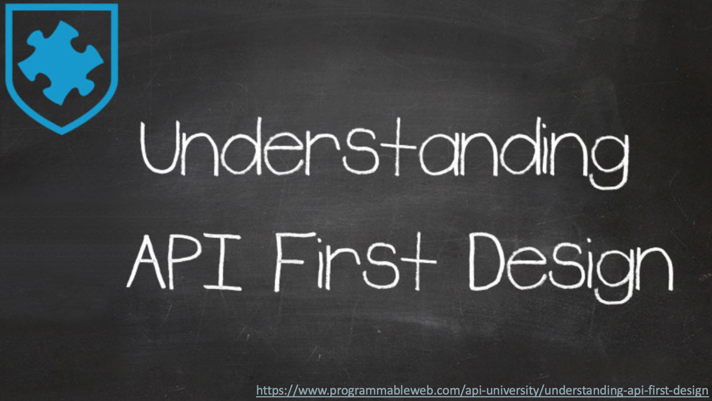
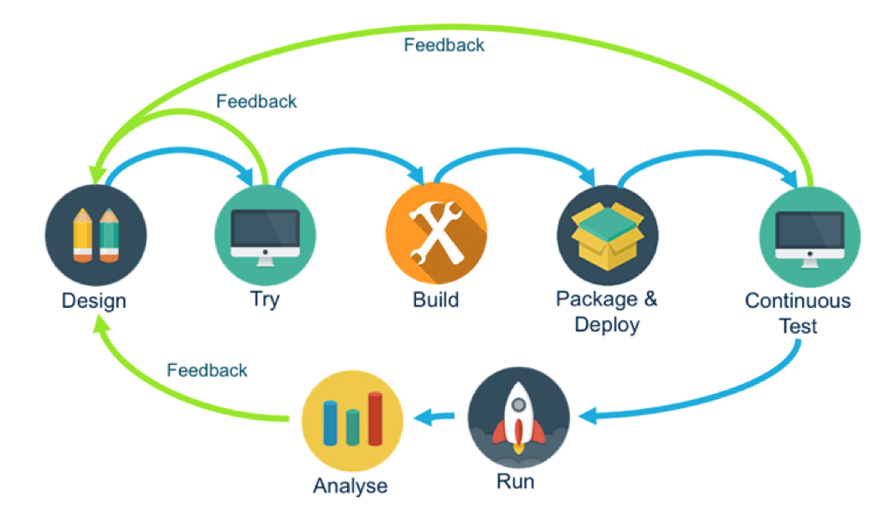
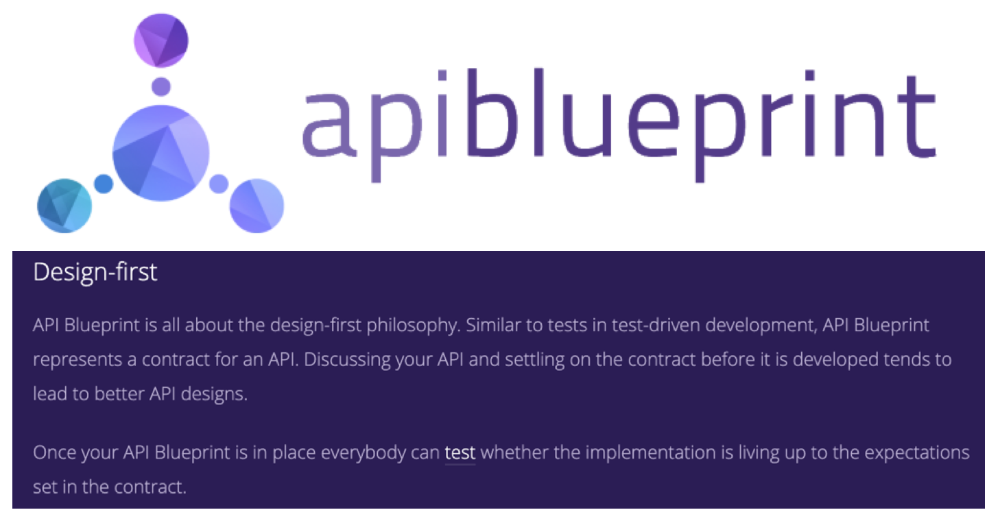

API Design Specification 중 하나인 API Blueprint에 대한 간략한 소개입니다.

> 본 블로그의 모든 포스트는 **macOS** 환경에서 테스트 및 작성되었습니다.  

### How to Design a Good API and Why it Matters

미국의 유명한 소프트웨어 아키텍처이자 Effective Java의 저자이신 **조슈아 블로치**가 Google Tech Talks에서 API Design에 대한 중요성에 대해서 위 타이틀로 발표한 내용 중 한 부분입니다.

***Public APIs, like diamonds, are forever. You have one chance to get it right so give it your best.***

1캐럿의 다이아몬드 보석을 만드는데 2톤의 원석이 들어간다고 합니다. 거기다 실제 다이아몬드가 만들어지기까지 많은 단계를 거치게 됩니다. 이렇게 만들어진 다이아몬드는 고가에 판매가 되며, 만들어진 이후 다시 모양등을 변경하는 것은 쉽지 않은 작업이죠. 다시 원하는 모양으로 바꾸려면 잘 모르겠지만, 굉장히 큰 비용이 발생하지 않을까요?  

Public API도 비슷합니다. API를 실제 오픈한 이후에는 변경할 경우 API를 사용하고 있는 많은 애플리케이션이 영향을 받습니다. 따라서 실제 오픈전에 개발이 잘 되어야 하고, 개발이 잘 되려면 설계가 튼실해야 합니다.

### API-First Design

API-First Design는 API 디자인을 우선 진행하고, 디자인된 것을 개발 이전에 프로토타입 해보면서 API 설계자, API 개발자, 앱 개발자간의 빠른 피드백을 통해 API에 대한 퀄리티를 빠른 시간에 높여서 이를 개발에 반영하는 방법입니다.

 

<b>API-First Design Process</b>

API-First Design 방식의 장점은 다음과 같습니다.

* Development teams can work in parallel
    * 설계가 끝나면 Mock API를 통해서 클라이언트 애플리케이션을 바로 개발할 수 있고, API 개발도 동시에 진행이 될 수 있기 때문에 전체 개발 속도를 줄일 수 있습니다.
* Lower cost of developing applications
    * 클라이언트 애플리케이션 입장에서 API 개발, 변경을 위한 대기 시간이 감소하기 때문에 (설계 문서만 업데이트 하면 되므로) 전체적인 애플리케이션 개발 비용도 감소될 수 있습니다.
* Reduced risk of failure
    * 설계 단계에서 충분한 검토와 프로토타입이 가능함으로, 운영에서의 오류나 스펙 변경을 최소화 할 수 있습니다.

### API Specification

API 설계 스펙은 여러가지가 있습니다. 이 중에서 가장 유명한 것이 **Swagger**이며, 그외 **Apiary**사의 **API Blueprint** (오라클에 인수됨), **MuleSoft**의 **RAML**이 있고, **Spring**의 경우는 **AsciiDoctor**를 **Spring REST Doc**에서 사용합니다.

> Swagger는 현재 Linux Foundation 산하의 Open API Initiative Project에 포함되면서, Open API Spec, 줄여서 OAS로 불리고 있습니다.

Swagger는 JSON/YAML 포멧을 지원하고, RAML은 YAML, API Blueprint는 Markdown을 지원합니다. 셋 중에서 Markdown을 사용하는 API Blueprint가 상대적으로 간략하고 작성하기 쉽습니다. 물론 디테일면에서 다른 스펙과 비교해 부족한 부분이 있지만, 코드 스니펫이나 스텁까지 필요하지 않다면, API Blueprint도 충분히 API 문서를 만들기 위한 훌륭한 스펙이라고 생각합니다.

API Design Spec 방법을 적용하기 위해서는 Design 우선이 되어야 하기 때문에, 쉽게 작성할 수 있는 표준이 좋습니다. 여기서는 API-First Design을 위한 Spec으로 API Blueprint 중심으로 소개합니다.

### API Blueprint

[API Blueprint](https://apiblueprint.org/)는 [Apiary](https://apiary.io)사에서 만든 스펙으로 현재는 Oracle에 인수되어 Oracle에 의해 관리하고 있습니다.  

디자인 도구는 ATOM, Visual Studio Code, Apiary등이 있는데, 그래도 Apiary에서 만든 스펙인데, Apiary가 API Blueprint를 가장 잘 지원하는 도구라고 볼 수 있습니다.

### Apiary

  

Apiary는 2011년에 만들어진 회사로 2017년에 Oracle에 인수 합병되었습니다. 
Markdown 형식의 API Blueprint와 이를 지원하는 웹 기반의 디자인 도구를 제공하며, 수많은 Open API를 등록, 관리, 오픈하고 있습니다.

대표적인 기능은 다음과 같습니다.  
* API Blueprint와 Swagger 2.0을 지원
* Mock API
* GitHub Sync & Integration
* API Styleguide
* Apiary CLI
* API Inspector
* Automated Testing with Dredd
* MSON (Markdown Syntax for Object Notation)
* API Team & Memeber

Apiary는 현재 Free, Standard, Pro 세 가지의 플랜을 제공합니다. 이 중에서 Free는 Team 관리, Private API 관리, GitHub Integration (Sync는 제공됨), Style Guide, 24*7 지원이 제공되지 않습니다.

> 참고로 Oracle에서 판매하는 제품중에 API 관리포탈/개발자포탈/게이트웨이를 제공하는 [API Platform](https://cloud.oracle.com/api-platform)이라는 제품이 있습니다. 이 제품을 구매하면 Apiary Enterprise 20 유저가 기본 제공됩니다.

다음 포스트에서는 간단하게 Apiary에서 가장 기본이 되는 API Blueprint 섹션들에 대해서 몇가지 살펴보도록 하겠습니다.