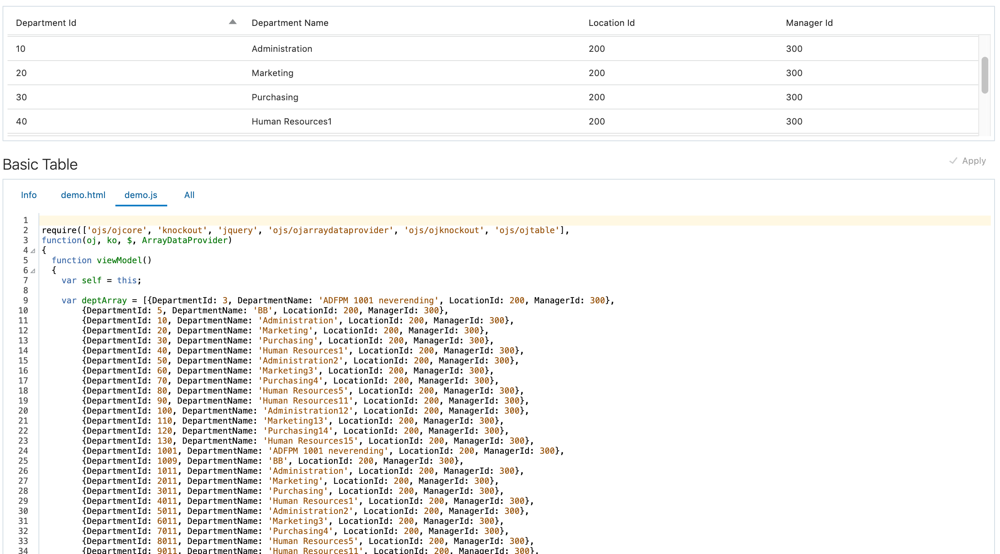
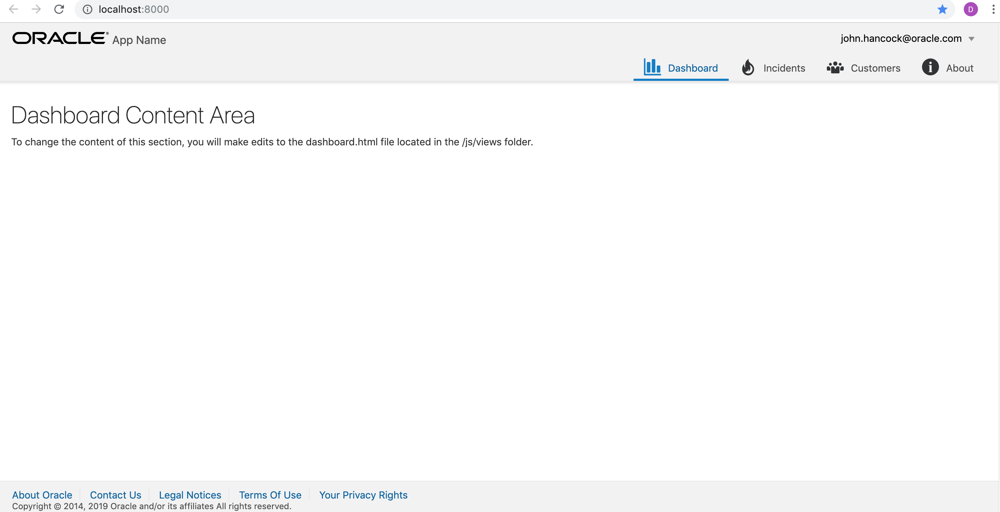
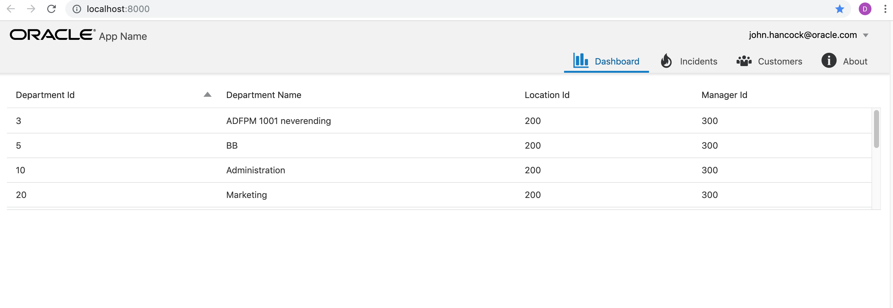

Oracle에서 개발한 오픈소스 프론트엔드 오픈소스 프레임워크인 JET(Javascript Extension Toolkit) 에 대해 간단하게 소개합니다.

> 본 블로그의 모든 포스트는 **macOS** 환경에서 테스트 및 작성되었습니다.  

### Oracle JET

Oracle JET은 새로운 형태의 프론트엔드 프레임워크라기 보다는 여러가지 오픈소스 라이브러리와 Oracle의 UI 컴포넌트인 Alta UI를 포함해서 만든 프론트엔드 프레임워크입니다.  

Oracle JET은 다음과 같은 오픈 소스 라이브러리를 사용합니다.


JQuery는 말이 필요없는 유명한 Javascript Library입니다.  
Apache Cordova 또한 유명한 하이브리드 모바일 개발 프레임워크입니다.
둘 다 유명한 유명한 오픈 소스인 만큼 따로 설명은 하지 않겠습니다.

여기서는 간단하게 Knockout에 대해서만 설명합니다.

### Knockout


Steve Sanderson에 의해 개발된 [Knockout](https://knockoutjs.com/)은 MIT license를 따르는 MVVM (Model-View-View Model) 패턴을 지원하는 가벼운 (66kb minified) Javascript 프레임워크로 선언적으로 쉽게 View와 Model간의 양방향 데이터 바인딩을 할 수 있도록 지원해줍니다. 이를 통해 다이나믹한 페이지 구성을 쉽게 할 수 있도록 만들어줍니다.

Knockout은 View(HTML)와 View-Model(JS)가 1:1로 매핑이 되어 데이터가 바인딩 됩니다. View-Model에서는 필요에 따라 서버 사이드에서 제공되는 API를 호출하여 Model을 생성하여 이를 활용하게 됩니다. 다음은 Knockout 아키텍처 입니다.  

{: .align-center}
Knockout Architecture
{: .text-center}

Knockout 주요 컨셉은 다음과 같습니다.


* Declarative Bindings
    * 간결하고 읽기 쉬운 선언적 구문 사용으로 DOM Element와 Model Data를 쉽게 연결
* Automatic UI Refesh
    * Observable로 양방향 데이터 바인딩을 통해 Data Model의 상태가 변경되면 UI가 자동으로 업데이트
* Dependency Tracking
    * 데이터 변환 및 결합을 위해 Model Data간의 관계 체인을 암시적 설정
* Templating
    * Model Data의 함수형태로 재활용 가능한 UI를 만들 수 있도록 지원

Knockout은 Oracle JET의 핵심적 요소입니다. 물론 Knockout 문법을 잘 알면 JET을 더 쉽게 확장하면서 사용할 수 있지만, Oracle JET에서 자체적으로 Knockout 문법을 Custom Tag 형태로 감싸서 제공하는 부분들이 있으므로, 이 부분만 사용할 수 있어도 어느정도의 기본적인 애플리케이션 개발이 가능합니다. 물론 Custom Tag는 한계가 있기 때문에 좀 더 확장 또는 커스터마이징이 필요한 경우에는 Knockout을 잘 이해하고 알아야 합니다.

Knockout과 관련해서는 다음의 공식 홈페이지에서 많은 정보를 얻을 수 있습니다.
* [Knockout 공식 홈페이지](https://knockoutjs.com/)
    * [Knockout Tutorial](http://learn.knockoutjs.com/)
    * [Knockout Live Example](https://knockoutjs.com/examples/)

### Oracle JET Cookbook

Knockout과 RequireJS를 잘 알면 좋겠지만, 배우는데 시간이 많이 걸리는 것이 사실입니다. Oracle에서는 빠르게 JET을 적용해서 사용할 수 있도록 JET Cookbook을 제공합니다. 다양한 UI Component에 대한 예제소스와 바로 테스트해볼 수 있는 환경을 제공하기 때문에 처음부터 Knockout과 RequireJS에 대한 기본적인 개념 정도만 있다면 쉽게 적용할 수 있습니다.

[Oracle JET Cookbook 바로 가기](https://www.oracle.com/webfolder/technetwork/jet/jetCookbook.html)


Oracle JET Components
{: .text-center}



Basic Table UI와 예제 소스
{: .text-center}

### Oracle JET Quickstart
Oracle JET를 시작하기 위해서는 Nodejs 설치가 필요합니다. [여기](https://nodejs.org/ko/)에서 운영체제에 맞는 버전으로 설치합니다. Nodejs 설치가 끝나면 npm을 통해서 Oracle JET CLI를 설치합니다.
```
npm install -g @oracle/ojet-cli
```

Oracle JET Template 프로젝트를 다운로드 받습니다. template은 4가지가 있는데, 기본적인 Navigation이 포함된 navdrawer로 생성합니다. <app name>은 JET 프로젝트 이름으로 필요한 이름을 지정합니다.
```
ojet create <app name> --template=navdrawer||navbar||basic||blank
```

JET 애플리케이션 실행은 ojet cli로 실행합니다.
```
cd <app name>

ojet serve
```

위의 경우는 일반적인 웹 애플리케이션입니다. 하이브리드 앱 형태로 구동하기 위해서는 Cordova를 설치하고 위에서 생성한 프로젝트에 add 해줘야 합니다.

```
npm install -g cordova

ojet add hybrid

ojet serve android||ios||windows
```

### Oracle JET Hello World Application

간단히 Hello World 프로젝트를 생성해보고 기본 JET 테이블 컴포넌트를 추가해보도록 하겠습니다.
```
ojet create ojet-hello-world --template=navdrawer

Processing template: navdrawer
Your app structure is generated. Continuing with library install.
Performing npm install may take a bit.
Invoking npm install.
npm WARN deprecated coffee-script@1.12.7: CoffeeScript on NPM has moved to "coffeescript" (no hyphen)

> phantomjs-prebuilt@2.1.16 install /Users/DonghuKim/Programming/Code/ojet/ojet-hello-world/node_modules/phantomjs-prebuilt
> node install.js

PhantomJS not found on PATH
Downloading https://github.com/Medium/phantomjs/releases/download/v2.1.1/phantomjs-2.1.1-macosx.zip
Saving to /var/folders/63/mhzl222x7qq34k8mw7qb23w80000gn/T/phantomjs/phantomjs-2.1.1-macosx.zip
Receiving...
  [=======================-----------------] 57%
Received 16746K total.
Extracting zip contents
Removing /Users/DonghuKim/Programming/Code/ojet/ojet-hello-world/node_modules/phantomjs-prebuilt/lib/phantom
Copying extracted folder /var/folders/63/mhzl222x7qq34k8mw7qb23w80000gn/T/phantomjs/phantomjs-2.1.1-macosx.zip-extract-1557298561614/phantomjs-2.1.1-macosx -> /Users/DonghuKim/Programming/Code/ojet/ojet-hello-world/node_modules/phantomjs-prebuilt/lib/phantom
Writing location.js file
Done. Phantomjs binary available at /Users/DonghuKim/Programming/Code/ojet/ojet-hello-world/node_modules/phantomjs-prebuilt/lib/phantom/bin/phantomjs
npm WARN qunit-reporter-junit@1.1.1 requires a peer of qunitjs@* but none is installed. You must install peer dependencies yourself.

added 467 packages from 789 contributors, removed 1 package and audited 1825 packages in 18.55s
found 9 vulnerabilities (1 low, 5 moderate, 3 high)
  run `npm audit fix` to fix them, or `npm audit` for details


   ╭───────────────────────────────────────────────────────────────╮
   │                                                               │
   │       New minor version of npm available! 6.8.0 → 6.9.0       │
   │   Changelog: https://github.com/npm/cli/releases/tag/v6.9.0   │
   │               Run npm install -g npm to update!               │
   │                                                               │
   ╰───────────────────────────────────────────────────────────────╯

Writing: oraclejetconfig.json
oraclejetconfig.json file exists. Checking config.
Running after_app_create hook.
Your app is ready! Change to your new app directory 'ojet-hello-world' and try 'ojet build' and 'ojet serve'.
```

JET Hello World Application을 실행합니다.
```
cd ojet-hello-world
ojet serve

Warning: Command is missing platform. Default to web.
Build: true
BuildType: dev
Destination: undefined
Destination target: undefined
Livereload: true
Livereload port: 35729
Platform: web
Port: 8000
Theme: alta
Theme platform: web
Theme version: 6.1.0
Building app.
Cleaning staging path.
Running before_build hook.
buildAllComponents srcBase src/js/jet-composites
Copy files to staging directory.
Copy finished.
Copy library files to staging directory.
Copy finished.
Copy reference components to staging directory.
Copy finished.
Optimizing svg into SVG sprites.
Svg optimisation task finished.
Compiling sass.
Sass compile finished.
Task index.html cdn bundle injection finished.
Running theme injection task.
Task index.html theme path injection finished.
Running theme copy task.
Theme copy task finished.
Running injection tasks.
Task main.js paths injection finished.
runAllComponentHooks 
Running after_build hook.
Running before_serve hook.
Starting web server.
Connecting to http://localhost:8000
Starting watcher.
Running after_serve hook.
Server ready: http://localhost:8000
Listening on port 35729.
Watching files.
Watcher: sass is ready.
Watcher: sourceFiles is ready.
Watcher: themes is ready.
```

실행하면 다음과 같은 기본 JET UI를 볼 수 있습니다.


### JET 프로젝트에 Table Component 적용하기
다운로드 받은 Template 구조를 보면 기본 페이지인 index.html과 js 하위에 main.js, appController.js, view와 viewModels에 각각 html 파일과 동일한 이름의 js 파일이 1:1로 매핑되어 있는 것을 볼 수 있습니다.


여기서는 새로운 페이지를 추가하지 않고, 기본 페이지 중에서 dashboard.html과 dashboard.js 파일에 JET Cookbook의 Basic Table Component를 추가합니다. 먼저 JET Cookbook의 Basic Component와 예제 소스를 다음 URL에서 확인합니다.  
https://www.oracle.com/webfolder/technetwork/jet/jetCookbook.html?component=table&demo=basicTable

예제 소스 중 demo.html 과 demo.js 소스를 볼 수 있는데 demo.js 탭을 클릭하면 다음과 같은 소스를 확인하실 수 있습니다. 전체를 다 복사할 필요는 없습니다. 필요한 부분은 require 부분에서 로드하는 모듈과 viewModel() 함수 안에 있는 코드만 필요합니다.

```javascript
require(['ojs/ojcore', 'knockout', 'jquery', 'ojs/ojarraydataprovider', 'ojs/ojknockout', 'ojs/ojtable'],
function(oj, ko, $, ArrayDataProvider)
{   
  function viewModel()
  {
    var self = this;

    var deptArray = [{DepartmentId: 3, DepartmentName: 'ADFPM 1001 neverending', LocationId: 200, ManagerId: 300},
        {DepartmentId: 5, DepartmentName: 'BB', LocationId: 200, ManagerId: 300},
        {DepartmentId: 10, DepartmentName: 'Administration', LocationId: 200, ManagerId: 300},
        {DepartmentId: 20, DepartmentName: 'Marketing', LocationId: 200, ManagerId: 300},
        {DepartmentId: 30, DepartmentName: 'Purchasing', LocationId: 200, ManagerId: 300},
        {DepartmentId: 40, DepartmentName: 'Human Resources1', LocationId: 200, ManagerId: 300},
        {DepartmentId: 50, DepartmentName: 'Administration2', LocationId: 200, ManagerId: 300},
        {DepartmentId: 60, DepartmentName: 'Marketing3', LocationId: 200, ManagerId: 300},
        {DepartmentId: 70, DepartmentName: 'Purchasing4', LocationId: 200, ManagerId: 300},
        {DepartmentId: 80, DepartmentName: 'Human Resources5', LocationId: 200, ManagerId: 300},
        {DepartmentId: 90, DepartmentName: 'Human Resources11', LocationId: 200, ManagerId: 300},
        {DepartmentId: 100, DepartmentName: 'Administration12', LocationId: 200, ManagerId: 300},
        {DepartmentId: 110, DepartmentName: 'Marketing13', LocationId: 200, ManagerId: 300},
        {DepartmentId: 120, DepartmentName: 'Purchasing14', LocationId: 200, ManagerId: 300},
        {DepartmentId: 130, DepartmentName: 'Human Resources15', LocationId: 200, ManagerId: 300},
        {DepartmentId: 1001, DepartmentName: 'ADFPM 1001 neverending', LocationId: 200, ManagerId: 300},
        {DepartmentId: 1009, DepartmentName: 'BB', LocationId: 200, ManagerId: 300},
        {DepartmentId: 1011, DepartmentName: 'Administration', LocationId: 200, ManagerId: 300},
        {DepartmentId: 2011, DepartmentName: 'Marketing', LocationId: 200, ManagerId: 300},
        {DepartmentId: 3011, DepartmentName: 'Purchasing', LocationId: 200, ManagerId: 300},
        {DepartmentId: 4011, DepartmentName: 'Human Resources1', LocationId: 200, ManagerId: 300},
        {DepartmentId: 5011, DepartmentName: 'Administration2', LocationId: 200, ManagerId: 300},
        {DepartmentId: 6011, DepartmentName: 'Marketing3', LocationId: 200, ManagerId: 300},
        {DepartmentId: 7011, DepartmentName: 'Purchasing4', LocationId: 200, ManagerId: 300},
        {DepartmentId: 8011, DepartmentName: 'Human Resources5', LocationId: 200, ManagerId: 300},
        {DepartmentId: 9011, DepartmentName: 'Human Resources11', LocationId: 200, ManagerId: 300},
        {DepartmentId: 10011, DepartmentName: 'Administration12', LocationId: 200, ManagerId: 300},
        {DepartmentId: 11011, DepartmentName: 'Marketing13', LocationId: 200, ManagerId: 300},
        {DepartmentId: 12011, DepartmentName: 'Purchasing14', LocationId: 200, ManagerId: 300},
        {DepartmentId: 13011, DepartmentName: 'Human Resources15', LocationId: 200, ManagerId: 300},
        {DepartmentId: 14011, DepartmentName: 'ADFPM 1001 neverending', LocationId: 200, ManagerId: 300},
        {DepartmentId: 15011, DepartmentName: 'BB', LocationId: 200, ManagerId: 300},
        {DepartmentId: 21022, DepartmentName: 'Administration', LocationId: 200, ManagerId: 300},
        {DepartmentId: 22022, DepartmentName: 'Marketing', LocationId: 200, ManagerId: 300},
        {DepartmentId: 23022, DepartmentName: 'Purchasing', LocationId: 200, ManagerId: 300},
        {DepartmentId: 24022, DepartmentName: 'Human Resources1', LocationId: 200, ManagerId: 300},
        {DepartmentId: 25022, DepartmentName: 'Administration2', LocationId: 200, ManagerId: 300},
        {DepartmentId: 26022, DepartmentName: 'Marketing3', LocationId: 200, ManagerId: 300},
        {DepartmentId: 27022, DepartmentName: 'Purchasing4', LocationId: 200, ManagerId: 300},
        {DepartmentId: 28022, DepartmentName: 'Human Resources5', LocationId: 200, ManagerId: 300},
        {DepartmentId: 29022, DepartmentName: 'Human Resources11', LocationId: 200, ManagerId: 300},
        {DepartmentId: 310022, DepartmentName: 'Administration12', LocationId: 200, ManagerId: 300},
        {DepartmentId: 311022, DepartmentName: 'Marketing13', LocationId: 200, ManagerId: 300},
        {DepartmentId: 312022, DepartmentName: 'Purchasing14', LocationId: 200, ManagerId: 300},
        {DepartmentId: 313022, DepartmentName: 'Human Resources15', LocationId: 200, ManagerId: 300}];
    self.dataprovider = new ArrayDataProvider(deptArray, {keyAttributes: 'DepartmentId', implicitSort: [{attribute: 'DepartmentId', direction: 'ascending'}]});
  }
  var vm = new viewModel;
  
  $(document).ready
  (
    function()
    {
      ko.applyBindings(vm, document.getElementById('table'));
    }
  );
});	
```

다운로드 받은 JET Template의 dashboard.js 파일을 오픈하면 다음과 같은 코드를 볼 수 있습니다.  Oracle JET은 모듈 로더로 RequireJS를 사용합니다. require 혹은 define으로 모듈 로드를 합니다. 위 Cookbook의 예제 코드에서는 require, 템플릿의 dashboard.js viewModel에서는 define을 사용했습니다. requireJS에서 require와 define은 약간 차이가 있지만, 기본적으로 js 모듈을 로드하는 목적은 같습니다. Cookbook 코드에서의 require 부분의 인자와 동일하게 템플릿의 dashboard.js의 define을 맞춰줍니다.

```javascript
/**
 * @license
 * Copyright (c) 2014, 2019, Oracle and/or its affiliates.
 * The Universal Permissive License (UPL), Version 1.0
 */
/*
 * Your dashboard ViewModel code goes here
 */
define(['ojs/ojcore', 'knockout', 'jquery'],
 function(oj, ko, $) {
  
    function DashboardViewModel() {
      var self = this;
      // Below are a set of the ViewModel methods invoked by the oj-module component.
      // Please reference the oj-module jsDoc for additional information.

      /**
       * Optional ViewModel method invoked after the View is inserted into the
       * document DOM.  The application can put logic that requires the DOM being
       * attached here. 
       * This method might be called multiple times - after the View is created 
       * and inserted into the DOM and after the View is reconnected 
       * after being disconnected.
       */
      self.connected = function() {
        // Implement if needed
      };

      /**
       * Optional ViewModel method invoked after the View is disconnected from the DOM.
       */
      self.disconnected = function() {
        // Implement if needed
      };

      /**
       * Optional ViewModel method invoked after transition to the new View is complete.
       * That includes any possible animation between the old and the new View.
       */
      self.transitionCompleted = function() {
        // Implement if needed
      };
    }

    /*
     * Returns a constructor for the ViewModel so that the ViewModel is constructed
     * each time the view is displayed.  Return an instance of the ViewModel if
     * only one instance of the ViewModel is needed.
     */
    return new DashboardViewModel();
  }
);

```

아래는 수정된 코드입니다. define에 정의된 모듈을 function에서 변수로 정의해서 사용합니다. 현재 JET Core인 ojcore는 oj, knockout은 ko, jquery는 $로 선언되어 있는데, 샘플을 보면 4번째 추가한 ojarraydataprovider를 사용합니다. 이 부분도 ArrayDataProvider으로 변수 선언해줍니다. 다음은 function DashboardViewMode()안 맨 마지막 부분에 예제 소스의 viewModel() 내용을 붙여넣기 해주면 됩니다. 

> JSON 데이터의 경우 예제에서는 샘플로 미리 변수로 정의해서 사용했는데, 실제로는 ajax 혹은 JET에서 제공하는 Collection 기능을 활용해서 응답받은 데이터를 가져와 사용해야 합니다.

```javascript
/**
 * @license
 * Copyright (c) 2014, 2019, Oracle and/or its affiliates.
 * The Universal Permissive License (UPL), Version 1.0
 */
/*
 * Your dashboard ViewModel code goes here
 */
define(['ojs/ojcore', 'knockout', 'jquery', 'ojs/ojarraydataprovider', 'ojs/ojknockout', 'ojs/ojtable'],
 function(oj, ko, $, ArrayDataProvider) {
  
    function DashboardViewModel() {
      var self = this;
      // Below are a set of the ViewModel methods invoked by the oj-module component.
      // Please reference the oj-module jsDoc for additional information.

      /**
       * Optional ViewModel method invoked after the View is inserted into the
       * document DOM.  The application can put logic that requires the DOM being
       * attached here. 
       * This method might be called multiple times - after the View is created 
       * and inserted into the DOM and after the View is reconnected 
       * after being disconnected.
       */
      self.connected = function() {
        // Implement if needed
      };

      /**
       * Optional ViewModel method invoked after the View is disconnected from the DOM.
       */
      self.disconnected = function() {
        // Implement if needed
      };

      /**
       * Optional ViewModel method invoked after transition to the new View is complete.
       * That includes any possible animation between the old and the new View.
       */
      self.transitionCompleted = function() {
        // Implement if needed
      };

    // 추가된 부분 시작
    var deptArray = [{DepartmentId: 3, DepartmentName: 'ADFPM 1001 neverending', LocationId: 200, ManagerId: 300},
            {DepartmentId: 5, DepartmentName: 'BB', LocationId: 200, ManagerId: 300},
            {DepartmentId: 10, DepartmentName: 'Administration', LocationId: 200, ManagerId: 300},
            {DepartmentId: 20, DepartmentName: 'Marketing', LocationId: 200, ManagerId: 300},
            {DepartmentId: 30, DepartmentName: 'Purchasing', LocationId: 200, ManagerId: 300},
            {DepartmentId: 40, DepartmentName: 'Human Resources1', LocationId: 200, ManagerId: 300},
            {DepartmentId: 50, DepartmentName: 'Administration2', LocationId: 200, ManagerId: 300},
            {DepartmentId: 60, DepartmentName: 'Marketing3', LocationId: 200, ManagerId: 300},
            {DepartmentId: 70, DepartmentName: 'Purchasing4', LocationId: 200, ManagerId: 300},
            {DepartmentId: 80, DepartmentName: 'Human Resources5', LocationId: 200, ManagerId: 300},
            {DepartmentId: 90, DepartmentName: 'Human Resources11', LocationId: 200, ManagerId: 300},
            {DepartmentId: 100, DepartmentName: 'Administration12', LocationId: 200, ManagerId: 300},
            {DepartmentId: 110, DepartmentName: 'Marketing13', LocationId: 200, ManagerId: 300},
            {DepartmentId: 120, DepartmentName: 'Purchasing14', LocationId: 200, ManagerId: 300},
            {DepartmentId: 130, DepartmentName: 'Human Resources15', LocationId: 200, ManagerId: 300},
            {DepartmentId: 1001, DepartmentName: 'ADFPM 1001 neverending', LocationId: 200, ManagerId: 300},
            {DepartmentId: 1009, DepartmentName: 'BB', LocationId: 200, ManagerId: 300},
            {DepartmentId: 1011, DepartmentName: 'Administration', LocationId: 200, ManagerId: 300},
            {DepartmentId: 2011, DepartmentName: 'Marketing', LocationId: 200, ManagerId: 300},
            {DepartmentId: 3011, DepartmentName: 'Purchasing', LocationId: 200, ManagerId: 300},
            {DepartmentId: 4011, DepartmentName: 'Human Resources1', LocationId: 200, ManagerId: 300},
            {DepartmentId: 5011, DepartmentName: 'Administration2', LocationId: 200, ManagerId: 300},
            {DepartmentId: 6011, DepartmentName: 'Marketing3', LocationId: 200, ManagerId: 300},
            {DepartmentId: 7011, DepartmentName: 'Purchasing4', LocationId: 200, ManagerId: 300},
            {DepartmentId: 8011, DepartmentName: 'Human Resources5', LocationId: 200, ManagerId: 300},
            {DepartmentId: 9011, DepartmentName: 'Human Resources11', LocationId: 200, ManagerId: 300},
            {DepartmentId: 10011, DepartmentName: 'Administration12', LocationId: 200, ManagerId: 300},
            {DepartmentId: 11011, DepartmentName: 'Marketing13', LocationId: 200, ManagerId: 300},
            {DepartmentId: 12011, DepartmentName: 'Purchasing14', LocationId: 200, ManagerId: 300},
            {DepartmentId: 13011, DepartmentName: 'Human Resources15', LocationId: 200, ManagerId: 300},
            {DepartmentId: 14011, DepartmentName: 'ADFPM 1001 neverending', LocationId: 200, ManagerId: 300},
            {DepartmentId: 15011, DepartmentName: 'BB', LocationId: 200, ManagerId: 300},
            {DepartmentId: 21022, DepartmentName: 'Administration', LocationId: 200, ManagerId: 300},
            {DepartmentId: 22022, DepartmentName: 'Marketing', LocationId: 200, ManagerId: 300},
            {DepartmentId: 23022, DepartmentName: 'Purchasing', LocationId: 200, ManagerId: 300},
            {DepartmentId: 24022, DepartmentName: 'Human Resources1', LocationId: 200, ManagerId: 300},
            {DepartmentId: 25022, DepartmentName: 'Administration2', LocationId: 200, ManagerId: 300},
            {DepartmentId: 26022, DepartmentName: 'Marketing3', LocationId: 200, ManagerId: 300},
            {DepartmentId: 27022, DepartmentName: 'Purchasing4', LocationId: 200, ManagerId: 300},
            {DepartmentId: 28022, DepartmentName: 'Human Resources5', LocationId: 200, ManagerId: 300},
            {DepartmentId: 29022, DepartmentName: 'Human Resources11', LocationId: 200, ManagerId: 300},
            {DepartmentId: 310022, DepartmentName: 'Administration12', LocationId: 200, ManagerId: 300},
            {DepartmentId: 311022, DepartmentName: 'Marketing13', LocationId: 200, ManagerId: 300},
            {DepartmentId: 312022, DepartmentName: 'Purchasing14', LocationId: 200, ManagerId: 300},
            {DepartmentId: 313022, DepartmentName: 'Human Resources15', LocationId: 200, ManagerId: 300}];
        self.dataprovider = new ArrayDataProvider(deptArray, {keyAttributes: 'DepartmentId', implicitSort: [{attribute: 'DepartmentId', direction: 'ascending'}]});
        // 추가된 부분 끝
    }

    /*
     * Returns a constructor for the ViewModel so that the ViewModel is constructed
     * each time the view is displayed.  Return an instance of the ViewModel if
     * only one instance of the ViewModel is needed.
     */
    return new DashboardViewModel();
  }
);
```

예제 소스에서 applyBindings 하는 부분이 있는데 이 부분은 필요치 않습니다. 기본 Template 프로젝트에서는 상위 main.js에서 index.html을 한번 바인딩 하고, appController.js의 loadModule을 호출해서 dashboard.js와 view와 viewModel을 모두 자동 바인딩하기 때문입니다. 이 부분은 Knockout의 [applyBindings](https://knockoutjs.com/documentation/binding-context.html)와 JET에서 제공하는 [module Util](https://www.oracle.com/webfolder/technetwork/jet/jsdocs/ModuleElementUtils.html)을 참고하기 바랍니다.

다음은 dashboard.html을 예제 소스의 demo.html로 변경합니다. 여기서도 demo.html의 모든 코드를 붙여넣기 하지 않습니다. Template에서는 모든 모듈의 html 페이지가 index.html에 임베딩 되는 구조로 index.html에 상위 Tag (html, head, title, script 등)가 이미 포함되어 있습니다. 즉 예제 소스의 body 하위를 붙여넣기 하면 된다는 얘기입니다. 반영된 dashboard.html 입니다.

```html
<!--
 Copyright (c) 2014, 2019, Oracle and/or its affiliates.
 The Universal Permissive License (UPL), Version 1.0
 -->
 <div id="sampleDemo" style="" class="demo-padding demo-container">
  <div id="componentDemoContent" style="width: 1px; min-width: 100%;">
    
    <oj-table id='table' aria-label='Departments Table'
                                    data='[[dataprovider]]'
                                    selection-mode='{"row": "multiple", "column": "multiple"}'
                                    dnd='{"reorder": {"columns": "enabled"}}'
                                    scroll-policy='loadMoreOnScroll'
                                    scroll-policy-options='{"fetchSize": 10}'
                                    columns='[{"headerText": "Department Id", 
                                               "field": "DepartmentId",
                                               "headerClassName": "oj-sm-only-hide",
                                               "className": "oj-sm-only-hide",
                                               "resizable": "enabled"},
                                              {"headerText": "Department Name", 
                                               "field": "DepartmentName",
                                               "resizable": "enabled"},
                                              {"headerText": "Location Id", 
                                               "field": "LocationId",
                                               "headerClassName": "oj-sm-only-hide",
                                               "className": "oj-sm-only-hide",
                                               "resizable": "enabled"},
                                              {"headerText": "Manager Id", 
                                               "field": "ManagerId",
                                               "resizable": "enabled"}]'
                                    style='width: 100%; height: 200px;'>
    </oj-table>

    
  </div>
</div>
```

적용된 UI 입니다.


### 마무리
Oracle JET 라는 프론트엔드 프레임워크와 제공되는 기본 테이블 컴포넌트를 활용해서 간단하게 웹 애플리케이션을 만들었습니다. 다양한 JET Cookbook을 제공하는데 특히 Chart는 종류도 다양하고 UI도 훌륭합니다. Oracle의 모든 클라우드 서비스가 모두 이 JET로 만들어져 있고 앞으로 출시되는 모든 서비스가 JET 기반으로 개발이 되고, Oracle의 모든 SaaS와 PaaS 서비스들이 모두 JET를 기반으로 Extension이 된다고 하니, Oracle 관련 프로젝트를 하는 분들에게는 필수적으로 알야야 할 프레임워크가 아닌가 생각됩니다.