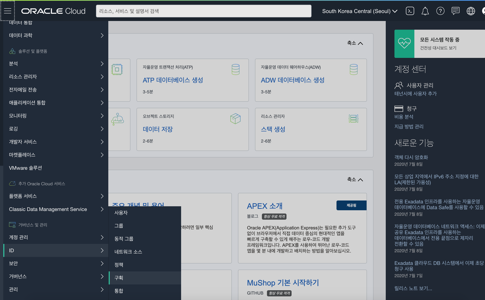
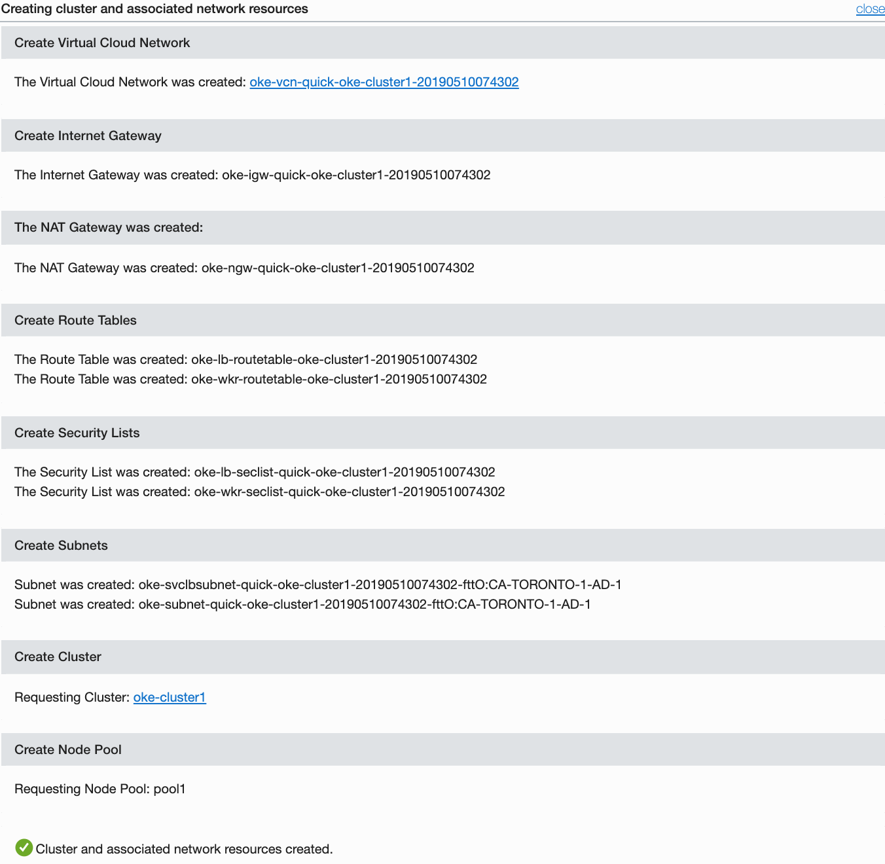
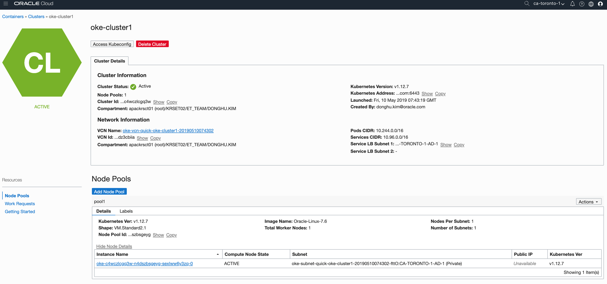
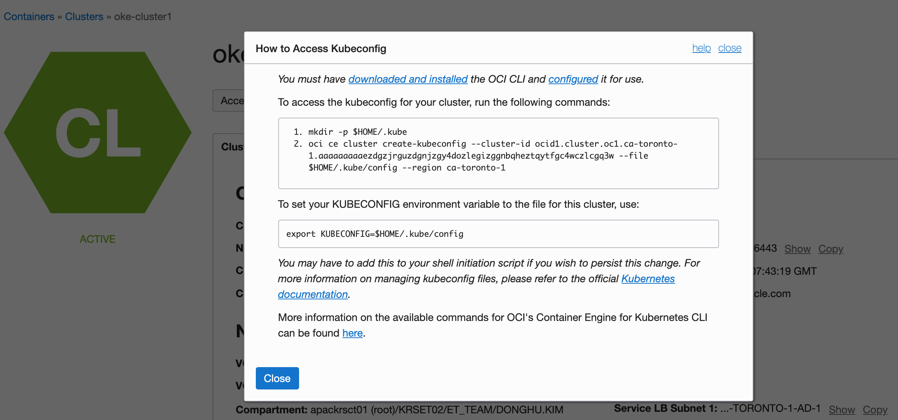
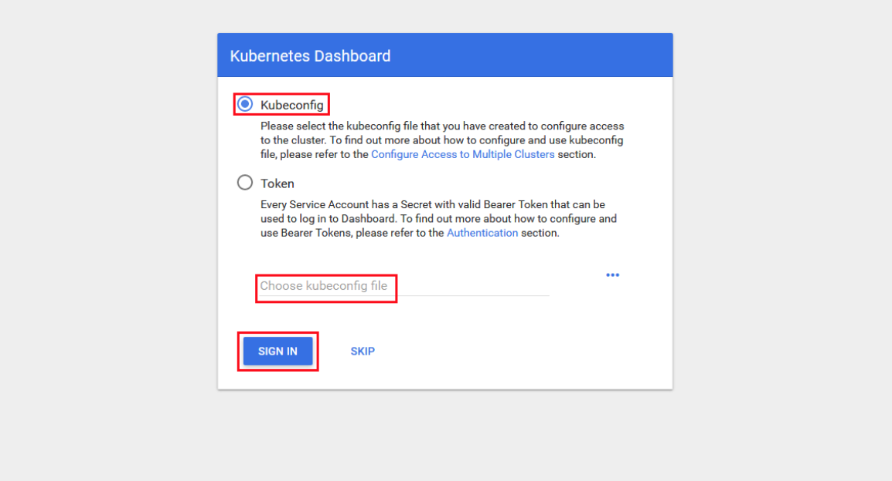
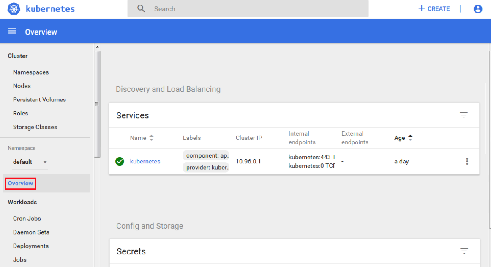

OCI (Oracle Cloud Infrastructure) Kubernetes Container Engine의 Cluster 생성과 kubeconfig 구성을 간단히 살펴보도록 하겠습니다.

> 본 블로그의 모든 포스트는 **macOS** 환경에서 테스트 및 작성되었습니다.  

### Oracle Cloud Infrastructure Container Engine for Kubernetes

Oracle Cloud Infrastructure Container Engine for Kubernetes (이하 OKE)는 Oracle Cloud 관리되는 확장 가능한 고가용성 컨테이너 서비스입니다.
Kubernetes가 무엇인지에 대해서는 아래 kubernetes.io에서 한국어로 자세히 설명하고 있으니 참고하시기 바랍니다.

[쿠버네티스란 무엇인가?](https://kubernetes.io/ko/docs/concepts/overview/what-is-kubernetes/)

### 준비 사항
OCI에서 제공하는 OKE의 Cluster 생성과 Cluster 접속을 위한 kubectl 설치 및 환경 구성하는 부분 (kubeconfig)을 진행해보도록 하겠습니다.
우선 필요한 준비물은 다음과 같습니다.

* Oracle Cloud Infrastructure 계정 - 처음 가입하면 300$ 상당의 Trial을 신청할 수 있습니다.
* oci-cli - 설치는 이 전 포스트인 [[Oracle Cloud] OCI-CLI 설치](2019-04-26-oci-cli-install.md)를 참고합니다.

### Login OCI Console
먼저 OCI에 로그인합니다. 아래 URL을 통해서 ashburn Region으로 접속합니다. Region은 로그인 한 후 변경할 수 있습니다.
```
https://console.us-ashburn-1.oraclecloud.com
```


OCI HOME
{: .text-center}

> 현재 Oracle은 frankfurt, ashburn, london, tokyo, phoenix, toronto Region이 있으며, 곧 Seoul Region도 생긴다고 하네요.

### Compartment 생성

OCI에서는 Compartment 라는 개념이 있습니다. Compute, Network, Storage와 같은 자원들을 Compartment라는 구획으로 나눠서 관리를 할 수 있습니다. 사용자 혹은 팀, 부서 단위로 자원들을 관리할 수 있습니다. 좌측 상단의 햄버거 아이콘을 클릭한 후 Identity를 클릭합니다.


OCI HOME - Identity
{: .text-center}

좌측 메뉴 중 Compartments를 클릭한 후 Create Compartment 버튼을 클릭해서 Compartment를 하나 생성하겠습니다. Parent Compartment 이름은 Oracle Cloud Trial 계정 생성 시 입력한 테넌트명입니다.

* NAME : DONGHU.KIM
* DESCRIPTION : DONGHU.KIM
* PARENT COMPARTMENT : 테넌트명 (root)

### Compartment에 Policy 부여

생성된 Compartment에 Policy를 부여합니다. 여기서는 OKE에 대한 모든 리소스 사용을 할 수 있는 Policy를 부여합니다. Identity > Policies를 클릭한 후 Create Policy 버튼을 클릭해서 Policy 이름과 Policy Statements를 다음과 같이 입력하고 생성합니다.

* NAME : OKE-Policy
* DESCRIPTION : OKE-Policy
* Policy Versioning : KEEP POLICY CURRENT
* Policy Statements
  * Allow service OKE to manage all-resources in compartment "Compartment명"

### OKE Cluster 생성
좌측 상단의 햄버거 메뉴를 클릭한 후 Developer Services > Container Clusters (OKE) 를 선택합니다.
Create Cluster 버튼을 클릭 한 후 다음과 같이 입력하고 Create 버튼을 클릭해서 생성합니다.

* NAME : oke-cluster1
* KUBERNETES VERSION : v1.12.7 (latest)
* QUICK CREATE : check
* Create Node Pool : SHAPE - VM.Standard2.1

> Oracle Cloud Compute Shape는 다음을 참고 하세요.  
> https://docs.cloud.oracle.com/iaas/Content/Compute/References/computeshapes.htm

생성이 완료되면 다음과 같이 Virtual Cloud Network (VCN), Internet Gateway, NAT Gateway, Route Table, Security List, Subnet, 그리고 OKE Cluster와 Node가 생성됩니다. 저는 Toronto Region에 생성을 해는데, 현재 AD (Avaiable Domain)이 Single (1개)이여서 Node가 하나만 생성되었습니다. Ashburn은 3개의 AD가 있는데, Ashburn에 생성하게 되면 3개의 Node가 생성됩니다.





### Kubeconfig

이제 생성된 OKE Cluster에 접속하기 위한 Kubeconfig를 만들 단계입니다.  
우선 Kubeconfig를 쓰기 위해서는 kubectl 설치가 필요합니다.  

> kubectl 설치는 다음 URL을 참고합니다.
> https://kubernetes.io/docs/tasks/tools/install-kubectl/

kubeconfig 생성을 위해서 우선 API signing key를 생성해서 OCI에 public key를 추가해줘야 합니다.
여기서는 signing key를 ssh-keygen으로 생성하겠습니다.

```
ssh-keygen -t rsa
```

#### Public Key 등록
생성된 id_rsa.pub 파일의 내용을 복사합니다.
OCI 콘솔 우측 상단의 사람 아이콘을 클릭하면 OCI 계정 아이디 (보통 이메일)을 볼 수 있는데, 클릭합니다.
좌측 API Keys 클릭한 후 Add Public Key 버튼을 클릭하여 Public Key를 붙여넣기 하고 ADD버튼을 클릭합니다.

#### Access Kubeconfig

처음에 생성한 oke-cluster1으로 이동합니다. (좌측 상단 햄버거 메뉴 > Developer Services > Container Clusters (OKE) > oke-cluster1)  
**Access Kubeconfig** 라는 버튼이 있습니다. 클릭을 해보면 oci-cli를 활용해서 kubeconfig 파일을 생성하는 단계가 나옵니다. 순서대로 실행합니다.



> oci-cli가 설치되어 있어야 합니다. [[Oracle Cloud] OCI-CLI 설치](2019-04-26-oci-cli-install.md)를 포스트를 참고하세요.

```
mkdir -p $HOME/.kube

oci ce cluster create-kubeconfig --cluster-id ocid1.cluster.oc1.ca-toronto-1.aaaaaaaaaezdgzjrguzdgnjzgy4dozlegizggnbqheztqytfgc4wczlcgq3w --file $HOME/.kube/config --region ca-toronto-1

export KUBECONFIG=$HOME/.kube/config
```

### kubectl 과 kubernetes Dashboard에서 OKE Cluster 접속 확인

OKE Cluster의 노드 정보를 보여줍니다.
```
$ kubectl get nodes
```

OKE Cluster에 대한 Dashboard를 다음과 같이 실행해서 로컬에서 구동합니다. 
```
$ kubectl proxy
```

다음 URL로 접속하면
```
http://localhost:8001/api/v1/namespaces/kube-system/services/https:kubernetes-dashboard:/proxy/
```
kubeconfig를 선택하고 생성했던 kubeconfig 파일을 선택한 후 **SIGN IN** 버튼을 클릭합니다.


OKE Cluster에 연결된 Kubernetes Dashboard입니다.

