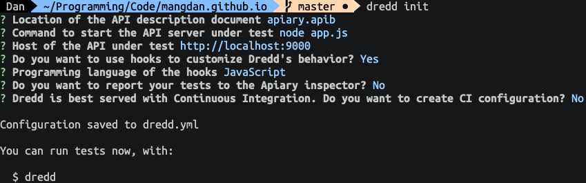
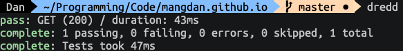
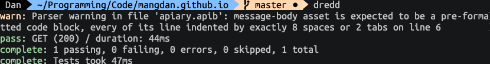
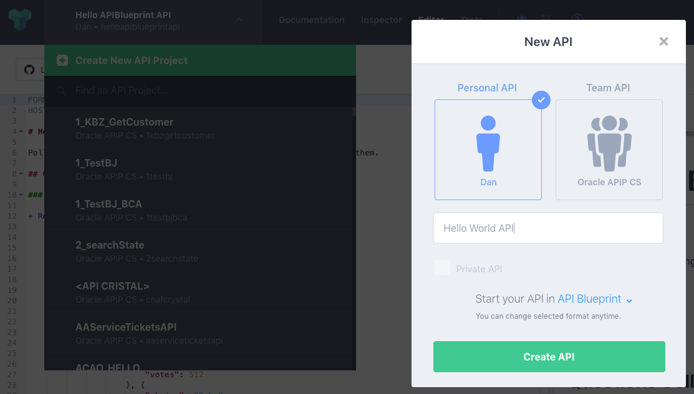
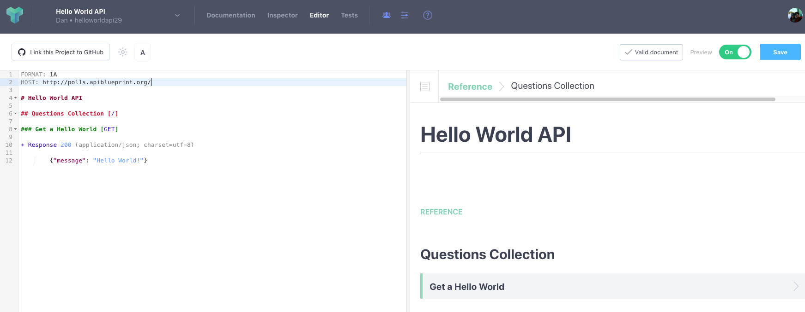
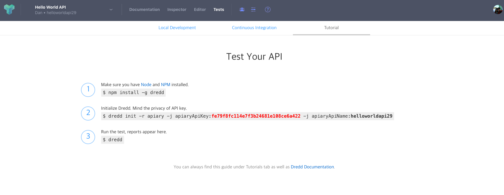
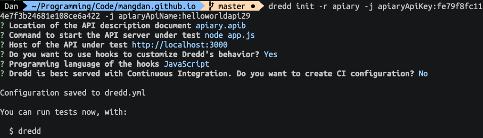
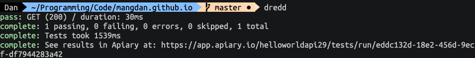
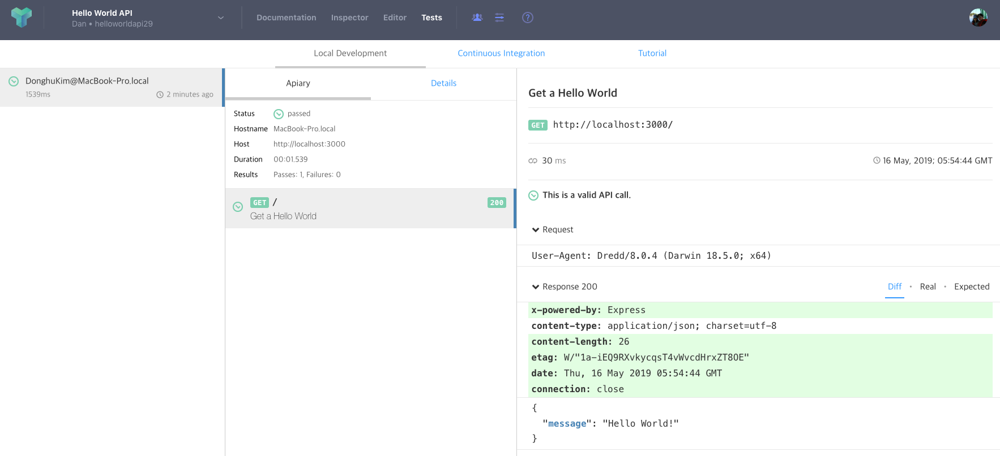

API 문서 (Swagger or API Blueprint)와 백엔드 서비스의 스펙이 서로 일치하는지 테스트하는 도구인 Dredd에 대해서 소개합니다.

> 본 블로그의 모든 포스트는 **macOS** 환경에서 테스트 및 작성되었습니다.  

### Validating API description document

API First Design 접근 방법에서는 우선 API를 설계한 이후 설계된 내용을 바탕으로 백엔드 서비스를 개발합니다.
사실 설계된 내용이 정확하게 개발에 반영이 되고, 지속적으로 설계내용과 개발 결과물이 싱크되면 좋겠지만, 현실에서는 개발자 혹은 설계자가 지속해서 신경쓰지 않는다면 요청/응답 데이터 구조 혹은 리소스에 대한 정의가 서로 달라질 수 있는등의 갭이 발생할 수 있습니다.

API는 API 설계를 통해 만들어진 문서를 바로 사용자에게 오픈하기 때문에 API 설계 문서와 개발된 서비스의 스펙이 다를 경우 사용하는 것 자체가 어려워질 수 있습니다. 일반적인 애플리케이션 개발에서의 설계, 개발의 갭과 다른 더 심각한 문제를 초래한다는 것이죠.

사람이 일일이 체크하는 것이 쉽지 않고, 또 실수도 있을 수 있습니다. 오픈 이후 유지보수 담당자가 설계 및 개발자와 동일한 보장도 없습니다. 사람이 하거나 메뉴얼적인 프로세스로 진행하기에는 한계가 분명히 발생합니다. 한번 틀어지기 시작하면 바로 잡는데 들어가는 시간과 비용도 무시 못할 겁니다. 애초에 이런 부분이 발생하지 않도록 해주는 명확하게 자동화된 어떤 도구 혹은 프로세스가 필요하겠죠.

사실, 완벽히 설계 문서와 개발된 산출물은 언어와 플랫폼이 다르게 때문에 강제적으로 동기화 하기 위한 도구는 없습니다. 하지만 완벽하게 강제화 하지 않지만, 둘 사이의 스펙을 비교,테스트 하고 리포트를 만들어주는 도구가 있습니다. 오늘 소개해 드릴 Dredd 입니다.

### Dredd Overview & Basic
Dredd는 Apiary에서 주도해서 개발하고 관리하고 있는 오픈소스 API 문서 검증 도구입니다.  
Dredd의 공식 홈페이지와 GitHub Repository는 아래 링크에서 확인하실 수 있습니다.

* [Dredd 공식 홈페이지](https://github.com/apiaryio/dredd)
* [Dredd GitHub Repository](https://dredd.org/en/latest/)

Dredd는 현재 API Blueprint와 Swagger 2.0(3.0은 현재 미지원) 스펙을 지원을 하고 있습니다. Dredd는 기본적으로는 설계자 혹은 개발자가 로컬PC 환경에서 Command로 실행하여 테스트하기 위한 cli (command line interface) 툴입니다.

> 로컬에서 단위 테스트를 위해 cli로 실행할 수 있지만, 매번 테스트를 할수도 없고, 실수로 누락할 경우도 있기 때문에 어느정도의 프로세스 자동화가 필요할 수 있습니다. 빌드/테스트/배포 자동화 (CI/CD)에 Dredd를 적용할 수 있는데, 우선 이번에는 Dredd에 대한 기본적인 사용법에 대해서 알아보고, 다음 포스트에서 CI/CD 연동을 통해 Dredd를 활용하는 부분에 대해서 살펴보겠습니다.

#### Dredd & Apiary

Dredd는 Apiary에서 개발한 도구로 Apiary와 연동해서 Dredd의 결과 리포트를 Apiary의 GUI에서 확인할 수 있습니다. 뒤에서 이 부분도 같이 살펴보도록 하겠습니다.

#### 설치와 설정

Dredd는 Node.js 기반으로 개발 되었기 때문에 우선 Node.js 설치가 필요합니다.  
아래 링크에서 최신 Node.js를 설치합니다.

* [Node.js Download](https://nodejs.org/ko/download/)

Node.js 설치가 완료되면 npm install 명령어로 다음과 같이 Dredd를 설치합니다.
```
> npm install -g dredd
```

설치 확인을 위해 Dredd version을 확인합니다.
```
> dredd -version
```

다음은 Dredd init을 실행합니다. Dredd init 은 Dredd를 실행을 위해 필요한 설정 파일을 만드는 작업으로 dredd.yml 이라는 Yaml 기반의 설정 파일을 생성하는 작업입니다.

```
> dredd init
```

위와 같이 실행하고 몇가지 설정을 위한 질문이 나오는데, 이 부분을 기입해주면 됩니다.  
* Location of the API description document  
    * 테스트 할 문서의 경로와 파일명, apib 는 apiblueprint 파일의 확장자입니다. apiary에서 작성한 문서를 다운로드 받거나 로컬에 파일을 생성해서 붙여넣기 하는식으로 생성할 수 있습니다. Default는 apiary.apib 입니다.

* Command to start the API server under test
    * 백엔드 서비스를 동작하기 위한 명령어를 입력합니다. Dredd가 실행되면 백엔드 서비스를 테스트하는 동안 잠시 구동하는데, 이 때 구동하기 위한 명령어를 입력해주면 됩니다. 여기서는 node app을 실행하기 위해 node app.js 라고 지정했습니다.

* Host of the API under test
    * 백엔드 서비스에 접속하기 위한 호스트와 포트입니다. 여기서는 http://localhost:3000 라고 입력했습니다. 

* Do you want to use hooks to customize Dredd's behavior?
    * 뒤에서 잠깐 설명하겠지만, Dredd 에서는 테스트 전/후로 특정 코드를 삽입할 수 있습니다. 이 부분을 Hook이라고 하는데, 여러가지 언어로 작성이 가능합니다. 테스트에서는 Hook을 사용하지 않기 때문에 No를 선택하는 것이 맞지만, No로 선택할 경우 Dredd.yml 파일에 이상한 문자가 들어가서 파싱 오류가 발생합니다. (아마 버그 같네요) 어차피 hook 파일을 지정하지 않기 때문에 일단 버그에 대한 Workaround로 Yes로 입력하고 언어는 Javascript를 선택합니다.

* Programming language of the hooks
    * 위에서 설명한 데로 Hook 언어는 Javascript를 선택합니다.

* Do you want to report your tests to the Apiary inspector?
    * 이 부분도 뒤에서 한번 더 언급할 예정입니다. Dredd의 결과 리포트를 Apiary로 전송할 수 있는데, 일단 이번에는 No로 선택합니다.

* Dredd is best served with Continuous Integration. Do you want to create CI configuration?
    * Dredd는 Jenkins, Travis와 같은 CI 툴과 연동을 할 수 있습니다. Yes로 선택하면 각 CI툴에서 필요로 하는 설정 파일이 만들어집니다. CI 툴 연동은 다음 포스트에서 다루도록 하겠습니다. 일단 여기서는 No를 선택합니다.

[Dredd init 실행 화면]


여기까지 완료하면 dredd.yml 파일이 생성됩니다. 파일을 열어보면 다음과 같이 생성되어 있는 것을 확인할 수 있습니다.

```
color: true
dry-run: null
hookfiles: null
language: nodejs
require: null
server: node app.js
server-wait: 3
init: false
custom: {}
names: false
only: []
reporter: []
output: []
header: []
sorted: false
user: null
inline-errors: false
details: false
method: []
loglevel: warning
path: []
hooks-worker-timeout: 5000
hooks-worker-connect-timeout: 1500
hooks-worker-connect-retry: 500
hooks-worker-after-connect-wait: 100
hooks-worker-term-timeout: 5000
hooks-worker-term-retry: 500
hooks-worker-handler-host: 127.0.0.1
hooks-worker-handler-port: 61321
config: ./dredd.yml
blueprint: apiary.apib
endpoint: 'http://localhost:3000'
```

#### 설계 문서와 백엔드 서비스 준비

Dredd 설정은 다 완료되었습니다. 이제 필요한 것은 테스트를 위한 API Blueprint 문서와 개발된 백엔드 서비스입니다. API Blueprin 문서를 다음과 같이 심플하게 작성합니다.  

간단히 /api/users 라는 Resource를 가지고, POST Action(Method)를 가지는 API입니다.  

apiary.apib 파일
```markdown
FORMAT: 1A
HOST: http://polls.apiblueprint.org/

# Hello World API

## Hello World [/]

### Get a Hello World [GET]

+ Response 200 (application/json; charset=utf-8)

        {"message": "Hello World!"}
```

app.js 파일입니다. Node.js의 Express Framework이 필요한데, 설치가 안되어 있으면 우선 Express 부터 설치합니다.

Express 설치 (저장하지 않고 임시로 설치하려면 --save 옵션은 빼주세요.)
```
> npm install express --save
```

app.js 파일입니다. 작성하고 app.js 파일을 만들면 됩니다.
```javascript
var app = require('express')();

app.get('/', function(req, res) {
  res.json({message: 'Hello World!'});
})

app.listen(3000);
```

이렇게 하면 로컬에 dredd.yml, apiary.apib, app.js 세 개의 파일이 만들어지게 됩니다. 이제 Dredd를 실행합니다.

```
> dredd
```

API Blueprint 문서와 백엔드 서비스간 테스트가 정상적으로 통과했습니다.



단순히 API 설계 문서와 개발된 서비스의 스펙만 일치하는지 체크하는 것이 아니라 문서에 대한 Validation과 서비스에 대한 테스트도 같이 수행 (어차피 서비스를 실행해야 하므로 실행 안되면 Fail이 되겠죠.)합니다. 아래는 API Blueprint 스펙을 정확히 따르지 않아서 Warning이 발생한 부분입니다. Warning의 경우는 크리티컬한 문제가 아니기 때문에 테스트는 정상적으로 수행합니다.



### Dredd 와 Apiary 연동

Command line에서 dredd를 실행하면 위 스크린샷 처럼 Command 상에서 Text로 테스트 결과를 확인할 수 있습니다. 이 결과를 Apiary에 있는 API 프로젝트로 전송해서 API 설계 문서와 함께 테스트 결과를 GUI로 확인할 수 있습니다.

이를 위해서는 Apiary에 접속한 후 관련된 API 설계 문서의 아이디와 키를 얻어야 합니다.

Apiary에 접속해서 위 API Blueprint 문서를 하나 만들어보도록 하겠습니다.

https://apiary.io 로 접속합니다. 계정을 만들어야 하는데 Apiary와 계정은 다음 문서를 참고하시기 바랍니다. 

* [[API Blueprint] Overview](2019-05-07-api-blueprint-overview.md)

먼저 로그인 한 후 좌측 상단의 API이름을 클릭하면 **Create New API Project**라는 버튼을 볼 수 있습니다. 클릭한 후 New API에 이름을 **Hello World API**라고 입력하고 Create API를 클릭해서 API를 하나 생성합니다.


좌측 에디터에 위 Hello World API Blueprint를 복사해서 붙여넣기 하고 좌측 상단의 Save 버튼을 클릭해서 저장합니다.


다음 우측 상단의 **Tests** 라는 링크가 있습니다. Tests를 클릭하면 다음과 같이 dredd init 시에 해당 문서의 api 이름과 key를 같이 아규먼트로 전달해서 생성할 수 있습니다. 동일하게 실행합니다.



실행 예
```
> dredd init -r apiary -j apiaryApiKey:fe79f8fc114e7f3b24681e108ce6a422 -j apiaryApiName:helloworldapi29
```

실행 후 나머지는 위와 동일하게 설정합니다.


다시 Dredd를 실행해서 테스트합니다.
```
> dredd
```

결과 확인을 위한 Apiary URL이 같이 출력되는 것을 볼 수 있습니다.


위에서 출력된 URL로 접속하거나, Apiary 문서의 Tests 링크로 들어가서 Local Development Tab을 클릭하면 아래와 같이 결과를 확인할 수 있는 UI를 볼 수 있습니다.


### Hook

Hook은 API 설계 문서에 있는 모든 API에 대한 검증 테스트를 수행할 때 추가할 수 있는 전/후처리를 위한 코드 블럭입니다. Javascript, Python, Go, Perl, PHP, Ruby, Rust로 작성을 할 수 있습니다. 자세한 설명은 아래 페이지에서 확인할 수 있습니다.

* [Dredd Hook - https://dredd.org/en/latest/hooks/index.html#hooks](https://dredd.org/en/latest/hooks/index.html#hooks)

Dredd Hook 에서 지원하는 유형입니다. 
* beforeAll called at the beginning of the whole test run
* beforeEach called before each HTTP transaction
* before called before a specific HTTP transaction
* beforeEachValidation called before each HTTP transaction is validated
* beforeValidation called before a specific HTTP transaction is validated
* after called after a specific HTTP transaction regardless its result
* afterEach called after each HTTP transaction
* afterAll called after whole test run

여기서는 before와 after에서 간단하게 로그를 찍는 데모를 보여드리도록 하겠습니다. 우선 dredd-hooks.js 라는 파일을 하나 생성하고 다음의 코드를 붙여넣기 해서 작성합니다.

dredd-hooks.js
```javascript
var hooks = require('hooks');
  
hooks.before('Hello World > Get a Hello World', function(transaction) {
    hooks.log('Executing hook "before" transaction "Hello World > Get a Hello World"');
});
hooks.after('Hello World > Get a Hello World', function(transaction) {
    hooks.log('Executing hook "after" transaction "Hello World > Get a Hello World"');
});
```

위 코드는 단순히 dredd hook의 before, after type을 사용한 것입니다. 여기서 before와 after의 첫번째 인자로 다음과 같은 부분이 있습니다.

```
Hello World > Get a Hello World
```

만약 위의 정보를 모르면 dredd --name 명령어를 실행하면 확인 가능합니다.

```
> dredd --name

info: Hello World > Get a Hello World
skip: GET (200) /
complete: 0 passing, 0 failing, 0 errors, 1 skipped, 1 total
complete: Tests took 1503ms
complete: See results in Apiary at: https://app.apiary.io/helloworldapi29/tests/run/d704d142-241c-4872-b793-6590917cf1c7
```

hook.after와 hook.before는 단일 api에 대한 전/후 처리를 하는 hook type으로 해당하는 API를 지정해줘야 합니다. 저 부분은 API Blueprint 문서의 제목과 Resource 이름을 지정한 것입니다.

```
hooks.before('API 문서 이름 > API Resource 이름', 실행될 함수)
```

실행될 함수에서는 요청과 응답에 대한 transaction 인자를 갖는 함수가 실행되는데, 여기서는 간단히 hooks.log로 로그를 찍어보도록 하겠습니다. transaction에 대한 자세한 설명은 [Dredd Hook](https://dredd.org/en/latest/hooks/index.html#hooks)에서 확인하시면 되겠습니다.

```javascript
function(transaction) {
    hooks.log('Executing hook "before" transaction "Hello World > Get a Hello World"');
}
```

만들어진 hook 파일을 사용하는 방법은 두 가지 입니다. dredd.yml 파일에 지정할 수 있고, 또 실행 시 지정할 수 있습니다.

dredd.yml에 hook 파일 지정은 hookfiles에 대한 값으로 지정해주면 됩니다.
```
hookfiles: dredd-hooks.js
```

실행 시 지정할 경우에는 다음과 같이 실행합니다.
```
> dredd --hookfiles=dredd-hooks.js
```

실행 결과 입니다. 전/후 로그가 찍힌 것을 확인할 수 있습니다.
```
hook: Executing hook "before" transaction "Hello World > Get a Hello World"
hook: Executing hook "after" transaction "Hello World > Get a Hello World"
pass: GET (200) / duration: 30ms
complete: 1 passing, 0 failing, 0 errors, 0 skipped, 1 total
complete: Tests took 940ms
complete: See results in Apiary at: https://app.apiary.io/helloworldapi29/tests/run/3b7578c0-8bd3-4206-a3a4-c2fea0fd5fad
```

### 마무리
간단히 Dredd에 대해서 살펴봤습니다. Dredd라는 이름은 1995년도에 개봉한 실베스터 스텔론 주연의 **저지 드래드** 라는 제목의 영화(마블 코믹스)의 제목에서 따 온 이름입니다. 영화에서 드레드는 경찰이면서 직접 법을 집행하는 미래의 집행관으로 나오는데, 비슷하게 이 Dredd 도구 또한 API 설계 문서(법)와 백엔드 서비스(실행/행위)간의 문제, 위반사항등을 파악하고 판단하는 역할을 하기 때문에 이러한 이름이 붙은 것 같습니다. 

API Blueprint 혹은 Swagger 문서에 대한 검증 도구로 Dredd는 매우 훌륭한 도구라고 생각합니다. 하지만, 설계자 혹은 개발자가 임의로 Dredd를 매번 실행해서 테스트를 해야 하기 때문에, Dredd만 가지고는 완벽하게 설계 문서와 백엔드 서비스를 동기화 시키는 것은 무리가 있습니다. 이 부분은 빌드/테스트/배포를 위한 자동화 프로세스 도구(CI/CD)를 반드시 사용하고, 이러한 도구에 Dredd를 포함시키는 형태로 강제화 하는 부분이 필요하다고 생각합니다. 다음 시간에는 Dredd와 CI(Continuous Integration) 솔루션을 통합하는 내용으로 포스트하도록 하겠습니다.