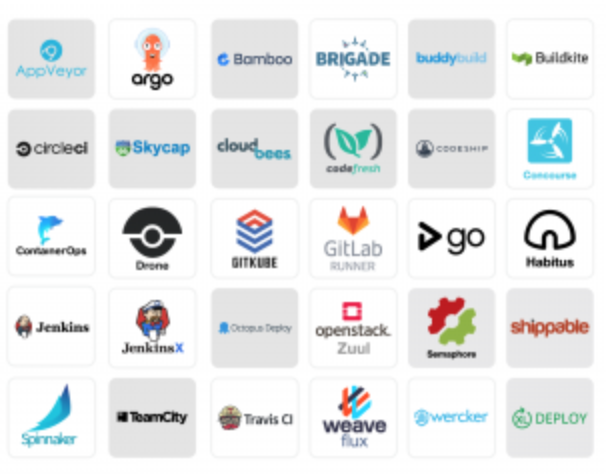
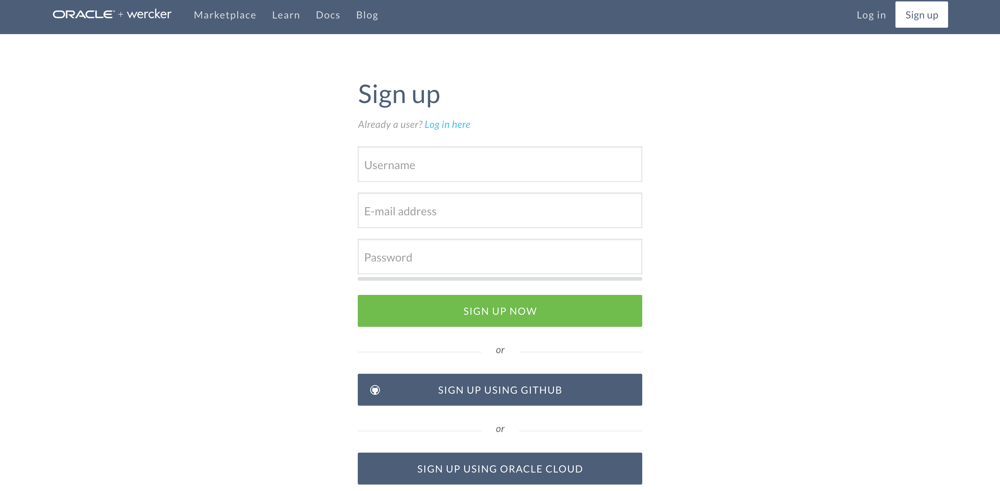
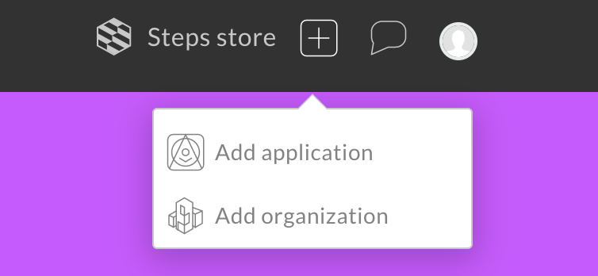
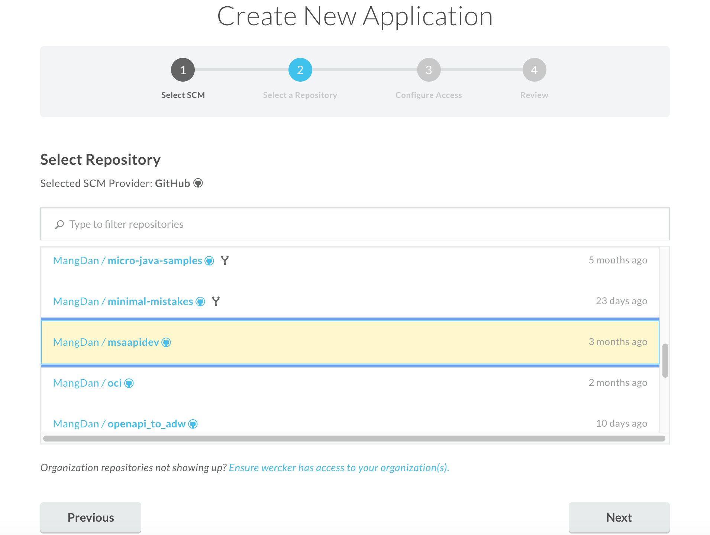
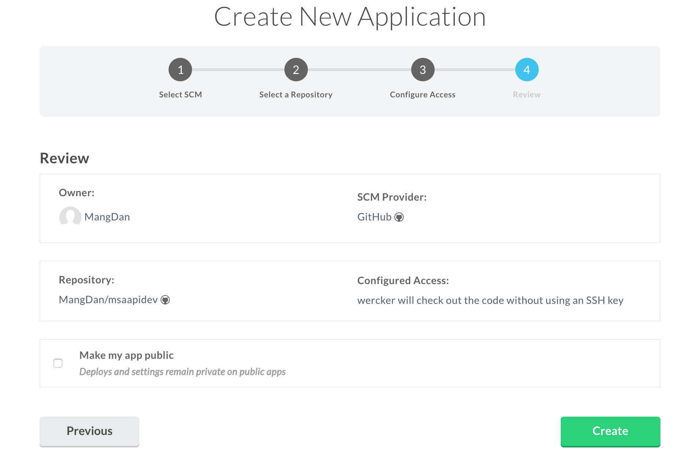
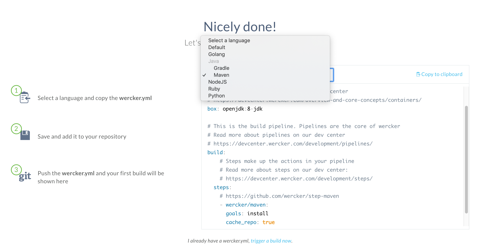
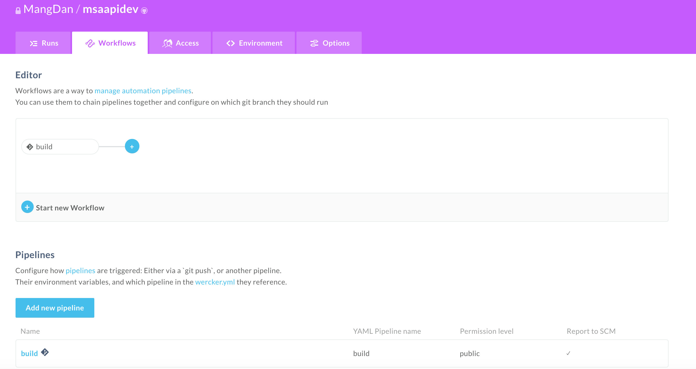
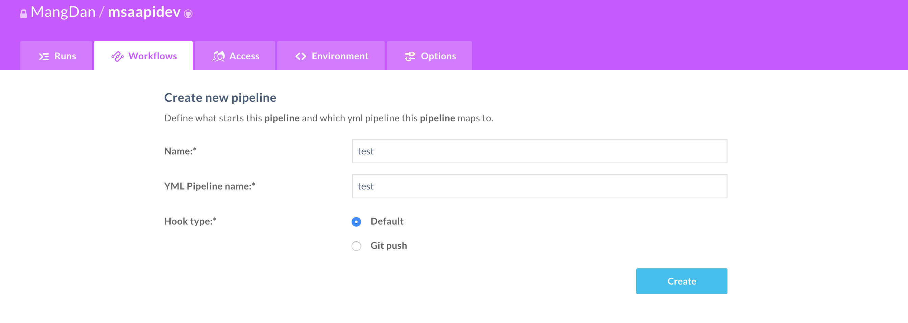
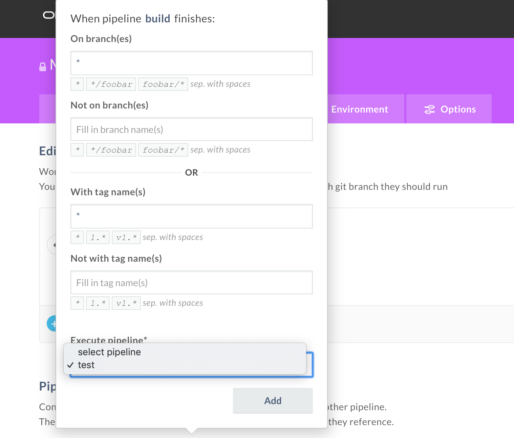
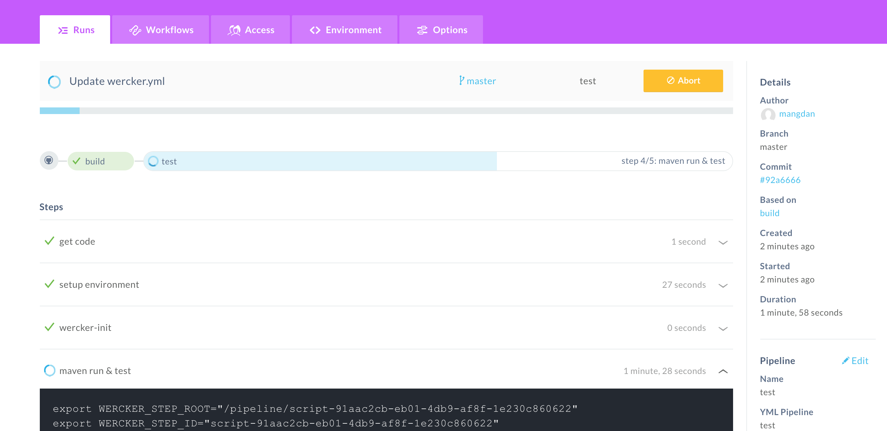

Wercker는 네덜란드 스타트 기업인 Wercker에서 개발한 컨테이너 기반의 CI/CD 솔루션으로 2017년에 오라클이 인수했습니다.  
간단하게 Wercker에 대해서 살펴보도록 하겠습니다.

> 본 블로그의 모든 포스트는 **macOS** 환경에서 테스트 및 작성되었습니다.  

### Wercker

Wercker 관련 웹사이트
* [Wercker App](https://app.wercker.com)
* [Wercker DevCenter: Guides](https://devcenter.wercker.com/)
* [Wercker GitHub](https://github.com/wercker)

Wercker의 홈페이지에서는 다음과 같이 Wercker를 소개하고 있습니다.  

> Wercker is a container-native automation platform to build, dev and deploy multi-service applications

직역하면 Wercker는 다중 서비스 애플리케이션을 빌드, 개발, 배포하기 위한 컨테이너 네이티브 자동화 플랫폼이다 정도로 해석될 수 있을 것 같네요.

PHP등으로 개발된 소규모의 단일 레이어 애플리케이션에 대한 빌드, 테스트, 배포의 경우는 FTP등을 통한 단순 업로드 및 재시작 하는 방식으로 서버에 배포를 합니다. 이후에 좀 더 복잡한 레이어 (멀티 레이어, 모놀리식)를 가지는 애플리케이션에 대한 빌드, 테스트, 배포 자동화를 위한 CI(Continuous Integration) 환경이 필요했고, Hudson이나 Jenkins와 같은 솔루션들을 주로 활용했던 것 같습니다. 근래에 클라우드 환경에서의 애플리케이션 운영이 늘어나면서, 클라우드 환경에 적합한 마이크로 서비스 아키텍쳐(이하 MSA)와 같은 애플리케이션 아키텍처와 함께 이에 적합한 CI 환경이 필요해졌습니다. Jenkins, Hudson과 같은 CI 서버를 사용해도 될텐데, 굳이 다른 CI 환경이 필요하냐 라고 생각할 수 있습니다. 사실 MSA는 기존 모놀리식과 비교해서 독립적으로 운영이 가능한 수많은 서비스들로 이뤄져 있고, 짧고 잦은 배포 주기와 함께, 배포된 위치 (Multi Cloud)와 언어(Polygrot), 플랫폼(Cloud/On-Premise, Container, VM 등)이 다를 수 있기 때문에 기존 모놀리식 아키텍쳐를 지원하던 CI 환경은 적합하지 않을 수 있습니다. 물론 요즘 이러한 트렌드 변화로 Jenkins와 같은 기존 CI 솔루션들도 이를 지원하기 위해 변화고 있습니다.

Wercker는 이러한 트랜드 변화에 맞춰 클라우드 네이티브 환경을 지원하기 위한 Continuous Integration & Continuous Delivery (이하 CI/CD) 솔루션입니다. Wercker와 비슷한 솔루션으로는 Travis CI, Circle CI가 있고, Jenkins도 클라우드 네이티브 지원을 위한 노력을 하고 있습니다.  
* [젠킨스, 쿠버네티스용 클라우드 네이티브 도구로 변신 시도한다](http://www.ciokorea.com/news/118880)
* [Cloud Native Jenkins](https://jenkins.io/sigs/cloud-native/)
* [Circle CI](https://circleci.com/)
* [Travis CI](https://travis-ci.org/)

[CNCF (Cloud Native Computing Foundation)](https://www.cncf.io/)의 Cloud Native Landscape의 CI/CD 영역을 보면, CNCF에서 인증한 여러가지 CI/CD 솔루션들을 볼 수 있습니다. Wercker를 포함해서 위에서 언급한 Jenkins, Travis, Circle등이 포함되어 있습니다.

**CNCF - Cloud Native Landscape - CI/CD**  


### Wercker 기본 요소

Wercker는 크게 Step, Pipeline, Workflow 세개의 기본 요소를 가지고 있습니다. Step이 제일 작은 개념이고, Workflow가 가장 큰 개념입니다. Pipeline은 여러개의 Step이라는 작업 단위로 이뤄져 있고, 여러개의 Step으로 구성된 Pipeline들을 엮어서 Workflow로 구성할 수 있습니다.

* Steps
    * 각 Step은 특정 스크립트 실행을 위한 커맨드가 포함됩니다. 예를 들어 npm install, 메이븐 작업(build, install, package등), 디렉토리 변경, git pull/push, docker image pull/push와 같은 작업들이 해당될 수 있습니다.

* Pipelines
    * 하나의 Pipeline은 다수의 Step(작업)으로 구성됩니다. 예를 들면, Build Pipeline은 애플리케이션 빌드를 위한 Step이 포함되어 있고, Test Pipeline (Pipeline 이름은 임의로 작성될 수 있습니다.)은 빌드 성공한 결과물을 테스트하는 Step이 포함될 수 있습니다. Deploy Pipeline은 실제 서버에 배포하는 내용의 Step이 포함될 수 있습니다. 
    * Pipeline내의 Step이 실행되기 위해서는 실행 될 환경이 필요한데, 각 Pipeline이 실행될 때 Docker Hub 등에서 Container Image를 가져와 구성합니다. 보통 하나의 Pipeline은 하나의 Container Image를 사용합니다.
* Workflows
    * Workflow는 Pipeline 실행에 대한 프로세스를 디자인할 수 있습니다. 예를 들면 Build Pipeline이 실행되면 Test Pipeline이 실행되고, Deploy Pipeline이 실행된다와 같이 순차적인 플로우를 구성할 수도 있고, Build Pipeline이 실행되고, Test Pipeline과 Deploy Pipeline을 병렬로 실행할 수도 있습니다. 이와 같이 Pipeline에 대한 실행 플로우를 구성하는 것이 Workflows 부분입니다.

### Wercker 사용하기

Wercker는 기본적으로 Shared VM 환경에서 사용자당 동시에 2개의 빌드 잡이 가능한 Community Edition을 무료로 제공합니다. Github 계정이 있으면 쉽게 Wercker에 무료 계정을 만들 수 있습니다.

#### Wercker 계정 만들기
https://app.wercker.com 로 접속해서 우측 상단의 **Sign up** 버튼을 클릭한 후 계정을 만들 수 있습니다. 보통 GitHub과 연동을 해서 작업을 많이 하기 때문에 GitHub 계정을 이용해서 가입하면, 자동으로 본인의 GitHub과 연동이 됩니다. 그외 Community Edition이 아닌 Oracle Cloud를 통해 구매한 경우 Dedicated 환경을 제공받는데, 이 경우에는 맨 마지막 **SIGN UP USING ORACLE CLOUD**로 **Sign up**하면 됩니다.


#### Wercker Application 생성
가입하고 로그인하면 우측 상단에 + 아이콘을 클릭하면 **Add Application**이라는 메뉴를 볼 수 있습니다. 클릭하면 Wercker Application을 생성하는데, 여기서의 Application은 Step과 Pipeline, Workflow를 포함하는 개념이라고 보면 됩니다.


#### Wercker Application 생성 - SCM 연결
보통 하나의 Wercker Application은 하나의 SCM(Source Control Management)과 연결됩니다. 아래와 같이 연결할 SCM을 선택합니다. 여기서는 간단히 GitHub Repository와 연결을 해 보도록 하겠습니다.
GitHub 계정으로 가입하면 자동으로 SCM의 본인 이름이 선택됩니다.


#### Wercker Application 생성 - SCM Repository 선택
빌드할 애플리케이션이 있는 Repository를 선택합니다.




#### Wercker Application 생성 - Setup SSH key
레파지토리 접속을 SSH Key를 사용할 경우 셋업하는 경우로 여기서는 SSH Key 없이 접속합니다.



#### Wercker Application 생성 - Review & Create
리뷰하고 **Create** 버튼을 클릭하면 Wercker Application이 만들어집니다.

### Wercker 환경 구성
Wercker Application이 만들어지면, **Nicely done!** 메시지와 함께 여러가지 빌드 환경을 위한 샘플 wercker 설정 샘플을 볼 수 있습니다. wercker 설정 파일은 YAML 포멧으로 작성되며, 환경 구성을 위한 Docker Image, Pipeline, Step을 정의합니다. 빌드 시나리오에 맞게 작성한 후 이 wercker.yml 파일을 SCM 레파지토리에 올려놓으면, Wercker가 이 YAML 파일을 기반으로 동작하는 구조라고 보면 됩니다.




#### Wercker.yml 샘플
아래는 간단하게 GitHub에 있는 MicroProfile Helidon으로 작성된 간단한 Application (msa-apidev-mp)라는 프로젝트를 빌드하고 테스트하는 wercker.yml 파일입니다.

box에 openjdk:8-jdk 라는 이미지를 Docker Hub에서 가져와서 8080 포트 오픈과 함께 컨테이너화 하여 실행합니다. 이후 GitHub에 있는 소스를 가져옵니다. (git clone)

파이프라인은 두개인데, 첫 번째는 build라는 파이프라인이고 두번째는 test라는 이름의 파이프라인입니다.  
첫 번째 build 파이프라인에서는 maven을 설치합니다. 그리고 Github에서 가져온 msa-apidev-mp 프로젝트로 이동 (cwd) 후 mvn clean package를 실행해서 빌드합니다.  
두 번째 test 파이프라인에서는 마찬가지로 msa-apidev-mp 프로젝트로 이동 후 java -jar target/msa-apidev-mp.jar 명령어를 실행해서 테스트 및 실행하는 내용입니다.

```
#Use OpenJDK base docker image from dockerhub and open the application port on the docker container
box:
  id: openjdk:8-jdk
  ports:
    - 8080
 
#Build our application using Maven, just as we always have
build:
  steps:
    - install-packages:
        packages: maven
    - script:
        name: maven build
        cwd: msa-apidev-mp
        code: mvn clean package 
test:
  steps:
    - script:
        name: maven run & test
        cwd: msa-apidev-mp
        code: java -jar target/msa-apidev-mp.jar
```

#### Wercker Workflow 구성

wercker.yml 파일 구성이 완료되면 이제는 workflow를 구성할 차례입니다.  
app.wercker.com에 접속해서 처음에 만든 wercker application (여기서는 msaapidev)를 클릭한 후 상단 탭 메뉴중에서 Workflows를 선택합니다. 그럼 기본 pipeline을 등록하고 이를 Workflow로 구성하는 화면이 나오는데, 기본적으로 build 라는 이름의 파이프라인이 있는 것을 볼 수 있습니다. 물론 파이프라인 이름은 변경할 수 있습니다. 제가 작성한 wercker.yml의 첫번째 파이프라인 이름 역시 build 이므로 이 부분은 변경하지 않고, 두번 째 파이프라인인 test라는 파이프라인을 추가하겠습니다. 아래 **Add new pipeline**을 클릭합니다.



Name과 YML Pipeline name을 모두 test로 입력하고 Create 합니다.


Create 한 후에 test pipeline에서 사용할 환경 변수를 입력하는 부분이 있는데, 여기서는 무시하고 다시 상단의 Workflows 메뉴를 클릭합니다. Editor 쪽에 build 옆에 파란색 동그라미의 + 아이콘이 있는데 클릭한 후 생성한 test 파이프라인을 선택한 후 **Add** 버튼을 클릭합니다.



그럼 다음과 같이 간단한 Workflow가 구성됩니다.


이제 간단하게 GitHub에 있는 소스를 수정하거나, Commit을 하면 자동으로 빌드를 시작합니다. 저는 간단하게 wercker.yml 파일 맨 아래에 스페이스를 추가하고 Commit 해보겠습니다. 그럼 자동으로 Wercker build 파이프라인이 시작해서 완료되고, test 파이프라인이 진행중인 것을 볼 수 있습니다. 각 Step에 대한 상세한 로그도 볼 수 있습니다.




### 마무리
Wercker는 심플함과 상대적으로 저렴한 가격 정책, 특히 Step에 대한 레파지토리를 제공함으로써 작성된 Step을 재활용하거나 공개할 수 있는 기능등은 타 솔루션 대비 좋은 것 같습니다. 아직 인지도나 기능적인 측면에서 Jenkins, Travis, Circle등에 떨어지긴 하지만 Cloud Native를 위한 CI 도구로써 충분하다고 봅니다. 아직 인지도가 떨어지는 관계로 다양한 예제나 샘플이 부족해서 특정 이슈를 해결하는데 시간이 많이 걸렸고, 공식 문서가 상세하지 못한 부분이 좀 아쉬운 부분이었습니다. 앞으로 이러한 부분이 좀 더 낳아지길 기대해 봅니다.