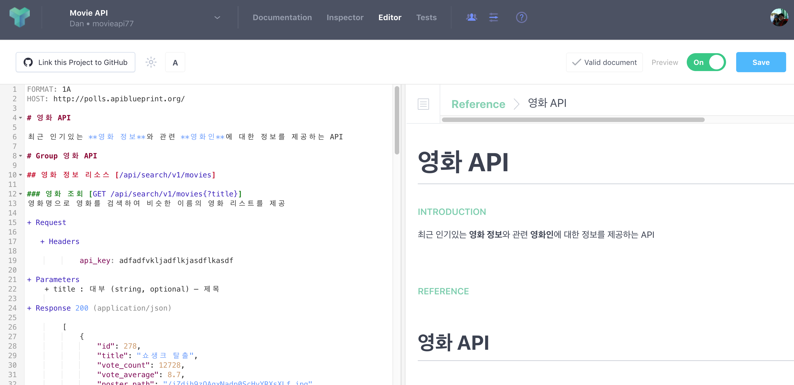
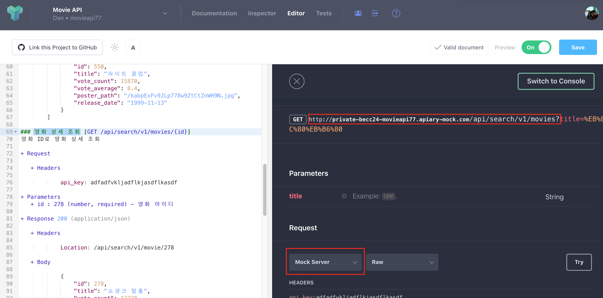
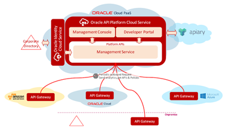
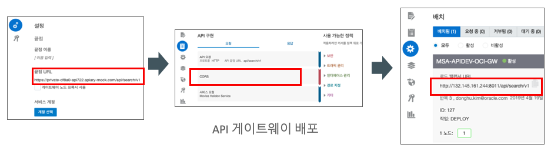
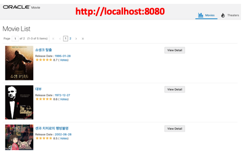
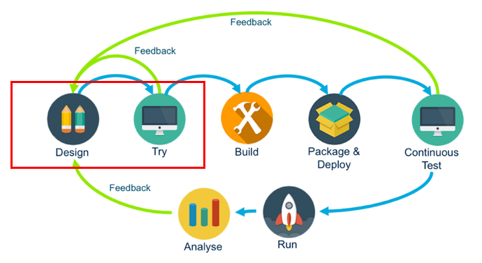

API 설계부터 구현, CI/CD 파이프라인, 컨테이너 배포 및 API 퍼블리시까지 전반적인 API Development Lifecycle을 오라클 솔루션을 사용해서 실습해 볼 수 있도록 작성되었습니다. 내용이 좀 많기 때문에 세번으로 나누어서 진행할 예정인데요, 첫 번째 포스트에서는 **API 디자인 및 프로토타입**, 두 번째는 **마이크로 서비스 개발**, 세 번째는 **빌드, 테스트, 배포 자동화와 API 퍼블리시** 라는 타이틀로 진행합니다. 

여기서 사용되는 모든 소스는 다음 GitHub 레파지토리에서 공유되고 있습니다.  
[실습 자료](https://github.com/MangDan/meetup-190420-api)

전체 과정에서 사용할 기술은 다음과 같습니다.
* API Blueprint - API 설계 스펙
* Oracle Apiary - API 디자인 도구
* Oracle API Platform - API 관리 서비스 (API Management)
* Oracle JET - 프론트엔드 프레임워크
* Oracle Helidon - Microprofile 기반 Microservice 개발 프레임워크
* Oracle Wercker - CI/CD
* Oracle Container Engine & Registry

> 본 블로그의 모든 포스트는 **macOS** 환경에서 테스트 및 작성되었습니다.  

### 시나리오
 

위 그림은 [API Blueprint Overview](/api-blueprint-overview/)에서 API-First Design를 설명하면서 사용한 그림입니다. 이 프로세스를 적용할건데, 각 스탭에 대해서 간략히 설명하자면:

* Design - API Blueprint와 Apiary를 활용해서 API를 디자인 합니다.
* Try - 설계한 API 문서를 프로토타입 합니다. Mock API와 JET UI Framework, API Platform을 사용합니다.
* Build - Microprofile 기반의 Helidon을 활용해서 서비스를 개발합니다.
* Package & Deploy - 개발된 서비스를 로컬에서 패키징, 배포, 테스트합니다.
* Continuous Test - CI/CD 파이프라인을 적용해서 빌드,테스트 및 컨테이너화 합니다.
* Run - 배포된 서비스를 API Platform에 적용해서 최종적으로 JET UI에 반영합니다.
* Analyse - 마이크로 서비스 분석 및 모니터링, API 사용현황에 대한 분석 및 모니터링을 합니다.

구현할 API입니다. 
* 영화 API
  * 영화에 대한 정보를 제공하는 API입니다.

* 영화인 API
  * 영화와 관련된 영화인(영화 관련자)에 대한 정보를 제공하는 API입니다.

### API 디자인

우선 API 디자인을 해보겠습니다. Swagger로 할 수 있지만, 여기서는 쉽게 마크다운으로 작성 가능한 API Blueprint로 작성해보도록 하겠습니다. 에디터는 [Apiary](https://apiary.io/)를 사용할 것이므로 계정이 필요합니다. 가입은 GitHub 계정이 있으면 쉽게 하실 수 있습니다. 없더라도 간단한 이메일 인증만 받으면 가입해서 무료로 사용해볼 수 있습니다.  
가입 방법과 Apiary에 대한 설명은 다음 포스트를 참고하세요.

[[API Blueprint] Basic - Apiary 계정 생성하고, API 설계 프로젝트 생성하기](/api-blueprint-basic)

다음은 사용할 API Blueprint 설계 문서입니다. 여기서 사용한 API Blueprint에 대한 설명은 다음 포스트에서 설명하고 있으니 스펙에 대해서 궁금하신 분들은 참고하세요.

[[API Blueprint] Basic](/api-blueprint-basic) 

```markdown
FORMAT: 1A
HOST: http://polls.apiblueprint.org/

# 영화 API

최근 인기있는 **영화 정보**와 관련 **영화인**에 대한 정보를 제공하는 API

# Group 영화 API

## 영화 정보 리소스 [/api/search/v1/movies]

### 영화 조회 [GET /api/search/v1/movies{?title}]
영화명으로 영화를 검색하여 비슷한 이름의 영화 리스트를 제공

+ Request

   + Headers
   
            api_key: adfadfvkljadflkjasdflkasdf

+ Parameters
    + title : 대부 (string, optional) – 제목
       
+ Response 200 (application/json)

        [
            {
                "id": 278,
                "title": "쇼생크 탈출",
                "vote_count": 12728,
                "vote_average": 8.7,
                "poster_path": "/iZdih9zQAqxNadp0ScHyYRXsXLf.jpg",
                "release_date": "1995-01-28"
            },
            {
                "id": 238,
                "title": "대부",
                "vote_count": 9746,
                "vote_average": 8.6,
                "poster_path": "/cOwVs8eYA4G9ZQs7hIRSoiZr46Q.jpg",
                "release_date": "1972-12-27"
            },
            {
                "id": 129,
                "title": "센과 치히로의 행방불명",
                "vote_count": 7174,
                "vote_average": 8.5,
                "poster_path": "/mD49waY0XR7HNrS13r63tfgYT08.jpg",
                "release_date": "2002-06-28"
            },
            {
                "id": 424,
                "title": "쉰들러 리스트",
                "vote_count": 7746,
                "vote_average": 8.5,
                "poster_path": "/oyyUcGwLX7LTFS1pQbLrQpyzIyt.jpg",
                "release_date": "1994-03-05"
            },
            {
                "id": 550,
                "title": "파이트 클럽",
                "vote_count": 15870,
                "vote_average": 8.4,
                "poster_path": "/kabpExFv9JLp778w9ZtCtZnWH9N.jpg",
                "release_date": "1999-11-13"
            }
        ]

### 영화 상세 조회 [GET /api/search/v1/movies/{id}]
영화 ID로 영화 상세 조회

+ Request

   + Headers
   
            api_key: adfadfvkljadflkjasdflkasdf
   
+ Parameters
   + id : 278 (number, required) - 영화 아이디
   
+ Response 200 (application/json)

   + Headers

            Location: /api/search/v1/movie/278

   + Body

            {
                "id": 278,
                "title": "쇼생크 탈출",
                "vote_count": 12728,
                "vote_average": 8.7,
                "poster_path": "/iZdih9zQAqxNadp0ScHyYRXsXLf.jpg",
                "release_date": "1995-01-28",
                "overview": "촉망받는 은행 간부 앤디 듀프레인(팀 로빈슨)은 아내와 그녀의 정부를 살해했다는 누명을 쓴다. 주변의 증언과 살해 현장의 그럴듯한 증거들로 그는 종신형을 선고받고 악질범들만 수용한다는 지옥같은 교도소 쇼생크로 향한다. 인간 말종 쓰레기들만 모인 그곳에서 그는 이루 말할 수 없는 억압과 짐승보다 못한 취급을 당한다. 그러던 어느 날, 간수의 세금을 면제받게 해 준 덕분에 그는 일약 교도소의 비공식 회계사로 일하게 된다. 그 와중에 교도소 소장은 죄수들을 이리저리 부리면서 검은 돈을 긁어 모으고 앤디는 이 돈을 세탁하여 불려주면서 그의 돈을 관리하는데..."
            }
           

# Group 영화인 API
## 영화인 정보 리소스 [/api/search/v1/movie-people]

### 영화인 조회 [GET /api/search/v1/movie-people{?filmography}]
필모 그래피로 영화인 정보를 검색하여 리스트를 제공

+ Request

   + Headers
   
            api_key: adfadfvkljadflkjasdflkasdf

+ Parameters
   + filmography : 쇼생크 (string, required) - 필모 그래피

+ Response 200 (application/json)
    + Attributes (array[MoviePeopleMeta])

### 영화인 상세 조회 [GET /api/search/v1/movie-people/{id}]
영화인 ID로 영화인의 상세 정보를 제공하는 API

+ Request

   + Headers
   
            api_key: adfadfvkljadflkjasdflkasdf

+ Parameters
   + id : 10084614 (number, required) - 영화인 아이디

+ Response 200 (application/json)
    + Attributes (MoviePeople)

# Data Structures

## MoviePeople (object)
+ Include MoviePeopleMeta
+ filmography : 쇼생크 탈출 (string, optional) - 필모그래피

## MoviePeopleMeta (object)
+ id : 10084614 (number, required) - 아이디
+ name : 프랭크 다라본트 (string, required) - 이름
+ role : 감독 (string, optional) - 역할
```

위에서 정의한 API 문서에 따르면 총 2개의 그룹과 2개의 API 리소스가 있는 것을 알 수 있습니다.

그룹1: 영화 API
- 영화 정보: /api/search/v1/movies
    - 영화 조회 [GET]
    - 영화 상세 조회 [GET]

그룹2: 영화인 API
- 영화인 정보: /api/search/v1/movie-people
    - 영화인 조회 [GET]
    - 영화인 상세 조회 [GET]

Apiary 가입 후 만든 Movie API 프로젝트에서 좌측 에디터에 위 API Blueprint를 붙여넣기 하고 우측 상단 Save 버튼을 눌러서 저장합니다.



### API Prototype

API 설계 후 실제 구현하기 전에 프로토타입을 하는 과정입니다. API 우선 설계(API-First Design)로 접근할 때 중요한 부분으로 API를 사용하는 클라이언트 측면에서 비즈니스와 기술적인 관점의 여러가지 사항을 체크하는 과정이라고 볼 수 있습니다. API 프로토타입 API 설계자, API 개발자, 앱 개발자간의 빠른 피드백이 가능하고, 설계 단계에서 오류를 파악하여 전체 개발 사이클 시간과 운영에서의 오류를 줄임으로써 이로 인한 비용 감소 효과를 볼 수 있습니다. 

설계에서의 완성도를 높힘으로써 전체 개발 시간과 API 완성도를 빠르게 끌어 올릴 수 있는 중요한 단계라고 볼 수 있습니다.

프로토타입 과정에서 필요한 부분은 다음과 같습니다.

* Mock API
* API Gateway (Oracle API Platform)
* 프론트엔드 애플리케이션

> 사실 프로토타입 과정에서 API management가 꼭 필요한 것은 아니겠지만, Mock API로 제공하지 못하는 부분들, 가령 단일 엔드포인트, 보안, 트래픽 제어, 서비스 라우팅등의 기능을 설계 단계에서 미리 적용해서 프로토타입을 해볼 수 있습니다.
오픈 API 혹은 특정 보안이나 정책 적용이 필요한 API의 경우 관련 기능을 프로토타입에 구현하는 노력이 필요할 수 있고, 프로토타입 과정에서 제외하더라도 이후 개발/테스트 단계에서 이 부분에 대한 추가적인 노력과 비용이 발생할 수 있기 때문에 이러한 API 관리 플랫폼을 미리 프로토타입 과정에서 활용해 보는 것이 더 정확한 프로토타입이 될 수 있습니다.

#### Mock API

Apiary에서는 자체적으로 가상의 API Mock 테스트를 위한 API Mock 서버를 제공합니다. Apiary를 사용하지 않아도 API Blueprint Mock Server 오픈 소스인 **Drakov**를 사용할 수도 있습니다. 여기서는 Apiary의 Mock API를 사용하겠습니다.

[Drakov](https://github.com/Aconex/drakov)

Apiary에서 만들어진 HTML 문서의 영화 조회 API를 클릭하고 Request 밑에 선택박스에서 **Mock Server**를 선택하면 위에 Mock API의 URL을 볼 수 있습니다.



마찬가지로 영화인 정보 리소스의 영화인 조회의 Mock API URL도 확인합니다. Path Parameter나 Query Parameter는 제외하고 Resource URL만 있으면 됩니다. 어차피 실제 런타임에서 호출할 때 필요한 부분이므로 API Gateway에 등록은 Parameter 제외하고 등록하려고 합니다. 아래는 제가 생성한 문서의 Mock API URL입니다.

* 영화 정보 Mock API
    * http://private-becc24-movieapi77.apiary-mock.com/api/search/v1/movies

* 영화인 정보 Mock API
    * https://private-becc24-movieapi77.apiary-mock.com/api/search/v1/movie-people

#### API Gateway (Oracle API Platform)

Microservice Architecture(이하 MSA)를 이루는 중요한 요소중에 하나가 API Gateway입니다. API Gateway는 분산된 수많은 서비스에 대한 단일 엔드포인트를 제공함으로써 클라이언트 변경을 최소화 해주고, 서비스에 대한 공통적으로 고려해야 하는 요소 (Cross-Cutting Issue)에 대한 해결책을 제공해줍니다. 가령 로깅이나 정책, 보안, 모니터링과 모네타이징까지...

API Gateway는 Netflix의 Zuul, KONG과 같은 오픈소스가 있지만, 상용 제품의 경우는 CA, AWS, IBM, MS, MuleSoft, RedHat과 같은 벤더에서 API Gateway를 포함하여 전반적인 API Management를 위한 솔루션으로 제공합니다.

이번에는 오라클의 API Management 제품인 API Platform을 간단히 소개하고 적용해 보도록 하겠습니다.

Oracle API Platform은 하이브리드 게이트웨이 배치모델을 지원하는 클라우드 제품으로 다음과 같은 요소로 이루어져 있습니다.
* API 문서 - Apiary (클라우드)
* API 관리 - API 관리 포탈 (클라우드)
* API 카탈로그 - API 개발자 포탈 (클라우드)
* API Gateway (하이브리드)

Apiary와 API 관리/개발자 포탈은 오라클 클라우드에서 서비스를 하고, 실질적인 요청/응답을 처리하는 Gateway는 On-Premise와 클라우드(AWS, Azure, Oracle 등)에 모두 설치되는 구조입니다. 오라클에서는 이를 3세대 게이트웨이(3rd Generation Gateway)라고 부르더군요. MSA에서는 각 서비스들의 위치가 특정되지 않을수도 있기 때문에 서비스들과 가장 가까운 위치에서 게이트웨이를 운영할 수 있는 부분은 큰 장점이라 봅니다. 각 게이트웨이가 관리 포탈에서 정의된 정책을 폴링하는 구조로 게이트웨이 노드 수에 상관없이 모든 게이트웨이에 빠르게 정책 적용하는 것이 용이합니다. 다만, 클라우드 솔루션이기 때문에 관리/개발자 포탈이 퍼블릭에서 운영이 될 수 밖에 없다는 점은 국내 금융등 온프레미스 환경을 선호하는 업계에서는 마이너스 요소가 아닌가 싶습니다. 

**Oracle API Platform Architecture**  


여기서는 Oracle Cloud에 가입하고 Oracle API Platform Cloud를 프로비저닝 하는 과정이나 API Gateway 설치과정은 따로 다루지 않겠습니다. Trial도 있지만, 상용 제품이기 때문에 구매해야 하는 부분도 있고, 굳이 상용이 아니더라도 Zuul과 같은 오픈소스를 사용해도 상관 없습니다.


Oracle API Platform에서 Mock API URL을 서비스로 등록하고 API를 신규로 등록해서 CORS 정책을 적용했습니다. 그리고 Gateway에 배포를 하면 3번째 그림처럼 API Gateway의 엔드포인트를 확인할 수 있습니다.


#### Application Prototype
이제 등록된 API를 활용해서 애플리케이션 프로토타입을 해보는 과정입니다. 프론트엔드 애플리케이션은 Oracle JET로 만들어봤습니다.

소스는 다음 깃헙에서 다운로드 받을 수 있습니다.
git clone https://github.com/MangDan/meetup-190420-api

다운로드 받으면 jet-movie-msa-ui 라는 폴더가 있고 하위에 endpoints.json 파일에 위 게이트웨이에 배포한 API 엔드포인트를 입력합니다.

```
> cd jet-movie-msa-ui/src/js

> vi endpoints.json

{
        "movies": "http://132.145.161.244:8011/api/search/v1/movies",
        "image": "https://image.tmdb.org/t/p/w185"
}
```

JET 애플리케이션 구동을 위해서 Node.js와 Oracle JET CLI를 설치해야 합니다.
Node.js는 설치되어 있다는 가정하에 다음 npm으로 Oracle JET CLI를 설치합니다.

```
> npm install -g @oracle/ojet-cli
```

다시 다운받은 JET Application 폴더로 이동해서 oraclejet-tooling을 install 합니다. GitHub Repository에서 공유되지 않은 node_module을 다운로드 받는 과정입니다.

```
> cd jet-movie-msa-ui

npm install @oracle/oraclejet-tooling --save
```

마지막으로 JET 애플리케이션을 실행합니다.
```
ojet serve
```

구동된 화면입니다.  


이번 시간에는 API-First Design 단계에서 API Design과 Try(Prototype)에 대해서 다뤘습니다.


실제 API가 개발되기 전에 Mock API와 API Gateway를 통해서 프로토타입을 함으로써, 이 과정에서 설계자, API 개발자, APP 개발자, API 관리자간에 빠른 피드백 생기고, 정확한 설계가 가능해집니다.
다음 시간에는 MicroProfile 기반의 Oracle Helidon Framework을 사용해서 서비스를 실제 개발해 보도록 하겠습니다.