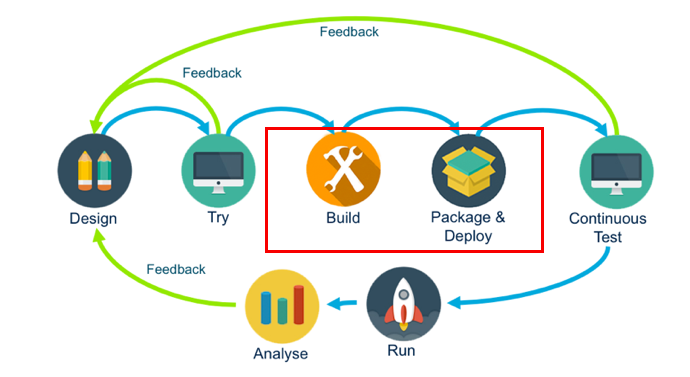

전 시간([Cloud Native Development 1탄 - API 디자인 및 프로토타입](/api-first-design-and-development-1))에 이어서 이번 시간에는 API 설계 내용을 토데로 Microprofile 기반의 Oracle Helidon을 사용해서 서비스를 개발해보도록 하겠습니다.

여기서 사용되는 모든 소스는 다음 GitHub 레파지토리에서 공유되고 있습니다.  
[실습 자료](https://github.com/MangDan/meetup-190420-api)

전 과정에서 사용하는 기술은 다음과 같습니다.
* API Blueprint - API 설계 스펙
* Oracle Apiary - API 디자인 도구
* Oracle API Platform - API 관리 서비스 (API Management)
* Oracle JET - 프론트엔드 프레임워크
* Oracle Helidon - Microprofile 기반 Microservice 개발 프레임워크
* Oracle Wercker - CI/CD
* Oracle Container Engine & Registry

> 본 블로그의 모든 포스트는 **macOS** 환경에서 테스트 및 작성되었습니다.  

### 테이블 스키마, 데이터 준비
오라클 DB를 사용했고, 테이블은 MOVIE, MOVIE_PEOPLE 두 개의 테이블을 만들었습니다.

```sql
CREATE TABLE MOVIE(
    ID NUMBER,
    TITLE VARCHAR2(200),
    POSTER_PATH VARCHAR2(200),
    VOTE_COUNT NUMBER,
    VOTE_AVERAGE NUMBER,
    RELEASE_DATE VARCHAR2(200),
    OVERVIEW VARCHAR2(4000)
)

CREATE TABLE MOVIE_PEOPLE(
    ID NUMBER,
    NAME VARCHAR2(100),
    ROLE VARCHAR2(100),
    FILMOGRAPHY VARCHAR2(4000)
)
```

### Helidon Project

Helidon Project는 [실습 자료](https://github.com/MangDan/meetup-190420-api) 링크를 통해서 다운로드 받을 수 있습니다.

```
> git clone https://github.com/MangDan/meetup-190420-api
```

meetup-190420-api 폴더안 다음 위치에 있는 properties 파일을 열고 위 테이블이 있는 DB로 정보를 변경해줍니다.

```
> vi meetup-190420-api/helidon-movie-api-mp/src/main/resources/META-INF/microprofile-config.properties

javax.sql.DataSource.oracle.dataSourceClassName=oracle.jdbc.pool.OracleDataSource
javax.sql.DataSource.oracle.dataSource.url = jdbc:oracle:thin:@{DB_IP}:{DB_PORT}:{SID}
javax.sql.DataSource.oracle.dataSource.user = {아이디}
javax.sql.DataSource.oracle.dataSource.password = {패스워드}
```

다음 위치의 MovieController.java 파일을 오픈해보면 구현되어 있는 4개의 API Resource Path를 볼 수 있습니다.

> helidon-movie-api-mp/src/main/java/io/helidon/api/movie/controller/MovieController.java

```java
package io.helidon.api.movie.controller;

import javax.enterprise.context.ApplicationScoped;
import javax.inject.Inject;
import javax.ws.rs.DefaultValue;
import javax.ws.rs.GET;
import javax.ws.rs.Path;
import javax.ws.rs.PathParam;
import javax.ws.rs.Produces;
import javax.ws.rs.QueryParam;
import javax.ws.rs.core.MediaType;
import javax.ws.rs.core.Response;
import javax.ws.rs.core.Response.ResponseBuilder;
import javax.ws.rs.core.Response.Status;

import io.helidon.api.movie.service.MovieService;

@Path("/api/search/v1")
@ApplicationScoped
public class MovieController {

    @Inject
    private MovieService movieService;
    
    @Path("/movies")
    @GET
    @Produces(MediaType.APPLICATION_JSON)
    public Response searchMovies(@DefaultValue("") @QueryParam("title") String title) {
        return Response.ok(movieService.searchMovies(title)).build();
    }

    @GET
    @Path("/movies/{id}")
    @Produces(MediaType.APPLICATION_JSON)
    public Response findMovieById(@PathParam("id") int id) {
        ResponseBuilder builder = Response.status(Status.OK);
        builder.header("Location", "/api/search/v1/movie/"+id);

        return builder.type(MediaType.APPLICATION_JSON).entity(movieService.findMovieByid(id)).build();
    }

    @GET
    @Path("/movie-people")
    @Produces(MediaType.APPLICATION_JSON)
    public Response searchMoviePeople(@QueryParam("filmography") String filmography) {
        return Response.ok(movieService.searchMoviePeople(filmography)).build();
    }

    @GET
    @Path("/movie-people/{id}")
    @Produces(MediaType.APPLICATION_JSON)
    public Response findMoviePeopleById(@PathParam("id") int id) {
        return Response.ok(movieService.findMoviePeopleByid(id)).build();
    }
}
```


DB Query는 MovieRepository.java 와 MoviePeopleRepository.java에서 연결하여 실행합니다.

**MovieRepository.java**
```java
package io.helidon.api.movie.repository;

import java.sql.Connection;
import java.sql.PreparedStatement;
import java.sql.ResultSet;
import java.sql.SQLException;
import java.util.ArrayList;
import java.util.List;
import java.util.Optional;

import javax.enterprise.context.ApplicationScoped;
import javax.inject.Inject;
import javax.inject.Named;
import javax.sql.DataSource;

import io.helidon.api.movie.entity.Movie;

@ApplicationScoped
public class MovieRepository {

    @Inject
    @Named("oracle")
    private DataSource dataSource;

    /**
     * Creates a new {@link TablesResource}.
     *
     * @param dataSource the {@link DataSource} to use to acquire database table
     *                   names; must not be {@code null}
     *
     * @exception NullPointerException if {@code dataSource} is {@code
     * null}
     */
    // @Inject
    // public MovieRepository(@Named("oracle") final DataSource dataSource) {
    //     super();
    //     this.dataSource = dataSource;
    // }

    public List<Movie> searchMovies(String title) {
        List<Movie> movieArray = new ArrayList<Movie>();
        String clause = "";
        if(!title.equals(""))
        clause = "AND TITLE LIKE ? || '%'";
        
        StringBuffer queryBuffer = new StringBuffer();
        queryBuffer.append("SELECT ID, TITLE, POSTER_PATH, VOTE_COUNT, VOTE_AVERAGE, RELEASE_DATE FROM MOVIE WHERE  ROWNUM <= 50 " + clause + " ORDER BY ID DESC");

        System.out.println(queryBuffer.toString());
        try {
            Connection conn = this.dataSource.getConnection();
            
            PreparedStatement ps = conn.prepareStatement(queryBuffer.toString());

            if(!title.equals(""))
                ps.setString(1, title);

            ResultSet rs = ps.executeQuery();

            while(rs.next()) {
                Movie movie = new Movie();
                movie.setId(rs.getInt("id"));
                movie.setTitle(Optional.ofNullable(rs.getString("title")).orElse(""));
                movie.setPoster_path(Optional.ofNullable(rs.getString("poster_path")).orElse(""));
                movie.setVote_count(Optional.ofNullable(rs.getInt("vote_count")).orElse(0));
                movie.setVote_average(Optional.ofNullable(rs.getInt("vote_average")).orElse(0));
                movie.setRelease_date(Optional.ofNullable(rs.getString("release_date")).orElse(""));
                movieArray.add(movie);
            }

        } catch (SQLException e) {
            e.printStackTrace();
        }

        return movieArray;
    }

    public Movie findMovieByid(int id) {
        Movie movie = new Movie();

        try {
            Connection conn = this.dataSource.getConnection();
            PreparedStatement ps = conn.prepareStatement("SELECT * FROM MOVIE WHERE ID = ?");

            ps.setInt(1, id);
            ResultSet rs = ps.executeQuery();

            if(rs.next()) {
                movie.setId(rs.getInt("id"));
                movie.setTitle(Optional.ofNullable(rs.getString("title")).orElse(""));
                movie.setVote_count(Optional.ofNullable(rs.getInt("vote_count")).orElse(0));
                movie.setVote_average(Optional.ofNullable(rs.getInt("vote_average")).orElse(0));
                movie.setPoster_path(Optional.ofNullable(rs.getString("poster_path")).orElse(""));
                movie.setRelease_date(Optional.ofNullable(rs.getString("release_date")).orElse(""));
                movie.setOverview(Optional.ofNullable(rs.getString("overview")).orElse(""));
            }

        } catch (SQLException e) {
            e.printStackTrace();
        }

        return movie;
    }
}
```

**MoviePeopleRepository.java**
```java
package io.helidon.api.movie.repository;

import java.sql.Connection;
import java.sql.PreparedStatement;
import java.sql.ResultSet;
import java.sql.SQLException;
import java.util.ArrayList;
import java.util.List;
import java.util.Objects;
import java.util.Optional;

import javax.enterprise.context.ApplicationScoped;
import javax.inject.Inject;
import javax.inject.Named;
import javax.sql.DataSource;

import io.helidon.api.movie.entity.MoviePeople;

@ApplicationScoped
public class MoviePeopleRepository {

    private final DataSource dataSource;

    /**
     * Creates a new {@link TablesResource}.
     *
     * @param dataSource the {@link DataSource} to use to acquire database table
     *                   names; must not be {@code null}
     *
     * @exception NullPointerException if {@code dataSource} is {@code
     * null}
     */
    @Inject
    public MoviePeopleRepository(@Named("oracle") final DataSource dataSource) {
        super();
        this.dataSource = Objects.requireNonNull(dataSource);
    }

    public List<MoviePeople> searchMoviePeople(String filmography) {
        List<MoviePeople> moviePeopleArray = new ArrayList<MoviePeople>();
        String clause = "";
        if(!filmography.equals(""))
        clause = "WHERE FILMOGRAPHY LIKE '%' || ? || '%'";
        
        StringBuffer queryBuffer = new StringBuffer();
        queryBuffer.append("SELECT * FROM MOVIE_PEOPLE " + clause + " ORDER BY ID DESC");
        
        try {
            Connection conn = this.dataSource.getConnection();
            
            PreparedStatement ps = conn.prepareStatement(queryBuffer.toString());

            if(!filmography.equals(""))
                ps.setString(1, filmography);

            ResultSet rs = ps.executeQuery();

            while(rs.next()) {
                MoviePeople moviePeople = new MoviePeople();
                moviePeople.setId(rs.getInt("id"));
                moviePeople.setName(Optional.ofNullable(rs.getString("name")).orElse(""));
                moviePeople.setRole(Optional.ofNullable(rs.getString("role")).orElse(""));
                moviePeople.setFilmography(Optional.ofNullable(rs.getString("filmography")).orElse(""));
                
                moviePeopleArray.add(moviePeople);
            }

        } catch (SQLException e) {
            e.printStackTrace();
        }

        return moviePeopleArray;
    }

    public MoviePeople findMoviePeopleByid(int id) {
        MoviePeople moviePeople = new MoviePeople();

        try {
            Connection conn = this.dataSource.getConnection();
            PreparedStatement ps = conn.prepareStatement("SELECT * FROM MOVIE_PEOPLE WHERE ID = ?");

            ps.setInt(1, id);
            ResultSet rs = ps.executeQuery();

            if(rs.next()) {
                moviePeople.setId(rs.getInt("id"));
                moviePeople.setName(Optional.ofNullable(rs.getString("name")).orElse(""));
                moviePeople.setRole(Optional.ofNullable(rs.getString("role")).orElse(""));
            }

        } catch (SQLException e) {
            e.printStackTrace();
        }

        return moviePeople;
    }
}
```

### Helidon Project Packaing & Run

다음과 같이 Maven Packaging 및 실행합니다.
```
> cd helidon-movie-api-mp

> mvn clean & package

> java -jar target/helidon-movie-api-mp.jar
```

curl로 테스트해보도록 하겠습니다.
```
> curl http://localhost:8000/api/search/v1/movies

> curl http://localhost:8000/api/search/v1/movies/{id}

> curl http://localhost:8000/api/search/v1/movie-people

> curl http://localhost:8000/api/search/v1/movie-people/{id}
```

이번 시간에는 Microprofile 기반의 Helidon Framework을 활용해서 실제 REST 서비스를 구현하고 패키징 및 실행하는 부분을 다뤘습니다.


 다음 시간에는 Wercker CI/CD와 Oracle Kubernetes Engine을 활용해서 빌드/테스트/배포 자동화하는 방법과 최종적으로 배포된 서비스를 API Gateway에 적용해서 UI를 완성하는 부분까지 다루도록 하겠습니다.