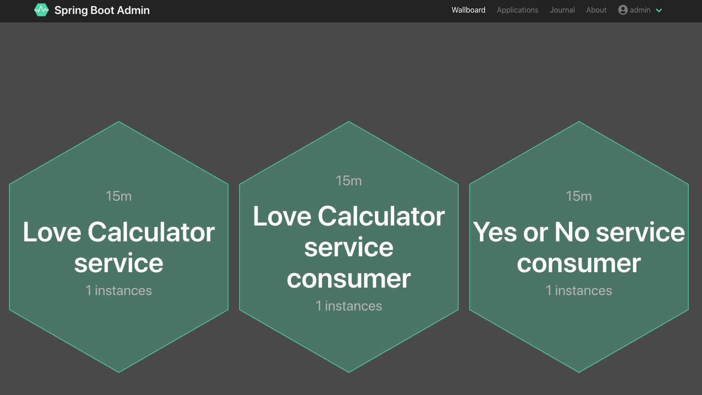

Microservice Architecture (이하 MSA)를 구축할 때 생각해야 될 여러가지 구성 요소중에 하나가 모니터링이 아닌가 생각됩니다. 수백개 혹은 수천개의 서비스들이 서로 다른 서버와 네트워크에서 운영되고, 각각의 서비스들이 유기적으로 연결되어 동작하는 MSA 환경에서 각 개별 혹은 전체 서비스들을 모니터링 하는 것은 생각만 해도 음.. 보통일이 아닐겁니다. 이러한 MSA가 적용된 분산 환경에서의 모니터링을 위한 다양한 솔루션들이 있는데, 우선은 국내 개발자들이 가장 많이 사용하는 스프링 기반 마이크로 서비스를 위한 몇가지 오픈소스 모니터링 방법들에 대해서 살펴보고 실습을 해보려고 합니다.

> 본 블로그의 모든 포스트는 **macOS** 환경에서 테스트 및 작성되었습니다.  

여기서 사용되는 모든 소스는 다음 GitHub 레파지토리에서 공유되고 있습니다.  
[실습 자료](https://github.com/MangDan/spring-boot-monitoring)

이번 실습을 위한 개발 환경입니다. 
> 개인적으로 Eclipse보다는 IntelliJ나 VSCODE를 더 선호하는 편인데, STS (Spring Tool Suite for Eclipse)는 Spring 개발을 위한 플러그인이 미리 구성되어 있어서 조금 무겁기는 해도 별도의 플러그인 설치 없이 바로 사용할 수 있다는 장점이 있습니다. 편의상 STS 환경에서 작업했습니다.
* Java JDK 1.8+
* Apache Maven
* Spring Tools 4 for Eclipse

### Netflix OSS
넷플릭스는 현재 전 세계적으로 1억 5천만명 이상의 가입자, 1억 시간 이상의 비디오 스트리밍을 제공하는 세계 최대의 동영상 스트리밍 기업입니다.    
2008년 8월부터 Java와 Oracle DB로 구성된 거대한 모놀리식 아키텍쳐를 마이크로 서비스로 전환하기 시작했으며, 거의 7년간의 노력 끝에 2016년 1월에 완료했습니다. 넷플릭스는 자사의 서비스에 적용해 가면서 만들어낸 다양한 솔루션들을 오픈소스로 공개했는데, 이것이 Netflix OSS (Open Source Software) 입니다. 이렇게 공개한 솔루션들중 일부가 스프링 클라우드 프로젝트 하위의 Spring Cloud Netflix라는 이름으로 통합되었습니다. Eureka, Hystrix, Feign, Ribbon, Archaius, Zuul이 통합된 대표적인 Netflix OSS 솔루션들입니다.

### Istio
Netflix OSS와 요즘 자주 비교되는 부분이 Istio인 것 같습니다.
Netflix OSS는 애플리케이션 소스 레벨에서 이러한 솔루션들을 통합하는데, 이 부분을 애플리케이션 소스 레벨이 아닌 인프라 레벨에서 다루고자 해서 나온 방법이 **서비스 매쉬(Service Mesh)** 이고, 대표적인 솔루션이 IBM, Google 및 Lyft가 공동 개발한 [Istio](https://istio.io/)입니다.  
Netflix OSS에서는 Service Discovery, Load Balancing, Fault Tolerance (Circuit Breaker 등), Gateway, Monitoring등의 기능을 애플리케이션 영역에서 다뤄야 했는데, 이 부분을 인프라에서 할 수 있게 한 것으로 개발자들이 신경쓰지 크게 신경쓰지 않아도 되며, 애플리케이션 소스를 건드릴 필요도 없고, 특정 언어나 프레임워크에 종속될 필요도 없다는 장점이 있습니다. 점점 MSA와 관련해서 다양한 기술들이 생기고 또한 진화하고 있고, 쿠버네티스와 같은 컨테이너에 대한 기술 수준이 계속해서 발전하면서, MSA가 점점 진화해 나가고 있는데, MSA를 1세대와 2세대로 굳이 나눈다면 Istio가 있느냐 없느냐로 나눠진다고 얘기 할 수 있을것 같습니다. Istio가 새로 나왔기 때문에 좋은점만 있는 것은 아닙니다. 2018년 7월에 정식으로 1.0이 릴리즈 되었지만, 아직 굵직한 레퍼런스가 없기 때문에, 도입을 위해서는 여러가지 측면에서 검증이 필요할 것으로 보입니다.

### Microservice Monitoring
마이크로서비스 모니터링을 말하면서 Netflix OSS와 Istio를 언급하는 이유는 마이크로서비스 모니터링 아키텍쳐가 서로 다르고 구현하는 방식이 다르기 때문입니다. Spring Boot 기반 마이크로 서비스라 하더라도 Istio를 쓰느냐 안쓰느냐에 따라 그 구성의 차이가 있어서 이 부분을 미리 언급했습니다.
시나리오는 아래과 같이 총 5가지입니다. 모니터링은 Spring Admin과 Prometheus + Grafana 조합이고, 여기에 Service Discovery가 포함됩니다. Service Discovery 부분은 나중에 다시 언급합니다.

* Spring Admin
* Eureka(Service Discovery) and Spring Admin
* Prometheus and Grafana
* Consul(Service Discovery), Prometheus and Grafana
* Kubernetes and Istio with Prometheus and Grafana

### Spring Boot 2 Actuator
우선 시작하기 전에 Spring Boot Actuator에 대해서 간략히 짚고 넘어가겠습니다.  
Spring Boot Actuator는 Spring Boot Application에서 발생하는 여러가지 메트릭 정보를 모아서 제공해주는 기능입니다. 보통 JVM 상태, 트래픽, Cache, DB 상태, Health, dump, 환경등의 정보를 제공한다고 보면 될 것 같습니다.
Spring Boot Actuator는 1.x 버전과 2.x 버전의 차이가 있는데, 좀 더 상세한 정보와 추가된 기능들이 있지만 가장 큰 부분은 Micrometer 정식 지원 부분이 아닌가 생각됩니다.  
일단, Spring Boot Actuator 1.x와 2.x의 차이는 아래 블로그가 도움이 될 것 같네요.  
https://www.baeldung.com/spring-boot-actuators

물론 1.x 버전에서 Micrometer를 아예 사용 못하는 것은 아니고, 설정을 통해 사용이 가능합니다.  
[Spring Boot 1.5 - Micrometer Application Monitoring](https://micrometer.io/docs/ref/spring/1.5)

Micrometer가 무엇이냐~ 일단, Mirometer 홈페이지(https://micrometer.io)에 가보면 커다랗게 다음과 같이 소개하는 문장이 눈에 들어옵니다.  

**Vendor-neutral application metrics facade**

대략 벤더 중립 애플리케이션 메트릭 퍼사드인데, 퍼사드는 일종의 특정 소프트웨어를 사용하기 위한 인터페이스 객체정도로 생각하면 된다고 합니다. Micrometer를 사용하면 다양한 모니터링 시스템과 연동을 할 수 있습니다. 이렇게 하는 이유는 Spring Boot Actuator가 제공하는 정보는 json 혹은 plain text 형태로 사람이 직관적으로 전체를 한눈에 이해하기가 쉽지 않습니다. 따라서 그래피컬하게 모니터링하기 위한 솔루션들을 붙여야 하는데, 이 Micrometer가 이러한 솔루션들을 연결해주는 다리 역할을 한다고 보면 됩니다.  
홈페이지에서 Micrometer를 **Think SLF4J, but for metrics.** 이라고 소개하고 있습니다. 다양한 로깅 구현체들을 추상화해서 인터페이스를 제공하는 SLF4J와 비슷한건데, 로깅이 아닌 메트릭을 위한 것이 바로 Micrometer입니다.

### 환경 구성
우선 기본 개발 환경 구성을 해보겠습니다. JDK는 OpenJDK 12(12.0.1), Eclipse는 Spring 개발을 위한 Spring Tool Suite (STS)를 사용합니다.

#### OpenJDK 12 설치
Windows 사용자는 아래 페이지에서 최신 버전인 OpenJDK 12(12.0.1)로 다운로드 받은 후 특정 폴더에 압축을 해제 합니다.  
[jdk.java.net: Archived OpenJDK General-Availability Releases](http://jdk.java.net/archive/)

macOS 유저는 brew를 사용해서 설치합니다.  
**macOS 사용자**
```
$ brew cask install java
```

> Windows와 macOS 모두 JAVA_HOME과 PATH를 설정해야 합니다. Windows는 시스템 환경변수에 추가하고 macOS는 .bash_profile에 추가합니다. 실제 핸즈온을 진행할 경우 Windows의 경우는 jdk와 함께 미리 환경 구성된 STS를 배포해야 할 것 같다.!!!!!

#### Apache Maven 설치
아래 페이지에서 최신 버전으로 다운로드 받은 후 특정 폴더에 압축을 해제 합니다.  
https://maven.apache.org/download.cgi

#### Spring Tool Suite (STS) 설치
https://spring.io/tools 에 들어가서 다운로드 받습니다. 마찬가지로 특정 플더에 압축을 해제합니다. macOS의 경우는 dmg 파일을 더블 클릭 후 Applications에 추가합니다.

#### Spring Tool Suite (STS) 실행
**Windows** - SpringToolSuite4.exe를 더블클릭  
**macOS** - Launchpad에 있는 **SpringToolSuite4**를 클릭

STS를 실행하면 workspace 경로를 지정해야 하는데, 저는 아래와 같이 workspace 폴더를 지정했습니다. 


**Launch** 버튼을 클릭하면 지정한 workspace 폴더가 생기고 다음과 같이 기본 화면을 보게 됩니다.


STS에 Java Home을 지정합니다. STS 환경설정 > Java > Installed JREs 선택하고 다음과 같이 OpenJDK Home 설정을 합니다.
**JRE home**
* /Library/Java/JavaVirtualMachines/openjdk-12.0.1.jdk/Contents/Home

**JRE name**
* OpenJDK 12.0.1+12


### Spring Admin
첫 번째 시나리오로 Spring Admin을 사용해서 모니터링 해보겠습니다.
Spring Admin은 Spring Boot 애플리케이션 모니터링을 위해 codecentric AG라는 회사에서 시작한 커뮤니티 프로젝트로 Spring Boot Actuator의 Endpoints의 정보를 가져와서 모니터링할 수 있는 Spring Boot Actuator Monitoring UI 프레임워크 입니다. 간단히 Spring Boot 프레임워크에 디펜덴시를 추가함으로써 Spring Boot Admin 서버를 구성할 수 있습니다.

#### Spring Admin Server 셋업
먼저 Spring Initializr를 통해서 Spring Boot 프로젝트를 하나 생성하겠습니다.  
STS 좌측 Package Explorer에서 "Create new Spring Starter Project via the Spring Initializr Web Service"를 클릭하거나 (프로젝트가 없을 경우만 나옵니다.) File > New > Spring Starter Project 를 선택하고 Name과 Java Version을 다음과 같이 지정합니다.

**Name**
* spring-admin-server

**Java Version**
* 12

Name 부분만 spring-admin-server로 지정하고 Next 버튼을 클릭합니다.


현재 기준으로 Spring Boot Version은 2.1.5입니다. Next를 클릭하면 관련 Dependency 추가를 위해 Available 모듈을 찾아 Dependency에 추가할 수 있지만, pom.xml에서 일괄적으로 추가할 수도 있기 때문에 여기서는 그냥 Next 클릭 후 Finish를 클릭해서 프로젝트를 생성하겠습니다.

생성한 프로젝트내의 pom.xml파일을 열어서 properties와 dependency, dependencyManagement를 추가합니다.

먼저 properties에는 spring-boot-admin.version을 추가합니다.
```xml
<properties>
    <java.version>12</java.version>
    <spring-boot-admin.version>2.1.5</spring-boot-admin.version>
</properties>
```

그리고 다음 dependency를 추가합니다.
```xml
<dependency>
    <groupId>org.springframework.boot</groupId>
    <artifactId>spring-boot-starter-web</artifactId>
</dependency>

<dependency>
    <groupId>de.codecentric</groupId>
    <artifactId>spring-boot-admin-starter-server</artifactId>
</dependency>

<dependency>
    <groupId>org.springframework.boot</groupId>
    <artifactId>spring-boot-starter-security</artifactId>
</dependency>

<dependency>
    <groupId>org.springframework.boot</groupId>
    <artifactId>spring-boot-devtools</artifactId>
    <optional>true</optional>
</dependency>
```
간단히 추가 의존성에 대해서 설명하면...
* spring-boot-starter-web 
    * web, RESTful, Spring MVC를 사용하는 애플리케이션 개발을 위한 부분으로 톰켓이 기본 자바 웹 컨테이너로 포함.
* spring-boot-admin-starter-server
    * Spring Boot Admin 서버 스타터
* spring-boot-devtools
    * Spring Boot 개발자 편의를 위해 제공되는 도구로 몇가지 기능이 있지만 주로 소스 변경 시 자동으로 재시작되는 기능 때문에 많이 사용.
* spring-boot-starter-security
    * Spring Security 스타터로 Sprng Application에 인증, 인가와 같은 기능을 구현할 때 사용, Spring Admin은 관리자를 위한 애플리케이션이기 때문에 아무나 접근하지 못하도록 Security 설정을 하기 위해서 추가.

마지막으로 dependencyManagement에 버전 관리를 위한 spring-boot-admin-dependencies가 추가되었습니다.
```xml
<dependencyManagement>
    <dependencies>
        <dependency>
            <groupId>de.codecentric</groupId>
            <artifactId>spring-boot-admin-dependencies</artifactId>
            <version>${spring-boot-admin.version}</version>
            <type>pom</type>
            <scope>import</scope>
        </dependency>
    </dependencies>
</dependencyManagement>
```

pom.xml에 추가된 전체 내용입니다.
```xml
<properties>
    <java.version>12</java.version>
    <spring-boot-admin.version>2.1.5</spring-boot-admin.version>
</properties>

<dependency>
    <groupId>org.springframework.boot</groupId>
    <artifactId>spring-boot-starter-test</artifactId>
    <scope>test</scope>
</dependency>

<dependency>
    <groupId>org.springframework.boot</groupId>
    <artifactId>spring-boot-starter-web</artifactId>
</dependency>

<dependency>
    <groupId>de.codecentric</groupId>
    <artifactId>spring-boot-admin-starter-server</artifactId>
</dependency>

<dependency>
    <groupId>org.springframework.boot</groupId>
    <artifactId>spring-boot-starter-security</artifactId>
</dependency>

<dependency>
    <groupId>org.springframework.boot</groupId>
    <artifactId>spring-boot-devtools</artifactId>
    <optional>true</optional>
</dependency>

<dependencyManagement>
    <dependencies>
        <dependency>
            <groupId>de.codecentric</groupId>
            <artifactId>spring-boot-admin-dependencies</artifactId>
            <version>${spring-boot-admin.version}</version>
            <type>pom</type>
            <scope>import</scope>
        </dependency>
    </dependencies>
</dependencyManagement>
```

#### Spring Security 설정
Spring Security 설정을 위해서 추가적으로 몇가지 작업이 필요합니다.

1. src/main/resources/application.properties를 열어서 다음과 같이 추가합니다. 애플리케이션 이름과 관리자 아이디, 패스워드, Spring Admin에서 사용할 포트입니다.
    ```properties
    spring.application.name=Boot-Aadmin
    spring.security.user.name=admin
    spring.security.user.password=admin
    server.port=8090
    ```
2. src/main/java 하위에 main 클래스를 열어서 메인 함수 하위에 다음과 같이 Security 설정을 위해 WebSecurityConfigurerAdapter를 상속받아서 login, logout 페이지로 접속할수 있게 SecurityConfig Class 구현합니다.

    ```
    public static void main(String[] args) {
		SpringApplication.run(SpringAdminServerApplication.class, args);
	}

    @Configuration
	public class SecurityConfig extends WebSecurityConfigurerAdapter {

	    @Override
	    protected void configure(HttpSecurity http) throws Exception {
	        SavedRequestAwareAuthenticationSuccessHandler successHandler 
	            = new SavedRequestAwareAuthenticationSuccessHandler();
	        successHandler.setTargetUrlParameter("redirectTo");
	        successHandler.setDefaultTargetUrl("/");

	        http.authorizeRequests()
	            .antMatchers("/assets/**").permitAll()
	            .antMatchers("/login").permitAll()
	            .anyRequest().authenticated().and()
	            .formLogin().loginPage("/login")
	            .successHandler(successHandler).and()
	            .logout().logoutUrl("/logout").and()
	            .httpBasic().and()
	            .csrf()
	            .csrfTokenRepository(CookieCsrfTokenRepository.withHttpOnlyFalse())
	            .ignoringAntMatchers(
	                "/instances",
	                "/actuator/**"
	             );
	    }
	}
    ```

> Eclipse에서 Auto Package Import 단축키는 ***"Control + Shift + o"*** 입니다.

#### Spring Admin Application 시작
프로젝트 마우스 우 클릭 후 Run As > Spring Boot App을 선택해서 애플리케이션을 시작합니다.


정상적으로 시작하면 웹브라우저를 열고 http://localhost:8090로 접속합니다. 그럼 다음과 같은 화면을 볼 수 있습니다.


위에서 설정한 아이디(admin)와 패스워드(admin)를 입력해서 Login합니다.


### Spring Boot Client Application
이제 Spring Admin에서 모니터링할 Spring Boot Client Application이 필요합니다. 아래 GitHub Repository를 다운로드 받으면 3개의 Spring Boot REST Service와 1개의 Web Application을 받을 수 있습니다.

[실습 자료](https://github.com/MangDan/spring-boot-monitoring)

#### 서비스 구성도
실습을 위한 간단한 마이크로 서비스와 UI입니다.  
**Love Calculator**와 **Yes or No**라는 Open API를 각각 호출하는 두개의 Spring Boot REST Client(love-calculator-consumer, yes-or-no-consumer)가 있습니다. **love-calculator-service(8081)**는 **love-calculator-consumer(8082)**를 호출한 후, 결과를 받아서 다시 관련 이미지를 얻기 위해서 **yes-or-no-consumer** 서비스를 호출합니다. 그리고 두 결과를 합쳐서 결과를 전달하는 서비스입니다.


관련 소스는 아래 GitHub에서 다운로드 받을 수 있습니다. 우측 Download 버튼을 클릭해서 다운로드 받으면 되며, git이 설치되어 있을 경우 clone 명령어로 다운로드 받을 수 있습니다.  
[실습 자료](https://github.com/MangDan/spring-boot-monitoring)

```
git clone https://github.com/MangDan/spring-boot-monitoring
```

#### 서비스와 웹 어플리케이션
3개의 Spring Boot 서비스와 1개의 웹 페이지로 이루어져 있습니다.
* love-calculator-service (Sprinb Boot Service)
* love-calculator-consumer (Sprinb Boot Service)
* yes-or-no-consumer (Sprinb Boot Service)
* love-calculator-web (Web Application)

> love-calculator-web 에서 사용한 UI는 아래 **THAPATECHNICAL** 에서 공개한 소스를 사용했습니다.  
https://www.thapatechnical.com/2019/02/love-calculator-using-javascript-html.html

#### Import Client Application
먼저 STS에서 다운로드 받은 4개의 프로젝트를 모두 Import 합니다. **File > Import** 혹은 좌측 Project Explorer에서 마우스 우 클릭 후 **Import > Import** 선택합니다.


다운로드 받은 각 프로젝트 폴더를 선택하고, **copy projects into workspace**를 체크해서 spring-admin-server 프로젝트가 있는 workspace로 Import 합니다.


좌측 Project Explorer에 Spring Boot Admin을 포함해서 총 5개의 프로젝트가 보이면 됩니다.  


#### Spring Boot Application 설정 확인
3개의 Spring Boot 프로젝트(love-calculator-consumer, yes-or-no-consumer, love-calculator-service)의 pom.xml은 모두 동일하게 다음과 같이 의존성 설정이 되어 있습니다. Spring Boot Admin Client를 위해 새로 추가된 부분은 다음과 같습니다.

* properties의 spring-boot-admin.version
* dependency의 spring-boot-starter-web, spring-boot-admin-starter-client, spring-boot-starter-actuator, spring-boot-devtools
* dependencyManagement

```xml
<properties>
    <java.version>12</java.version>
    <spring-boot-admin.version>2.1.5</spring-boot-admin.version>
</properties>

<dependencies>
    <dependency>
        <groupId>org.springframework.boot</groupId>
        <artifactId>spring-boot-starter</artifactId>
    </dependency>

    <dependency>
        <groupId>org.springframework.boot</groupId>
        <artifactId>spring-boot-starter-test</artifactId>
        <scope>test</scope>
    </dependency>

    <dependency>
        <groupId>org.springframework.boot</groupId>
        <artifactId>spring-boot-starter-web</artifactId>
    </dependency>
    
    <dependency>
        <groupId>de.codecentric</groupId>
        <artifactId>spring-boot-admin-starter-client</artifactId>
    </dependency>

    <dependency>
        <groupId>org.springframework.boot</groupId>
        <artifactId>spring-boot-starter-actuator</artifactId>
    </dependency>

    <dependency>
        <groupId>org.springframework.boot</groupId>
        <artifactId>spring-boot-devtools</artifactId>
        <optional>true</optional>
    </dependency>
</dependencies>

<dependencyManagement>
    <dependencies>
        <dependency>
            <groupId>de.codecentric</groupId>
            <artifactId>spring-boot-admin-dependencies</artifactId>
            <version>${spring-boot-admin.version}</version>
            <type>pom</type>
            <scope>import</scope>
        </dependency>
    </dependencies>
</dependencyManagement>
```

#### application.properties
3개 프로젝트 모두 src/main/resources/application.properties에 다음과 같은 내용이 추가되어 있습니다. 

**love-calculator-service의 application.properties**
```properties
spring.application.name=Love Calculator service
spring.boot.admin.client.url=http://localhost:8090
spring.boot.admin.client.username=admin
spring.boot.admin.client.password=admin
management.endpoints.web.exposure.include=*
server.port=8081
```

**love-calculator-consumer의 application.properties**
```properties
spring.application.name=Love Calculator service
spring.boot.admin.client.url=http://localhost:8090
spring.boot.admin.client.username=admin
spring.boot.admin.client.password=admin
management.endpoints.web.exposure.include=*
server.port=8082
```

**yes-or-no-consumer의 application.properties**
```properties
spring.application.name=Love Calculator service
spring.boot.admin.client.url=http://localhost:8090
spring.boot.admin.client.username=admin
spring.boot.admin.client.password=admin
management.endpoints.web.exposure.include=*
server.port=8083
```

Spring Admin으로 애플리케이션의 정보를 전송해야 하므로, Spring Admin 서버의 url과 username, password를 지정되어 있습니다. Spring Actuator는 기본적으로 health, info 정보만 노출됩니다.
따라서, management.endpoints.web.exposure.include 또는 management.endpoints.web.exposure.exclude를 통해서 Actuator에서 노출할 정보를 추가해야 합니다. 여기서는 모두 노출되도록 구성했습니다.
위 내용은 3개 서비스 모두 동일하며, 포트만 8081, 8082, 8083으로 다르게 지정되어 있습니다.

#### Controller
love-calculator-service는 AJAX로 호출되는 부분이므로, Cross Domain Ajax 요청을 위해 CORS를 설정해야 합니다. 따라서 love-calculator-service 서비스에 대해서만 @CrossOrigin("*") 어노테이션을 사용했습니다. 그외 @RestController 어노테이션을 통해서 REST 서비스로 만들고 JSON을 반환하도록 작성했습니다.


### 테스트
Spring Boot Admin 서버가 작동하고 있는 상태에서 love-calculator-web을 제외한 Spring Boot Client Application을 시작합니다.  
Spring Boot Admin 서버와 마찬가지로 각 프로젝트 클릭 후 "Run As > Spring Boot App"을 클릭하여 각 서비스를 시작합니다. (순서는 상관 없습니다.)

마지막으로 love-calculator-web/WebContent/index.html 파일을 Browser에서 오픈합니다.


간단히 테스트해보겠습니다. **Your Name**과 **Love Name**을 입력하고 **click** 버튼을 클릭합니다. 다음과 같이 Percentage와 관련 이미지가 나오면 성공입니다.


다음 정보와 함께 Spring Boot Admin에 접속해서 메트릭스 모니터링 대시보드를 확인해보도록 하겠습니다.
* http://localhost:8090
* admin / admin

**Wallboard**


**Applications**


**Service Insights Details**


**Service JVM Threads**


### 정리
Spring Boot Admin을 활용해서 Spring Boot Service Metrics Monitoring 하는 부분에 대해서 간략히 데모와 함께 살펴봤습니다. Client Service를 Spring Boot Admin에 연결하는 방법은 두 가지가 있을 수 있습니다.

1. Client 서비스에 spring-boot-admin-starter-client dependency 추가
2. Service Discovery (Eureka, Consul, Zookeeper)를 함께 사용

Spring Boot Admin은 Spring Application 모니터링을 위한 훌륭한 도구이지만, Spring 관련 의존성(actuator, spring boot admin)이 강해서 다른 프레임워크나 언어로 개발된 서비스 모니터링은 불가능합니다. 하지만 spring boot admin에 대한 의존성을 포함하지 않고 (Actuator는 필요) 연결할 수도 있는데, **Service Discovery** 솔루션을 사용하는 것이 그 방법입니다. 물론 Spring Boot Admin을 사용하기 위해서는 Actuator가 필요하기 때문에 Spring Boot 프레임워크를 사용해야 하는건 변함이 없습니다. 어쨋든 MSA 환경에서 대부분의 서비스들은 **Service Discovery**에 등록해서 서비스를 해야 하므로, 모니터링도 **Service Discovery**에 붙이는 것이 제대로된 모습이라고 볼 수 있습니다. 다음에는 Spring Boot Admin에 Netflix **Service Discovery** 솔루션인 **Eureka**를 붙여서 모니터링 하는 부분을 포스트하도록 하겠습니다.

> 현재 Spring Boot Admin 2.x 에서는 Spring Boot Client 1.5.x 버전에 대한 모니터링을 지원하고 있습니다. 단, 모니터링 Endpoint가 변경된 관계로 기존 Spring Boot Client 1.5.x 버전의 application.properties(yml)에 다음 내용을 추가해야 합니다.
> ```
> spring.boot.admin.api-path=instances
> ```