전 시간([Cloud Native Development 2탄 - 마이크로 서비스 개발하기](/api-first-design-and-development-3))에 이어서 이번 시간에는 CI/CD 빌드 파이프라인 자동화 및 API 게이트웨이 퍼블리시에 대한 내용으로 진행합니다.

여기서 사용되는 모든 소스는 다음 GitHub 레파지토리에서 공유되고 있습니다.  
[실습 자료](https://github.com/MangDan/meetup-190420-api)

전체 과정에서 사용하는 기술은 다음과 같습니다.
* API Blueprint - API 설계 스펙
* Oracle Apiary - API 디자인 도구
* Oracle API Platform - API 관리 서비스 (API Management)
* Oracle JET - 프론트엔드 프레임워크
* Oracle Helidon - Microprofile 기반 Microservice 개발 프레임워크
* Oracle Wercker - CI/CD
* Oracle Container Engine & Registry

> 본 블로그의 모든 포스트는 **macOS** 환경에서 테스트 및 작성되었습니다.  

### CI/CD 파이프라인

**CI/CD Pipeline**
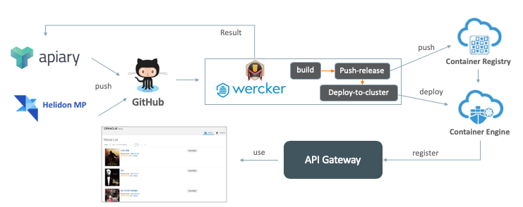

전체 과정은 다음과 같습니다. 
1. 첫 번째 포스트에서 API Blueprint를 GitHub에 Push합니다. 
2. 포스트에서 만든 Helidon 프로젝트도 GitHub에 Push 합니다.
3. Wercker 애플리케이션을 만들고, Oracle Container Registry와 Container Engine(Kubernetes, 이하 OKE) 연결을 위한 환경 구성을 합니다.
4. Wercker 파이프라인을 생성 후 워크플로우를 구성합니다.. 파이프라인은 총 3개로 build, push-release, deploy-to cluster입니다.
5. Wercker의 모든 파이프라인이 완료되면 Helidon Project가 Container Engine에 배포됩니다.
6. 배포된 서비스의 External URL을 확인하고 Oracle Gateway에 적용해서 최종적으로 UI에 반영합니다.

### Apiary와 GitHub sync

먼저 Apiary에서 작성한 API Blueprint를 GitHub Repository에 Push하겠습니다. Apiary는 GitHub Sync 및 Integration 기능을 제공합니다. Apiary 문서로 이동한 후 상단의 Settings를 클릭합니다.

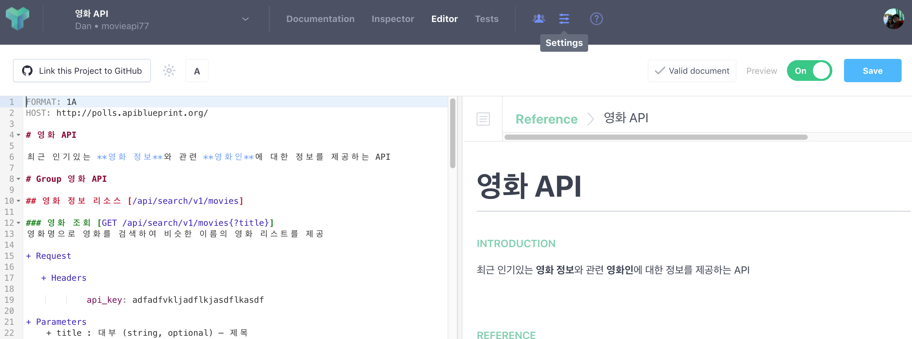

아래로 가보면 **Link your GitHub repository** 부분의 우측 **Link this project to GitHub** 버튼을 클릭합니다. GitHub 계정으로 가입했을 경우 기본적으로 가입한 GitHub 계정과 연결되어 있기 때문에 해당 Repository 목록을 볼 수있습니다.

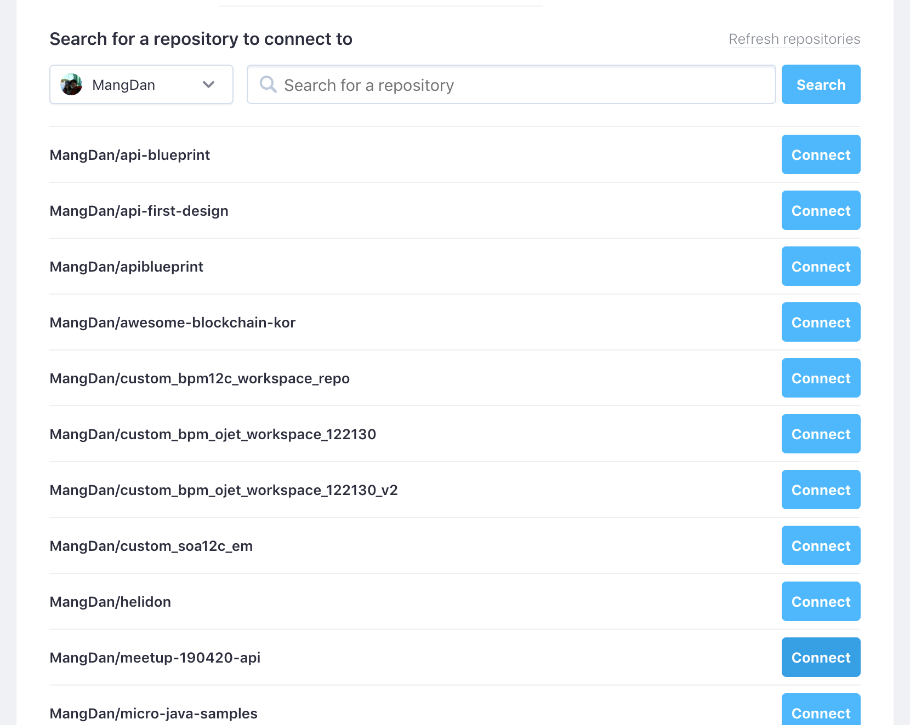

연결하면 Commit and start sync 버튼을 클릭해서 GitHub에 Push 합니다.
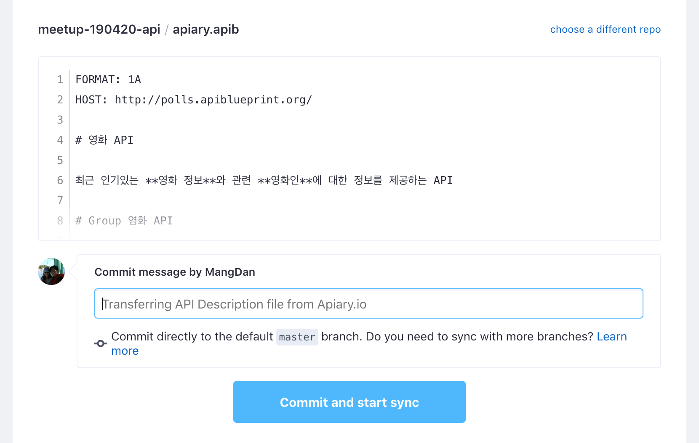

정상적으로 Commit 됩니다. 파일의 이름은 현재는 apiary.apib 라는 이름으로 올라갑니다. 파일 이름을 지정하는 것은 안되는 것 같습니다. 그렇다는 것은 하나의 레피지토리에 한개의 API Blueprint파일만 가능하다는 얘기입니다. 유료 버전의 경우는 가능한 것 같은데 이 부분은 아직 확인해보질 못했습니다.


Commit과 Push가 완료되었습니다.
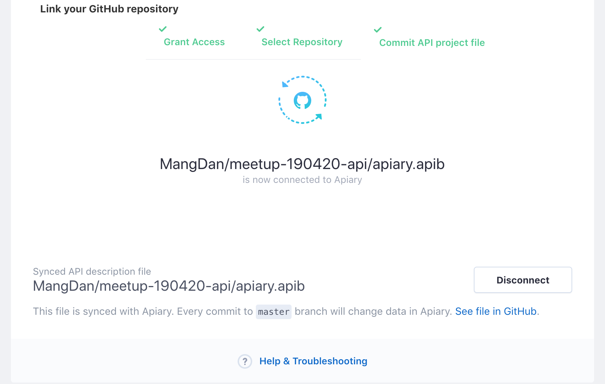

아래와 같이 정상적으로 GitHub에 Push된 것을 확인할 수 있습니다.
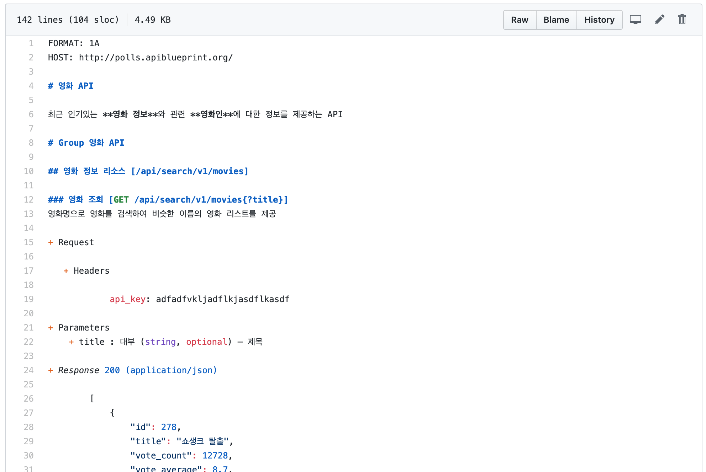

### Helidon Project를 GitHub에 푸시하기
다음은 두 번째 포스트에서 개발한 Helidon Project를 GitHub에 Push합니다.

```
> git add helidon-movie-api-mp

> git commit -m "add helidon-movie-api-mp"

> git push -u origin master
```

GitHub에 올라온 Helidon Project 입니다. 


참고로 Helidon Project의 .gitignore 내용은 다음과 같습니다.
```
target/*
  
.project
.classpath
.settings
.DS_Store
.dockerignore
.gitignore
```

### Dredd 설정

Dredd는 이전 포스트에서 한 번 다룬적이 있습니다. 간단히 API 문서 (Swagger or API Blueprint)와 백엔드 서비스의 스펙이 서로 일치하는지 테스트하는 도구라고 이해하면 됩니다.

Dredd에 대한 자세한 내용은 아래 포스트 참고하기 바랍니다.
[[API Blueprint] Testing your API with Dredd](/api-blueprint-dredd)

전 포스트에서는 Dredd를 활용해서 로컬에서 테스트 하는 것을 간단히 설명했는데, 이번에는 CI/CD 파이프라인에 이 Dredd 스텝을 추가해서 문서 검증하는 부분까지도 자동화하도록 하겠습니다.

우선 마찬가지로 dredd.yml 파일을 생성해야 합니다. Apiary 문서 에디터 상단의 **Tests**라는 메뉴를 클릭하고 **Tutorial** 탭을 선택하면, dredd install과 init을 통해 구성하는 부분이 볼 수 있습니다.

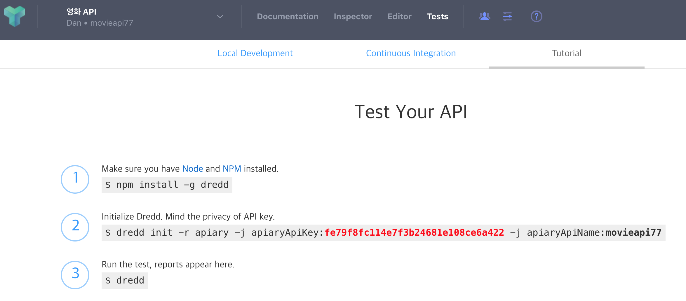

Dredd 설치는 위 포스트를 참고하면 되는데, npm install을 통해 설치되므로, Node.js 설치가 필요합니다. 설치 되면 아래와 같이 npm install -g 명령어로 Global Scope로 설치합니다.
```
$ npm install -g dredd
```

다음은 작성한 API 문서에 대한 Apiary Key와 Unique Name을 이용해서 dredd.yml을 구성하기 위한 init을 합니다. 6가지 물어보는데 아래와 같이 동일하게 입력해줍니다.
```
$ dredd init -r apiary -j apiaryApiKey:fe79f8fc114e7f3b24681e108ce6a422 -j apiaryApiName:movieapi77

422 -j apiaryApiName:movieapi77
? Location of the API description document apiary.apib
? Command to start the API server under test java -jar helidon-movie-api-mp/target/helidon-movie-api-mp.jar
? Host of the API under test http://localhost:8080
? Do you want to use hooks to customize Dredd's behavior? Yes
? Programming language of the hooks JavaScript
? Found Wercker configuration, do you want to add Dredd? No

Configuration saved to dredd.yml

You can run tests now, with:

  $ dredd
```

완료되면 dredd.yml 파일이 다음과 같이 생성됩니다.
```
color: true
reporter: apiary
custom:
  apiaryApiKey: fe79f8fc114e7f3b24681e108ce6a422
  apiaryApiName: movieapi77
dry-run: null
hookfiles: null
language: nodejs
require: null
server: java -jar helidon-movie-api-mp/target/helidon-movie-api-mp.jar
server-wait: 3
init: false
names: false
only: []
output: []
header: []
sorted: false
user: null
inline-errors: false
details: false
method: []
loglevel: warning
path: []
hooks-worker-timeout: 5000
hooks-worker-connect-timeout: 1500
hooks-worker-connect-retry: 500
hooks-worker-after-connect-wait: 100
hooks-worker-term-timeout: 5000
hooks-worker-term-retry: 500
hooks-worker-handler-host: 127.0.0.1
hooks-worker-handler-port: 61321
config: ./dredd.yml
blueprint: apiary.apib
endpoint: 'http://localhost:8080'
```

dredd.yml 파일도 동일하게 GitHub에 Push합니다.

```
$ git add dredd.yml

$ git commit -m "add dredd.yml"

$ git push -u origin master
```

### Oracle k8s Engine (OKE) Cluster 생성하기

Oracle Cloud Infrastructure (OCI)에서 Oracle k8s Engine (이하 OKE) 생성에 대한 자세한 설명은 아래 포스트를 참고하시기 바랍니다.

[[OCI Container Engine] Kubernetes Cluster 생성하기](/creating-oracle-kubernetes-cluster)

저는 OCI에서 movie-oke-cluster1 이라는 OKE Cluster를 하나 생성했습니다. 서울 리전에 만들었는데, 현재 Available Domain이 하나라서 한개의 Node Pool이 만들어졌습니다.
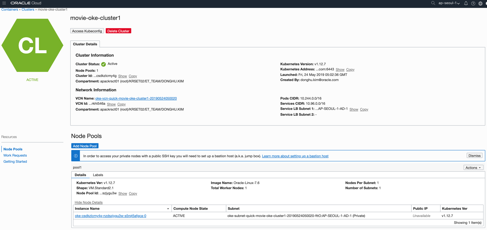

#### oci-cli 설치
Wercker CI 구성을 위해서 kubeconfig 파일을 생성해야 합니다.  
OCI에서 운영되는 k8s를 위한 kubeconfig 파일을 생성하기 위해서 oci-cli를 사용합니다.
oci-cli 설치는 다음 포스트를 참고하시기 바랍니다.

[[Oracle Cloud] OCI-CLI 설치](/oci-cli-install)

#### kubectl 설치
OKE Cluster와 통신을 위해서 kubectl 이라는 cli를 사용하는데, 사실 이 과정에서 꼭 필요하지는 않지만, OKE에 배치된 서비스에 대한 정보를 얻기 위해서 kubectl을 설치하는 것을 권장합니다.
설치 가이드는 다음 사이트를 참고합니다.
https://kubernetes.io/docs/tasks/tools/install-kubectl/

macOS의 경우는 다음과 같이 curl 명령어를 통해서 바로 설치가 가능합니다.
```
curl -LO https://storage.googleapis.com/kubernetes-release/release/$(curl -s https://storage.googleapis.com/kubernetes-release/release/stable.txt)/bin/darwin/amd64/kubectl
```

Homebrew로 설치할수도 있습니다.
```
brew install kubernetes-cli
```

Windows에서도 curl을 통해 설치합니다.
```
curl -LO https://storage.googleapis.com/kubernetes-release/release/v1.14.0/bin/windows/amd64/kubectl.exe
```

#### oci-cli 구성
다음과 같이 실행합니다.
```
oci setup config
```

oci-cli 구성을 위해서 몇가지 필요한 요소가 있습니다.
* User OCID - OCI 우측 상단 사용자 아이콘 클릭 후 사용자 아이드를 선택하면 다음과 같이 Tenancy OCID를 확인할 수 있습니다.
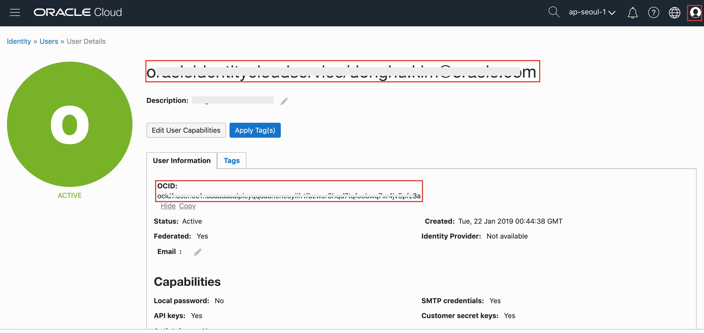
* Tenancy ID - 마찬가지로 OCI 우측 상단 사용자 아이콘 클릭 후 Tenancy 명을 선택하면 다음과 같이 Tenancy OCID를 확인할 수 있습니다.
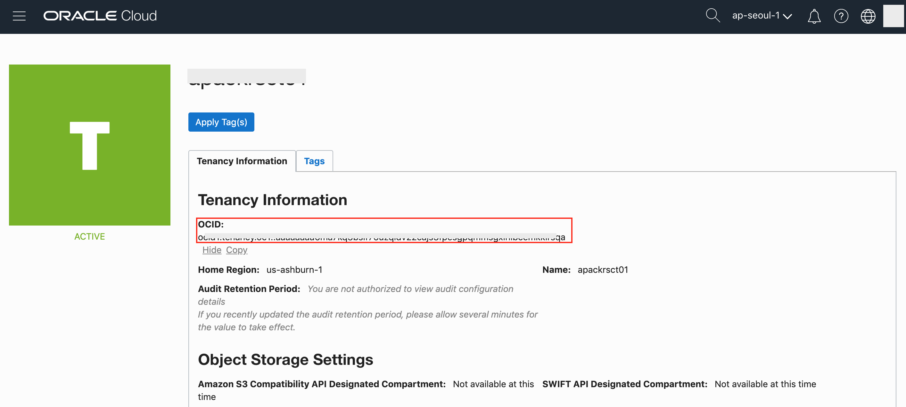
* Public/Private Key - OCI 연결을 위해서 RSA 키를 생성합니다. 생성할 경로를 지정하면 해당 위치에 자동으로 생성됩니다. 별도로 생성해서 사용할 경우 **ssh-keygen -t rsa** 혹은 oci-cli 설치 후 **oci setup keys** 명령어로 쉽게 생성할 수 있습니다. 만들어진 공용 키 (public key)는 OCI의 API KEy로 등록해줍니다.
* Region - 기본 리전으로 **us-ashburn-1**을 선택합니다.

#### kubeconfig 생성
kubeconfig 생성을 위해서 실행해야 할 oci 명령어는 OCI에서 생성한 OKE Cluster Console에서 확인 가능합니다.

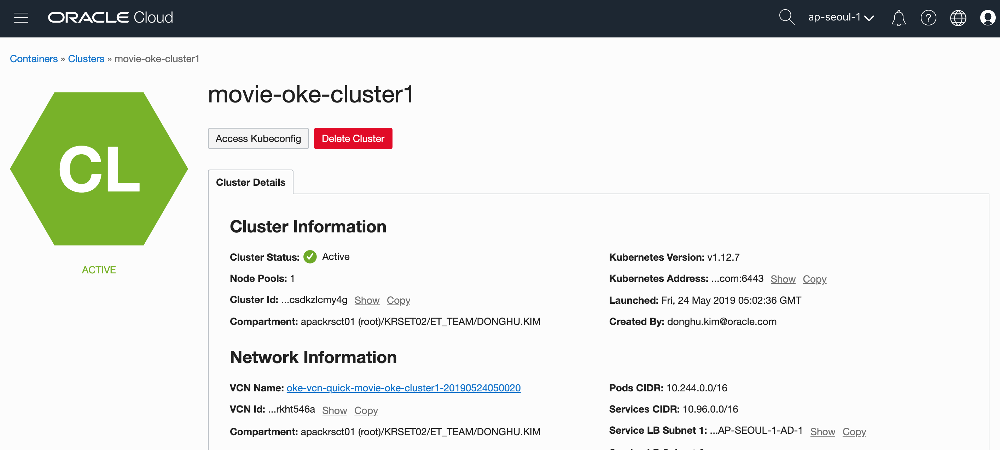

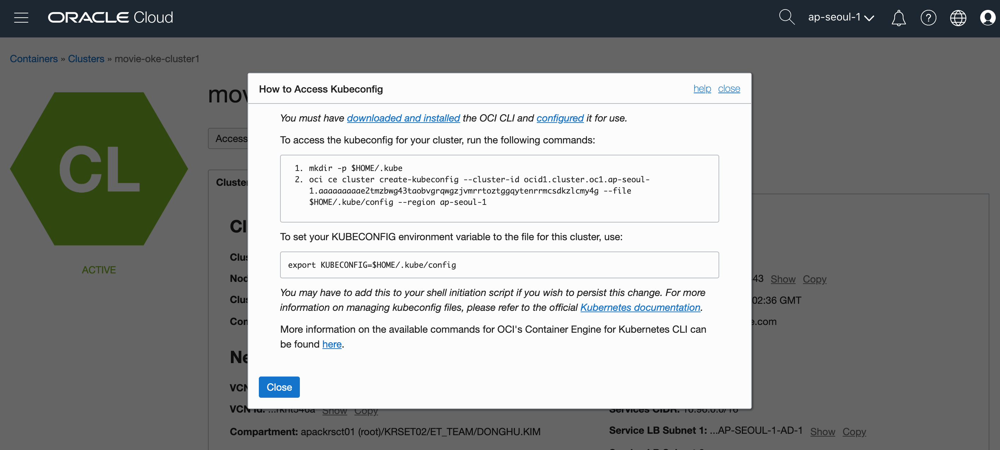

```
$ mkdir -p $HOME/.kube

$ oci ce cluster create-kubeconfig --cluster-id ocid1.cluster.oc1.ap-seoul-1.aaaaaaaaae2tmzbwg43taobvgrqwgzjvmrrtoztggqytenrrmcsdkzlcmy4g --file $HOME/.kube/movie_oke_cluster1_config --region ap-seoul-1

export KUBECONFIG=$HOME/.kube/movie_oke_cluster1_config
```

원래는 .kube/config 파일이 기본인데 여기서는 movie_oke_cluster1_config 라는 이름으로 바꾸서 만들었습니다.

### Wercker 애플리케이션 생성 및 파이프라인 구성
Wercker CI는 오라클이 인수한 컨테이너 기반의 CI/CD 서비스입니다. 자세한 설명은 다음 포스트를 참고하시기 바랍니다.

[[Wercker] Overview](/wercker-overview)

위 포스트를 참고해서 Wercker Application을 생성하고 GitHub Repository에 연결합니다.
만들어진 Wercker Application에서 Environment를 구성해야 하는데, 여기서 필요한 내용중 일부가 위에서 생성한 kubeconfig(여기서는 movie_oke_cluster1_config) 파일에 있습니다.
우선, Wercker에서 필요한 내용은 다음과 같습니다.

* KUBERNETES_MASTER
* KUBERNETES_AUTH_TOKEN
* OCI_AUTH_TOKEN
* DOCKER_REGISTRY
* DOCKER_USERNAME
* DOCKER_REPO

#### KUBERNETES_MASTER와 KUBERNETES_AUTH_TOKEN의
KUBERNETES_MASTER와 KUBERNETES_AUTH_TOKEN의 정보는 kubeconfig 파일에서 확인할 수 있습니다.
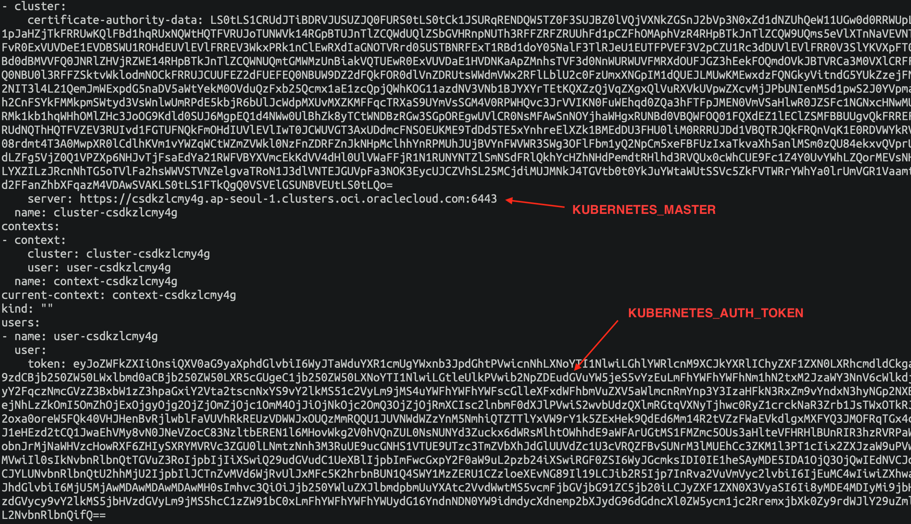

#### OCI_AUTH_TOKEN
OCI Auth Token은 OCI Console 우측 상단의 사용자 아이콘을 클릭 후 아이디를 선택하면 좌측 Auth Tokens라는 메뉴를 통해서 생성 가능합니다.
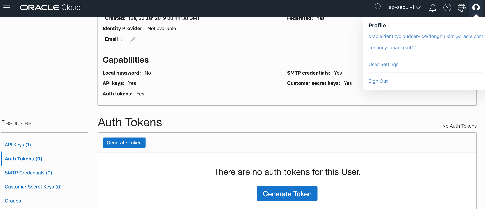

**생성된 토큰**
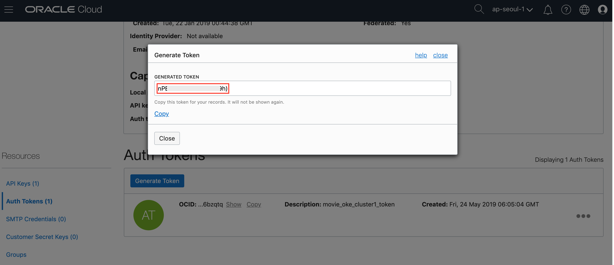

#### DOCKER_REGISTRY
Container Registry는 각 리전별로 존재합니다. Registry는 리전키 + ocir.io로 구성되는데, 리전키의 경우는 현재 icn(서울), nrt(도쿄), yyz(토론토), fra(프랑크푸르트), lhr(런던), iad(애쉬번), phx(피닉스)입니다. 여기서는 서울 리전에 있는 Registry를 사용하도록 하겠습니다.

> icn.ocir.io

#### DOCKER_USERNAME
Docker Username은 OCI 사용자 아이디입니다. OCI Console 우측 상단의 사람 아이콘을 클릭해서 확인할 수 있습니다. 여기에 Tenancy명이 필요합니다. 보통 이름은 다음과 같이 구성됩니다.

> {Tenancy명}/oracleidentitycloudservice/이메일 계정

#### DOCKER_REPO
Docker Repository이름으로 Tenancy명 + {레파지토리명}입니다. 레파지토리 이름은 임의 지정합니다.

> {Tenancy명}/helidon-movie-api-mp

생성한 Wercker Application의 환경 설정이 끝났습니다.
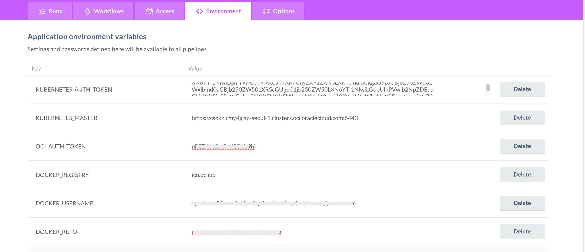

#### Wercker 파이프라인 및 워크플로우 구성
Wercker 상단의 Workflows를 클릭 한 후 Pipelines의 **Add new pipeline** 버튼을 클릭해서 다음 두개의 파이프라인을 생성합니다. build 파이프라인은 기본으로 정의되어 있습니다.

파이프라인 생성과 워크플로우 구성은 다음 포스트를 참고하시기 바랍니다.  
[[Wercker] Overview](/wercker-overview)

* push-release
* deploy-to-cluster

다음은 두개의 파이프라인을 순차적으로 실행되도록 워크플로우를 구성합니다.  
구성된 결과는 다음과 같습니다.

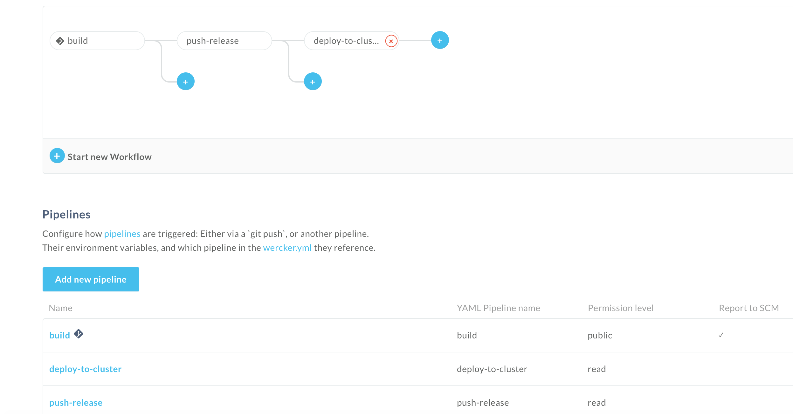

#### Wercker.yml
Wercker.yml 파일을 하나 만들겠습니다. 여기서는 jdk, maven, node가 모두 필요하기 때문에 같이 있는 컨테이너가 있으면 좋겠다고 생각했는데 마침 Docker Hub에 jimador라는 분이 공유한 [jimador/docker-jdk-8-maven-node](https://hub.docker.com/r/jimador/docker-jdk-8-maven-node/)라는 이미지가 있어서 사용했습니다.  

```
#Use OpenJDK base docker image from dockerhub and open the application port on the docker container
box:
# id: openjdk:8-jdk
  id: jimador/docker-jdk-8-maven-node
  ports:
    - 8080

#Build our application using Maven, just as we always have
build:
  steps:
    - script:
        name: pwd
        code: pwd
    - install-packages:
        packages: maven
    - script:
        name: maven build
        cwd: helidon-movie-api-mp
        code: mvn clean package 
    - npm-install
    - script:
        name: install-dredd
        code: sudo npm install -g dredd --ignore-scripts
    - script:
        name: dredd
        code: dredd
        
#Push the docker image with our built and tested application to the Oracle Container Registry
push-release:
  steps:
    - internal/docker-push:
        username: $DOCKER_USERNAME
        password: $OCI_AUTH_TOKEN
        repository: $DOCKER_REGISTRY/$DOCKER_REPO
        registry: https://$DOCKER_REGISTRY/v2
        tag: $WERCKER_GIT_BRANCH-$WERCKER_GIT_COMMIT
        working-dir: /pipeline/source/helidon-movie-api-mp
        ports: 8080
        cmd: java -jar target/helidon-movie-api-mp.jar

#Deploy our container from the Oracle Container Registry to the Oracle Container Engine (Kubernetes)
deploy-to-cluster:
  box:
      id: alpine
      cmd: /bin/sh

  steps:
  - bash-template
    
  - kubectl:
      name: delete secret
      server: $KUBERNETES_MASTER
      token: $KUBERNETES_AUTH_TOKEN
      insecure-skip-tls-verify: true
      command: delete secret wercker; echo delete registry secret

  - kubectl:
      name: create secret
      server: $KUBERNETES_MASTER
      token: $KUBERNETES_AUTH_TOKEN
      insecure-skip-tls-verify: true
      command: create secret docker-registry wercker --docker-server=$DOCKER_REGISTRY --docker-email=nobody@oracle.com --docker-username=$DOCKER_USERNAME --docker-password='$OCI_AUTH_TOKEN'; echo create registry secret

  - script:
      name: "Visualise Kubernetes config"
      code: cat kubernetes.yml

  - kubectl:
      name: deploy helidon-movie-api-mp to kubernetes
      server: $KUBERNETES_MASTER
      token: $KUBERNETES_AUTH_TOKEN
      insecure-skip-tls-verify: true
      command: apply -f kubernetes.yml
```

위 파일의 내용을 간단히 설명하면
1. build 
  * 파이프라인 에서는 maven 설치 후(설치되어 있는 이미지라 설치 안해도 되지만, 신규 버전으로 진행하기 위해 별도로 설치) Helidon 빌드 및 패키징을 위해 maven build 및 패키징을 합니다. Dredd를 실행해야 하기 때문에 npm install로 Dredd 설치하는 부분까지가 build 파이프라인에서의 스탭들입니다. 참고로 pwd는 Wercker에서 구동한 Container 내 작업 폴더를 출력해주는 명령어이며, cwd는 경로 이동을 위한 명령어 입니다.
2. push-release
  * Oracle Container Registry에 Helidon Project를 컨테이너 이미지화하여 푸시하게 됩니다. username과 password와 registry는 위에서 설정한 Wercker 환경 구성값을 사용했고, tag의 경우는 Wercker의 기본 변수들의 내용을 가지고 정의합니다. 이렇게 할 경우 이미지 푸시할 때 같은 이름이 아닌 매번 다른 이름의 이미지 태그를 갖는 이미지로 푸시할 수 있고, OKE 배포 시 동일한 환경 변수를 참조해서 동일한 태그를 가진 이미지를 끌고와 배포할 수 있습니다.

  3. deploy-to-cluster
  각 파이프라인별로 도커 이미지를 다르게 할 수 있습니다. 이번 파이프라인에서는 OKE 배포를 위한 부분만 있으면 되므로 alpine 이미지를 사용했습니다. 스탭은 간단하게 컨테이너 안의 secret이 있을 경우 우선 삭제하고, 다시 생성합니다. 다음 OKE 배포를 위한 kubernetes.yml 파일 (다음 단계에서 생성) 내용을 출력해서 확인하고, 마지막으로 OKE에 배포합니다.

  다 작성되었으면 마찬가지로 GitHub에 푸시합니다.

```
$ git add wercker.yml

$ git commit -m "add wercker.yml"

$ git push -u origin master
```

#### kubernetes.yml.template

OKE 배포를 위한 kubernetes.yml 파일입니다. 이상하게 뒤에 .template가 붙는데 이 부분은 뒤에서 설명합니다. 먼저 kubernetes.yml.template 파일을 다음과 같이 생성합니다.

**kubernetes.yml.template**
```
#
# Copyright (c) 2018 Oracle and/or its affiliates. All rights reserved
#
# Licensed under the Apache License, Version 2.0 (the "License");
# you may not use this file except in compliance with the License.
# You may obtain a copy of the License at
#
#     http://www.apache.org/licenses/LICENSE-2.0
#
# Unless required by applicable law or agreed to in writing, software
# distributed under the License is distributed on an "AS IS" BASIS,
# WITHOUT WARRANTIES OR CONDITIONS OF ANY KIND, either express or implied.
# See the License for the specific language governing permissions and
# limitations under the License.
#
kind: Deployment
apiVersion: extensions/v1beta1
metadata:
  name: helidon-movie-api-mp
  labels:
    commit: ${WERCKER_GIT_COMMIT}
spec:
  replicas: 2
  selector:
    matchLabels:
      app: helidon-movie-api-mp
  template:
    metadata:
      labels:
        app: helidon-movie-api-mp
        commit: ${WERCKER_GIT_COMMIT}
    spec:
      containers:
      - name: helidon-movie-api-mp
        image: ${DOCKER_REGISTRY}/${DOCKER_REPO}:${WERCKER_GIT_BRANCH}-${WERCKER_GIT_COMMIT}
        imagePullPolicy: Always
        ports:
        - name: http
          containerPort: 8080
          protocol: TCP
      imagePullSecrets:
        - name: wercker
---
kind: Service
apiVersion: v1
metadata:
  name: helidon-movie-api-mp
  labels:
    app: helidon-movie-api-mp
    commit: ${WERCKER_GIT_COMMIT}
spec:
  ports:
  - port: 30000
    targetPort: 8080
    name: http
  selector:
    app: helidon-movie-api-mp
  type: LoadBalancer
```

**.template이 붙는 이유**  
${WERCKER_GIT_BRANCH}나 ${WERCKER_GIT_COMMIT}과 같은 환경 변수들을 직접 동적으로 kubernetes.yml 파일에서 읽어올 수 없기 때문입니다. 무슨말이냐 하면, Wercker는 kubectl로 kubernetes.yml을 활용해서 배포해야 하는데, 변수를 그대로 텍스트로 인지하기 때문에 배포할 이미지등을 Registry에서 찾아오지를 못합니다. Wercker는 이 부분을 .template이라는 파일을 우선 읽은 후 자체적으로 변수에 해당하는 값으로 대체해서 다시 .template을 제외한 파일로 변환합니다. 즉 kubernetes.yml.template이라는 파일을 우선 읽은 후 파일안의 변수를 실제 값으로 변경 후에 다시 kubernetes.yml파일로 만들어서 이 파일을 사용하는 것이죠.

Wercker에서 최종 파이프라인 (deploy-to-cluster)에서 apply -f kubernetes.yml 명령어를 통해 배포를 시작합니다. replica는 2로 두개의 pod가 만들어지고, ${DOCKER_REGISTRY}/${DOCKER_REPO}:${WERCKER_GIT_BRANCH}-${WERCKER_GIT_COMMIT} 의 이미지를 가지고 와서 프라이빗 서비넷에서 8080 포트로 컨터이너를 가동합니다. 서비스는 LoadBalancer 타입으로 구동하며, 퍼블릿 서브넷에서 30000 포트로 서비스하게 됩니다.


### Wercker 파이프라인 실행

GitHub에 최종적으로 배포된 내용은 다음과 같습니다.

* API Blueprint (apiary.apib)
* Helidon Project - helidon-movie-api-mp
* dredd.yml
* wercker.yml
* kubernetes.yml.template

모든 파일이 GitHub에 올라간 후 Wercker에서 해당 파이프라인을 포함하는 워크플로우 실행 결과 입니다. 정상적으로 모든 과정이 에러 없이 완료되었습니다.

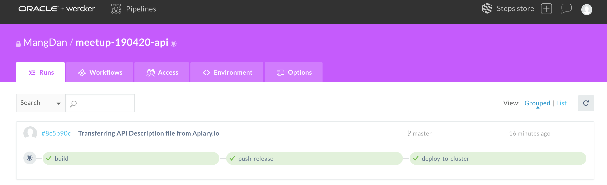

Apiary의 **Tests**의 **Continuous Integration** 탭에서 Dredd에서 전송한 문서에 대한 검증 결과 리포트도 확인할 수 있습니다.

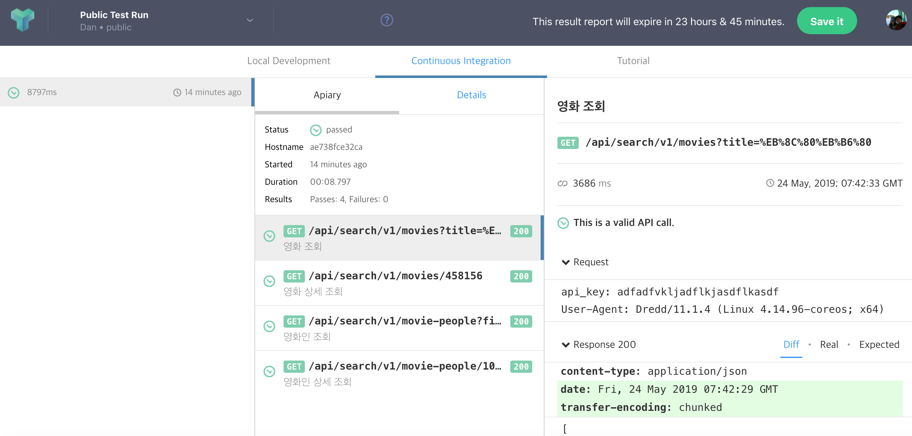

OCI 서울 리전의 Container Registry입니다. helidon-movie-api-mp 이미지가 보입니다.

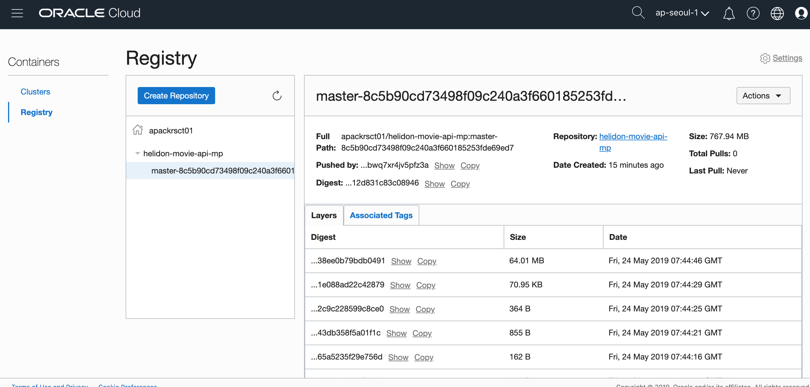

OKE Cluster 정보를 확인해보겠습니다. 참고로 config 파일에 대한 환경 변수 설정은 따로 해야 합니다.  
export KUBECONFIG=/Users/DonghuKim/.kube/movie_oke_cluster1_config

```
$ kubectl get all

NAME                                        READY     STATUS    RESTARTS   AGE
pod/helidon-movie-api-mp-6d54769d5f-6pchd   1/1       Running   0          4m
pod/helidon-movie-api-mp-6d54769d5f-qvfh8   1/1       Running   0          2d

NAME                           TYPE           CLUSTER-IP      EXTERNAL-IP      PORT(S)           AGE
service/helidon-movie-api-mp   LoadBalancer   10.96.133.129   132.145.86.228   30000:31564/TCP   2d
service/kubernetes             ClusterIP      10.96.0.1       <none>           443/TCP           2d

NAME                                   DESIRED   CURRENT   UP-TO-DATE   AVAILABLE   AGE
deployment.apps/helidon-movie-api-mp   2         2         2            2           2d

NAME                                              DESIRED   CURRENT   READY     AGE
replicaset.apps/helidon-movie-api-mp-6d54769d5f   2         2         2         2d
```

두 개의 pod가 올라가 있습니다. 서비스의 external-ip로 호출해보겠습니다.

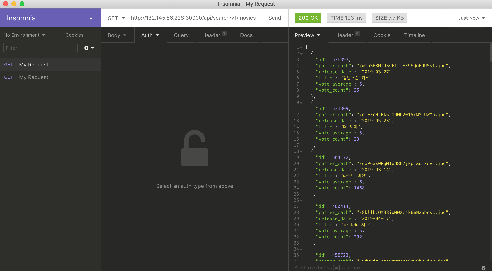

정상적으로 결과를 리턴합니다. 다음엔 API 게이트웨이에 적용했던 Mock API를 위 서비스로 변경, 적용 한 후 JET 애플리케이션에 정상적으로 반영되었는지 확인해보겠습니다.

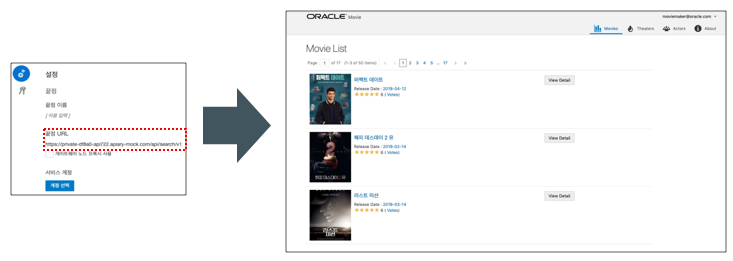

다음 과정은 API Gateway에 배포된 API를 API 개발자 포탈에 퍼블리시 하면 애플리케이션 개발자들이 검색하고 API키를 발급 받아서 사용할 수 있습니다. 따로 이미지 캡쳐를 하지 못해서 인터넷에 있는 이미지로 대체하겠습니다.

**API 관리 포탈에서 API 개발자 포탈로 퍼블리시**
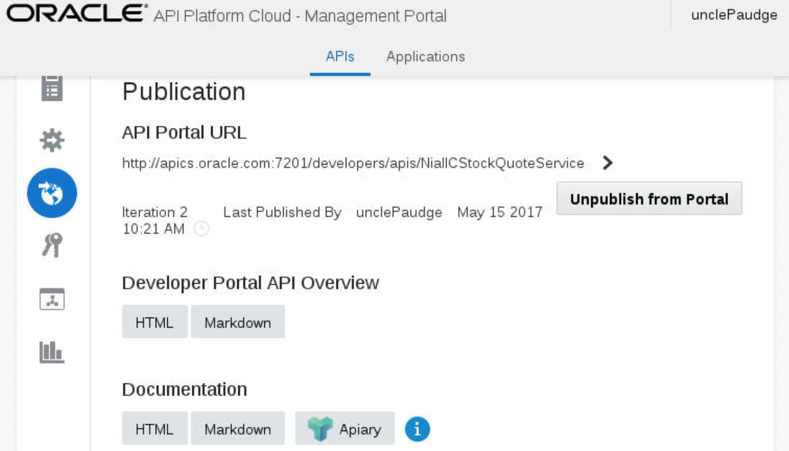

**API 검색 및 구독하기**
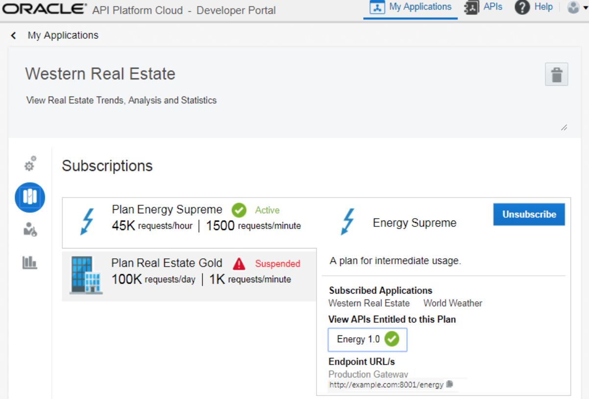


### 정리
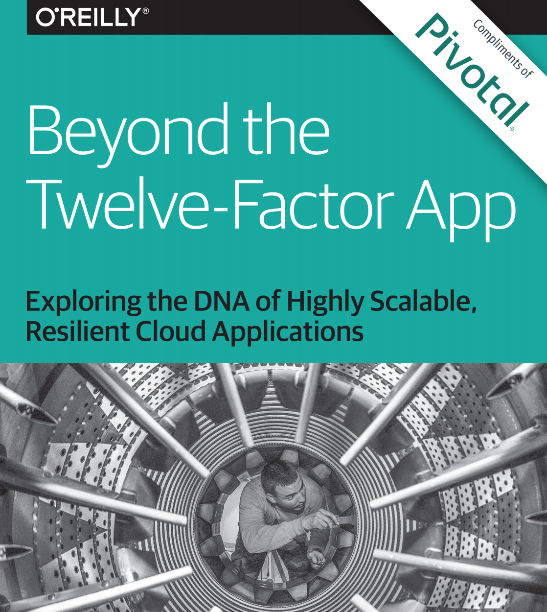
지금까지 API-Design First에 대한 기본적인 이해를 위해 간단히 정리해봤습니다. Microservice Architecture의 근간이 되는 12 Factor 방법론(SaaS 앱을 만들기 위한 방법론)을 넘어서 현재의 트랜드를 반영한 **Beyond the Twelve-Factor App**에서도 API-Design First를 포함하고 있습니다. MSA를 얘기하면 항상 Spring Cloud와 Netflix OSS, Kubernetes, Istio등 다양한 MSA 아키텍쳐 인프라를 위한 기술들과 백엔드 서비스에 대한 부분만 고민할 수 있지만, 서비스가 잘 만들어지기 위한 설계와 문서에 대한 관리 또한 매우 중요한 요소인 것 같습니다. 그렇다 하더라도 두번째 포스트에서 마이크로 서비스라는 용어를 사용했고, 또 실제로는 수 많은 서비스들이 엮일 수 있기 때문에 여기 예제처럼 단순히 k8s에 배포하는 것으로 끝나는 것이 아니라 실제 MSA를 위한 인프라와 개발환경등에서 필요한 다양한 요소들을 이 프로세스에 대입될 수 있어야 할 것입니다.