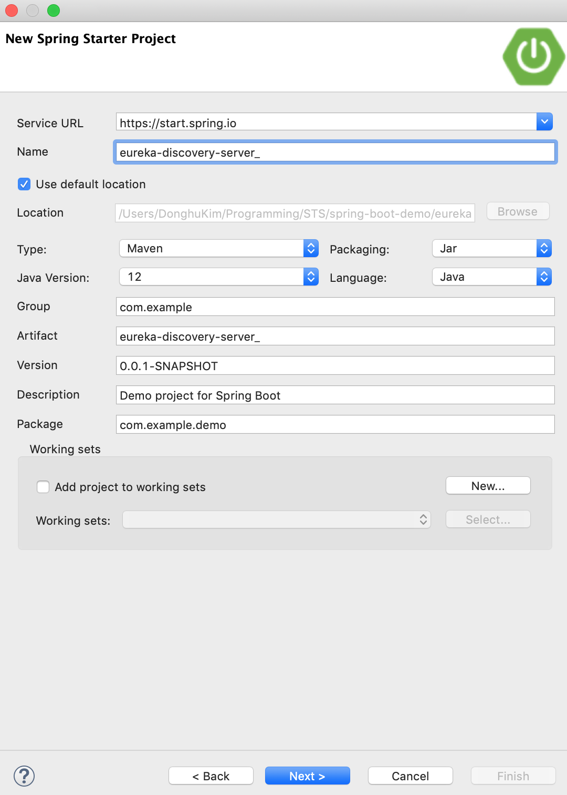
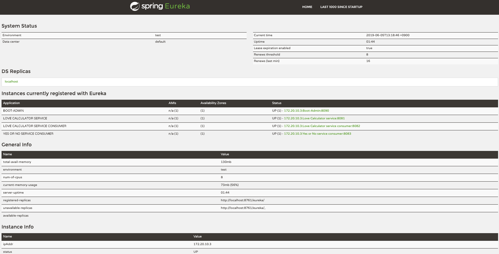
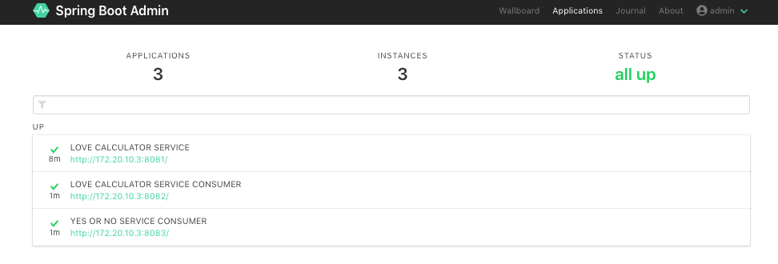

전 포스트에서 Spring Boot Admin(이하 SBA)과 SBA Client를 활용해서 Spring Boot Application 모니터링 환경을 구성해봤는데, 이번 포스트에서는 Microservice Architecture(이하 MSA)환경에서 필수 요소인 **Service Discovery**를 활용해서 구성하는 방법에 대해 다룹니다. 보통 MSA 환경에서는 **Service Discovery**를 포함하고 있는 경우가 대부분이기 때문에 적용하는데 어려움이 없을 것이고, 적용 시 Spring Boot Client Application에 SBA을 위한 추가적인 Dependency가 빠지기 때문에 더 가볍게(?) 운영할 수 있다는 장점이 있습니다. 또한, SBA에 대한 Dependency가 제거되기 때문에 다른 모니터링 솔루션으로 소스 수정 없이 변경이 가능합니다.

> 본 블로그의 모든 포스트는 **macOS** 환경에서 테스트 및 작성되었습니다.  

여기서 사용되는 모든 소스는 다음 GitHub 레파지토리에서 공유되고 있습니다.  
[실습 자료](https://github.com/MangDan/spring-boot-monitoring)

이번 실습을 위한 개발 환경입니다. 
> 개인적으로 Eclipse보다는 IntelliJ나 VSCODE를 더 선호하는 편인데, STS (Spring Tool Suite for Eclipse)는 Spring 개발을 위한 플러그인이 미리 구성되어 있어서 조금 무겁기는 해도 별도의 플러그인 설치 없이 바로 사용할 수 있다는 장점이 있습니다. 편의상 STS 환경에서 작업했습니다.
* Java JDK 1.8+
* Apache Maven
* Spring Tools 4 for Eclipse

### 환경 구성
환경은 이전 포스트인 [Spring Boot Microservice Monitoring 1탄 - Spring Admin](/spring-boot-microservice-monitoring-1)에서 구성한 환경을 그대로 사용합니다.

### Eureka 서버 프로젝트 생성 및 설정
Spring Boot에서 Eureka Server를 구성해보겠습니다.  
먼저, STS에서 Spring Starter 프로젝트를 생성하겠습니다.
좌측 Project Explorer 의 빈 공간에 마우스 우 클릭해서 **New > Project**를 선택한 후 **Spring Starter Project** 선택합니다.

다음과 같이 입력하고 Create 합니다.
```
Name: eureka-discovery-server
Java version: 12
```



#### pom.xml
pom.xml 에 Spring Cloud의 Eureka Dependency를 추가합니다.
properties에 spring-cloud.version을 추가하고, Dependency에 다음과 같이 추가합니다.

> Spring에서 Eureka Server 구성을 위한 Dependency를 추가했고, Activation과 JAXB를 추가했습니다. Java9 이후 부터는 JAXB 관련 구현체와 Activation을 지원하지 않습니다. 따라서 Java9 이상 사용할 경우 구동할 때 "java.lang.TypeNotPresentException: Type javax.xml.bind.JAXBContext not present"와 Activation에 대한 ClassNotFound 오류가 발생합니다. 다음과 같이 Dependency에 관련 Library를 추가해줘야 합니다.
>
> 참고 : https://cloud.spring.io/spring-cloud-static/Greenwich.RELEASE/multi/multi_spring-cloud-eureka-server.html

> Spring Cloud 버전에 Greenwich.SR1이라고 되어 있는데, Spring Cloud에서는 Release Train으로 버전을 관리 합니다. 즉 메이저 버전에 대해 이름을 부여하고 마이너 버전 숫자는 SRx 형태로 구성됩니다. Greenwich는 2.1 버전이고, SR1이 포함되서 2.1.1 버전이 됩니다.
>
> 참고 : https://spring.io/projects/spring-cloud

```xml
<properties>
    <java.version>12</java.version>
    <spring-cloud.version>Greenwich.SR1</spring-cloud.version>
</properties>

<dependencies>
    <dependency>
        <groupId>org.springframework.cloud</groupId>
        <artifactId>spring-cloud-starter-netflix-eureka-server</artifactId>
    </dependency>
    
    <dependency>
        <groupId>org.springframework.boot</groupId>
        <artifactId>spring-boot-starter-test</artifactId>
        <scope>test</scope>
    </dependency>

    <dependency>
        <groupId>javax.activation</groupId>
        <artifactId>activation</artifactId>
        <version>1.1.1</version>
    </dependency>

    <dependency>
        <groupId>javax.xml.bind</groupId>
        <artifactId>jaxb-api</artifactId>
        <version>2.3.0</version>
    </dependency>

    <dependency>
        <groupId>com.sun.xml.bind</groupId>
        <artifactId>jaxb-core</artifactId>
        <version>2.3.0</version>
    </dependency>

    <dependency>
        <groupId>com.sun.xml.bind</groupId>
        <artifactId>jaxb-impl</artifactId>
        <version>2.3.0</version>
    </dependency>
</dependencies>

<dependencyManagement>
    <dependencies>
        <dependency>
            <groupId>org.springframework.cloud</groupId>
            <artifactId>spring-cloud-dependencies</artifactId>
            <version>Greenwich.RELEASE</version>
            <type>pom</type>
            <scope>import</scope>
        </dependency>
    </dependencies>
</dependencyManagement>
```

#### application.properties
* eureka.client.register-with-eureka
    * Eureka Server도 하나의 서비스 어플리케이션(서버이면서 클라이언트가 될 수도 있음)으로, 자신을 Eureka 서버에 등록 할지 여부, 제외할 것이기 때문에 false
* eureka.client.fetch-registry
    * 클라이언트 서비스가 Eureka 서버로부터 서비스 리스트 정보를 로컬에 캐싱 할지 여부로 모니터링을 위한 클라이언트로 사용하지 않을것이기 때문에 false


```properties
spring.application.name=eureka-discovery-server 
server.port=8761

eureka.client.register-with-eureka=false
eureka.client.fetch-registry=false
```

#### Eureka Server Application에 어노테이션 추가
src/main/java/com/example/demo/EurekaDiscoveryServerApplication.java 파일을 열어서 @EnableEurekaServer 어노테이션을 추가합니다.

> 패키지 경로와 파일명은 프로젝트 생성할 때 정의한 이름을 따르므로 다를 수 있습니다.

```java
package com.example.demo;

import org.springframework.boot.SpringApplication;
import org.springframework.boot.autoconfigure.SpringBootApplication;
import org.springframework.cloud.netflix.eureka.server.EnableEurekaServer;

@SpringBootApplication
@EnableEurekaServer
public class EurekaDiscoveryServerApplication {

	public static void main(String[] args) {
		SpringApplication.run(EurekaDiscoveryServerApplication.class, args);
	}
}
```

### Spring Admin Server 구성
#### eureka client dependency 추가
이전 포스트에서 생성한 spring-admin-server의 pom.xml에 아래 Eureka Client Dependency를 추가합니다.
```xml
<dependency>
    <groupId>org.springframework.cloud</groupId>
    <artifactId>spring-cloud-starter-netflix-eureka-client</artifactId>
</dependency>
```

DependencyManagement에 Spring Cloud를 추가합니다.
```xml
<dependencyManagement>
    <dependencies>
        <dependency>
            <groupId>de.codecentric</groupId>
            <artifactId>spring-boot-admin-dependencies</artifactId>
            <version>${spring-boot-admin.version}</version>
            <type>pom</type>
            <scope>import</scope>
        </dependency>
        <dependency>
            <groupId>org.springframework.cloud</groupId>
            <artifactId>spring-cloud-dependencies</artifactId>
            <version>Greenwich.RELEASE</version>
            <type>pom</type>
            <scope>import</scope>
        </dependency>
    </dependencies>
</dependencyManagement>
```

#### Spring Admin Server Application에 어노테이션 추가
Eureka Server와 Spring Admin Server 연결을 하겠습니다. 이전 포스트에서 생성한 spring-admin-server 프로젝트의 src/main/java/com/examle/demo.SpringAdminServerApplication.java 파일을 열어서 @EnableDiscoveryClient 어노테이션을 추가합니다.

```java
package com.example.demo;

import org.springframework.boot.SpringApplication;
import org.springframework.boot.autoconfigure.SpringBootApplication;
import org.springframework.cloud.client.discovery.EnableDiscoveryClient;
import org.springframework.context.annotation.Configuration;
import org.springframework.security.config.annotation.web.builders.HttpSecurity;
import org.springframework.security.config.annotation.web.configuration.WebSecurityConfigurerAdapter;
import org.springframework.security.web.authentication.SavedRequestAwareAuthenticationSuccessHandler;
import org.springframework.security.web.csrf.CookieCsrfTokenRepository;

import de.codecentric.boot.admin.server.config.EnableAdminServer;

@SpringBootApplication
@EnableAdminServer
@EnableDiscoveryClient
public class SpringAdminServerApplication {

	public static void main(String[] args) {
		SpringApplication.run(SpringAdminServerApplication.class, args);
	}
    
    @Configuration
	public class SecurityConfig extends WebSecurityConfigurerAdapter {
        .....
    }
}
```

#### Spring Admin Server application.properties
원래 설정에 Eureka 관련 설정을 추가했습니다. 추가된 내용에 대해서 간략히 설명하면,
* spring.boot.admin.discovery.ignored-services
    * Spring Admin에서 모니터링 제외할 애플리케이션 이름을 지정할 수 있습니다. eureka.client.register-with-eureka가 true일 경우 Eureka 서버에 등록되기 때문에 Spring Admin이 자신에 대한 Actuator를 모니터링 하게 됩니다. 여기서는 SBA 자신을 모니터링하지 않도록 하기 위해서 이 옵션을 사용했습니다. 참고로 이 옵션을 사용하지 않고, eureka.client.fetch-registry을 false로 하게 되면 Eureka Server에 Spring Admin을 클라이언트로 등록하지 않기 때문에 이 옵션을 사용할 필요가 없습니다.
* eureka.client.service-url.defaultZone
    * Eureka Server Url입니다.
* eureka.client.register-with-eureka
    * Spring Admin Server는 Eureka 서버에 클라이언트(서비스 인스턴스)로 등록. true
* eureka.client.fetch-registry
    * Spring Admin Server에서는 Eureka로 부터 등록된 서비스 리스트 정보를 가져와서 모니터링해야 합니다. true
* eureka.instance.lease-renewal-interval-in-seconds
    * Eureka Server에 서비스 인스턴스를 재 등록하는 간격, Eureka Server내의 서비스 인스턴스와의 Heartbeat 역할을 합니다. (10초)
* eureka.instance.metadata-map.startup
    * #needed to trigger info and endpoint update after restart
* eureka.client.registry-fetch-interval-seconds
    * Eureka Client에 존재하는 캐시로 Eureka 클라이언트가 Eureka 서버로 서비스 정보 요청 간격입니다. eureka.client.fetch-registry가 false일 경우 적용되지 않습니다.

> Eureka Server에서는 Eureka Cilent를 Instance라는 개념으로 등록, 관리합니다. 일반적으로 Eureka Client와 Eureka Instance는 1:1이지만, 동일한 Eureka Client가 하나의 호스트에 여러개가 운영될 때((e.g. 8080, 8081, 8082..), 별도의 인스턴스로 관리해야 하는 경우 다음 옵션을 사용해서 InstanceID를 랜덤하게 부여할 수 있습니다.
> * eureka.instance.metadataMap.instanceId=${spring.application.name}:${spring.application.instance_id:${random.value}}

> instance.metadata-map 은 등록된 인스턴스와 관련된 메타 정보를 key/value 형태로 전달할 때 사용합니다.

```properties
spring.application.name=Boot-Admin
spring.security.user.name=admin
spring.security.user.password=admin
server.port=8090

# Eureka
spring.boot.admin.discovery.ignored-services=boot-admin

eureka.client.service-url.defaultZone=http://localhost:8761/eureka/
eureka.client.register-with-eureka=true
eureka.client.fetch-registry=true

eureka.instance.lease-renewal-interval-in-seconds=10
eureka.instance.metadata-map.startup=${random.int}
eureka.client.registry-fetch-interval-seconds=5
```

### Eureka 클라이언트 구성
Eureka 클라이언트로 사용할 Spring Boot Application은 이전 포스트인 [Spring Boot Microservice Monitoring 1탄 - Spring Admin](/spring-boot-microservice-monitoring-1)에서 사용한 Love Calculator 서비스를 활용하려고 합니다. 3개의 서비스 (love-calculator-service, love-calculator-consumer, yes-or-no-consumer)에 대한 설정은 동일하므로, 여기서는 love-calculator-service에 만 적용해보겠습니다.

#### pom.xml
love-calculator-service 프로젝트의 pom.xml에 다음과 같이 수정합니다. 기존 spring admin client를 주석처리하고 eureka client dependency를 추가합니다.

```xml
<!--  for SBA
<dependency>
    <groupId>de.codecentric</groupId>
    <artifactId>spring-boot-admin-starter-client</artifactId>
</dependency>
-->

<!--  for Eureka -->
<dependency>
    <groupId>org.springframework.cloud</groupId>
    <artifactId>spring-cloud-starter-netflix-eureka-client</artifactId>
</dependency>
<!--  for Eureka -->
```

dependecyManagement에 다음과 같이 spring cloud를 추가합니다.
```xml
<dependencyManagement>
    <dependencies>
        <dependency>
            <groupId>de.codecentric</groupId>
            <artifactId>spring-boot-admin-dependencies</artifactId>
            <version>${spring-boot-admin.version}</version>
            <type>pom</type>
            <scope>import</scope>
        </dependency>
        <dependency>
            <groupId>org.springframework.cloud</groupId>
            <artifactId>spring-cloud-dependencies</artifactId>
            <version>Greenwich.RELEASE</version>
            <type>pom</type>
            <scope>import</scope>
        </dependency>
    </dependencies>
</dependencyManagement>
```

#### Client Application에 어노테이션 추가
src/main/java/com/example/demo/LoveCalculatorServiceApplication.java를 열어서 @EnableDiscoveryClient 어노테이션을 추가합니다.

```java
package com.example.demo;

import org.springframework.boot.SpringApplication;
import org.springframework.boot.autoconfigure.SpringBootApplication;
import org.springframework.cloud.client.discovery.EnableDiscoveryClient;

@SpringBootApplication
@EnableDiscoveryClient
public class LoveCalculatorServiceApplication {

	public static void main(String[] args) {
		SpringApplication.run(LoveCalculatorServiceApplication.class, args);
	}

}
```

#### application.properties 수정
src/main/resources/application.properties를 다음과 같이 수정합니다. SBA관련 프로퍼티는 주석처리하고 Eureka 서버 주소를 지정했습니다.

```properties
spring.application.name=Love Calculator service
server.port=8081
management.endpoints.web.exposure.include=*

# for SBA
#spring.boot.admin.client.url=http://localhost:8090
#spring.boot.admin.client.username=admin
#spring.boot.admin.client.password=admin

eureka.client.service-url.defaultZone: http://localhost:8761/eureka
```

동일하게 love-calculator-consumer와 yes-or-no-consumer를 수정합니다.

### 테스트
모든 서비스를 시작합니다. STS에서 각 프로젝트를 마우스 우클릭 후 Rus As> Spring Boot App을 선택해서 시작합니다.
Browser에서 http://localhost:8761로 접속합니다. 다음과 같이 SBA을 포함해서 4개의 인스턴스가 등록된 것을 확인할 수 있습니다.



SBA에서는 SBA 자신만 제외한 3개의 Love Calculator 서비스가 모니터링 되고 있습니다.


### 정리
Service Discovery 오픈소스 솔루션인 Eureka와 SBA를 연결해서 Spring Boot Service Metrics Monitoring 하는 부분에 대해서 간략히 데모와 함께 살펴봤습니다. 보통 MSA환경에서는 SBA와 같은 모니터링 서비스를 단독으로 사용하는 것보다 **Service Discovery**와 연결해서 사용하는 것을 권장하고 있습니다. 이는 특정 모니터링 솔루션에 대한 Dependency를 줄일 수 있으며, Eureka와 같은 **Service Discovery** 솔루션 자체적으로 지원해주는 여러가지 기능들을 활용해서 더 정확하고 신뢰성있게 모니터링 할 수 있기 때문인 것 같습니다. 물론 SBA를 사용한다는 것은 Spring Boot Application에 Dependency가 생겨서 다른 언어 혹은 프레임워크 서비스는 모니터링 하기 어렵다는 단점이 있습니다. 이 부분은 SBA가 아닌 다른 모니터링 솔루션을 사용함으로써 해결할 수 있습니다. 다음에는 MSA 모니터링을 위해 유명한 오픈소스인 Prometheus와 Grafana를 사용하는 방법에 대해서 포스팅합니다.

### 생각해 볼것들
**Eureka & SBA Clustering**  
본 예제에서는 Eureka 서버나 SBA Standalone Mode로 진행했지만, 실제로 운영하기 위해서는 고 가용성을 위한 Cluster Mode로 구성해야 할 것입니다. Eureka는 여러대의 서버를 구성해서 서로 Peering할 수 있습니다. 이렇게 구성하면 각 Peering 노드끼리 싱크가 됩니다. 클라이언트에서는 serviceUrl.defaultZone에 Peering 구성한 서버를 모두 나열해줍니다.  
> Eureka Clustering 참조:  
> https://coe.gitbook.io/guide/service-discovery/eureka_2#eureka-peering

Spring Boot Admin도 마찬가지로 Clustering Mode를 지원합니다. SBA에서는 Cluster Replication을 위해서 In-Memory Data Grid 솔루션인 [Hazelcast](http://www.hazelcast.com/)를 사용합니다.
> SBA Clustering 참조:  
> https://github.com/codecentric/spring-boot-admin/blob/master/spring-boot-admin-docs/src/main/asciidoc/server-clustering.adoc

**Eureka에 Spring Security 적용**  
SBA와 마찬가지로 Eureka에도 Spring Security 적용이 가능할텐데, 여러 블로그나 Spring 가이드데로 해봤지만 잘 안됐습니다. 로그인 시도하면 인증거부 메시지와 함께 로그인 페이지로 돌아옵니다. Stackoverflow에 관련 이슈들이 다수 올라와 있는것으로 봐서 먼가 이슈가 있는 것 같은데, 몇시간 해보다가 이 부분은 나중에 해보기로 하고 패스...

**Eureka 서버가 다운되면**
SBA와 Eureka를 모두 올려놓은 상태에서 Eureka 서버를 Terminate했지만 여전히 SBA에는 서비스가 남아 있습니다. SBA쪽에서 Eureka 서버 접속 오류 메시지가 뜨면서 Cache 갱신이 안되는 메시지가 뜨는데, 먼가 어떤 옵션이 있을 것 같은데 찾지 못했습니다. 이 부분도 일단은 패스...

### 참고 자료
* https://github.com/SDSACT/coe-guide/blob/master/Service%20Discovery/Eureka_2.md
* https://roadmichi.blogspot.com/2016/01/edge-server-ribbon-api.html
* https://codecentric.github.io/spring-boot-admin/current/
* https://cloud.spring.io/spring-cloud-netflix/spring-cloud-netflix.html