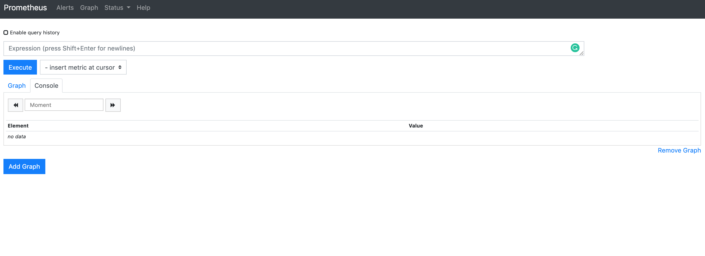
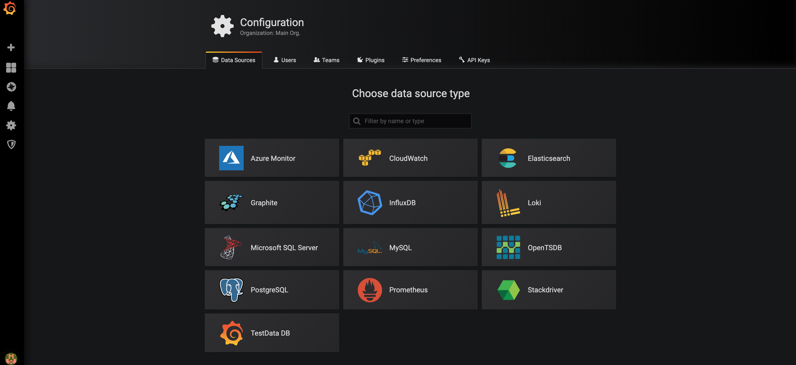

Spring Boot Admin(이하 SBA)를 사용해서 Spring Boot Application 모니터링 환경을 구성해봤는데, 이번에는 모니터링 오픈소스로 잘 알려진 Prometheus와 오픈소스 대시보드인 Grafana를 사용해서 모니터링 환경 구성을 해보겠습니다. SBA는 Spring Application 모니터링만 가능하지만, Prometheus와 Grafana 조합을 사용하면 다른 언어와 다른 프레임워크 기반의 Applicatoin 모니터링도 가능해집니다. 이전 포스트에서 사용한 Spring Boot Applicatoin (Love Calculator)를 사용할 것이며, 모니터링 부분만 변경하는 내용입니다.

> 본 블로그의 모든 포스트는 **macOS** 환경에서 테스트 및 작성되었습니다.  

여기서 사용되는 모든 소스는 다음 GitHub 레파지토리에서 공유되고 있습니다.  
[실습 자료](https://github.com/MangDan/spring-boot-monitoring)

* Java JDK 1.8+
* Apache Maven
* Spring Tools 4 for Eclipse
* Prometheus
* Grafana
* Docker (Option)

### Prometheus 설치

#### Windows 버전 설치
아래 URL에 접속해서 Windows 버전으로 다운로드 받은 후 특정 폴더에 압축을 해제 합니다.  
다운로드: https://prometheus.io/download/

#### macOS 버전 설치
macOS에서는 brew 명령어로 설치합니다. 사전에 homebrew 설치되어 있어야 합니다. 다운로드 받아서 설치하고자 할 경우는 위 URL에서 Darwin 버전으로 다운로드 받으면 됩니다.

**Install homebrew**
```
$ ruby -e "$(curl -fsSL https://raw.githubusercontent.com/Homebrew/install/master/install)" < /dev/null 2> /dev/null
```

**Install Prometheus**
```
$ brew install prometheus

$ prometheus --version
```

#### Docker Image
Docker가 설치되어 있는 경우에는 Docker Hub에서 Prometheus Image를 pull해서 사용할 수 있습니다.
```
$ docker pull prom/prometheus
```

### Prometheus 설정, 실행
#### Prometheus 설정
특정 디렉토리에 prometheus.yml 파일을 생성하고 다음과 같이 설정합니다.

```properties
global:
  scrape_interval:     15s

scrape_configs:
  - job_name: love-calculator-service
    metrics_path: '/actuator/prometheus'
    static_configs:
      - targets: ['localhost:8081', 'localhost:8082', 'localhost:8083']
```

몇 가지 설정에 대해서 간략히 살펴보겠습니다.
* global.scrape_interval - 메트릭스 정보를 수집할 주기 (기본 15초)
* global.evaluation_interval - 여기서는 사용하지 않지만, Alert Rule 사용할 경우 Rule에 대한 evaluate하는 주기, 실행 결과에 따라 inactive, pending, firing 상태로 구분되어서 이 상태를 기반으로 AlertManager에서 알람을 보냄
* rule_files - Rule을 사용할 경우 rule file의 위치를 지정 (여러개 가능)
* scrape_config.job_name - 메트릭스 수집하는 Job에 대한 이름을 지정
* static_configs.targets - 실제 메트릭을 수집할 서버의 주소를 지정, 여러개 지정도 가능

#### Prometheus 실행
**Docker**
```
$ docker run -p 9090:9090 -v ~/.prometheus/prometheus.yml prom/prometheus
```

**Windows or macOS**
```
$ prometheus --config.file ~/.prometheus/prometheus.yml 
```

> Prometheus에서는 여러가지 API들을 제공하고 있습니다. 그냥 API를 사용할 수 있는것이 아니라 Prometheus 서버 시작 옵션값에 따라서 사용할 수 있는 API들이 정해져 있습니다. 예를들면 --web.enable-admin-api 옵션을 사용할 경우 Prometheus 서버 관리에 해당하는 API를 호출할 수 있습니다. 더 자세한 정보는 아래 가이드 참고하세요.  
> https://prometheus.io/docs/prometheus/latest/querying/api/

#### Prometheus Web UI 접속
http://localhost:9090 으로 접속하면 Prometheus UI를 볼 수 있습니다.


### Grafana 설치
#### Windows 버전 설치
Grafana도 Windows의 경우 아래 URL에 접속해서 다운로드 받아 설치합니다. 설치 버전과 zip 버전이 있습니다. 간단하게 zip 버전을 받아서 특정 폴더에 압축해제 합니다.
다운로드: https://grafana.com/grafana/download?platform=windows

#### macOS 버전 설치
macOS에서는 마찬가지로 brew 명령어로 설치합니다.
```
$ brew install grafana
```

brew가 아닌 다운로드 받아서 설치하고자 할 경우는 wget으로 다운로드 받아서 압축 해제합니다.
```
$ wget https://dl.grafana.com/oss/release/grafana-6.2.1.darwin-amd64.tar.gz 
tar -zxvf grafana-6.2.1.darwin-amd64.tar.gz 
```

### Grafana 시작

**Windows**
압축 해제한 폴더내의 grafana-server.exe 파일을 더블클릭해서 실행합니다.
```
$ bin/grafana-server.exe
```

Grafana의 기본 포트는 3000이며, 기본 관리자 계정은 admin/admin 입니다. 포트등 일부 설정 변경은 conf/sample.ini 파일을 참고하면 되고, 해당 파일을 custom.ini 파일로 복사한 후 수정하면 됩니다. (e.g. 포트의 경우 http_port)

**macOS**
맥 사용자는 Homebrew Service를 통해 시작할 수 있습니다.
```
$ brew tap homebrew/services

$ brew services start grafana
```
포트와 관리자 계정 정보는 동일합니다.

**Docker**
```
$ docker run -d -p 3000:3000 grafana/grafana
```
> Docker에서 실행하는 부분과 관련 좀 더 자세한 사항은 아래 문서 참고합니다.  
https://grafana.com/docs/installation/docker/

#### Grafana Web UI 접속 및 Prometheus 데이터 소스 지정
http://localhost:3030 으로 접속 후 admin/admin 입력합니다. 패스워드는 변경 가능합니다.
접속 후 Prometheus 서버를 데이터 소스로 지정해서 연결합니다. 좌측 **Configuration > Data Sources > Add data source**를 순서대로 선택합니다.


Grafana에서는다양한 데이터소스가를 지원합니다. 여기서는 Prometheus를 선택합니다.


HTTP url에 Prometheus 서버 주소를 입력하고 **Save & Test** 버튼을 클릭합니다. (Prometheus 서버가 시작된 상태여야 합니다.) 성공적으로 연결되면 **Data source is working** 이라는 메시지가 나타납니다.


### Love Calculator 서비스 수정
#### Dependency (pom.xml)
Eureka와 Spring Boot Admin 관련 Dependency를 제거하고 Spring Boot Actuator에서 Prometheus 지원을 위해 Micrometer 관련 Dependency를 추가하겠습니다. 3개 서비스(love-calculator-service, love-calculator-consumer, yes-or-no-consumer)모두 동일하게 설정합니다. 

각 서비스의 pom.xml을 열고 다음과 같이 변경합니다. Spring Boot Admin과 Eureka는 주석처리 하고 Micrometer 및 Micrometer Prometheus 관련 Dependency를 추가합니다.
```xml
<!--  for Spring Boot Admin
<dependency>
  <groupId>de.codecentric</groupId>
  <artifactId>spring-boot-admin-starter-client</artifactId>
</dependency>
-->

<!--  for Eureka
<dependency>
  <groupId>org.springframework.cloud</groupId>
  <artifactId>spring-cloud-starter-netflix-eureka-client</artifactId>
</dependency>
for Eureka -->

<dependency>
  <groupId>org.springframework.boot</groupId>
  <artifactId>spring-boot-starter-actuator</artifactId>
</dependency>

<dependency>
    <groupId>io.micrometer</groupId>
    <artifactId>micrometer-core</artifactId>
</dependency>

<dependency>
    <groupId>io.micrometer</groupId>
    <artifactId>micrometer-registry-prometheus</artifactId>
</dependency>
```

> Micrometer는 첫 번째 포스팅에서 설명을 했습니다. 간단하게 다시 설명하면, Spring Boot 2.0 Metrics에서 정식 지원하기 시작했으며, 기본적으로 다양한 모니터링 시스템과 연동을 할 수 있도록 지원합니다. SLF4J와 비슷한데, SLF4J가 로깅과 관련이 있다면, Micrometer는 메트릭을 위한 것이라고 보면 됩니다.

#### Application에 @EnableDiscoveryClient 제거
각 서비스(love-calculator-service, love-calculator-consumer, yes-or-no-consumer)의 src/main/java/com/example/demo/*Application.java파일을 열고 전 포스팅에서 추가한 @EnableDiscoveryClient을 제거합니다. (package도 제거합니다.)

```java
package com.example.demo;

import org.springframework.boot.SpringApplication;
import org.springframework.boot.autoconfigure.SpringBootApplication;

@SpringBootApplication
public class LoveCalculatorConsumerApplication {

	public static void main(String[] args) {
		SpringApplication.run(LoveCalculatorConsumerApplication.class, args);
	}
}
```

### Grafana 대시보드 구성
Grafana에는 사용자들이 직접 대시보드를 만들어서 공유를 하는 공간이 있습니다. 대시보드를 처음부터 구성해도 되겠지만, 여기서는 Spring Boot와 Micrometer 관련 대시보드중에서 평점이 좋은 대시보드 하나를 임포트해서 사용하겠습니다.

Grafana Dashboards(https://grafana.com/dashboards)에 가면 Grafana에서 공식적으로 제공하는 대시보드와 사용자 대시보드를 조회할 수 있습니다. 이중에서 가장 평점이 높은 **JVM(Micrometer)**를 Import 하겠습니다.

**JVM(Micrometer) Dashboard**


> 여기서 주의할 사항은 Import 할 대시보드가 Micrometer를 활용하도록 구성이 되어 있습니다.
해당 대시보드에 대한 설명글을 보면 Micrometer의 common tag를 활용하는 부분이 있습니다. 
대시보드에서는 Prometheus에서 수집하는 다수의 서비스들을 모니터링 해야 합니다. 여기서 이 다수의 서비스들을 모니터링 하기 위해 tag를 붙일 수 있는데 각 서비스 Application에 Bean을 등록해주면 됩니다.
> 
> 
> 
> ```java
> @SpringBootApplication
> public class LoveCalculatorServiceApplication {
> 
> 	public static void main(String[] args) {
> 		SpringApplication.run(LoveCalculatorServiceApplication.class, args);
> 	}
> 	
> 	@Bean
> 	MeterRegistryCustomizer<MeterRegistry> configurer(
> 	    @Value("${spring.application.name}") String applicationName) {
> 	    return (registry) -> registry.config().commonTags("application", applicationName);
> 	}
> }
> ```

대시보드를 클릭하면 우측에 해당 대시보드의 ID를 확인할 수 있습니다. JVM(Micrometer)는 4701 입니다.

다시 로컬에 구성한 Grafana에서 좌측 **+** 버튼을 클릭한 후 **Import** 버튼을 클릭합니다.


Grafana.com Dashboard 텍스트 필드에 대시보드 ID를 입력하면 아래와 같이 대시보드 Import 설정 화면이 나옵니다. 맨 아래 Prometheus 선택 후 Import 버튼을 클릭합니다.


### Love Calculator 서비스 시작 및 Prometheus 메트릭스 수집
모든 예제 서비스들을 시작합니다. STS에서 love-calculator-service, love-calculator-consumer, yes-or-no-consumer 서비스를 시작합니다.

Prometheus 서버에 접속하면 수집된 Metrics 목록을 볼 수 있습니다. 아무거나 하나 선택한 후 Execute 버튼 클릭 후 아래 Graph 클릭하면 차트를 볼 수 있습니다.


### Grafana 대시보드
Grafana 접속해서 Import한 JVM(Micrometer) 대시보드를 열어봅니다. 제대로 했다면 아래와 같은 대시보드를 볼 수 있습니다.


### 정리
Prometheus와 Grafana를 사용해서 Spring Boot Actuator 모니터링 환경을 구성해봤습니다. 
Prometheus 설정에 static_configs에 직접 각 서비스에 대한 위치를 입력했는데, 매번 서비스가 변경되거나 신규로 추가될 때 마다 관리자가 Prometheus Configuration을 하기는 쉽지 않을 겁니다. 따라서 Prometheus를 사용하는 경우에도 **Service Discovery**가 필요합니다. Prometheus는 Exporter라는것을 통해서 3party 시스템과 연동할 수 있지만, 아쉽게도 현재는 공식적으로 Eureka는 지원하지 않습니다. (참고: Prometheus Exporters - https://prometheus.io/docs/instrumenting/exporters/) 하지만 Eureka와 더블어 마찬가지로 유명한 Hashicorp사의 Consul을 정식으로 지원합니다. 다음 포스팅에서는 Consul과 Prometheus를 연결해서 모니터링하는 방법에 대해서 포스팅합니다.