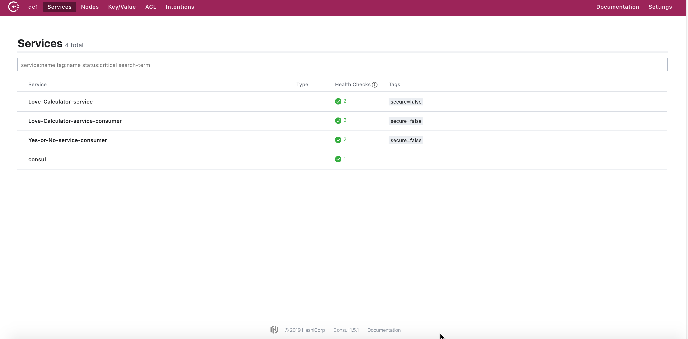

이번에는 Consul과 Prometheus, Grafana 조합으로 구성해보겠습니다. Prometheus와 Grafana는 이전 포스트에서 이미 구성했기 때문에 이번 포스트에서는 Consul과 Prometheus 연결이 주 내용이 될 것 같습니다.

> 본 블로그의 모든 포스트는 **macOS** 환경에서 테스트 및 작성되었습니다.  

여기서 사용되는 모든 소스는 다음 GitHub 레파지토리에서 공유되고 있습니다.  
[실습 자료](https://github.com/MangDan/spring-boot-monitoring)

* Java JDK 1.8+
* Apache Maven
* Spring Tools 4 for Eclipse
* Prometheus
* Grafana
* Docker (Option)

### Consul
Consul은 Terraform, Packer, Nomad, Vault, Vagrant와 같은 제품을 개발한 회사로 유명한 Hashicorp(하시코프)에서 만든 **Service Discovery** 솔루션입니다. Consul은 오픈소스 라이센스와 상용(Enterprise Pro, Enterprise Premium)라이센스를 제공합니다. 상용 라이센스의 경우 확장이나 엔터프라이즈 환경을 고려한 기능들을 포하

Consul 홈페이지에서는 크게 아래 4가지 기능으로 나눠서 Consul을 설명하고 있습니다.
* Service Discovery
  * 각 서비스에 대한 주소를 등록하고, 다른 서비스에서 찾을 수 있는 기능을 제공
* Failure Detection
  * health check를 통해서 서비스의 상태를 체크, 만약 health check fail이 되면 노드에서 삭제
* Multi Datacenter
  * 멀티 데이터센터를 지원, 데이터 센터간에는 WAN GOSSIP 프로토콜을 통해 서로 정보를 조회
* KV Storage
  * Config Server와 같이 Config 파일에 대한 정보를 공유하기 위한 Key / Value 저장소

#### Consul 다운로드
Windows와 macOS 버전은 아래 페이지에서 다운로드 가능합니다.
* https://www.consul.io/downloads.html

macOS와 Windows 버전 모두 zip 파일로 압축되어 있으며, 다운로드 후 특정 디렉토리에 압축을 풀면 됩니다.

Docker의 경우는 다음과 같이 Docker Hub에서 제공하는 공식 이미지를 사용합니다. 실행은 다음 Docker Hub의 Consul 페이지를 참고합니다.  
https://hub.docker.com/_/consul
```
$ docker pull consul
```

macOS의 경우는 Homebrew을 통해 인스톨도 가능합니다.
```
$ brew install consul

$ consul version
```

설치가 완료되면 Server Agent를 실행해야 합니다. 

> **Agent**  
> Consul Agent는 Server와 Client 두가지 모드를 지원하는데, 하나의 데이터센터는 최소한 하나의 Server Agent가 필요합니다. 하나의 Cluster 에는 하나의 Server Agent와 함께 다수의 Client Agent(선택)가 있고, Server Agent가 Client Agent를 관리합니다. 여기에 Consul UI를 위한 서버가 필요합니다. Consul 홈페이지에서는 하나의 Cluster에 Server Agent, Client Agent, Web UI까지 최소 3개의 서버를 권장하고 있습니다. 물론 Web UI의 경우는 Server Agent에 같이 구성할 수 있으며, Client Agent 없이 Server Agent 단일 노드로 구성도 가능합니다

#### Consul Agent 시작
개발 환경에서 단일 노드로 Consul을 시작하고자 할 때 -dev 옵션을 사용할 수 있습니다. -dev 옵션을 사용하면 모든 정보가 메모리에 저장되고, 빠르게 시작할 수 있습니다. -ui 옵션은 Consul  Web UI 서버가 같이 시작합니다. 추가적인 Agent 관련 옵션은 아래 페이지를 참고합니다.  
https://www.consul.io/docs/agent/options.html

```
$ consul agent -dev -ui
```

#### Consul Web UI
http://localhost:8500/ui 로 접속하면 다음과 같이 Consul Web UI를 확인할 수 있습니다.


클라우드 환경에서의 Service Discovery에 대한 필요성에 대해서 잘 설명된 페이지 (from consul)
https://www.hashicorp.com/resources/modern-service-networking-cloud-microservices

### Spring Boot Consul 설정
이전 포스트에서 사용한 Love Calculator 서비스를 계속 사용합니다.

#### Dependency
3개의 Love Calculator Spring Boot Service(love-calculator-service, love-calculator-consumer, yes-or-no-consumer)에서 Consul Service Discovery 활성화를 위해서 다음 Dependency를 추가합니다.

```xml
<dependency>
    <groupId>org.springframework.cloud</groupId>
    <artifactId>spring-cloud-starter-consul-discovery</artifactId>
</dependency>
```

#### Properties
동일하게 3개의 서비스의 application.properties에 다음 설정을 추가합니다.
```properties
spring.cloud.consul.host=localhost
spring.cloud.consul.port=8500
```

### 서비스 시작 및 Consul 서비스 확인
3개의 Love Calculator 서비스(love-calculator-service, love-calculator-consumer, yes-or-no-consumer)를 시작한 후 Consul Web UI에 접속해봅니다. 다음과 같이 3개의 서비스가 등록된 것을 확인할 수 있습니다.



### Prometheus Consul Exporter 설정
prometheus.yml 파일의 내용을 다음과 같이 수정합니다. static_configs 내용을 주석처리하고 consul_sd_configs를 다음과 같이 추가합니다.

```properties
global:
  scrape_interval:     15s

scrape_configs:
  - job_name: love-calculator-service
    metrics_path: '/actuator/prometheus'
#    static_configs:
#      - targets: ['localhost:8081', 'localhost:8082', 'localhost:8083']
    consul_sd_configs:
      - server: 'localhost:8500'
    relabel_configs:
      - source_labels: [__meta_consul_tags]
        action: keep
      - source_labels: [__meta_consul_service]
        target_label: job
```

### Prometheus와 Grafana 시작

**Prometheus 시작**
```
$ prometheus --config.file=prometheus.yml
```

**Grafana 시작**
```
$ brew services start grafana
```

### Grafana 대시보드


### 정리
Consul에 대해서 자세히 다뤄보지를 못해서 이번에는 매끄럽게 연결되지 않는 부분이 있고, Spring Boot 쪽에 오류가 나는데(오류라기 보다는 연결 체크하는 과정에서의 Exception을 출력해주는 부분), 이 부분은 나중에 따로 확인해봐야 할 것 같습니다. Consul도 가장 기본적인 Service Discovery 부분만 다뤄서 Eureka와 비교하기는 그렇지만, 멀티 데이터 센터 구성이나 확장, 자체 DNS 지원등은 상용 라이센스가 필요하기는 하지만 더 괜찮은 부분이라고 생각됩니다. Eureka와 같이 코드에서 관리하지 않기 때문에 이 부분도 관리에 있어서 장점이 될 수 있을 것 같네요. 물론 Eureka도 충분히 Service Discovery를 위한 훌륭한 솔루션입니다. 여하튼 Prometheus에서 공식적으로 Eureka Exporter를 하루빨리 지원하길 바랍니다.

지금까지 총 4회에 걸쳐서 Microservice Metrics 모니터링에 대해서 살펴봤습니다. 
정리하자면, Spring Boot Admin은 Spring Boot 모니터링 도구로써 훌륭하지만, 다른 언어나 프레임워크의 경우는 직접 모니터링이 어렵기 때문에, 다양한 언어 혹은 프레임워크를 사용하는 경우라면 Prometheus + Grafana 조합이 더 좋다고 봅니다. MSA 모니터링에 있어서는 Service Discovery는 관리/운영에 있어서 당연히 필요한 부분이며, Eureka와 Consul 모두 훌룡한 Service Discovery 솔루션이긴 하지만, Prometheus에서 Eureka Exporter를 아직 공식 지원하지 않는 부분은 좀 아쉬운 부분인 것 같습니다.

Spring Boot은 많은 모니터링 솔루션들과 연동을 할 수 있도록 지원하고 있지만, MicroProfile의 경우는 현재 Prometheus밖에 지원하지 못한 상황인 것 같습니다. 모니터링을 포함해서 MicroProfile은 전반적인 서비스 메시 부분을 Istio와의 통합에 노력을 쏟고 있는 것 같습니다. MicroProfile 하위 프로젝트를 보면 Istio 통합과 관련된 프로젝트가 3개나 진행되고 있습니다. Netflix OSS나 Consul과 같은 Service Discovery와 연결은 아직 지원하고 있지 않은데... 아~ 찾아보니 하나 있네요. KumuluzEE(쿠물루즈?)


### 참고 자료
* https://cloud.spring.io/spring-cloud-consul/spring-cloud-consul.html  
https://www.robustperception.io/finding-consul-services-to-monitor-with-prometheus  
* https://github.com/twinformatics/eureka-consul-adapter/blob/master/prometheus-sample-config.yml  
* https://www.consul.io/docs/agent/options.html  
* https://learn.hashicorp.com/consul/getting-started/agent#stopping-the-agent
* https://learn.hashicorp.com/consul/getting-started/ui
* http://redutan.github.io/2018/04/13/spring-cloud-consul
* https://www.hahwul.com/2018/08/consul-service-mesh-made-easy.html
* https://www.hashicorp.com/resources/difference-between-open-source-enterprise-consul (오픈소스와 Enterprise 버전 차이점)