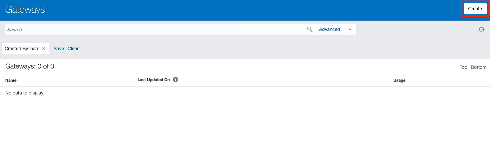
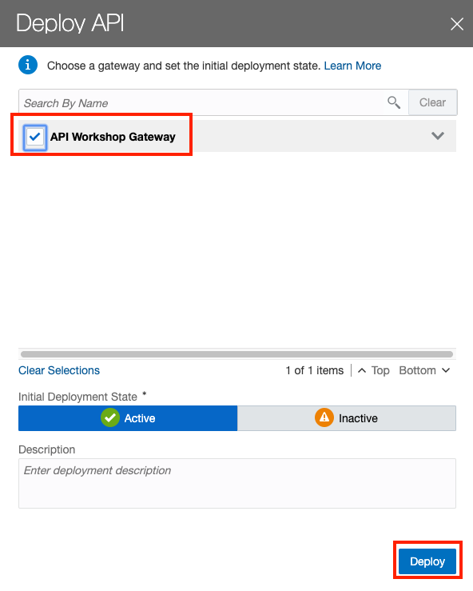

오라클의 API 관리 클라우드 플랫폼인 API Platform Cloud Service (이하 APIPCS)를 사용할 때 별도로 설치가 필요한 부분이 API 게이트웨이입니다. API 게이트웨이는 클라우드 (Oracle, AWS, Azure등) 혹은 On-Premise에 설치가 가능한데, 여기서는 Oracle Cloud Infrastructure (이하 OCI)의 Compute 인스턴스에 설치하는 방법을 포스팅합니다.

> 본 블로그의 모든 포스트는 **macOS** 환경에서 테스트 및 작성되었습니다.  

### 기본 준비 환경
> Oracle APIPCS와 OCI Compute 인스턴스가 프로비저닝 되어 있어야 합니다. 여기서는 두 서비스가 프로버저닝 되어 있다는 전제하에 진행합니다.

* Oracle API Platform Cloud Service
* Oracle Cloud Infrastructure Compute Instance

### 논리 게이트웨이 생성
* Oracle APIPCS에 접속해서 논리 게이트웨이를 생성합니다. 먼저 APIPCS에 로그인합니다.
    

    > Oracle APIPCS는 논리 게이트웨이와 물리 게이트웨이로 두 가지 유형으로 나눠서 관리합니다. 논리 게이트웨이는 APIPCS의 관리포탈에서 실제 동작하는 물리 게이트웨이를 그룹으로 관리하기 위한 목적으로 생성합니다. 예를 들면, **개발 게이트웨이** 라는 논리 게이트웨이가 있다고 가정하고, 실제 IP 주소를 가지는 서버의 물리 게이트웨이인 **Dev Gateway Node - 1**, **Dev Gateway Node - 2**가 있다고 가정할 때, 두 개의 물리 게이트웨이는 **개발 게이트웨이** 라는 논리 게이트웨이에 포함시켜서 관리할 수 있습니다. 논리 게이트웨이에 포함시킬 수 있는 물리 게이트웨이 수가 늘어나도, 별도로 추가되는 비용은 없고, 단지 물리 게이트웨이가 설치 될 하드웨어만 있으면 됩니다. 과금 대상은 논리 게이트웨이로 논리 게이트웨이 단위로 시간 당 35,000 호출까지는 기본 비용을 받습니다. 논리 게이트웨이가 2개가 되면, 2배의 비용이 발생하는 것이고, 전체 호출은 시간 당 70,000 호출까지 가능합니다. 가격과 관련된 자세한 부분은 [Oracle API Platform Pricing](https://cloud.oracle.com/api-platform/pricing)을 참고하시기 바랍니다.

* 좌측 **Gateways** 메뉴를 클릭한 후 우측 상단의 **Create**버튼을 클릭합니다.
    

* Gateway Name을 입력한 후 **Create** 버튼을 클릭해서 논리 게이트웨이를 생성합니다. 아래는 예시입니다.
    * Gateway Name: API Workshop Gateway

### 물리 게이트웨이 설치 파일과 게이트웨이 설치를 위한 설정 및 구성파일 다운로드
* 생성하면 다음과 같이 논리 게이트웨이 목록에서 확인할 수 있습니다.
     

* 생성한 논리 게이트웨이를 클릭한 후 우측 상단의 **Download Gateway Installer**를 클릭합니다. 물리적으로 설치할 수 있는 게이트웨이 설치파일을 다운로드 받을 수 있습니다.
    > 다운로드 받은 물리 게이트웨이 설치 파일은 오라클 퍼블릭 클라우드와 연결될 수 있는 어떤 환경에서도 설치가 가능합니다. (예. AWS, Azure, On-Premise)

* 설정 파일을 구성한 후 다운로드 받을 수 있습니다. 우측 상단의 **Open Installation Wizard**를 클릭합니다.
     

* 먼저 Oracle APIPCS의 관리 콘솔 및 사용자,인증 관리를 위한 IDCS(오라클의 인증 관리 서비스)에 대한 정보를 확인하는 단계입니다. **Next** 버튼을 클릭 합니다.
     

* 두 번째 단계에서는 물리 게이트웨이의 이름과 설명, Listen IP 및 Public Address, 설치 파일과 설치 경로에 대한 정보를 입력한 후 **Next** 버튼을 클릭 합니다. 아래는 예시입니다.
    * Gateway Node Name: API Workshop Gateway Node 1
    * Gateway Node Description: API Workshop Gateway Node 1
    * Listen IP Address: 10.0.0.3 (설치 할 서버의 Private IP)
    * Public Address: 132.145.83.173 (설치 할 서버의 Public IP)
    * Node Installation Directory: 설치 할 디렉토리
    * Installation Archive Location: 다운로드 받은 게이트웨이 파일의 압축 해제 할 디렉토리

* 세 번째는 게이트웨이 서버의 힙 메모리, 포트등의 정보를 입력합니다. 아래는 예시입니다.
    > 설치되는 게이트웨이 노드는 오라클 웹로직 서버위에 애플리케이션 형태로 배포됩니다. 따라서 모든 설정은 웹로직 설정을 기반으로 합니다. 필요한 부분만 기술합니다.

    * OAuth 2.0 프로파일 위치 (OAuth 설정을 위해 필요하며, 여기서는 설정하지 않습니다)
    * 게이트웨이 실행 모드: 개발 (웹로직 실행 모드)
    * 힙 크기: 2 (GB)
    * 최대 힙 크기: 4 (GB)
    * 통신 포트 > 관리 서버 포트: 8011 (웹로직 관리 콘솔 포트)
    * 런타임 포트 > 관리 서버 포트: 8001

     

* 마지막으로 **파일 다운로드** 버튼을 클릭하면 위에서 설정한 정보를 담은 **gateway-props.json** 파일을 다운로드 받게 됩니다. 

     

### 설치 파일 업로드
* 게이트웨이 설치 파일과 구성 파일, JDK를 설치 할 서버에 업로드합니다.
    > 게이트웨이를 설치 할 환경은 **OCI Compute**입니다.

    * JDK 업로드 (아래는 예시 입니다.)
        ```
        # scp -i .ssh/id_rsa jdk-8u221-linux-x64.tar.gz opc@132.145.xx.xxx:/home/opc
        ```

    * API 게이트웨이 설치파일과 구성 파일 업로드 (아래는 예시 입니다.)
        ```
        # scp -i .ssh/id_rsa ApicsGatewayInstaller.zip gateway-props.json opc@132.145.xx....:/home/opc
        ```

### 물리 게이트웨이 노드 설치 준비
* 설치 할 OCI 서버에 접속합니다.
    ```
    # ssh -i id_rsa opc@132.145.xx.xxx
    ```

* 먼저 설치 할 그룹과 사용자를 추가합니다.
    ```
    # sudo groupadd oracle

    # sudo useradd oracle -s /bin/bash -g oracle
    ```

* 업로드 한 파일에 대한 소유자를 oracle 사용자로 변경한 후 파일을 해당 유저의 홈 디렉토리로 이동합니다.
    ```
    # sudo chown -R oracle:oracle ApicsGatewayInstaller.zip gateway-props.json jdk-8u221-linux-x64.tar.gz

    # sudo mv ApicsGatewayInstaller.zip gateway-props.json jdk-8u221-linux-x64.tar.gz /home/oracle
    ```

* 사용자를 oracle 사용자로 변경한 후 다음과 같이 폴더 생성 및 이동합니다.
    ```
    # sudo su - oracle

    # mkdir java apigw apigw_installer

    # mv jdk-8u221-linux-x64.tar.gz java

    # mv ApicsGatewayInstaller.zip apigw_installer
    ```

* jdk를 압축 해제합니다.
    ```
    # cd $home/java

    # tar -xvf jdk-8u221-linux-x64.tar.gz
    ```

* API 게이트웨이 설치파일을 압축 해제합니다.
    ```
    # cd $home/apigw_installer

    # unzip ApicsGatewayInstaller.zip
    ```

* 구성 파일을 설치 폴더로 복사합니다.
    > 미리 해당 파일을 복사한 후 압축을 해제할 경우 덮어쓰게 됩니다. 따라서, 압축 해제한 후 구성 파일을 복사합니다.

    ```
    # mv ../gateway-props.json .
    ```

### 물리 게이트웨이 노드 설치
* 게이트웨이 설치파일을 압축 해제한 폴더에서 다음과 같이 실행합니다.
    > 게이트웨이 설치 시 단계는 설치(install), 구성(configure), 서버 시작(start), join(관리 서버에 등록)입니다. 옵션 중에서 **install-configure-start-join** 은 이 4개의 단계를 모두 순서대로 실행한다는 것을 의미합니다. 물론 특정 스탭만을 실행할 수도 있습니다. 예를 들어 **install** 옵션만 사용하면, 설치만 진행합니다. 
    ```
    # cd $home/apigw_installer

    # ./APIGateway -f gateway-props.json -a install-configure-start-join
    ```

* 설치 스크립트를 실행하면 중간에 Gateway Manager와 Runtime User를 위한 Client Id와 Client Secret을 필요로 합니다. 이 부분은 IDCS에 접속해서 해당 정보를 가져와야 합니다.
    > 위 정보를 가져오는 부분은 아래 URL을 참고합니다.  
    > 참고) https://redthunder.blog/2018/07/17/teaching-how-to-provision-oracle-autonomous-api-platform-and-api-gateway/
    > 

* 실행하면 다음과 같이 몇 가지 필요로 하는 정보를 입력받는 프롬프트가 나옵니다. 기본적으로 웹로직이 설치되기 때문에 웹로직 관리자 아이디(보통 weblogic)와 패스워드, API Platform의 관리자 아이디와 패스워드(APIPCS 프로비저닝 한 사용자 혹은 APIPCS에 대한 관리 권한 할당을 받은 사용자), **Client ID** 및 **Client Secret**가 필요합니다.
    
    ```
    [oracle@api-workshop-instance-1 apigw_installer]$ ./APIGateway -f gateway-props.json -a install-configure-start-join
    Setting OPATCH_NO_FUSER to true
    Please enter user name for weblogic domain,representing the gateway node:
    weblogic
    Password:
    2019-07-25 02:19:41,957 INFO action: install-configure-start-join
    2019-07-25 02:19:41,957 INFO Initiating validation checks for action: install.
    2019-07-25 02:19:42,020 WARNING Previous gateway installation found at directory = /home/oracle/apigw
    2019-07-25 02:19:42,021 INFO Current cleanup action is CLEAN 
    2019-07-25 02:19:42,021 INFO Validation complete
    2019-07-25 02:19:42,021 INFO Action install is starting
    2019-07-25 02:19:42,021 INFO start action: install
    This action will now cleanup existing gateway installation(if it exists).Do you want to proceed?: y/n
    y
    2019-07-25 02:19:43,617 INFO Clean started.
    2019-07-25 02:19:43,618 INFO Logging to file /home/oracle/apigw/logs/main.log
    2019-07-25 02:19:43,618 INFO Outcomes of operations will be accumulated in /home/oracle/apigw/logs/status.log
    2019-07-25 02:19:43,619 INFO Clean finished.
    2019-07-25 02:19:43,619 INFO Installing Gateway
    2019-07-25 02:22:34,507 INFO Gateway installation action status = INSTALLED.
    2019-07-25 02:22:34,507 INFO Installing API Analytics.
    2019-07-25 02:22:38,537 INFO API Analytics installation complete.
    2019-07-25 02:22:38,537 INFO Please review gateway installation logs for full status.
    2019-07-25 02:22:38,537 INFO complete action: install isSuccess: ok detail: {}
    2019-07-25 02:22:38,537 INFO Action install has completed successfully. Detail: {}
    2019-07-25 02:22:38,537 INFO [====                ] 20% complete
    2019-07-25 02:22:38,537 INFO Initiating validation checks for action: configure.
    2019-07-25 02:22:38,618 INFO Validation complete
    2019-07-25 02:22:38,618 INFO Action configure is starting
    2019-07-25 02:22:38,618 INFO start action: configure
    2019-07-25 02:22:38,618 INFO Creating Gateway domain
    2019-07-25 02:23:05,453 INFO Gateway domain creation complete.
    2019-07-25 02:23:05,453 INFO complete action: configure isSuccess: ok detail: {}
    2019-07-25 02:23:05,453 INFO Action configure has completed successfully. Detail: {}
    2019-07-25 02:23:05,453 INFO [========            ] 40% complete
    2019-07-25 02:23:05,453 INFO Initiating validation checks for action: start.
    2019-07-25 02:23:05,525 INFO Validation complete
    2019-07-25 02:23:05,525 INFO Starting JavaDB
    nohup: ignoring input and redirecting stderr to stdout
    2019-07-25 02:23:16,256 INFO Starting Admin Server 
    2019-07-25 02:23:16,260 INFO Starting Node Manager 
    nohup: redirecting stderr to stdout
    2019-07-25 02:23:16,263 INFO Waiting for domain to come up 
    2019-07-25 02:23:16,265 INFO Waiting for service to start
    nohup: redirecting stderr to stdout
    2019-07-25 02:23:47,773 INFO Status of domain start = STARTED
    2019-07-25 02:23:47,773 INFO Starting Managed Server
    2019-07-25 02:23:47,778 INFO Waiting for Managed Server
    2019-07-25 02:23:47,779 INFO Waiting for service to start
    nohup: redirecting stderr to stdout
    2019-07-25 02:24:17,810 INFO Waiting for service to start
    2019-07-25 02:24:47,947 INFO Status of managed server = STARTED
    2019-07-25 02:24:47,947 INFO [================    ] 80% complete
    2019-07-25 02:24:47,947 INFO Initiating validation checks for action: join.
    2019-07-25 02:24:48,010 INFO Validation complete
    Actions:
        install: SUCCESSFUL
            detail: {}
        patch: not_attempted
        configure: SUCCESSFUL
            detail: {}
        creategateway: not_attempted
        join: not_attempted

    Servers:
        gateway server: running
            url: http://10.0.0.3:8011/apiplatform/gatewaynode/v1
        management server: running
            url: https://apipcs-workshop-busanbank2019.apiplatform.ocp.oraclecloud.com:443/apiplatform/administration/v1/version

    2019-07-25 02:24:56,484 INFO Performing java db health check.
    2019-07-25 02:24:56,485 INFO  Java db host = 10.0.0.3 dbPort = 1527
    Java DB health check:
        db server: running

    Environment details:
        Free space (domain directory): 32091934720
    2019-07-25 02:25:03,000 INFO Attributes to be validated = ['gateway_server', 'management_server', 'java_db_server']
    2019-07-25 02:25:03,000 INFO Health status check execution is complete.
    Please enter gateway manager user:
    donghu.kim@oracle.com
    Password:
    Please enter gateway runtime client id:
    9E7E2F94FCFE4AC4870A7A1FC997CCF7_APPID
    Please enter gateway runtime client secret:
    ffd420bd-fc00-484e-96f3-e3651f74f2f4
    Please enter gateway runtime user:
    donghu.kim@oracle.com
    Password:
    2019-07-25 02:28:35,811 INFO joining gateway ...
    2019-07-25 02:28:35,811 INFO Action join is starting
    2019-07-25 02:28:35,811 INFO start action: join
    Error: Gateway runtime user does not have the requisite node service account grants on the gateway or the grant process itself has failed due to possible network issues.
    Do you want to add node service account grants to gateway for the gateway runtime user -  y/n
    y
    Please enter gateway runtime user:
    donghu.kim@oracle.com
    Please enter gateway runtime password:
    Password: 
    2019-07-25 02:29:12,787 INFO complete action: join isSuccess: ok detail: {"status": "JOIN_COMPLETED"}
    2019-07-25 02:29:12,787 INFO Action join has completed successfully. Detail: {"status": "JOIN_COMPLETED"}
    2019-07-25 02:29:12,788 INFO join request is sent, please login to APICS portal as gateway manager to approve the request
    Actions:
        install: SUCCESSFUL
            detail: {}
        patch: not_attempted
        configure: SUCCESSFUL
            detail: {}
        creategateway: not_attempted
        join: SUCCESSFUL
            detail: {"status": "JOIN_COMPLETED"}

    Servers:
        gateway server: running
            url: http://10.0.0.3:8011/apiplatform/gatewaynode/v1
        management server: running
            url: https://apipcs-workshop-busanbank2019.apiplatform.ocp.oraclecloud.com:443/apiplatform/administration/v1/version

    2019-07-25 02:29:19,948 INFO Performing java db health check.
    2019-07-25 02:29:19,948 INFO  Java db host = 10.0.0.3 dbPort = 1527
    Java DB health check:
        db server: running

    Environment details:
        Free space (domain directory): 32126705664
    2019-07-25 02:29:26,181 INFO [============        ] 60% complete
    2019-07-25 02:29:26,181 INFO Initiating validation checks for action: lockdown.
    2019-07-25 02:29:26,243 INFO Validation complete
    2019-07-25 02:29:26,244 INFO [====================] 100% complete
    2019-07-25 02:29:26,244 INFO Full-Setup execution complete. Please check log file for more details
    2019-07-25 02:29:26,244 INFO Execution complete.
    ```

### 논리 게이트웨이에 물리 게이트웨이 노드 추가 승인
* Oracle APIPCS에 접속한 후 처음 추가 한 **논리 게이트웨이**를 선택 한 후 좌측 두 번째 **Nodes** 아이콘을 클릭하면 **Requesting** 옆에 숫자 1이 있는 것을 볼 수 있습니다. **물리 게이트웨이** 설치 시 마지막 **join** 단계에서 실제 **논리 게이트웨이**에 추가를 위한 요청을 하게 됩니다. 여기서 **Approve**를 해줘야 최종적으로 **논리 게이트웨이**에 **물리 게이트웨이** 노드가 추가됩니다.
    **Requesting**
    

    **Approve**
    

### 논리 게이트웨이 로드 발란서 설정
* 물리 게이트웨이 노드의 경우 여러개가 설정이 될 수 있기 때문에 기본적으로 배포되는 API의 경우 로드 발란서 URL을 통해 접속합니다. 따라서 논리 게이트웨이에 대표 로드 발란서 URL을 설정해줘야 합니다. 여기서는 별도의 로드 발란서가 현재 없는 상태이고, 하나의 물리 게이트웨이 노드만 추가된 상태이기 때문에 물리 게이트웨이 노드의 IP와 포트로 설정합니다.
    

### Security List와 Firewall 업데이트
* OCI Compute 인스턴스에서 물리 게이트웨이 포트(8011)를 열어줘야 합니다. 우선 Security List에 추가합니다.
    

* 게이트웨이 노드가 설치 된 OCI Compute에 접속해서 Firewall에 8011/tcp를 추가합니다.
    ```
    # sudo firewall-cmd --list-all 

    # sudo firewall-cmd --permanent --add-port=8011/tcp

    # sudo firewall-cmd --reload
    ```

### API 추가 및 구현
* 이제 물리 게이트웨이 노드의 설치가 모두 끝났습니다. 이제 실제 API를 생성해서 게이트웨이가 잘 동작하는 지 테스트를 해보겠습니다. 먼저 API Platform 관리콘솔에 접속 한후 좌측 상단의 **APIs**를 클릭합니다.
    

* Name과 Version을 다음과 같이 추가합니다.
    * Name: Yes or No API
    * Version: 1.0

    

* API 목록을 확인한 후 생성 한 API를 클릭 합니다.
    

* API 구현(여기서의 구현은 API에 대한 정책을 적용하는 내용입니다.)을 합니다. 먼저 API Request에 엔드포인트를 설정합니다.
    

* 실제 호출 할 서비스를 입력합니다. 다음과 같이 오픈 서비스를 활용합니다.
    * Enter a URL : select
    * https://yesno.wtf/api

* 저장합니다.
    

* 마지막으로 게이트웨이에 배포합니다. 좌측 배포(Deployments) 선택 후 **Deploy API** 클릭합니다. 생성한 논리 게이트웨이를 체크한 후 **Deploy**를 클릭 합니다.
    

* 배포가 완료되면 다음과 같이 API의 엔드포인트 주소를 볼 수 있습니다.
    

### 서비스 테스트
* 실제 서비스를 호출해서 테스트합니다.
    
