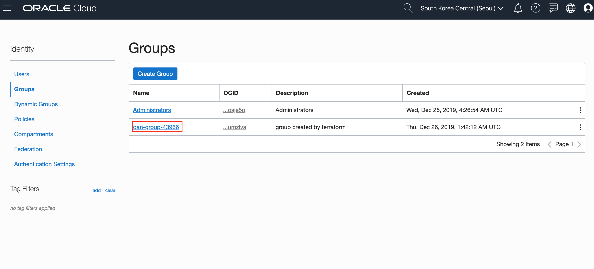
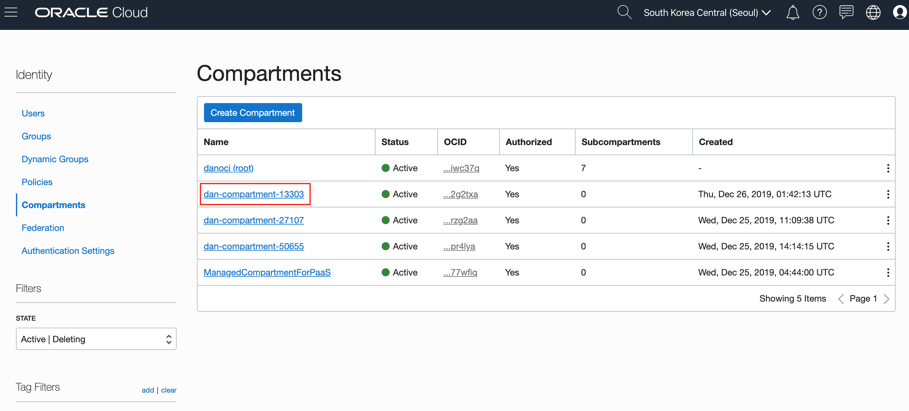
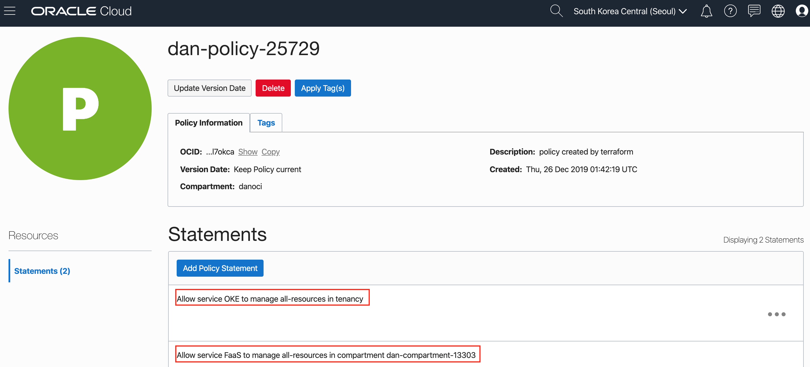
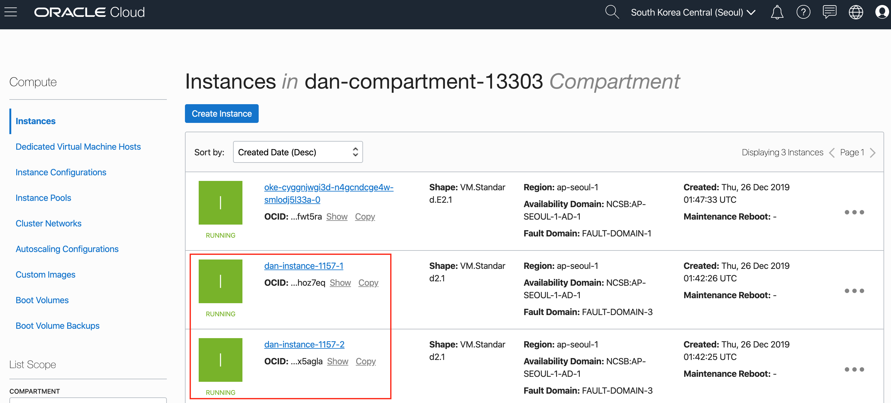
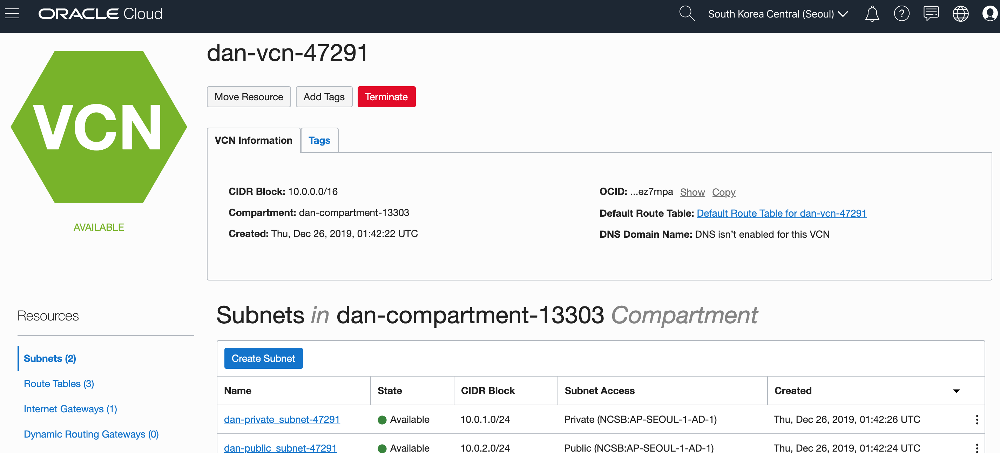
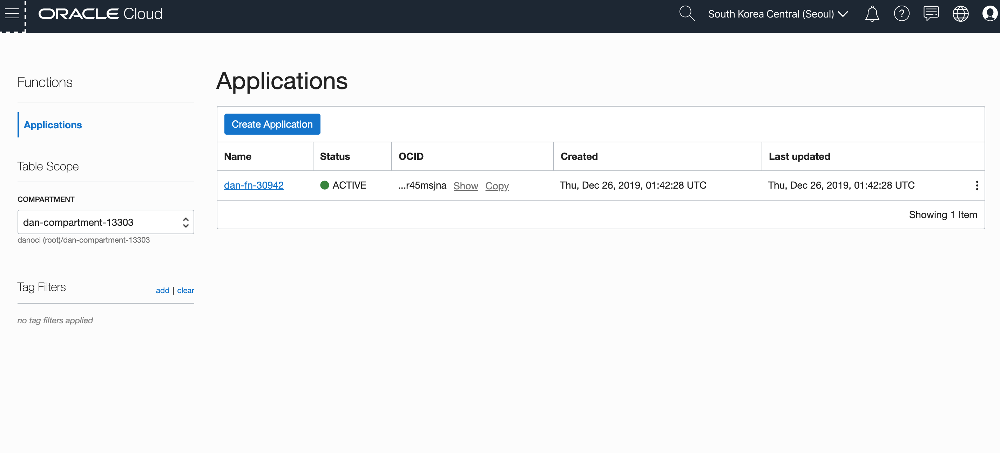
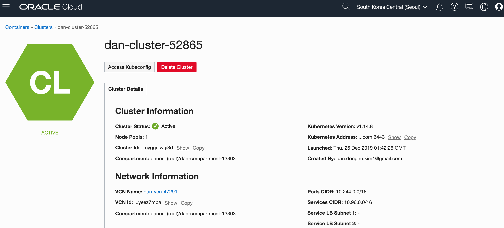
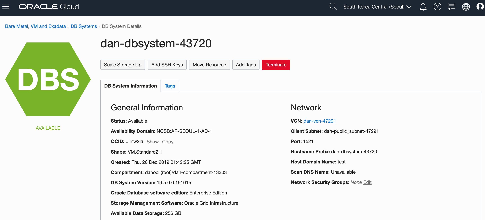
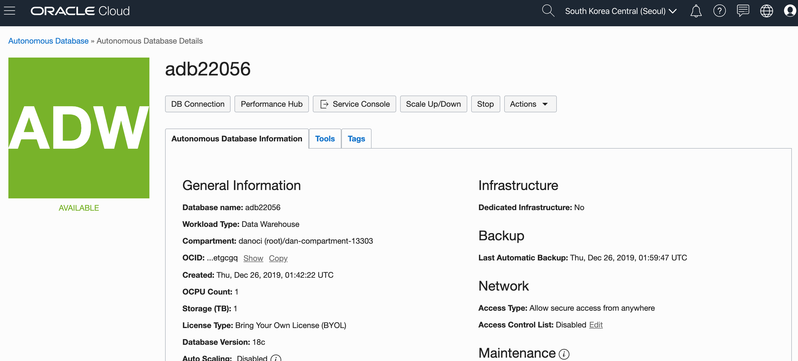

이번 포스트에서는 실제 테라폼 코드를 사용하여 Oracle Infrastructure Cloud (이하 OCI)에 리소스를 프로비저닝해보도록 한다.  
OCI에 프로비저닝 할 내용은 다음과 같다.
* IAM Group
* IAM Compartment
* IAM Policy
* Compute
* Network (VCN, Private/Public Subnet, Loadbalancer, Security List, NAT Gateway, Internet Gateway)
* Autonomous Database
* Autonomous Data Warehouse (ADW)
* Autonomous Transaction Processing (ATP)
* Kubernetes Engine (OKE)
* Oracle Funtions (Serverless)

테라폼의 Module을 사용하여 각 리소스를 모듈화 하였고, Workspace를 사용해서 Multi Oracle Tenancy 프로비저닝이 가능하도록 구현해봤다.

> 본 블로그의 모든 포스트는 **macOS** 환경에서 테스트 및 작성되었습니다.  

### OCI용 테라폼 파일 다운로드
테라폼 프로젝트는 아래 깃헙 저장소를 통해서 제공한다.
> https://github.com/MangDan/Infrastructure-as-Code

다운로드 받은 OCI용 테라폼 프로젝트의 디렉토리 구조는 다음과 같다.
```
.
├── oci
│   ├── evn
│   │   ├── {tenancy}.{region}.tfvars
│   │   └── danoci.ap-seoul-1.tfvars
│   ├── provider.tf
│   ├── main.tf
│   ├── vars.tf
│   ├── terraform.tfstate.d
│   ├── modules
│   │   ├── adb
│   │   │   ├── main.tf
│   │   │   ├── datasources.tf
│   │   │   ├── vars.tf
│   │   │   └── outputs.tf
│   │   ├── compartment
│   │   │   ├── main.tf
│   │   │   ├── datasources.tf
│   │   │   ├── vars.tf
│   │   │   └── outputs.tf
│   │   ├── compute
│   │   │   ├── main.tf
│   │   │   ├── datasources.tf
│   │   │   ├── vars.tf
│   │   │   └── outputs.tf
│   │   ├── container
│   │   │   ├── main.tf
│   │   │   ├── datasources.tf
│   │   │   ├── vars.tf
│   │   │   └── outputs.tf
│   │   ├── dbsystem
│   │   │   ├── main.tf
│   │   │   ├── datasources.tf
│   │   │   ├── vars.tf
│   │   │   └── outputs.tf
│   │   ├── functions
│   │   │   ├── main.tf
│   │   │   ├── datasources.tf
│   │   │   ├── vars.tf
│   │   │   └── outputs.tf
│   │   ├── group
│   │   │   ├── main.tf
│   │   │   ├── datasources.tf
│   │   │   ├── vars.tf
│   │   │   └── outputs.tf
│   │   ├── policy
│   │   │   ├── main.tf
│   │   │   ├── datasources.tf
│   │   │   ├── vars.tf
│   │   │   └── outputs.tf
│   │   └── vcn
│   │       ├── main.tf
│   │       ├── datasources.tf
│   │       ├── vars.tf
│   │       └── outputs.tf
│   └── run_tf.sh
└──
```

현재 oci 프로젝트 하위 모듈들의 공통 구성 파일인 provider.tf, main.tf, vars.tf 파일이 있고, modules 하위에 생성할 리소스 별로 모듈을 구성했다. 각 모듈은 main.tf, datasources.tf, vars.tf, outputs.tf 파일로 구성되어 있다. env 폴더안에는 OCI Tenancy 및 Region별로 tfvars 환경파일을 작성했다. 이외 terraform.tfstate.d, workspace는 테라폼 workspace를 구성할 경우 생성되는데, terraform.tfstate.d안에는 테라폼 실행 시 각 workspace별로 상태파일(tfstate)이 저장된다. run_tf.sh 파일은 workspace를 각 Tenancy 혹은 Region별로 구분한 후 이를 동시에 프로비저닝하기 위해 만든 쉘 스크립트 파일이다.

### Workspace 생성
먼저 workspace를 생성해보겠다. 여기서 workspace 이름은 환경 구성파일 (tfvars)의 이름과 동일하게 구성할 것이며, **{tenancy}-{region}** 형태로 구성하겠다. OCI에 Free Trial 계정을 하나 생성해서 진행해 본다. 환경은 다음과 같다.
* Tenancy : danoci
* Region : ap-seoul-1

> 테라폼 설치가 되어 있어야 한다. 테라폼 설치는 [여기](2019-12-24-terraform-with-oci-1.md)를 참고한다.

이제 다운로드 받은 프로젝트의 oci 폴더에서 workspace를 생성한다.
```
$ terraform workspace new danoci-ap-seoul-1
```

생성한 workspace를 확인한다. *가 붙은것은 현재 선택된 workspace를 의미한다. 다른 workspace를 선택할 경우에는 terraform workspace select {workspace} 형태로 변경할 수 있다.
```
$ terraform workspace list

  default
* danoci-ap-seoul-1
```

### 환경 파일
env 폴더안에 workspace 이름과 동일하게 tfvars 파일을 만들었다. 환경 변수로 등록해서 사용할 수 있지만, 여기서는 tfvars를 사용했고, workspace 이름과 동일하게 만든 이유는 쉘 스크립트 안에서 여러개의 workspace별로 동시에 실행할 수 있도록 구성하기 위해서이다. (이 부분은 run_tf.sh를 설명하는 곳에서 다시 설명)

env 폴더안에 danoci.ap-seoul-1.tfvars 파일의 내용을 보면 다음과 같다.
```
tenancy_ocid     = "ocid1.tenancy.oc1......"
compartment_ocid = ""
user_ocid        = "ocid1.user.oc1......"
fingerprint      = "48:1a:98:8c:cd:f6:63:4b:f...."
private_key_path = "~/.oci/oci_api_key.pem"
region           = "ap-seoul-1"
home_region      = "ap-seoul-1"
ssh_public_key   = "~/.ssh/id_rsa.pub
```

tenancy_ocid, user_ocid, fingerprint, private_key, ssh_public_key, region등의 정보는 아래 포스트를 참고한다.
> [OCI-CLI 설치](2019-04-26-oci-cli-install.md)

### 모듈 공통 구성 파일
생성할 리소스들을 모듈화 했는데, 각 모듈에서 사용할 공통 구성 파일을 provider.tf, main.tf, vars.tf 3개의 파일로 구성했다.  
먼저 provider.tf에는 oci provider를 다음과 같이 정의한다.

**provider.tf**
```terraform
provider "oci" {
  tenancy_ocid     = "${var.tenancy_ocid}"
  user_ocid        = "${var.user_ocid}"
  fingerprint      = "${var.fingerprint}"
  private_key_path = "${var.private_key_path}"
  region           = "${var.region}"
}
```

vars.tf 파일에는 프로바이더와 각 모듈에서 사용하는 변수들을 정의한다. tfvars에 있는 값들은 vars.tf의 각 변수에 자동으로 매핑된다. 그 외에 각 모듈별로 사용할 변수와 값들이 포함되어 있다.
**vars.tf**
```terraform
# Variables Exported from env.sh

# Uses Default Value
variable "tenancy_ocid" {}
variable "user_ocid" {}
variable "oci_user_ocid" {}
variable "fingerprint" {}
variable "private_key_path" {}
variable "compartment_ocid" {}
variable "region" {}
variable "home_region" {}
variable "ssh_public_key" {}
variable "availability_domain" {
  default = 1
}
variable "name_prefix" {
  default = "dan"
}
variable "freeform_tags" {
  type = "map"

  default = {
    freeform_tags = "Freeform Tags"
  }
}
variable "defined_tags" {
  type = "map"

  default = {
    "KRSET02.ET" = "ET_TEAM:donghu.kim@oracle.com"
  }
}

# for compute module
variable "compute" {
  type = "map"

  default = {
    num_nodes      = 2
    instance_shape = "VM.Standard2.1"
  }
}

# for vm database module
variable "dbsystem" {
  type = "map"

  default = {
    "database_edition" = "ENTERPRISE_EDITION"
    "db_version"       = "12.2.0.1"
    "admin_password"   = "WelCome123##"
    "character_set"    = "AL32UTF8"
    "ncharacter_set"   = "AL16UTF16"
    "db_workload"      = "OLTP"
    "licence_model"    = "LICENSE_INCLUDED"
    "node_count"       = 1
    "shape"            = "VM.Standard2.1"
    "source"           = "NONE"
    "time_zone"        = "Asia/Seoul"
  }
}

# for container module
variable "container" {
  type = "map"

  default = {
    "kubernetes_version"              = "LATEST"
    "is_kubernetes_dashboard_enabled" = true
    "is_tiller_enabled"               = true
    "node_image_name"                 = "Oracle-Linux-7.6"
    "node_shape"                      = "VM.Standard2.1"
    "num_nodes"                       = 1
    "kubecfg_expiration"              = 10
    "kubecfg_token_version"           = "2.0.0"
  }
}

# for autonomous database module
variable "adb" {
  type = "map"

  default = {
    "cpu_core_count"                                 = 1
    "data_storage_size_in_tbs"                       = 1
    "db_workload"                                    = "DW" #DW (ADW), OLTP (ATP)
    "is_auto_scaling_enabled"                        = false
    "is_dedicated"                                   = false
    "is_preview_version_with_service_terms_accepted" = false

  }
}
```

main.tf에는 각 모듈을 실행하기 위해 해당 모듈이 있는 폴더의 위치를 지정하고, 넘겨줄 변수를 정의한다.

```terraform
# Creates a group
module "group" {
  source        = "./modules/group"
  tenancy_ocid  = "${var.tenancy_ocid}"
  user_ocid     = "${var.oci_user_ocid}" // IDCS에서 관리하는 사용자를 추가할 경우 ${var.user_ocid}
  name_prefix   = "${var.name_prefix}"
  freeform_tags = "${var.freeform_tags}"
}

# Creates a compartment
module "compartment" {
  source        = "./modules/compartment"
  tenancy_ocid  = "${var.tenancy_ocid}"
  name_prefix   = "${var.name_prefix}"
  freeform_tags = "${var.freeform_tags}"

  # group_name   = "${module.group.group_name}"
}

# Create a Virtual Cloud Network
module "vcn" {
  source           = "./modules/vcn"
  tenancy_ocid     = "${var.tenancy_ocid}"
  compartment_ocid = "${module.compartment.compartment_id}"
  #compartment_ocid    = "${var.compartment_ocid}"
  availability_domain = "${var.availability_domain}"
  name_prefix         = "${var.name_prefix}"
  freeform_tags       = "${var.freeform_tags}"
}

# Creates Compute Instance
module "compute" {
  source           = "./modules/compute"
  tenancy_ocid     = "${var.tenancy_ocid}"
  region           = "${var.region}"
  compartment_ocid = "${module.compartment.compartment_id}"
  #compartment_ocid    = "${var.compartment_ocid}"
  availability_domain = "${var.availability_domain}"
  compute             = "${var.compute}"
  name_prefix         = "${var.name_prefix}"
  ssh_public_key      = "${file(var.ssh_public_key)}"
  public_subnet_ocid  = "${module.vcn.public_subnet_ocid}"
  freeform_tags       = "${var.freeform_tags}"
}

# Creates Autonomous Database
module "dbsystem" {
  source              = "./modules/dbsystem"
  tenancy_ocid        = "${var.tenancy_ocid}"
  availability_domain = "${var.availability_domain}"
  compartment_ocid    = "${module.compartment.compartment_id}"
  #compartment_ocid   = "${var.compartment_ocid}"
  dbsystem           = "${var.dbsystem}"
  public_subnet_ocid = "${module.vcn.public_subnet_ocid}"
  name_prefix        = "${var.name_prefix}"
  ssh_public_key     = "${file(var.ssh_public_key)}"
  freeform_tags      = "${var.freeform_tags}"
}

# Creates Autonomous Data Warehouse (ADW), Autonomous Transaction Processing (ATP)
module "adb" {
  source           = "./modules/adb"
  compartment_ocid = "${module.compartment.compartment_id}"
  #compartment_ocid = "${var.compartment_ocid}"
  adb           = "${var.adb}"
  freeform_tags = "${var.freeform_tags}"
}

# Create Kubernetes Engine (OKE)
module "container" {
  source           = "./modules/container"
  tenancy_ocid     = "${var.tenancy_ocid}"
  compartment_ocid = "${module.compartment.compartment_id}"
  #compartment_ocid = "${var.compartment_ocid}"
  availability_domain = "${var.availability_domain}"
  container           = "${var.container}"
  private_subnet_ocid = "${module.vcn.private_subnet_ocid}"
  vcn_id              = "${module.vcn.vcn_id}"
  name_prefix         = "${var.name_prefix}"
}


# Create Funtions (Serverless)
module "functions" {
  source = "./modules/functions"
  #compartment_ocid = "${var.compartment_ocid}"
  compartment_ocid   = "${module.compartment.compartment_id}"
  public_subnet_ocid = "${module.vcn.public_subnet_ocid}"
  name_prefix        = "${var.name_prefix}"
  freeform_tags      = "${var.freeform_tags}"
}

# Create Policy
module "policy" {
  source = "./modules/policy"
  #compartment_ocid = "${var.compartment_ocid}"
  compartment_ocid = "${var.tenancy_ocid}"
  statements       = "${local.statements}"
  name_prefix      = "${var.name_prefix}"
  # providers = {
  #   oci = "oci.home"
  # }
}

locals {
  # statements = [
  #   "Allow service OKE to manage all-resources in compartment ${module.compartment.compartment_name}", "Allow service FaaS to manage all-resources in compartment ${module.compartment.compartment_name}"
  # ]
  statements = [
    "Allow service OKE to manage all-resources in tenancy", "Allow service FaaS to manage all-resources in compartment ${module.compartment.compartment_name}"
  ]
}
```

위에서 **module.compartment.compartment_id** 이런 내용이 있는데 Compartment 모듈을 실행하고 Compartment의 Outputs.tf에서 나온 결과를 다른 모듈의 매개변수로 사용한 것이다. 아래는 Compartment Module의 outputs.tf인데, output으로 compartment_id가 반환되는 것을 확인할 수 있다.

```terraform
# Output variables from created compartment

output "compartment_name" {
  value = "${oci_identity_compartment.compartment.name}"
}

output "compartment_id" {
  value = "${oci_identity_compartment.compartment.id}"
}
```

main.tf 맨 아래 locals가 보인다. 변수의 일종이지만, variable과는 다르게 일종의 지역변수와 같은 역할을 한다. main.tf 안에서만 사용하면서 여기서 사용한 것과 같이 특정 모듈의 output의 값을 할당해서 동적으로 값을 지정할 수 있다. 본 예제에서는 Function의 경우 위에서 생성한 Compartment에서만 관리되도록 Policy 구문을 사용했고, OKE의 경우는 전체 Tenancy 레벨에서 괸리되는 구문을 사용했는데, locals에 해당 구문들을 정의했다.

**OKE 관련 Policy**
```
Allow service OKE to manage all-resources in tenancy
```

**FaaS(Function) 관련 Policy**
```
Allow service FaaS to manage all-resources in compartment ${module.compartment.compartment_name}
```

### 테라폼 초기화
우선 provider.tf 파일이 있는 위치에서 terraform init을 통해 모듈 초기화 및 OCI Provider Plugin을 내려 받는다.
```
$ terraform init
```

### 테라폼 실행
그럼 생성한 workspace를 선택하고 테라폼을 실행해보겠다. 먼저 workspace를 선택한다.
```
$ terraform workspace select danoci-ap-seoul-1
```

현재 선택된 workspace를 보려면 다음과 같이 show 명령어를 사용한다.
```
$ terraform workspace show
danoci-ap-seoul-1
```

테라폼 적용(apply)전에 plan을 실행해서 수행될 작업에 대한 계획을 확인한다. 구성 파일에 대한 유효성 검사도 같이 진행하게 된다. tfvars 환경 구성파일의 경우 현재 workspace 이름과 같기 때문에 아래와 같이 실행하면 해당 tfvars 파일을 참조하게 된다.
```
$ terraform plan -var-file="env/$(terraform workspace show).tfvars"
```

plan 결과가 예상한 계획과 일치하면, apply를 통해서 실제 인프라에 반영한다. 다음과 같이 apply를 실행한다.
```
$ terraform apply -var-file="env/$(terraform workspace show).tfvars"
```

ocid1.dhcpoptions.oc1.ap-seoul-1.aaaaaaaa3bfzcrqkcykn2ggbnisuvvyxzxxcfb5nkm6d7xfqnm5xze5anjya

오류없이 완료되면 아래와 같은 메시지를 볼 수 있다. 
```
Apply complete! Resources: 30 added, 0 changed, 0 destroyed.
```

OCI Console에 접속해서 실제 리소스가 생성된 것을 확인할 수 있다.

**Group**


**Group**


**Compartment**


**Policy**


**Compute (2nodes, VM-Standard-2.1)**


**VCN**


**Function**


**Container (1node, VM-Standard-E2.1)**


**Autonomous Database**


**Autonomous Data Warehouse**



다음 포스트에서는 쉘 스크립트와 테라폼 workspace를 활용해서 Multi Tenancy Provisioning을 해보도록 한다.