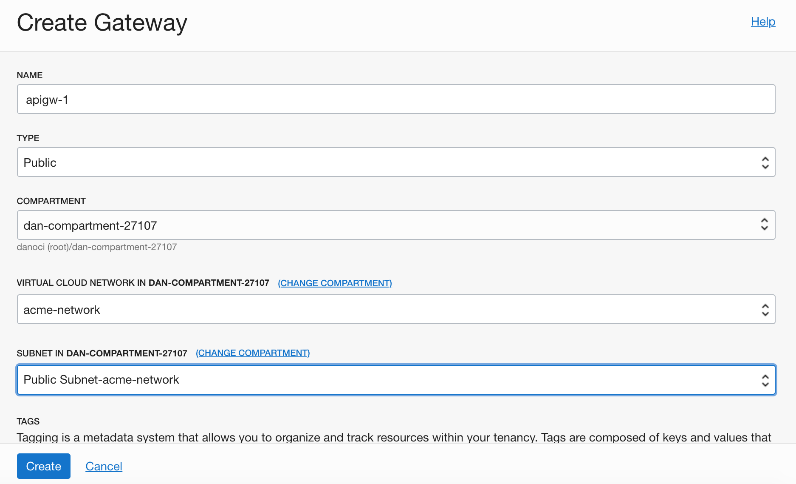

Oracle API Gateway가 OCI (Oracle Cloud Infrastructure) 버전으로 새롭게 출시되었다. 예전에 잠깐 다뤘던 Oracle API Platform Cloud 제품은 아직 그대로 서비스하고 있지만, 아마도 OCI에 맞춰서 새롭게 개발이 되고 있는 것 같다. 아직은 게이트웨이 기능만 제공하는데, 추후 관리/개발자 콘솔이나 Apiary와 같은 API 문서화 기능등이 추가될 것으로 보인다.

> 본 블로그의 모든 포스트는 **macOS** 환경에서 테스트 및 작성되었습니다.  

### Policy
API Gateway를 사용하기 위한 기본 Policy는 다음과 같다. 여기서는 간단히 dan-group-12476 이라는 그룹과 dan-compartment-12476 이라는 Compartment를 만들고 Policy를 추가했다. 이 외에 API Gateway에서 Function을 사용할 것이기 때문에 functions-family를 사용할 수 있도록 관련 Policy를 추가했다.

> Policy명: apigw-developers-manage-access
> Allow group dan-group-12476 to manage api-gateway-family in compartment dan-compartment-12476
> Allow group dan-group-12476 to manage virtual-network-family in compartment dan-compartment-12476
> Allow group dan-group-12476 to use functions-family in compartment dan-compartment-12476

Dynamic Group으로 API Gateway에서 Function을 사용하도록 구성하는 경우는 다음과 같이 Dynamic Group을 추가한 후
> Dynamic Group명: apigw-gateways-dyn-grp
> ALL {resource.type = 'ApiGateway', resource.compartment.id = 'ocid1.compartment.oc1..aaaaaaaafov7sichnuymoxmx34nclgckcxpsuthwnxvo7bh7w5hdufrzg2aa'}

이렇게 Policy를 추가해주면 된다.
> Allow dynamic-group apigw-gateways-dyn-grp to use functions-family in compartment dan-compartment-12476

### Function 배포
Function 배포는 아래 핸즈온 GitHub 문서를 참조한다.
https://github.com/MangDan/oracle-functions-graalvm-handson

### API Gateway 생성
OCI Console에 로그인 한 후 Developer Services > API Gateway > Create Gateway를 차례로 선택한다.

아래 스크린샷과 같이 입력/선택한 후 Create 버튼을 클릭한다.
> 먼저 VCN이 생성되어 있어야 한다.

### Deployment 추가
생성한 Gateway를 클릭한 후 Deployment를 클릭하여 추가한다.

API를 추가하는 방법은 제공되는 Form에서 추가하는 방법과 JSON으로 작성해서 추가하는 두 가지 방법이 있다. 여기선 Function을 제공되는 Form에서 추가하도록 한다.

* Name: HelloWorldFunctionAPI
* PATH Prefix: /hello

아직은 Policy가 몇개 안된다. Authentication, CORS, Rate Limiting 정도만 있다. CORS에 Allowed Origin 부분에 *를 추가한 CORS Policy를 추가했다.

Route는 여러개 추가할 수 있다. 각 Route에는 PATH, METHODS, TYPE을 추가한다. Type은 백엔드 서비스 유형인데 기본적으로 HTTP, Oracle Functions, Stock Response를 제공한다.

> Stock Response는 실제 Backend 서비스를 사용하는 것이 아니라 일종의 Dummy 형태의 Backend 서비스를 API Gateway에 등록하는 것이다. 간단한 테스트를 위해 Mock 서비스를 필요로 할 때 유용하다.

* PATH: /world
* METHODS: GET
* TYPE: Oracle Functions

### 생성 완료, Endpoint URL 확인
생성을 한 후에는 API Gateway Detail에서 Endpoint를 확인할 수 있다.

실제 호출할 경우 Deployment에서 추가한 Path Prefix와 Route에서의 Path를 URL에 붙여서 호출하면 된다.
Path Prefix가 해당 API의 상위 Path가 되고, 각 Route의 Path는 하위 Path가 되는 것이다.

### 호출

> URL 예시
> https://lnv4zip3622zhqhu4ojo23tkf4.apigateway.ap-seoul-1.oci.customer-oci.com/hello/world

***

아직은 기능이 많이 부족하다. Policy도 몇개 안되고, Backend 서비스도 OCI Native는 현재 Function만 제공한다. Oracle은 현재 API Gateway를 Alpine이라는 프로젝트명으로 개발을 진행중인데, 내용은 기존 Oracle API Platform에서 제공하는 기능들이 OCI로 옮겨가는 내용이 될 것으로 보인다. 물론 Gateway 엔진은 빠르게 배포될 수 있도록 [Grizzly](https://javaee.github.io/grizzly/)기반으로 변경되는 것으로 보이는데, 아직 확실한 것은 없다.