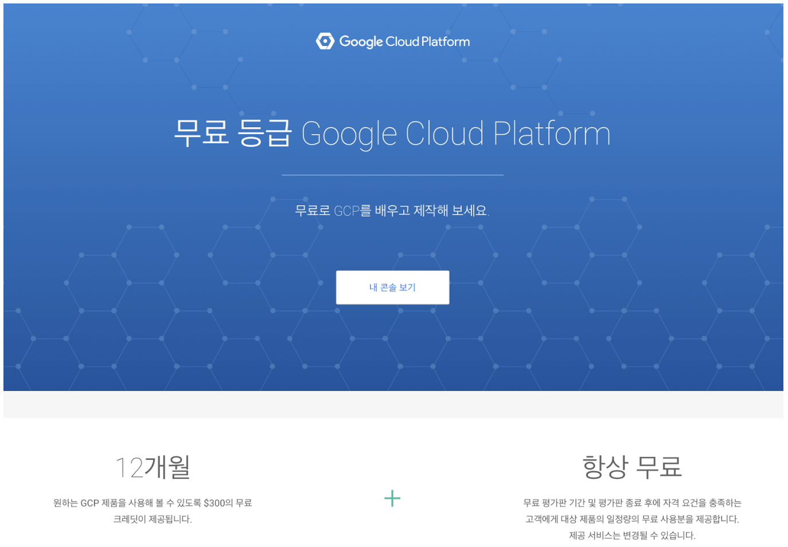

Google Cloud Platform (이하 GCP)는 두 가지 무료 정책이 있다. 간단히 소개한다.

> 본 블로그의 모든 포스트는 **macOS** 환경에서 테스트 및 작성되었습니다.  

### Free Tier 
기본적으로 Free Tier로 가입하면 $300 상당의 크레딧이 제공되며, 1년간 사용할 수 있다.  
몇가지 제한이 있는데 내용을 보면,

1. 동시에 8코어(or virtual CPUs)까지 사용 가능하고
2. VM에서 GPU를 사용할 수 없다.ㅏ
3. 용량을 늘리기 위한 SR을 신청할 수 없으며,
4. Windows VM 생성이 불가능 하다.

### Always Free Tier
Always Free는 기간이나 크레딧에 상관없이 지속적으로 무료 사용이 가능하지만, Free Tier보다는 좀 더 제약이 많다. Always Free Tier에서 사용 가능한 서비스와 제한 조건은 다음 페이지에서 확인 가능하다.
> https://cloud.google.com/free/docs/gcp-free-tier#always-free-usage-limits

가장 많이 사용되는 Compute의 경우 리전에 대한 제약이 있는데, US 리전(Oregon: us-west1, Iowa: us-central1, South Carolina: us-east1) 을 사용하는 경우 한달에 1개의 f1-micro Shape의 VM 인스턴스를 사용한다. 추가로 월 30GB HDD와 5GB의 스탭샷 스토리지를 제공한다. 스냅샷 스토리지의 경우 총 5개의 리전(Oregon: us-west1, Iowa: us-central1, South Carolina: us-east1, Taiwan: asia-east1, Belgium: europe-west1)에서만 사용할 수 있다. 그리고 North America에서 다른 모든 지역으로 나가는 트래픽은 1GB/월 까지 무상으로 제공한다. 위 페이지에서는 Google kubernetes Engine에 대해 클러스터 관리 수수료는 부과되지 않지만, 표준 Compute Engine 가격에 따라 요금이 청구된다고 되어 있는데, 아마도 Always Free Tier에서는 표준이 아닌 f1-micro만 사용할 수 있기 때문에 사용할 수 없을 것 같다. 이 부분은 확인한 후 다시 업데이트 하겠다. 이 외에도 Cloud Shell(5GB 스토리지), Cloud Vision, Cloud Run, App Engine, Functions등 다양한 서비스들을 Always Free tier로 사용할 수 있다는 점이 장점이다.