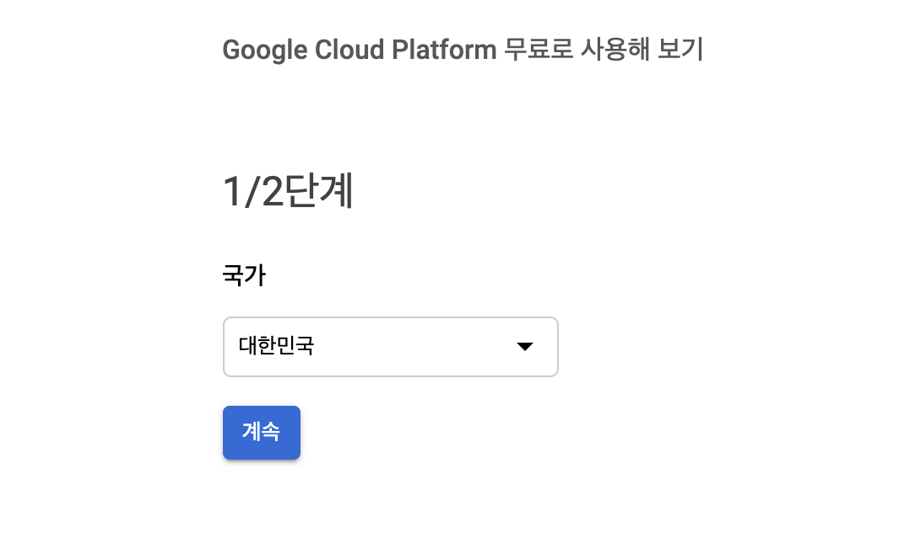
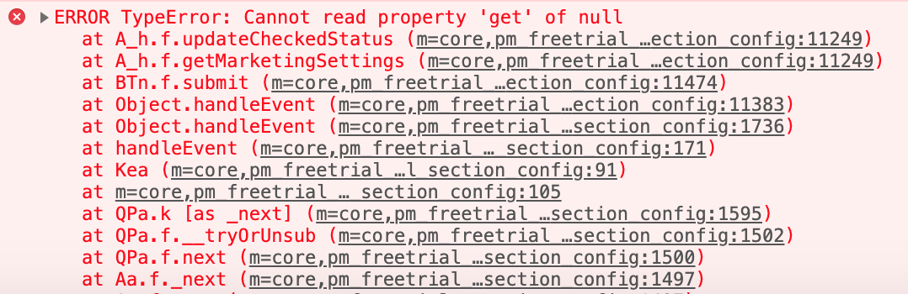
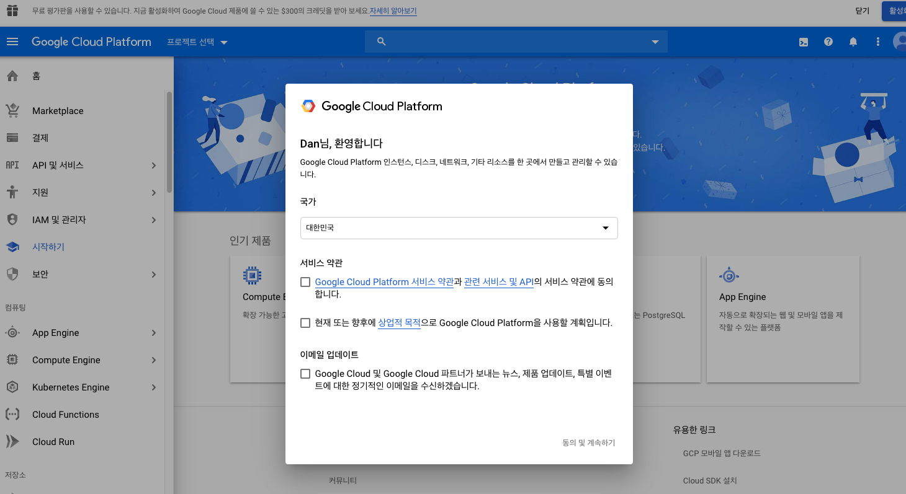
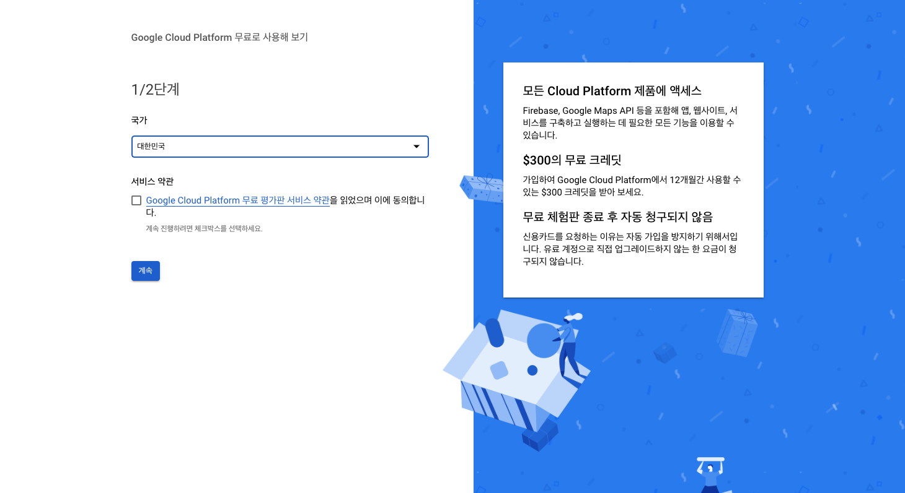

전 포스트에 이어서 마지막으로 EnvSearch(실습 환경 검색) Vue 컴포넌트와 JWT에 대해서 정리한다.

> 본 블로그의 모든 포스트는 **macOS** 환경에서 테스트 및 작성되었습니다.  

### GCP Free Tier 계정 생성
GCP Free Tier 계정을 생성하려면, 기본적으로 Google 계정이 필요하다. 문제는 구글에서 GCP Free Tier 생성을 위한 가입 페이지를 검색해서 가입을 하려고 하면, 가입을 위한 버튼이 눌러지지 않는 오류가 있다. 아래 계속 버튼이 클릭이 안된다.

크롬의 개발자 모드 콘솔에서 확인해보면 오류가 나는 것을 확인할 수 있다. updateCheckedStatus에서 오류인데, 아마 먼가 체킹하는 폼이 있어야 하는데 화면에 보이지 않는 이슈인것 같다. 이게 의도된 건지, 아니면 가입 페이지 오류인지

구글링을 해본 결과 별도의 가입 페이지가 있는 것을 확인했다. 주소는 다음과 같다. 
> https://cloud.google.com/gcp/getting-started/?hl=ko

여기서 동의 및 계속하기를 진행하고, 다음 페이지에서 계속 버튼을 클릭한다.

그럼 다음과 같이 서비스 약관 체크 버튼이 나오면서 진행할 수 있다. 아마 이 체크버튼이 정상적으로 들어가면 보이지 않는 것 같다.

### 참고 블로그
https://private-space.tistory.com/41