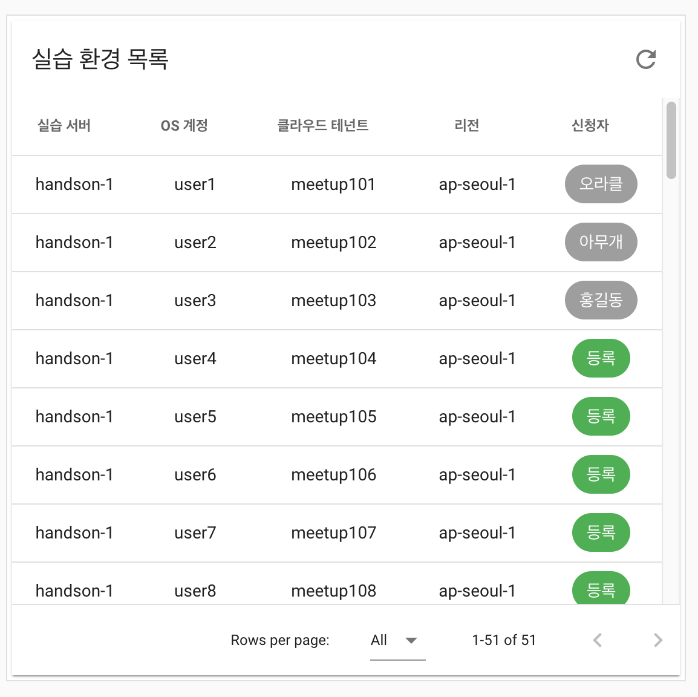
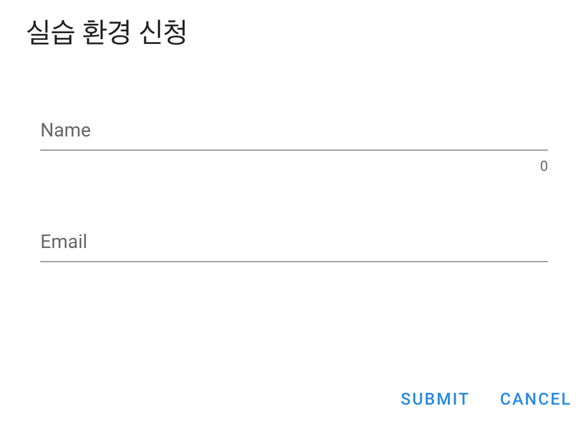
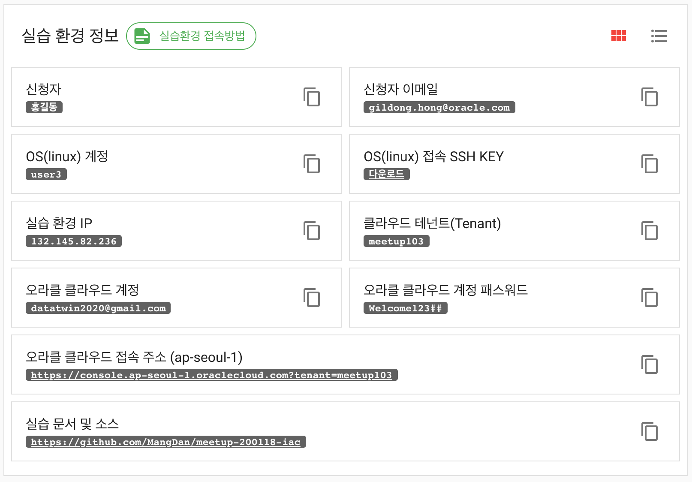
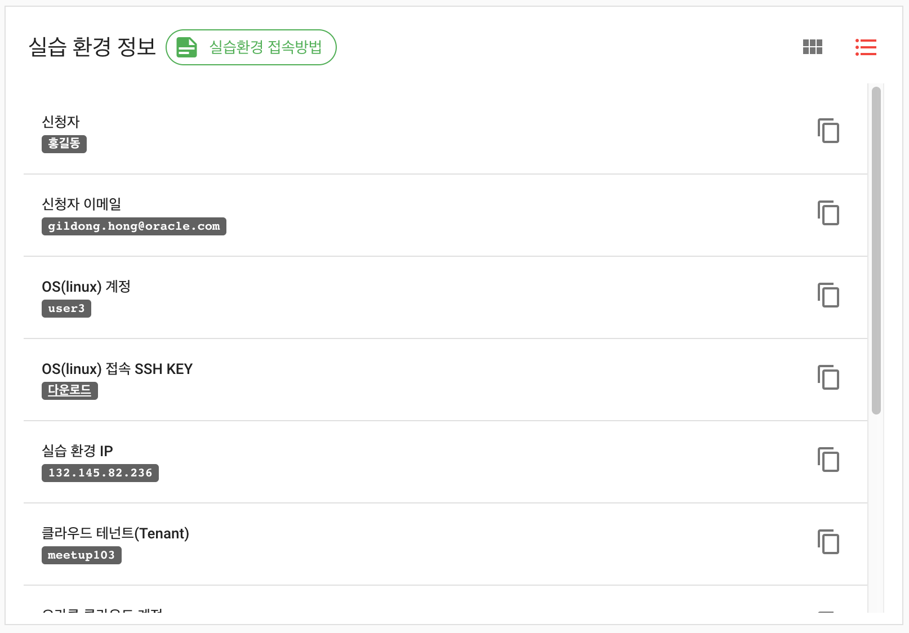

전 포스트에서는 Spring Boot + JPA + Oracle DB 조합으로 백엔드 서비스를 개발한 내용을 정리했다. 이번 포스팅은 프론트엔드를 Vue + Vuex + Vuetify 조합으로 개발한 내용을 정리한다.

> 본 블로그의 모든 포스트는 **macOS** 환경에서 테스트 및 작성되었습니다.  

### 소스 공유
소스는 다음 [깃헙 저장소](https://github.com/MangDan/meetup-handson-env)에서 확인할 수 있다.

### 개발 프레임워크, DB, 인증
* Frontend Framework: Vue + Vuetify + Vuex
* Backend Framework: Spring Boot + JPA
* Database: Oracle
* Security: JWT (Json Web Token)

### 프론트엔드 애플리케이션 설명
프론트엔드에서 보여줄 내용은 다음과 같다.
* 실습 환경 리스트
* 실습 환경 신청 폼
* 신청한 실습 환경 내용 조회
* 관리자 추가, 로그인, 토큰 갱신 (JWT 사용)
* 실습 환경 추가, 수정, 삭제 (관리자 기능)

### Vue.js
처음에 React.js로 시작해보려고 했는데, 구글링을 해보니 React.js에 비해 상대적으로 접근하기 쉽다고 해서 Vue.js로 선택했다. MVVM 패턴이나 가상 DOM, 컴포넌트, 라우팅, 상태관리등 React.js와 비슷한 부분이 많다고 하니, 나같은 초짜의 경우 먼저 Vue에 익숙해진후 React로 넘어가는 것이 낫다고 판단됐다. Vue는 MVVM 패턴이라고 해서 **View <-> ViewModel <-> Model** 형태의 구조를 띠며, View와 ViewModel간의 양방향 데이터 바인딩을 지원한다. Angular나 React와 비교해서 상대적으로 가벼운 것도 장점이다.

### Vuetify
구글의 Material Design을 채용한 Vue 기반의 UI 프레임워크다. 웬만한 웹사이트 개발을 위한 컴포넌트들을 다 갖췄으며, 가이드 및 예제 샘플등을 제공하고 있기 때문에 금방 활용할 수 있다.  
아래는 공식 홈페이지 주소다.

> https://vuetifyjs.com/

### Vuex
Vuex는 Vue.js 애플리케이션에 대한 상태 관리 패턴 + 라이브러리이며, 모든 컴포넌트에 대한 중앙 집중식 저장소 역할을 한다. 여러개의 컴포넌트(header, footer, list, detail 등)들로 구성이 되어 있을 때 서로의 상태 혹은 데이터를 주고 받기 위해 이벤트, 파라미터등올 전달하는 것은 관리도 어렵고, 문제가 발생했을 때 추적이 어렵다는 단점이 있는데, 이를 해결하기 위해 중앙에서 상태 혹은 데이터를 관리하기 위한 것이 Vuex라고 할 수 있다. 말이 좀 어려운 것 같은데, 모든 컴포넌트에서 접근이 가능한 글로벌 변수를 관리하는 라이브러리라고 생각하면 될 것 같다. 여기서는 토큰을 담고 관리하는 역할로 Vuex를 사용한다. 참고로 React에서의 상태관리 라이브러리는 Redux, Mobx등이 있다.

### 기타
기타 몇가지 라이브러리를 추가로 사용했는데, AJAX 통신을 위한 Axios, ES6를 지원하지 않는 구형 브라우저를 위해 ES6를 ES5 이하로 변환하기 위한 Babel, Javascript 코드의 에러를 탐지하기 위한 Linter로 ESLint를 추가했다.

> 린트(lint)는 소스 코드에 오류가 있는지를 찾아내주는 작업이며, 이러한 작업을 도와주는 도구를 린터(linter)라고 부른다. 보통 Javascript의 경우 더더욱 린터가 필요한데, 이유는 Javascript의 경우 컴파일 과정이 따로 없기 때문에 런타임 오류가 발생할 확률이 높기 때문이다. 

### 설치 및 구성
vue는 다음과 같이 npm으로 설치한다.
```shell
$ npm install -g @vue/cli
```

보통은 Vue의 Boilerplate를 가져다 사용하겠지만, 여기서는 직접 프로젝트를 생성했다. 아래와 같이 실행하면 meetup-handson-env-frontend 라는 이름의 Vue 프로젝트가 생성된다.
```shell
$ vue create meetup-handson-env-frontend
```

참고로 Boilerplate는 다음과 같이 init으로 생성한다. 아래는 webpack을 사용하는 프로젝트를 생성하는 예제이다.
```shell
$ vue init webpack project
```

이제 vuetify를 추가해보자. 생성한 프로젝트에서 아래와 같이 실행한다.
```shell
$ cd create meetup-handson-env-frontend
$ vue add vuetify
```

이젠 프로젝트에서 사용할 라우터를 설치하고 추가한다.
```shell
$ npm install --save vue-router
```

AJAX 통신을 위해 Axio도 추가한다.
```shell
$ npm install --save axios
```

ESLint는 개발 모드에서만 사용할 것이기 때문에 다음과 같이 devDependencies에 추가한다.
```shell
$ npm install --save-dev eslint eslint-plugin-vue@next
```

### Vue 프로젝트 및 소스 설명
```
.
├── Dockerfile
├── babel.config.js
├── package-lock.json
├── package.json
├── public
│   ├── assets
│   │   └── img
│   │       ├── mac_terminal_connect_guide.png
│   │       ├── oracle_logo1.png
│   │       ├── oracle_logo2.png
│   │       ├── oracle_logo3.png
│   │       └── putty_connect_guide.png
│   ├── index.html
├── src
│   ├── App.vue
│   ├── components
│   │   ├── EnvDetail.vue
│   │   ├── EnvList.vue
│   │   ├── EnvSearch.vue
│   │   ├── Footer.vue
│   │   ├── Header.vue
│   ├── main.js
│   ├── plugins
│   │   └── vuetify.js
│   ├── registerServiceWorker.js
│   ├── router
│   │   └── index.js
│   ├── store
│   │   └── index.js
│   └── views
│       ├── About.vue
│       └── Home.vue
└── vue.config.js
```

### App.vue
가장 먼저 볼 부분은 최상위 컴포넌트인 App.vue 파일이다. App.vue의 내용이 실제 index.html 의 ```<div id="app"/>``` 부분에 마운트된다. Header와 Footer를 컴포넌트로 분리했으며, 메인 페이지는 Router로 처리했다. Vue는 보통 파일의 확장자를 .vue로 하며, 하나의 vue파일안에 HTML (template 태그로 시작)과 스크립트(Javascript), 스타일(css)을 같이 포함한다. 라우터를 통해서 페이지 라우팅을 할 수 있는데, 파라미터를 넘길수도 있다. 여기서는 연습삼아 param이라는 파라미터를 라우터를 통해 넘겨받고, 이를 각 Header 컴포넌트와 Main 라우터로 넘겨봤다.

```vue
<template>
  <v-app>
    <Header :param="param" />
    <v-content height="auto">
      <router-view :param="param"></router-view>
    </v-content>
    <Footer />
  </v-app>
</template>

<script>
import Header from "./components/Header";
import Footer from "./components/Footer";

export default {
  name: "App",

  components: {
    Header,
    Footer
  },

  data() {
    return { param: "" };
  },
  mounted() {
    this.param = this.$route.params.param;
  }
};
</script>
```

### main.js
가장 먼저 실행되는 javascript로 Vue 인스턴스를 생성하는 역활을 한다. 실제 사용하는 라이브러리들을 import하며, axios와 EventBus, store에 대한 설정도 한다. Vue 컴포넌트를 index.html의 ```<div id="app"/>``` 부분에 마운트 하는 역할도 한다.
> EventBus는 각 컴포넌트간에 이벤트를 사용하여 데이터를 전달할 때 사용하기 위해 추가.

```javascript
import Vue from 'vue'
import App from './App.vue'
import router from './router'
import store from './store'
import vuetify from './plugins/vuetify'
import axios from 'axios'
import './registerServiceWorker'

axios.defaults.baseURL = 'http://localhost:8000'
axios.defaults.headers.post["Content-Type"] = "application/json";
axios.defaults.headers.get["Content-Type"] = "application/json";

const local = axios.create({
  baseURL: ''
});

Vue.prototype.$local = local;

Vue.config.productionTip = false;

Vue.prototype.$EventBus = new Vue();
Vue.prototype.$axios = axios;
Vue.prototype.$store = store;

new Vue({
  router,
  vuetify,
  render: h => h(App)
}).$mount('#app')
```

### router/index.js
SPA(Single Page Application)을 개발할 때 우선 고려해야 하는 부분이 라우터다. URI에 따라서 컴포넌트를 다시 렌더링(화면 전환)하는 것으로, 보통 네비게이션 메뉴에 따라서 화면이 전환될 때 사용한다. Vue에서는 공식적으로 vue-router를 사용한다. 아래는 주소가 **http://localhost:8080** 일 경우 **Home** 컴포넌트(Home.vue)로 이동하고, **http://localhost:8080/about** 일 경우는 **About** 컴포넌트(About.vue)로 이동한다. URI Path에 파라미터도 넘길 수 있는데 **http://localhost:8080/param1** 으로 호출하면 Home 컴포넌트로 param1이라는 값을 전달할 수 있다. 파라미터는 App.vue에서 mounted를 통해 값을 전달받고 이를 각 컴포넌트 혹은 라우터로 전달할 수 있다. (App.vue 참조)

```javascript
import Vue from 'vue'
import VueRouter from 'vue-router'
import Home from '../views/Home.vue'

Vue.use(VueRouter)

const routes = [{
    path: '/',
    name: 'home',
    component: Home
  }, {
    path: '/:param',
    name: 'home',
    component: Home
  },
  {
    path: '/about',
    name: 'about',
    // route level code-splitting
    // this generates a separate chunk (about.[hash].js) for this route
    // which is lazy-loaded when the route is visited.
    component: () => import( /* webpackChunkName: "about" */ '../views/About.vue')
  }
]

const router = new VueRouter({
  mode: 'history',
  base: process.env.BASE_URL,
  routes
})

export default router
```

### store/index.js
Vuex를 통해서 상태(데이터)관리를 위한 내용은 store 폴더안에 작성한다. Vuex는 state, getters, mutations, actions로 이뤄져 있는데 간단히 소개한다.

#### State
* 컴포넌트간 공유를 위한 데이터 속성을 의미하며, Vue 컴포넌트에서 접근 시 ***{{ $store.state.statevalue }}*** 와 같이 접근한다. 보통 메모리에 저장이 되기 때문에 페이지 리프레시가 되면 데이터가 사라진다. 토큰을 계속 들고 있어야 하므로, 여기서는 가져온 토큰을 sessionStorage에 담았다.

```json
state: {
    access_token: sessionStorage.getItem("access_token"),
    refresh_token: sessionStorage.getItem("refresh_token"),
    expires_in: "",
    claims: JSON.parse(sessionStorage.getItem("claims")),
    intervalId: null
  }
```

#### Getters
* 로직을 추가한 State를 가져오기 위해 사용, 보통 각 컴포넌트에서 computed(계산된 값) 형태로 사용될 수 있으나, Getters에 공통으로 적용하면, 실제 컴포넌트에서 사용할 때 간소화 해서 사용할 수 있다. getTokenExpiresIn이라는 getters를 사용하는데, 토큰의 남은 시간을 계산해서 결과를 반환한다.
getters는 ***{{ $store.getters.getTokenExpiresIn }}*** 와 같은 방법으로 접근한다.

```json
getters: {
    getTokenExpiresIn(state) {
      return (state.claims.exp - Math.floor(new Date().getTime() / 1000) < 0 ? "" : state.claims.exp - Math.floor(new Date().getTime() / 1000));
    },
    getIntervalId(state) {
      return state.intervalId;
    },
    getClaims(state) {
      return state.claims;
    }
  }
```

#### MapGetters
* Getters에서 ***{{ $store.getters.getTokenExpiresIn }}*** 와 같이 사용하는 부분을 간략히 하고자 할 때 사용한다. 각 Vue 컴포넌트에서 computed에 mapState를 아래와 같이 사용하면, 실제 접근 시 ***{{ getTokenExpiresIn }}*** 만으로도 접근할 수 있다.

```json
computed: {
    ...mapState(["getTokenExpiresIn"])
```

#### Mutations
* Getters가 State의 데이터를 조작해서 가져온다면, Mutations는 State의 값을 업데이트할 때 사용한다. mutations의 loginToken은 데이터를 받아서 Session Storage에 저장한 후 state값을 업데이트 한다.

```json
mutations: {
    loginToken(state, data) {
      sessionStorage.setItem("access_token", data.access_token);
      sessionStorage.setItem("refresh_token", data.refresh_token);

      state.access_token = data.access_token;
      state.refresh_token = data.refresh_token;
      state.expires_in = data.expires_in;
    },
    delToken(state) {
      sessionStorage.removeItem('access_token');
      sessionStorage.removeItem('refresh_token');
      sessionStorage.removeItem('claims');
      if (state.access_token)
        state.access_token = null;
      if (state.refresh_token)
        state.expires_in = null;
      if (state.claims)
        state.claims = null;
    },
    setAllClaims(state, claims) {
      state.claims = claims;
    },
    setJwtExpiresIn(state, expires_in) {
      state.expires_in = expires_in;
    },
    setIntervalId(state, intervalId) {
      state.intervalId = intervalId;
    }
  }
```

#### Actions
* Mutations는 동기식 처리만 가능하다. 그럼 비동기일 경우는? 예를 들면 AJAX로 REST 서비스를 호출한 후 그 결과를 state에 담고 싶다면 Actions를 사용해야 한다. 아래 getAllClaimsFromToken에서는 JWT의 Access Token의 Claims 정보를 가져오는 REST 서비스를 호출한 후 그 결과를 state에 업데이트 한다. 

```json
actions: {
    getAllClaimsFromToken(context, username) {
      axios({
          method: "post",
          url: "/api/auth/claims",
          data: {
            "username": username
          },
          headers: {
            "X-Authorization": "Bearer " + context.state.access_token,
            "Content-Type": "application/json"
          }
        })
        .then(result => {
          sessionStorage.setItem("claims", JSON.stringify(result.data));
          context.commit("setAllClaims", result.data);
          context.dispatch("setJwtExpiresIn");
        })
        .catch(error => {
          console.log(error);
        });
    },
    setJwtExpiresIn(context) {
      if (context.state.claims != null && context.state.claims.exp != undefined) {
        var intervalId = setInterval(() => {
          let expires_in = (context.state.claims.exp - Math.floor(new Date().getTime() / 1000) < 0 ? "" : context.state.claims.exp - Math.floor(new Date().getTime() / 1000));
          context.commit('setJwtExpiresIn', expires_in)
        }, 1000)

        context.commit("setIntervalId", intervalId);
      }

    },
    destroySetJwtExpiresInScheduler(context) {
      clearInterval(context.getters.getIntervalId);
    }
```

### Home.vue
이제 라우터에서 기본 URI (/)로 접근 시 최초 로딩되는 Home.vue 컴포넌트를 살펴본다. Home.vue의 내용은 단지 두 개의 컴포넌트를 두 개의 컬럼으로 분리해서 보여주는 간단한 레이아웃이다. EnvList와 EnvSearch라는 두 컴포넌트를 사용했는데, 컴포넌트 사용 방법은 컴포넌트를 Import 한 후, components에 등록하고, template에서 Tag로 사용하는 식으로 사용한다. 라우터에서 전달한 파라미터의 경우 컴포넌트에서 전달 받을때는 props를 사용한다.

```vue
<template>
  <v-container fluid>
    <v-row></v-row>
    <v-row>
      <!-- Environments -->
      <v-col xs="12" sm="12" md="12" lg="5" xl="5">
        <v-card class="mr-1 pa-1" outlined tile>
          <EnvList ref="envlist" :param="param" />
        </v-card>
      </v-col>
      <!-- Environment Detail -->
      <v-col xs="12" sm="12" md="12" lg="7" xl="7">
        <v-card class="mr-1 pa-1" outlined tile>
          <EnvSearch ref="envsearch" :param="param" />
        </v-card>
      </v-col>
    </v-row>
  </v-container>
</template>

<script>
import EnvList from "../components/EnvList";
import EnvSearch from "../components/EnvSearch";

export default {
  name: "home",
  props: ["param"],
  components: {
    EnvList,
    EnvSearch
  }
};
```

### EnvList.vue (실습 환경 목록)
이제 본격적으로 컴포넌트를 작성한다. 각 컴포넌트들은 모두 기본적으로 template 태그로 시작한다.
> 소스의 내용이 길어서 필요한 설명이 필요한 부분만 사용했다. 전체 소스는 GitHub 저장소에서 확인하면 된다.

#### 실습 환경 목록과 환경 신청 폼
EnvList 컴포넌트의 최종 결과 화면은 다음과 같다. 실습 환경 목록을 보여주는 테이블과 실습자가 실습 환경을 신청하는 폼(모달 팝업)이 포함된다.





#### EnvList > v-data-table
우선 목록을 보여주기 위해 Vuetify의 v-data-table을 사용했다. 속성에 **:** 가 있는 경우는 속성의 값에 data를 바인딩하거나, 삼항조건 연산(물음표 연산)등이 가능하다. 이름에서 알 수 있듯이 headers는 테이블의 헤더와 헤더에 매핑되는 값을 정의하고, envs에는 테이블에 보여줄 데이터, itemsPerPage는 한 페이지에 보여줄 목록의 수이다. 각 변수는 data에 정의가 될 것이다.

```html
<template>
  <v-data-table
    :headers="headers"
    :items="envs"
    :items-per-page="itemsPerPage"
    sort-by="calories"
    class="elevation-1"
    height="418px"
  >
```

#### EnvList > data
컴포넌트에서 사용하는 데이터를 담을 변수를 선언, Vue 객체가 내부적으로 사용하게 된다. data에 정의된 값에 접근할 때는 스크립트에서 접근할 때와 template(html)에서 접근하는 방식이 다르다.

* 스크립트에서 접근은 this를 사용한다.  

  ```
  this.errmsg1
  ```

* template에서 접근  

  ```
  {{ errmsg1 }}
  ```

headers 데이터는 v-data-table에서 사용하며, text는 컬럼명, value는 가져온 데이터 객체의 키 값(JSON 객체일 경우 JSON 객체의 키), align은 정렬을 의미한다. v-data-table에서 items에 envs를 사용하므로, 빈 envs를 배열로 선언해준다.

```javascript
data: () => ({
    dialog: false,
    alert: false,
    errmsg1: "",
    errmsg2: "",
    formTitle: "실습 환경 신청",
    formHasErrors: false,
    itemsPerPage: -1, //all
    headers: [
      { text: "실습 서버", value: "env_name", align: "center" },
      { text: "OS 계정", value: "osuser", align: "center" },
      { text: "클라우드 테넌트", value: "tenant", align: "center" },
      { text: "리전", value: "region", align: "center" },
      { text: "신청자", value: "username", align: "center" }
    ],
    envs: [],
    ....
  })
```

#### EnvList > created, mounted
Vue의 라이프사이클을 보면, 크게 Create, Mount, Update, Destroy로 구분되는데, Update와 Destroy는 화면에 그려진 돔(DOM)에 대한 업데이트와 Vue 인스턴스를 제거하는 과정과 연관이 있다. 여기서는 Create과 Mount를 사용했는데, Create이 가장 먼저 발생하며, data와 computed, methods, watch등이 활성화된 상태이지만, Template과 가상돔은 랜더링이 안된 상태를 의미한다. 하지만 Mount는 컴포넌트가 돔에 추가될 때 실행되며, 돔을 변경하고자 할 때 사용한다. 다른 컴포넌트에서 initialize라는 이벤트가 밸상하면 EnvList.Vue 컴포넌트에서 이를 initialize 함수를 호출한다. 예상할 수 있을텐데, 이 initialize 함수는 실습 환경 리스트를 JSON으로 가져오는 함수다.

```javascript
  mounted() {
    // When refresh button is clicked...
    this.$EventBus.$on(
      "initialize",
      function() {
        /* eslint-disable no-console */
        this.initialize();
      }.bind(this) // EventBus에서는 Event 안에 this는 자신이 된다. 따라서 바인딩할때 이와 같이 처리해줘야 한다.
    );
  },
  created() {
    this.initialize();
  },
```

#### EnvList > v-dialog, v-text-field
실습 환경 목록에서 실습자가 하나의 실습 환경을 사용하겠다고 신청하는 폼이다. Vuetify의 v-dialog를 사용하며 v-model은 data에 정의되어 있어야 한다. 여기서는 dialog라는 데이터를 선언했으며, boolean 타입으로 true 또는 false를 가진다. true일 경우 dialog가 오픈 되며, false일 경우 닫힌다. v-text-field는 text input 폼이다. ref는 해당 폼을 구분할 수 있는 유일한 값(id)이며, 입력된 데이터는 v-model에 담긴다. counter를 추가하면 텍스트를 입력할 때마다 글자수를 표기해준다. 

```html
<v-dialog v-model="dialog" max-width="500px">
          <v-card ref="form">
            <v-card-title>
              <span class="headline">{{ formTitle }}</span>
            </v-card-title>

            <v-card-text>
              <v-container>
                <v-row>
                  <v-col cols="12" sm="12" md="12">
                    <v-text-field
                      ref="username"
                      v-model="editedItem.username"
                      label="Name"
                      counter
                      :rules="[rules.required]"
                    ></v-text-field>
```

#### EnvList > Validation
Vue 자체적으로도 Validation을 위한 여러가지 방법이 있지만, Vuetify를 사용하면 data에 rules를 정의하여 Validation 규칙을 만들수 있다. 이렇게 만든 Rule을 :rules에서 사용하면 되는데, 여러개의 룰을 적용할 수도 있다.

```javascript
rules: {
      required: value => !!value || "Required.",
      counter: value => value.length <= 5 || "Max 5 characters",
      email: value => {
        const pattern = /^(([^<>()[\]\\.,;:\s@"]+(\.[^<>()[\]\\.,;:\s@"]+)*)|(".+"))@((\[[0-9]{1,3}\.[0-9]{1,3}\.[0-9]{1,3}\.[0-9]{1,3}])|(([a-zA-Z\-0-9]+\.)+[a-zA-Z]{2,}))$/;
        return pattern.test(value) || "Invalid e-mail.";
      }
```

Validate는 Submit 이벤트가 발생하면 다음과 같은 로직으로 Validate할 수 있다.
```javascript
Object.keys(this.form).forEach(f => {
    if (!this.form[f]) this.formHasErrors = true;

    //console.log(this.$refs[f]);
    this.$refs[f].validate(true);
});
```

#### EnvList > Methods
메소드는 데이터나 화면을 특정 이벤트에 따라 조작하기 위해 사용된다. 기본적으로 통신은 axios를 사용했다. 
REST 서비스는 전 포스팅에서 Spring Boot으로 만든 서비스를 이용했다. 

editItem 함수에서는 v-data-table의 각 로우 데이터를 클릭했을 때 로우 데이터를 item에 담아 넘겨준다. 그리고 이 정보를 editedItem에 사본을 복사한다. item에 username(신청자)가 있으면 환경 조회 컴포넌트 (EnvSearch.vue)로 이벤트를 전달하고, 그렇지 않으면 신청폼을 오픈한다.

assignUser 함수에서는 신청폼에서 사용자가 이름과 이메일을 입력후 제출을하면 해당 실습 환경에 할당(업데이트)한다. 여기서 Promise를 사용했는데, 해당 AJAX 호출한 결과를 받은 후 결과를 EnvSearch.vue 컴포넌트로 이벤트를 전달해서 신청한 환경 정보가 우측에 보이도록 구성하기 위해 사용했다. 콜백헬을 염두에 둔 코딩이라기 보다는 그냥 연습삼아 한번 사용해봤을 뿐이다.

```javascript
methods: {
    initialize() {
      this.$axios({
        method: "get",
        url: "/api/v1/meetup/envs?sort=num,asc",
        headers: { "Content-Type": "application/json" }
      })
        .then(result => {
          this.envs = result.data;
        })
        .catch(error => {
          console.log(error.response.data);
        });
    },
    getColor(assign) {
        ...
    },
    editItem(item) {
      this.alert = false;
      this.editedIndex = this.envs.indexOf(item);
      this.editedItem = Object.assign({}, item);    // 로우 아이템 사본 복사

      if (item.username != null) {
        /* eslint-disable no-console */
        this.$EventBus.$emit("goEnvForm", item);    //환경 상세 페이지로 이벤트 전달
      } else {
        this.dialog = true; // 신청폼 오픈
      }
    },
    deleteItem(item) {
        ...
    },
    close() {
        ...
    },
    submit() {
        ...
    },
    delete() {
        ...
    },
    assignUser() {
      return new Promise((resolve, reject) => {
        _this
          .$axios({
            method: "post",
            url: "/api/v1/meetup/env",
            data: data,
            headers: {
              "Content-Type": "application/json"
            }
          })
          .then(result => {
            resolve(result.data);
          })
          .catch(error => {
            reject(error);
          });
      });
    },
    searchEnv(data) {
        ...
    }
  }
```

### EnvDetail.vue (실습 환경 정보)
EnvList(실습 환경 목록)에서 신청한 정보를 우측 화면에 보여주는데, 이 부분을 처리하는 컴포넌트가 EnvSearch.vue(신청자와 아이디로 실습 환경 검색)다. EnvSearch 컴포넌트안에는 하위 컴포넌트로 EnvDetail을 포함하는데, EnvDetail은 EnvList에서 신청한 환경에 대한 상세 정보를 보여준다. EnvList에서 신청한 환경을 클릭하거나, 신규로 신청한 경우 바로 EnvDetail이 보이게 된다.





EnvSearch에서 EnvDetail을 보여주는 부분은 다음과 같다. 실제 EnvSearch에서 이벤트를 받으면 보여줄 실습 환경 정보를 가져온 후 showEnv를 true로 업데이트해서 EnvDetail 컴포넌트를 렌더링한다.

```html
<EnvDetail ref="envDetail" v-if="showEnv" />
```

#### EnvDetail > card type과 list type
화면에 보여주는 정보는 card 타입과 list 타입 두 가지 타입으로 보여주도록 했다. 이를 위해서 listTtype에 대한 분기를 v-if를 사용해서 처리하여 서로 다르게 보여주도록 구성했다.

```html
<v-container v-if="this.listType=='card'" fluid class="pt-0">
...

<v-container v-else-if="this.listType=='list'" fluid class="pt-0">
...
```

물론 card type이나 list type이냐를 선택하는 버튼은 SearchEnv.vue에 있으며 버튼을 클릭하면 EventBus를 타고 EnvDetail.vue로 오도록 구성했다.

```javascript
this.$EventBus.$on(
    "displayEnv",
    function(listType, data) {
    /* eslint-disable no-console */
    this.displayEnv(listType, data);
    }.bind(this) // EventBus에서는 Event 안에 this는 자신이 된다. 따라서 바인딩할때 이와 같이 처리해줘야 한다.
);
```

#### EnvDetail > data
EnvDetail에서 사용하는 data로, 여기서 살펴볼 내용은 env 객체와 listType 부분이다. listType은 화면에 보여줄 형태가 card 형이냐 list형이냐를 결정하며, env에는 보여줄 환경 정보를 담는다.

```javascript
data: () => ({
    tooltipShow: false,
    tooltipPositionX: 0,
    tooltipPositionY: 0,
    tooltipCloseDelay: 1000,
    notifications: false,
    sound: true,
    widgets: false,
    alert: false,
    errmsg: "",
    listType: "card",
    env: {
      num: 0,
      osuser: "",
      username: "",
      email: "",
      tenant: "",
      region: "",
      cloud_account: "",
      cloud_account_pw: "",
      handson_doc_url: "",
      key_download_url: "",
      env_ip: ""
    }
  }),
```

#### EnvDetail > mounted
mounted에는 EnvSearch에서 넘어오는 이벤트를 받는다. EnvSearch (실습 환경 검색) 컴포넌트에서 검색한 결과(실습 환경 정보)와 보여줄 형태(list, card)를 넘겨준다.

```javascript
mounted() {
    this.$EventBus.$on(
      "displayEnv",
      function(listType, data) {
        this.displayEnv(listType, data);
      }.bind(this) // EventBus에서는 Event 안에 this는 자신이 된다. 따라서 바인딩할때 이와 같이 처리해줘야 한다.
    );
  }
```

#### EnvDetail > methods
메소드의 내용은 특별한 것은 없다. displayEnv 메소드는 EnvSearch 컴포넌트에서 조회된 결과를 받아서 env data에 전달한다. copy 메소드가 있는데, 각 환경 정보를 쉽게 복사하기 위한 클립보드 복사 기능이다. 복사가 되면 copied라는 메시지와 함께 작은 툴팁이 보여진다.

```javascript
methods: {
    displayEnv(listType, data) {
      this.listType = listType;
      this.env = Object.assign({}, data);
    },
    copy(copyTxt, event) {
      let tempElem = document.createElement("textarea");
      tempElem.value = copyTxt;
      document.body.appendChild(tempElem);

      tempElem.select();
      document.execCommand("copy");
      document.body.removeChild(tempElem);

      if (this.tooltipShow == false) {
        this.tooltipShow = !this.tooltipShow;

        this.tooltipPositionX = event.clientX - 10;
        this.tooltipPositionY = event.clientY;

        setTimeout(
          function() {
            this.tooltipShow = !this.tooltipShow;
          }.bind(this),
          this.tooltipCloseDelay
        );
      }
    },
    openConnectGuideDialog() {
      this.dialog = true;
    }
  }
```

env data는 다음과 같이 Vuetify의 v-card와 v-list-item을 사용하여 화면에 바로 렌더링해준다.
```html
<v-card class="mx-auto" outlined tile>
    <v-list-item>
        <v-list-item-content>
        <v-list-item-title disabled>신청자</v-list-item-title>
        <v-list-item-subtitle>
            <kbd>{{env.username}}</kbd>
        </v-list-item-subtitle>
        </v-list-item-content>
        <v-list-item-icon>
        <v-btn icon @click="copy(env.username, $event)">
            <v-icon>mdi-content-copy</v-icon>
        </v-btn>
        </v-list-item-icon>
    </v-list-item>
</v-card>
```

작성하다보니, 내용이 길어져서 EnvSearch 컴포넌트와 JWT는 다음 포스트에서 다루겠다.

### 참고한 블로그
* https://medium.com/witinweb/vue-js-%EB%9D%BC%EC%9D%B4%ED%94%84%EC%82%AC%EC%9D%B4%ED%81%B4-%EC%9D%B4%ED%95%B4%ED%95%98%EA%B8%B0-7780cdd97dd4
* https://beomy.tistory.com/47
* https://joshua1988.github.io/web-development/vuejs/vuex-start/#vuex%EB%9E%80