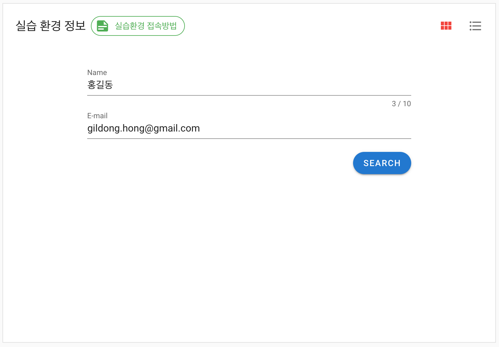

전 포스트에 이어서 마지막으로 EnvSearch(실습 환경 검색) Vue 컴포넌트와 JWT에 대해서 정리한다.

> 본 블로그의 모든 포스트는 **macOS** 환경에서 테스트 및 작성되었습니다.  

### 소스 공유
소스는 다음 [깃헙 저장소](https://github.com/MangDan/meetup-handson-env)에서 확인할 수 있다.

### EnvSearch.vue
EnvSearch 컴포넌트의 최종 결과 화면은 다음과 같다. 간단히 실습 환경을 사용하는 실습자가 자신이 신청한 실습 환경을 조회하는 화면이다. 신청자명과 이메일로 조회를 하며, 상단 **실습환경 접속방법** 버튼을 통해 간단히 실습 환경에 접속하는 가이드 팝업을 보여준다.

#### EnvSearch > v-chip, v-form, v-alert
Vuetify의 컴포넌트중 위 3개의 UI 컴포넌트를 추가로 사용했다. v-chip은 간단한 정보를 보여주는 작은 조각 같은 것으로, 버튼과 비슷하다. 여기선 버튼 대용으로 사용해봤다.

chips 예제

v-form은 입력 폼이다. 메소드에서 보겠지만, v-form을 사용하면, form validation을 할 때 코드를 단순화 할 수 있다.

v-alert는 폼에서 입력한 정보를 제출할 때 발생한 오류를 보여준다. 예를들면 조회한 정보가 없는 경우라던지, 벡엔드 서비스에 문제가 생긴 경우를 들수 있다.

작성중.....

### 참고한 블로그
* https://medium.com/witinweb/vue-js-%EB%9D%BC%EC%9D%B4%ED%94%84%EC%82%AC%EC%9D%B4%ED%81%B4-%EC%9D%B4%ED%95%B4%ED%95%98%EA%B8%B0-7780cdd97dd4
* https://beomy.tistory.com/47
* https://joshua1988.github.io/web-development/vuejs/vuex-start/#vuex%EB%9E%80