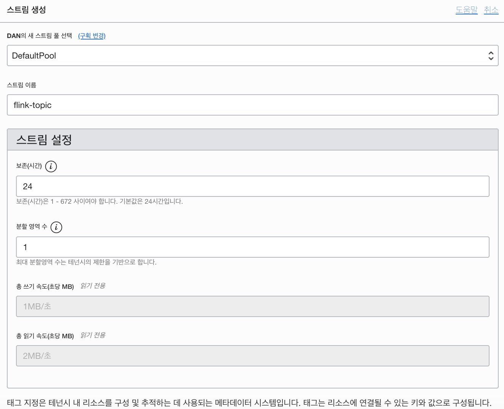
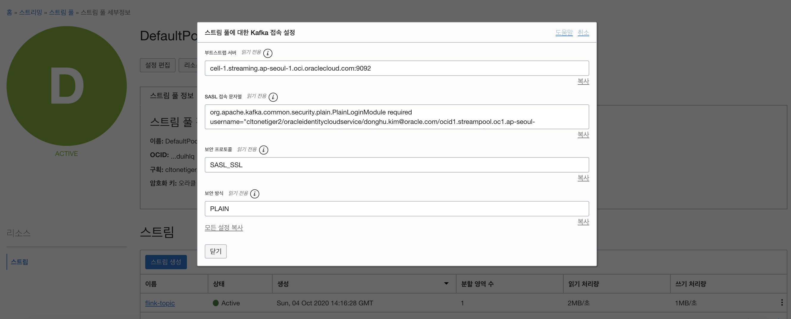
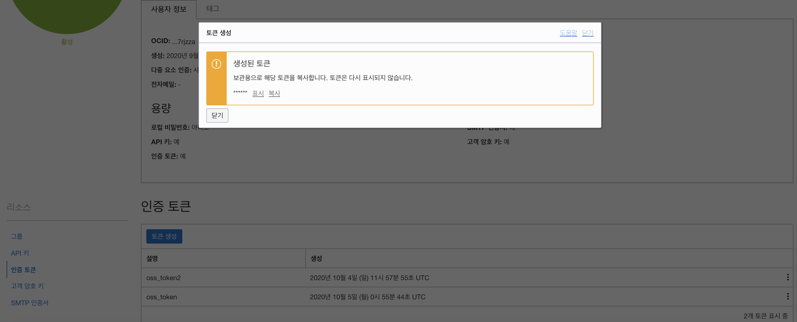
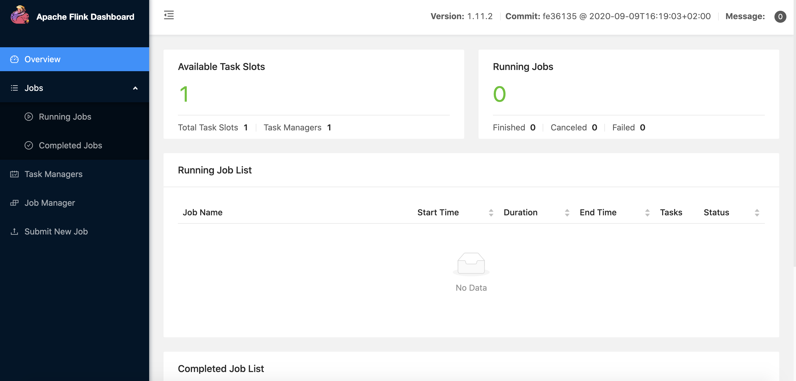
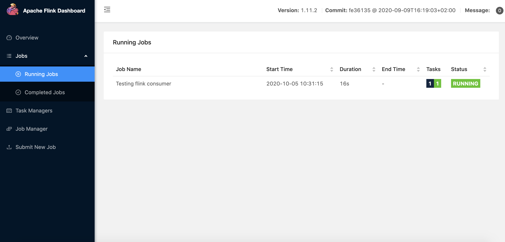
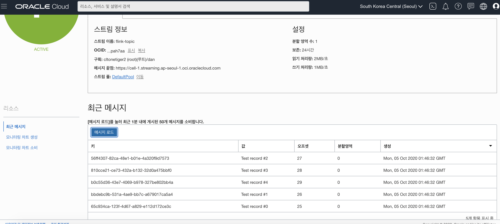
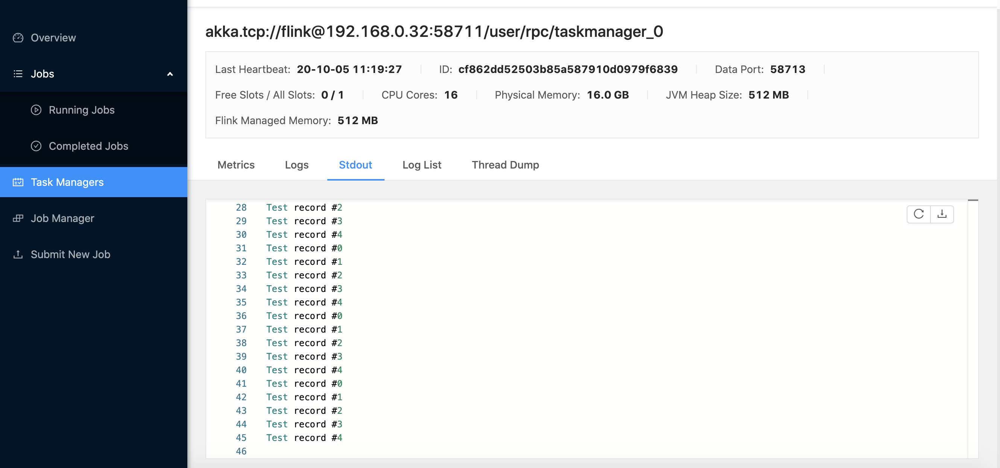

Oracle Cloud (이하 OCI)의 Streaming 서비스는 Apache Kafka API와 호환성을 제공하고 있다. 여기서는 Oracle Streaming Cloud Service (이하 OSS)와 함께 데이터 생산자(Producer)로 Kafka, 소비자(Consumer)로 Flink를 사용하는 방법을 정리했다.

> 본 블로그의 모든 포스트는 **macOS** 환경에서 테스트 및 작성되었습니다.  

### 소스 공유
소스는 다음 [깃헙 저장소](https://github.com/MangDan/oci-streaming-examples)에서 확인할 수 있다.

### OSS 스트림(토픽) 구성
우선 OCI에서 OSS 스트림을 사용할 수 있도록 구성하고 Kafka 관련 접속 정보를 얻어야 한다.

#### OSS 스트림(토픽) 생성
OSS에서 스트림 (토픽)을 생성하는 절차는 간단하다. OCI 콘솔에 접속한 후 아래 경로로 이동해서 생성할 수 있다.
> 좌측 햄버거 메뉴 > 분석 > 스트리밍 > 스트림 생성



#### 스트림풀 (스트림 그룹) 및 Kafka 접속 정보
스트림풀은 스트림의 그룹을 의미한다. 위에서 생성한 스트림에 별도의 스트림풀을 지정하지 않은 경우 기본 스트림풀 (DefaultPool)에 포함된다. 스트림풀을 보면 스트림풀에 접속을 위한 Kafka 설정을 포함하고 있다. 이 정보를 이용해서 Kafka 및 Flink 설정을 하게 된다.

* 부트 스트랩 서버: cell-1.streaming.{Region-Code}.oci.oraclecloud.com:9092  
* SASL 접속 문자열:
org.apache.kafka.common.security.plain.PlainLoginModule required username="{테넌시명}/{OCI 계정}/{스트림풀 OCID}" password="{AUTH_TOKEN}";  
* 보안 프로토콜: SASL_SSL  
* 보안 방식: PLAIN  



#### Auth Token 생성
Kafka 접속 정보에서 필요한 정보를 얻을 수 있지만, 자신의 계정과 연관된 AUTH_TOKEN은 만들어줘야 한다. 다음 순서로 토큰을 생성한다.

> 우측 상단 프로파일 > 계정 선택 > 인증 토큰 > 토큰 생성 > 복사


### Flink 환경 구성
Flink 환경을 구성하고 소비자(Consumer)를 작성하여 실행할 것이다. 여기서는 로컬 클러스터 환경으로 구성한다.

#### Flink 설치
설치는 아래 주소를 참고한다.
> https://ci.apache.org/projects/flink/flink-docs-release-1.9/getting-started/tutorials/local_setup.html

MacOS의 경우 다음과 같이 HomeBrew를 활용하면 쉽게 설치할 수 있다.
```
$ brew install apache-flink

$ flink --version
```

#### Flink 클러스터 실행
MacOS의 경우 HomeBrew로 설치할 경우 보통 **/usr/local/Cellar/apache-flink/{버전}**과 같은 위치에 설치된다. 정확한 경로 위치는 다음과 같이 brew info로 확인한다.

```
$ brew info apache-flink

apache-flink: stable 1.11.2, HEAD
Scalable batch and stream data processing
https://flink.apache.org/
/usr/local/Cellar/apache-flink/1.11.2 (174 files, 336MB) *
  Built from source on 2020-10-04 at 14:46:29
From: https://github.com/Homebrew/homebrew-core/blob/HEAD/Formula/apache-flink.rb
License: Apache-2.0
==> Requirements
Required: java = 1.8 ✔
==> Options
--HEAD
	Install HEAD version
==> Analytics
install: 713 (30 days), 2,253 (90 days), 13,079 (365 days)
install-on-request: 714 (30 days), 2,243 (90 days), 13,028 (365 days)
build-error: 0 (30 days)
```

설치는 다음과 같이 이동하여 실행한다.
```
$ cd /usr/local/Cellar/apache-flink/1.11.2/libexec/bin

$ ./start-cluster.sh
```

Flink에서 제공하는 관리 콘솔에 접속해 본다.
> http://localhost:8081



### Flink 소비자(Consumer)
Flink는 Java와 Scala를 통해 코드를 작성할 수 있다. 여기서는 메이븐 프로젝트와 Java를 활용하여 작성하였다.

#### Flink 소비자 작성
Flink는 최신 버전인 1.11.2 버전을 사용했다. 아래와 같이 Dependency와 Maven Plugin 설정을 한다.

pom.xml
```xml
<?xml version="1.0" encoding="UTF-8"?>
<project xmlns="http://maven.apache.org/POM/4.0.0" xmlns:xsi="http://www.w3.org/2001/XMLSchema-instance"
         xsi:schemaLocation="http://maven.apache.org/POM/4.0.0 http://maven.apache.org/maven-v4_0_0.xsd">
  <modelVersion>4.0.0</modelVersion>
  <groupId>com.example.app</groupId>
  <artifactId>oss-kafka-flink-consumer</artifactId>
  <packaging>jar</packaging>
  <version>1.0-SNAPSHOT</version>
  <properties>
    <project.build.sourceEncoding>UTF-8</project.build.sourceEncoding>
    <project.reporting.outputEncoding>UTF-8</project.reporting.outputEncoding>
    <flink.version>1.11.2</flink.version>
  </properties>
  <dependencies>
    <dependency>
      <groupId>org.apache.flink</groupId>
      <artifactId>flink-connector-kafka-0.11_2.11</artifactId>
      <version>${flink.version}</version>
    </dependency>
    <dependency>
      <groupId>org.apache.flink</groupId>
      <artifactId>flink-java</artifactId>
      <version>${flink.version}</version>
    </dependency>
    <dependency>
      <groupId>org.apache.flink</groupId>
      <artifactId>flink-streaming-java_2.11</artifactId>
      <version>${flink.version}</version>
    </dependency>
  </dependencies>
  <build>
		<plugins>
			<plugin>
				<groupId>org.apache.maven.plugins</groupId>
				<artifactId>maven-shade-plugin</artifactId>
				<version>3.2.4</version>
				<executions>
					<!-- Run shade goal on package phase -->
					<execution>
						<phase>package</phase>
						<goals>
							<goal>shade</goal>
						</goals>
						<configuration>
							<artifactSet>
								<excludes>
									<!-- This list contains all dependencies of flink-dist
									Everything else will be packaged into the fat-jar
									-->
									<exclude>org.apache.flink:flink-shaded-*</exclude>
									<exclude>org.apache.flink:flink-core</exclude>
									<exclude>org.apache.flink:flink-java</exclude>
									<exclude>org.apache.flink:flink-scala</exclude>
									<exclude>org.apache.flink:flink-runtime</exclude>
									<exclude>org.apache.flink:flink-optimizer</exclude>
									<exclude>org.apache.flink:flink-clients</exclude>
									<exclude>org.apache.flink:flink-avro</exclude>
									<exclude>org.apache.flink:flink-java-examples</exclude>
									<exclude>org.apache.flink:flink-scala-examples</exclude>
									<exclude>org.apache.flink:flink-streaming-examples</exclude>
									<exclude>org.apache.flink:flink-streaming-java</exclude>

									<!-- Also exclude very big transitive dependencies of Flink
									WARNING: You have to remove these excludes if your code relies on other
									versions of these dependencies.
									-->
									<exclude>org.scala-lang:scala-library</exclude>
									<exclude>org.scala-lang:scala-compiler</exclude>
									<exclude>org.scala-lang:scala-reflect</exclude>
									<exclude>com.amazonaws:aws-java-sdk</exclude>
									<exclude>com.typesafe.akka:akka-actor_*</exclude>
									<exclude>com.typesafe.akka:akka-remote_*</exclude>
									<exclude>com.typesafe.akka:akka-slf4j_*</exclude>
									<exclude>io.netty:netty-all</exclude>
									<exclude>io.netty:netty</exclude>
									<exclude>org.eclipse.jetty:jetty-server</exclude>
									<exclude>org.eclipse.jetty:jetty-continuation</exclude>
									<exclude>org.eclipse.jetty:jetty-http</exclude>
									<exclude>org.eclipse.jetty:jetty-io</exclude>
									<exclude>org.eclipse.jetty:jetty-util</exclude>
									<exclude>org.eclipse.jetty:jetty-security</exclude>
									<exclude>org.eclipse.jetty:jetty-servlet</exclude>
									<exclude>commons-fileupload:commons-fileupload</exclude>
									<exclude>org.apache.avro:avro</exclude>
									<exclude>commons-collections:commons-collections</exclude>
									<exclude>org.codehaus.jackson:jackson-core-asl</exclude>
									<exclude>org.codehaus.jackson:jackson-mapper-asl</exclude>
									<exclude>com.thoughtworks.paranamer:paranamer</exclude>
									<exclude>org.xerial.snappy:snappy-java</exclude>
									<exclude>org.apache.commons:commons-compress</exclude>
									<exclude>org.tukaani:xz</exclude>
									<exclude>com.esotericsoftware.kryo:kryo</exclude>
									<exclude>com.esotericsoftware.minlog:minlog</exclude>
									<exclude>org.objenesis:objenesis</exclude>
									<exclude>com.twitter:chill_*</exclude>
									<exclude>com.twitter:chill-java</exclude>
									<exclude>com.twitter:chill-avro_*</exclude>
									<exclude>com.twitter:chill-bijection_*</exclude>
									<exclude>com.twitter:bijection-core_*</exclude>
									<exclude>com.twitter:bijection-avro_*</exclude>
									<exclude>commons-lang:commons-lang</exclude>
									<exclude>junit:junit</exclude>
									<exclude>de.javakaffee:kryo-serializers</exclude>
									<exclude>joda-time:joda-time</exclude>
									<exclude>org.apache.commons:commons-lang3</exclude>
									<exclude>org.slf4j:slf4j-api</exclude>
									<exclude>org.slf4j:slf4j-log4j12</exclude>
									<exclude>log4j:log4j</exclude>
									<exclude>org.apache.commons:commons-math</exclude>
									<exclude>org.apache.sling:org.apache.sling.commons.json</exclude>
									<exclude>commons-logging:commons-logging</exclude>
									<exclude>org.apache.httpcomponents:httpclient</exclude>
									<exclude>org.apache.httpcomponents:httpcore</exclude>
									<exclude>commons-codec:commons-codec</exclude>
									<exclude>com.fasterxml.jackson.core:jackson-core</exclude>
									<exclude>com.fasterxml.jackson.core:jackson-databind</exclude>
									<exclude>com.fasterxml.jackson.core:jackson-annotations</exclude>
									<exclude>org.codehaus.jettison:jettison</exclude>
									<exclude>stax:stax-api</exclude>
									<exclude>com.typesafe:config</exclude>
									<exclude>org.uncommons.maths:uncommons-maths</exclude>
									<exclude>com.github.scopt:scopt_*</exclude>
									<exclude>org.mortbay.jetty:servlet-api</exclude>
									<exclude>commons-io:commons-io</exclude>
									<exclude>commons-cli:commons-cli</exclude>
								</excludes>
							</artifactSet>
							<filters>
								<filter>
									<artifact>org.apache.flink:*</artifact>
									<excludes>
										<exclude>org/apache/flink/shaded/**</exclude>
										<exclude>web-docs/**</exclude>
									</excludes>
								</filter>
								<filter>
									<!-- Do not copy the signatures in the META-INF folder.
									Otherwise, this might cause SecurityExceptions when using the JAR. -->
									<artifact>*:*</artifact>
									<excludes>
										<exclude>META-INF/*.SF</exclude>
										<exclude>META-INF/*.DSA</exclude>
										<exclude>META-INF/*.RSA</exclude>
									</excludes>
								</filter>
							</filters>
							<transformers>
								<!-- add Main-Class to manifest file -->
								<transformer implementation="org.apache.maven.plugins.shade.resource.ManifestResourceTransformer">
									<mainClass>com.example.app.FlinkTestConsumer</mainClass>
								</transformer>
							</transformers>
							<createDependencyReducedPom>false</createDependencyReducedPom>
						</configuration>
					</execution>
				</executions>
			</plugin>
			
			<!-- Configure the jar plugin to add the main class as a manifest entry -->
			<plugin>
				<groupId>org.apache.maven.plugins</groupId>
				<artifactId>maven-jar-plugin</artifactId>
				<version>2.5</version>
				<configuration>
					<archive>
						<manifestEntries>
							<Main-Class>com.example.app.FlinkTestConsumer</Main-Class>
						</manifestEntries>
					</archive>
				</configuration>
			</plugin>

			<plugin>
				<groupId>org.apache.maven.plugins</groupId>
				<artifactId>maven-compiler-plugin</artifactId>
				<version>3.8.1</version>
				<configuration>
					<release>8</release>
				</configuration>
			</plugin>
		</plugins>
	</build>
	<profiles>
		<profile>
			<!-- A profile that does everyting correctly:
			We set the Flink dependencies to provided -->
			<id>build-jar</id>
			<activation>
				<activeByDefault>false</activeByDefault>
			</activation>
			<dependencies>
				<dependency>
					<groupId>org.apache.flink</groupId>
					<artifactId>flink-java</artifactId>
					<version>${flink.version}</version>
					<scope>provided</scope>
				</dependency>
				<dependency>
					<groupId>org.apache.flink</groupId>
					<artifactId>flink-streaming-java</artifactId>
					<version>${flink.version}</version>
					<scope>provided</scope>
				</dependency>
				<dependency>
					<groupId>org.apache.flink</groupId>
					<artifactId>flink-clients</artifactId>
					<version>${flink.version}</version>
					<scope>provided</scope>
				</dependency>
			</dependencies>
		</profile>
	</profiles>
</project>
```

다음은 OSS 접속을 위한 설정 파일을 작성한다. OSS 스트림풀에서 확인한 Kafka 접속 정보를 활용한다.

consumer.config
```properties
bootstrap.servers=cell-1.streaming.ap-seoul-1.oci.oraclecloud.com:9092
group.id=FlinkExampleConsumer
request.timeout.ms=60000
sasl.mechanism=PLAIN
security.protocol=SASL_SSL
sasl.jaas.config=org.apache.kafka.common.security.plain.PlainLoginModule required username=\"{테넌시명}/{사용자 계정}/{스트림풀 OCID}\" password=\"{AUTH_TOKEN}\";
```

Java로 작성된 코드이며, FlinkKafkaConsumer로 스트림(토픽)으로 메시지를 수신하여 출력만 하는 역할을 하는 간단한 코드이다.

```Java
@SuppressWarnings("all")
public class FlinkTestConsumer {

    private static final String TOPIC = "flink-topic";
    private static final String FILE_PATH = "src/main/resources/consumer.config";

    public static void main(String... args) {
        try {
            //Load properties from config file
            Properties properties = new Properties();
            properties.load(new FileReader(FILE_PATH));
            
            final StreamExecutionEnvironment env = StreamExecutionEnvironment.getExecutionEnvironment();
            DataStream<String> stream = env.addSource(new FlinkKafkaConsumer011<String>(TOPIC, new SimpleStringSchema(), properties));
            stream.print();
            env.execute("Testing flink consumer");

        } catch(FileNotFoundException e){
            System.out.println("FileNoteFoundException: " + e);
        } catch (Exception e){
            System.out.println("Failed with exception " + e);
        }
    }
}
```

Flink 관련 코드는 아래 Github Repository를 통해서 확인할 수있다.
> https://github.com/MangDan/oci-streaming-examples/tree/main/kafka-flink/flink

#### 빌드 및 잡(Job) 실행
빌드
```
$ mvn package
```

잡(Job) 실행
```
$ flink run -c "com.example.app.FlinkTestConsumer" target/oss-kafka-flink-consumer-1.0-SNAPSHOT.jar 

Job has been submitted with JobID fe7e3abba870a537cf4f5a7961ae924e
```

잡(Job) 실행 확인 


### Kafka 생산자 (Producer)
Kafka 생산자는 Java로 작성됐다. 

#### Kafka 생산자 코드
Kafka Dependency 설정과 함께 Jar 실행 시 Kafka 관련 Library추가를 위한 Maven Plugin 구성을 한다.

pom.xml
```xml
<?xml version="1.0" encoding="UTF-8"?>
<project xmlns="http://maven.apache.org/POM/4.0.0" xmlns:xsi="http://www.w3.org/2001/XMLSchema-instance" xsi:schemaLocation="http://maven.apache.org/POM/4.0.0 http://maven.apache.org/maven-v4_0_0.xsd">
	<modelVersion>4.0.0</modelVersion>
	<groupId>com.example.app</groupId>
	<artifactId>oss-kafka-producer</artifactId>
	<packaging>jar</packaging>
	<version>1.0-SNAPSHOT</version>
	<properties>
		<project.build.sourceEncoding>UTF-8</project.build.sourceEncoding>
		<project.reporting.outputEncoding>UTF-8</project.reporting.outputEncoding>
		<kafka.version>2.6.0</kafka.version>
	</properties>

	<dependencies>
		<dependency>
			<groupId>org.apache.kafka</groupId>
			<artifactId>kafka-clients</artifactId>
			<version>${kafka.version}</version>
		</dependency>
		<dependency>
			<groupId>org.slf4j</groupId>
			<artifactId>slf4j-api</artifactId>
			<version>1.7.5</version>
		</dependency>
		<dependency>
			<groupId>ch.qos.logback</groupId>
			<artifactId>logback-classic</artifactId>
			<version>1.2.3</version>
		  </dependency>
		<dependency>
			<groupId>org.slf4j</groupId>
			<artifactId>slf4j-log4j12</artifactId>
			<version>1.7.5</version>
		</dependency>
		<dependency>
            <groupId>com.fasterxml.jackson.core</groupId>
            <artifactId>jackson-databind</artifactId>
            <version>2.11.3</version>
        </dependency> 
	</dependencies>
	<build>
		<defaultGoal>install</defaultGoal>
		<plugins>
			<plugin>
				<groupId>org.apache.maven.plugins</groupId>
				<artifactId>maven-compiler-plugin</artifactId>
				<version>3.8.1</version>
				<configuration>
					<release>8</release>
				</configuration>
			</plugin>
			<plugin>
				<groupId>org.apache.maven.plugins</groupId>
				<artifactId>maven-resources-plugin</artifactId>
				<version>3.2.0</version>
				<configuration>
					<encoding>UTF-8</encoding>
				</configuration>
			</plugin>
			<plugin>
                <groupId>org.apache.maven.plugins</groupId>
                <artifactId>maven-dependency-plugin</artifactId>
                <version>3.1.2</version>
                <executions>
                    <execution>
                        <id>copy-dependencies</id>
                        <phase>package</phase>
                        <goals>
                            <goal>copy-dependencies</goal>
                        </goals>
                        <configuration>
                            <outputDirectory>${project.build.directory}/libs</outputDirectory>
                            <overWriteReleases>false</overWriteReleases>
                            <overWriteSnapshots>false</overWriteSnapshots>
                            <overWriteIfNewer>true</overWriteIfNewer>
                            <includeScope>runtime</includeScope>
                        </configuration>
                    </execution>
                </executions>
            </plugin>
			<plugin>
				<groupId>org.apache.maven.plugins</groupId>
				<artifactId>maven-jar-plugin</artifactId>
				<version>2.5</version>
				<configuration>
					<archive>
						<manifest>
							<addClasspath>true</addClasspath>
							<addExtensions>true</addExtensions> 
							<mainClass>com.example.app.KafkaProducerExample</mainClass>
							<classpathPrefix>libs/</classpathPrefix>                            
						</manifest>
						<!-- <manifestEntries>
							<Class-Path>libs/kafka-clients-2.6.0.jar</Class-Path>
						</manifestEntries> -->
					</archive>
				</configuration>
			</plugin>
		</plugins>
	</build>
	<profiles>
		<profile>
			<!-- A profile that does everyting correctly:
			We set the Flink dependencies to provided -->
			<id>build-jar</id>
			<activation>
				<activeByDefault>false</activeByDefault>
			</activation>
			<dependencies>
				<dependency>
					<groupId>org.apache.kafka</groupId>
					<artifactId>kafka-clients</artifactId>
					<version>${kafka.version}</version>
					<scope>provided</scope>
				</dependency>
			</dependencies>
		</profile>
	</profiles>
</project>
```

실행 시 5건의 텍스트 메시지를 OSS로 전송한다.

```Java
@SuppressWarnings("all")
public class CompatibleProducer {

    public void produce() {
        String authToken = "{AUTH_TOKEN}";
        String tenancyName = "{테넌시명}";
        String username = "{사용자 계정}";
        String streamPoolId = "{스트림풀 OCID}";
        String topicName = "{스트림명/토픽명}";

        Properties properties = new Properties();
        properties.put(ProducerConfig.BOOTSTRAP_SERVERS_CONFIG, "cell-1.streaming.ap-seoul-1.oci.oraclecloud.com:9092");
        properties.put(ProducerConfig.KEY_SERIALIZER_CLASS_CONFIG, StringSerializer.class.getName());
        properties.put(ProducerConfig.VALUE_SERIALIZER_CLASS_CONFIG, StringSerializer.class.getName());
        properties.put(ProducerConfig.TRANSACTION_TIMEOUT_CONFIG, 5000);
        properties.put(ProducerConfig.DELIVERY_TIMEOUT_MS_CONFIG, 5000);
        properties.put(ProducerConfig.REQUEST_TIMEOUT_MS_CONFIG, 5000);
        properties.put("sasl.mechanism", "PLAIN");
        properties.put("security.protocol", "SASL_SSL");
        properties.put("sasl.jaas.config",
                        "org.apache.kafka.common.security.plain.PlainLoginModule required username=\""
                        + tenancyName + "/"
                        + username + "/"
                        + streamPoolId + "\" "
                        + "password=\""
                        + authToken + "\";"
        );
        properties.put("retries", 5); // retries on transient errors and load balancing disconnection
        properties.put("max.request.size", 1024 * 1024); // limit request size to 1MB

        KafkaProducer producer = new KafkaProducer(properties);
        
        for (int i = 0; i < 5; i++) {
            ProducerRecord record = new ProducerRecord(topicName, UUID.randomUUID().toString(), "Test record #" + i);
            
            producer.send(record, (md, ex) -> {
                if( ex != null ) {
                    ex.printStackTrace();
                }
                else {
                    System.out.println(
                            "Sent msg to "
                                    + md.partition()
                                    + " with offset "
                                    + md.offset()
                                    + " at "
                                    + md.timestamp()
                    );
                }
            });
        }
        producer.flush();
        producer.close();
        System.out.println("produced 5 messages");
    }

}
```

빌드
```
$ mvn package
```

실행
```
$ java -jar target/oss-kafka-producer-1.0-SNAPSHOT.jar

00:11 INFO  o.a.k.c.s.a.AbstractLogin - Successfully logged in.
00:11 INFO  o.a.kafka.common.utils.AppInfoParser - Kafka version: 2.6.0
00:11 INFO  o.a.kafka.common.utils.AppInfoParser - Kafka commitId: 62abe01bee039651
00:11 INFO  o.a.kafka.common.utils.AppInfoParser - Kafka startTimeMs: 1601824282658
00:11 INFO  org.apache.kafka.clients.Metadata - [Producer clientId=producer-1] Cluster ID: OSS
Sent msg to 0 with offset 15 at 1601824286584
Sent msg to 0 with offset 16 at 1601824286584
Sent msg to 0 with offset 17 at 1601824286584
Sent msg to 0 with offset 18 at 1601824286584
Sent msg to 0 with offset 19 at 1601824286584
00:11 INFO  o.a.k.clients.producer.KafkaProducer - [Producer clientId=producer-1] Closing the Kafka producer with timeoutMillis = 9223372036854775807 ms.
produced 5 messages
```

게시된 메시지 확인


Kafka 관련 코드는 아래 Github Repository를 통해서 확인할 수있다.
> https://github.com/MangDan/oci-streaming-examples/tree/main/kafka-flink/kafka/producer

### Flink Job Task 확인
Flink Console에서 Task Managers > Stdout으로 이동하여 소비한 메시지를 확인한다.



### 참고한 블로그
* https://blogs.oracle.com/developers/oracle-streaming-service-producer-consumer
* https://github.com/igfasouza/OSS_examples