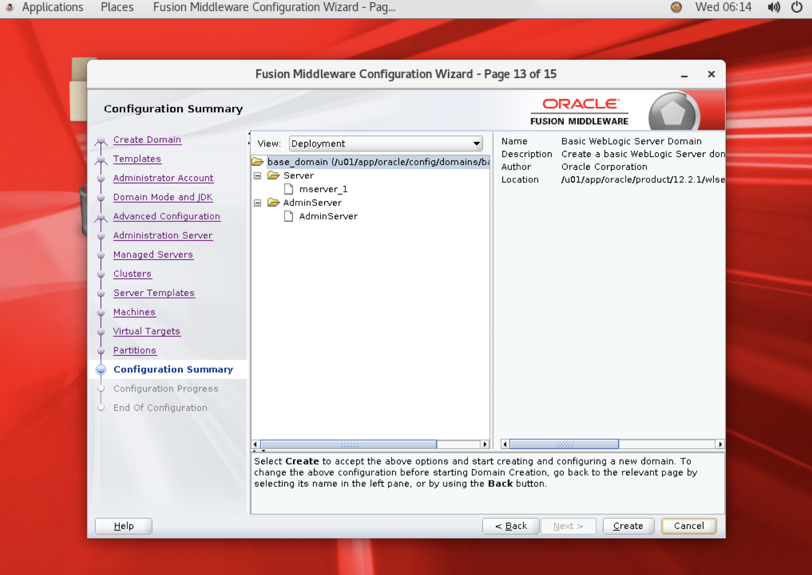

Oracle Cloud Infrastructure(이하 OCI)의 Compute Instance에 WebLogic 12c를 설치해본다.

> 본 블로그의 모든 포스트는 **macOS** 환경에서 테스트 및 작성되었습니다.  

### OCI Compute Instance
OCI Compute Instance를 미리 준비해야 한다. 여기서는 Oracle Linux 7에 VM.Standard.E2.2 Shape으로 생성했다.


### WebLogic, Java 준비
WebLogic은 12c (12.2.1.4)를 사용하고, JDK는 현재 12c에 호환되는 JDK 8로 준비한다.

#### 다운로드
WebLogic 12c (12.2.1.4)는 아래 링크를 통해 다운로드 받을 수 있다. Generic 버전으로 다운로드 받는다.

> https://www.oracle.com/kr/middleware/technologies/weblogic-server-downloads.html

아래 링크를 통해서 JDK8 (8u261)을 다운로드 한다.

> https://www.oracle.com/kr/java/technologies/javase/javase-jdk8-downloads.html

#### 서버에 업로드
업로드 할 디렉토리 생성
```
ssh -i ~/.ssh/id_rsa opc@{public-ip} mkdir -p /home/opc/install
```

설치 파일 업로드
```
$ scp -i ~/.ssh/id_rsa jdk-8u261-linux-i586.tar.gz opc@{public-ip}:/home/opc/install/

$ scp -i ~/.ssh/id_rsa fmw_12.2.1.4.0_wls_lite_Disk1_1of1.zip opc@{public-ip}:/home/opc/install/
```

### 설치 환경 준비
서버 OS에 WebLogic을 설치할 사용자 및 그룹을 생성한다. 그리고 설치를 위한 디렉토리 생성, 디렉토리와 업로드한 설치 파일에 대한 소유자 및 권한 변경, 압축 해제까지 진행한다.

#### OS 사용자 생성
우선 서버에 접속한다.
```
$ ssh -i ~/.ssh/id_rsa opc@{public-ip}
```

아래와 같이 user와 group을 생성한다. 
```
$ sudo groupadd -g 54321 oinstall
$ sudo useradd -u 54321 -g oinstall oracle
$ sudo passwd oracle
```

#### 설치 디렉토리 구성
설치할 디렉토리 구성은 다음과 같이 구성하고 소유자 및 권한을 지정한다. (디렉토리 구조는 설치자가 원하는데로 구성하면 되지만, 일반적으로 오라클 제품들은 루트에 u01 디렉토리를 생성하고 하위에 설치한다)
```
sudo mkdir -p /u01/app/oracle/product/12.2.1
sudo mkdir -p /u01/app/oracle/config/domains
sudo mkdir -p /u01/app/oracle/config/applications
sudo chown -R oracle:oinstall /u01
sudo chmod -R 775 /u01/
```

#### 설치 파일 소유자 변경
소유자가 opc 사용자로 되어 있는 설치 파일을 oracle 사용자로 변경한 후 oracle 사용자의 홈 디렉토리로 옮겨준다.
```
$ cd ~/install

$ sudo chown -R oracle:oinstall fmw_12.2.1.4.0_wls_lite_Disk1_1of1.zip
$ sudo chown -R oracle:oinstall jdk-8u261-linux-i586.tar.gz

$ sudo mkdir /home/oracle/install
$ sudo chown -R oracle:oinstall /home/oracle/install
$ sudo move fmw_12.2.1.4.0_wls_lite_Disk1_1of1.zip jdk-8u261-linux-i586.tar.gz /home/oracle/install
```

#### 환경 변수
oracle 사용자의 bash_profile에 아래 내용을 추가한다.

```
$ sudo su - oracle
$ vi ~/.bash_profile

# User specific environment and startup programs
export ORACLE_BASE=/u01/app/oracle
export ORACLE_HOME=$ORACLE_BASE/product/12.2.1
export MW_HOME=$ORACLE_HOME
export WLS_HOME=$MW_HOME/wlserver
export WL_HOME=$WLS_HOME
export DOMAIN_BASE=$ORACLE_BASE/config/domains
export DOMAIN_HOME=$DOMAIN_BASE/base_domain
export JAVA_HOME=/u01/app/oracle/jdk1.8.0_261

PATH=$PATH:$HOME/.local/bin:$HOME/bin:$JAVA_HOME/bin

export PATH
```

```
$ source ~/.bash_profile
```

#### 설치 파일 압축 해제
```
$ sudo su - oracle

$ cd install

$ unzip fmw_12.2.1.4.0_wls_lite_Disk1_1of1.zip
```

Java의 경우 JAVA HOME 폴더를 생성할 경로로 이동한 후 압축을 해제한다.
```
$ mv jdk-8u261-linux-i586.tar.gz /u01/app/oracle

$ cd /u01/app/oracle

$ tar -xvf /u01/app/oracle/jdk-8u261-linux-i586.tar.gz
```

#### Java bad ELF interpreter 이슈
Oracle Cloud에서 Compute 환경을 VM.Standard.E2 (AMD EPYC) Shpae을 사용하는 경우 java -version을 해보면 아래와 같은 오류가 발생할 것이다.
> -bash: /u01/app/oracle/jdk1.8.0_261/bin/java: /lib/ld-linux.so.2: bad ELF interpreter: No such file or directory

원래 Oracle Linux를 설치하면 glibc.x86_64 이 설치되어 있지만, AMD64 아키텍처인 경우 glibc.i686을 설치해줘야 한다.

```
# change to opc user
$ exit

$ sudo yum -y install glibc.i686
```

```
$ sudo su - oracle

$ java -version
java version "1.8.0_261"
Java(TM) SE Runtime Environment (build 1.8.0_261-b12)
Java HotSpot(TM) Server VM (build 25.261-b12, mixed mode)
```

### VNC 환경 구성
GUI 환경에서 WebLogic을 설치하기 위해 VNC 서버를 구성해 보겠다. 

#### Server with GUI Group 설치
OCI에 Oracle Linux 이미지로 
```
$ sudo yum update

$ sudo yum group install "Server with GUI"
```

#### VNC 서버 설치 및 구성
VNC 서버를 설치
```
# changed to opc user
# exit

# sudo yum install tigervnc-server -y
```

VNC 서버 패스워드 설정
```
$ vncpasswd

Password:
Verify:
Would you like to enter a view-only password (y/n)? n
A view-only password is not use
```

VNC 서버 서비스 파일 복제
```
$ sudo cp /lib/systemd/system/vncserver@.service /etc/systemd/system/vncserver@\:1.service
```

VNC 서버 서비스 파일 내용중 USER를 opc로 변경한다.
```
$ sudo vi /etc/systemd/system/vncserver@\:1.service
```

변경전
```
# Clean any existing files in /tmp/.X11-unix environment
ExecStartPre=/bin/sh -c '/usr/bin/vncserver -kill %i > /dev/null 2>&1 || :'
ExecStart=/usr/bin/vncserver_wrapper <USER> %i
ExecStop=/bin/sh -c '/usr/bin/vncserver -kill %i > /dev/null 2>&1 || :'
```

변경후
```
# Clean any existing files in /tmp/.X11-unix environment
ExecStartPre=/bin/sh -c '/usr/bin/vncserver -kill %i > /dev/null 2>&1 || :'
ExecStart=/usr/bin/vncserver_wrapper opc %i
ExecStop=/bin/sh -c '/usr/bin/vncserver -kill %i > /dev/null 2>&1 || :'
```

VNC 서버 시작 및 상태 확인
```
$ sudo systemctl daemon-reload
$ sudo systemctl enable vncserver@:1.service
$ sudo systemctl start vncserver@:1.service
$ sudo systemctl status vncserver@:1.service
```

방화벽에 추가 (5901 포트)
```
$ sudo firewall-cmd --zone=public --add-service=vnc-server --permanent

$ sudo firewall-cmd --reload
```

마지막으로 OCI의 Security List에 5901 포트를 추가한다.


#### VNC Viewer 설치 및 접속 확인
VNC Viewer는 아래 링크에서 다운로드 받을 수 있다.
>https://www.realvnc.com/en/connect/download/viewer/

MacOS의 경우 HomeBrew를 통해 쉽게 설치 가능하다.
```
$ brew cask install vnc-viewer 
```

VNC Viewer를 실행해서 아래와 같이 설정한다.


접속 확인


### 설치를 위한 X Windows 설정 및 추가 라이브러리 설치
설치를 위해서 oracle 사용자의 DISPLAY 설정이 필요하다. 먼저 root 사용자로 접속해서 다른 사용자도 일시적으로 X서버에 접속할 수 있도록 설정한다.

```
# change to root user
$ sudo bash

$ export DISPLAY=:1

$ xhost +
```

WebLogic Installer 실행
```
$ su - oracle

$ export DISPLAY=:1

$ $JAVA_HOME/bin/java -jar fmw_12.2.1.4.0_wls_lite_generic.jar
```

실행했을때 아래와 같은 오류가 발생할 수 있다.

> Exception in thread "main" java.lang.UnsatisfiedLinkError: /u01/app/oracle/jdk1.8.0_261/jre/lib/i386/libawt_xawt.so: libXext.so.6: cannot open shared object file: No such file or directory

위 오류는 libawt_xawt.so 라이브러리가 누락되어 발생하는 오류로 설치해주면 된다.
```
$ sudo yum install libawt_xawt.so -y
```

### WebLogic 설치
이제 WebLogic 설치를 진행한다.  
다시 oracle 유저로 변경 후 DISPLAY 설정 및 설치 파일을 실행한다.
```
$ su - oracle

$ export DISPLAY=:1

$ $JAVA_HOME/bin/java -jar fmw_12.2.1.4.0_wls_lite_generic.jar
```

#### Inventory Setup


#### Welcome
Next 클릭


#### Auto Updates
Skip Auto Updates 체크 후 Next


#### Installation Location
오라클 홈 경로는 처음에 지정한 /u01/app/oracle/product/12.2.1 로 지정한다.


#### Installation Type
WebLogic Server 선택 후 Next


#### Prerequisite Check
Warning이 뜨지만 무시하고 Next


#### Installation Summary
Install 버튼 클릭하여 설치 진행


#### Installation Complete
설치 완료, Finish 버튼 클릭


### WebLogic Domain 구성
설치가 완료되면 자동으로 WebLogic Domain을 구성하는 GUI가 열린다.

#### Create Domain
도메인 경로는 위에서 정한 경로로 변경하고 Next


#### Templates
도메인 생성 시 필요한 라이브러리들을 묶어놓은 템플릿을 선택할 수 있다. 여기서는 기본 템플릿만 선택하고 Next


#### Administrator Account
WebLogic 관리자 계정 및 패스워드 설정


#### Domain Mode and JDK
도메인 모드는 Development, JDK 위치는 위에서 설치한 위치로 되어 있는지 확인한다.


#### Advanced Configuration
Administration Server와 Topology 체크


#### Administration Server
Administration Server 이름 및 포트(Default 7001) (기본으로 진행)


#### Managed Server
Managed Server 추가를 위해서 Add 버튼 클릭 후 아래와 같이 이름 및 포트 설정 (Default 7003)


#### Clusters, Server Templates, Machines, Virtual Target, Partitions 구성은 모두 Skip

#### Configuration Summary
확인 후 Create 버튼 클릭하여 도메인 생성 작업 진행


#### End of Configuration
Next 후 Finish 클릭하여 도메인 생성 완료


### 서버 시작
서버는 Admin Server를 먼저 시작하고, Managed Server를 시작한다. 

먼저 Admin Server를 시작한다. 아래와 같이 RUNNING 메시지가 뜨면 정상이다.
```
$ cd $DOMAIN_HOME

$ startWebLogic.sh

<Notice> <WebLogicServer> <BEA-000365> <Server state changed to RUNNING.>
```

다음은 Managed Server를 시작한다. 새 터미널을 열고 다음과 같이 실행한다. WebLogic 관리자 및 패스워드 입력 프롬프트에서 입력해준다. 마찬가지로 아래와 같이 RUNNING 메시지가 뜨면 정상이다.
```
$ sudo su - oracle

$ cd $DOMAIN_HOME

$ bin/startManagedWebLogic.sh mserver_1

Enter username to boot WebLogic server:weblogic
Enter password to boot WebLogic server:

<Notice> <WebLogicServer> <BEA-000365> <Server state changed to RUNNING.>
```

### WebLogic Admin Console 접속
접속을 위해서 Linux Firewall에서 포트를 열어줘야 한다. 그리고 OCI Console 에서 Security List에 포트를 추가해준다.

#### Firewall에 포트 추가
터미널을 하나 더 열고 다음과 같이 포트를 추가한다.

```
$ sudo firewall-cmd --permanent --zone=public --add-port=7001/tcp

$ sudo firewall-cmd --permanent --zone=public --add-port=7003/tcp
```

물론 위와 같이 지정해서 할수도 있지만, 편의상 Firewall을 Disable해도 된다.
```
$ sudo systemctl stop firewalld.service
$ sudo systemctl disable firewalld.service
```

완료후 firewall 서비스를 재시작한다.
```
$ sudo systemctl restart firewalld
```

#### Security List 추가
OCI 콘솔에서 Security List에 오픈할 포트를 추가한다. 여기서는 WebLogic 서버에서 자주 사용되는 7000번대 포트를 모두 열도록 Range Port 설정을 했다 (7000-7999)


### WebLogic Admin Console 접속 확인
아래와 같은 형태의 URL로 접속해본다.

>http://{public-ip}:7001/console


### WebLogic Admin Console 서버 확인
WebLogic Admin Console에서 로그인한 후 환경 > 서버를 클릭하여 Admin Server와 Managed Server를 확인한다.


### 참고
* http://www.ludovicocaldara.net/dba/weblogic-in-oci/
* https://oracle-base.com/articles/12c/weblogic-installation-on-oracle-linux-6-and-7-1221
* https://www.youtube.com/watch?v=B6et8JZFylA