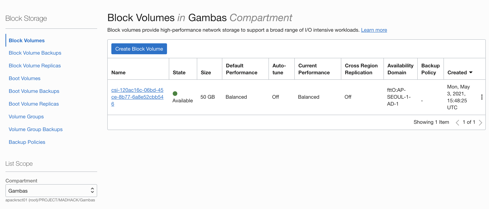
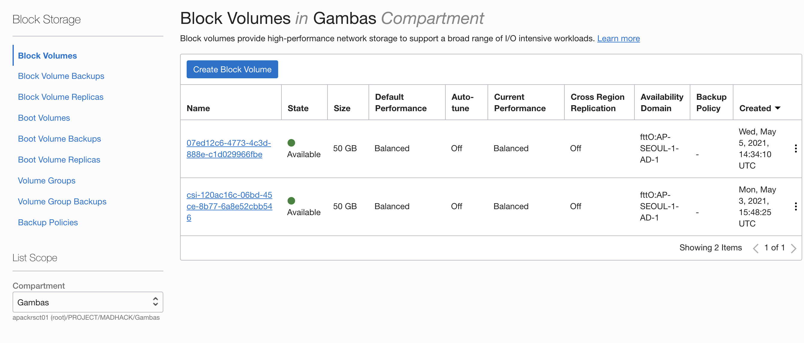
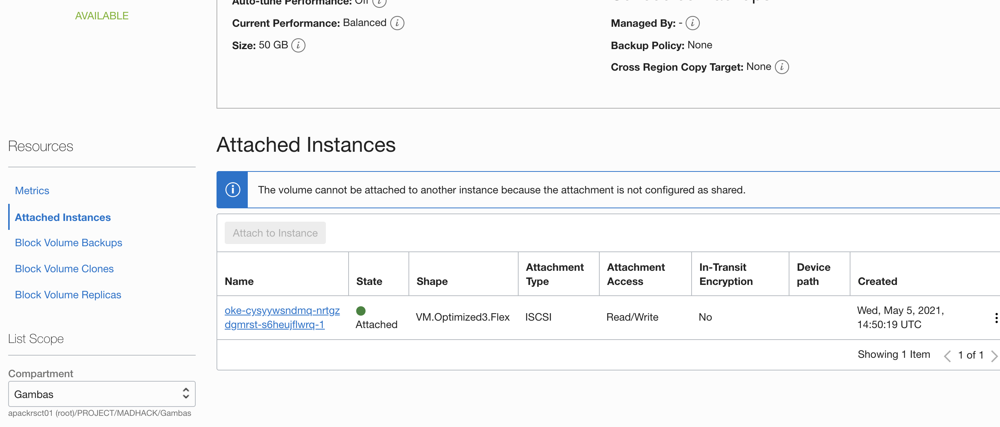

Oracle Cloud Infrastructure(이하 OCI)의 관리형 쿠버네티스 서비스인 Oracle Kubernetes Engine (이하 OKE)에서 OCI Block Volume Storage를 Persistent Volume으로 사용하는 방법을 정리했다.

> 본 블로그의 모든 포스트는 **macOS** 환경에서 테스트 및 작성되었습니다.  

### OCI OKE Volume Plugins
OKE Cluster에서 Block Volume Storage를 연결하기 위한 플러그인으로 CSI(Container Storage Interface) Volume Plugin과 FlexVolume Plugin을 지원하고 있다. 작년까지는 FlexVolume Plugin만 지원했지만 현재는 CSI Volume Plugin도 지원하고 있다.
FlexVolume Plugin은 CSI가 나오기 전의 out-of-tree volume plugin (플러그인 소스 코드를 쿠버네티스 레파지토리에 추가하지 않고도 Custom Plugin을 만들 수 있는 방식)이다. CSI는 메소스, 도커스웜등의 여러 컨테이너 오케스트레이션 커뮤니티들이 협력하여 스토리지 관리를 위한 공통 인터페이스이다. 쿠버네티스의 경우 1.3 이후부터 CSI를 지원하기 시작했다.

향후 관련된 새로운 기능들은 CSI Volume Plugin에만 추가될 예정이기 때문에, 가급적 CSI를 활용하도록 하자. (물론 K8S 개발자나 커뮤니티에서는 여전히 FlexVolume을 지원하겠지만...)

한 가지 더 차이가 있다면, CSI의 경우 Worker Node와 Block Volume Storage가 같은 리전의 같은 Availability Domain(AD)에 속해야 한다. FlexVolume Plugin의 경우 AD를 지정할 수 있다.  

아래는 FlexVolume에서 AD를 지정하기 위한 Annotation이다.
```
matchLabels:
  failure-domain.beta.kubernetes.io/zone: "US-ASHBURN-AD-1"
```

### OCI Storage Class
두 개의 Plugin을 사용할 수 있기 때문에 이를 위한 두 개의 Storage Class를 제공한다.

OKE에서 기본적으로 oci, oci-bv 두 개의 스토리지 클래스를 확인할 수 있다.
```
$ kubectl get storageClass

NAME            PROVISIONER                       RECLAIMPOLICY   VOLUMEBINDINGMODE      ALLOWVOLUMEEXPANSION   AGE
oci (default)   oracle.com/oci                    Delete          Immediate              false                  2d
oci-bv          blockvolume.csi.oraclecloud.com   Delete          WaitForFirstConsumer   false                  2d
```

Persistent Volume Claim에서 사용할 Volume Plugin을 정의할 때 아래와 같이 Storage Class 이름을 지정하면 된다.

* CSI Volume Plugin을 사용할 경우의 Storage Class 이름: "oci-bv"
* Flex Volume Plugin을 사용할 경우의 Storage Class: "oci"

### 예시 1: CSI Volume Plugin을 사용하여 Block Volume을 Persistent Volume으로 동적 생성하기

먼저 Persistent Volume Claim 아래와 같이 정의한 후 생성한다. CSI Volume Plugin을 사용할 것이므로 StorageClassName은 oci-bv이고, ReadWriteOne의 50기가짜리 Block Volume을 요청한다.

***csi-bvs-pvc.yaml***
```
apiVersion: v1
kind: PersistentVolumeClaim
metadata:
  name: mynginxclaim
spec:
  storageClassName: "oci-bv"
  accessModes:
    - ReadWriteOnce
  resources:
    requests:
      storage: 50Gi
```

***PVC 생성***
```
$ kubectl create -f  csi-bvs-pvc.yaml
```

***PVC 생성 확인***
```
$ kubectl get pvc

NAME           STATUS        VOLUME                                     CAPACITY   ACCESS MODES   STORAGECLASS   AGE
mynginxclaim   Pending   csi-120ac16c-06bd-45ce-8b77-6a8e52cbb546   50Gi       RWO            oci-bv         4m
```

PVC의 상태를 보면 Pending인 것을 알 수 있는데, "oci-bv" Storage Class 정의를 보면 VolumeBidingMode가 기본값이 WaitForFirstConsumer로 되어 있기 때문이다. 특정 파드에서 PVC를 통해 처음 생성한 PV를 생성하게 되면 상태가 변경된다.

이제 PVC를 사용하여 Pod에서 Volume을 생성한 후 Binding한다.

***nginx-pod.yaml***
```
apiVersion: v1
kind: Pod
metadata:
  name: nginx
spec:
  containers:
    - name: nginx
      image: nginx:latest
      ports:
        - name: http
          containerPort: 80
      volumeMounts:
        - name: data
          mountPath: /usr/share/nginx/html
  volumes:
    - name: data
      persistentVolumeClaim:
        claimName: mynginxclaim
```

***Pod 생성***
```
$ kubectl create -f nginx-pod.yaml
```

***PVC 확인***  
STATUS가 Bound 상태로 변했다.
```
$ kubectl get pvc

NAME               STATUS    VOLUME                               CAPACITY   ACCESSMODES   STORAGECLASS   AGE
mynginxclaim       Bound     csi-120ac16c-06bd-45ce-8b77-6a8e52cbb546     50Gi       RWO           oci-bv         4m
```

OCI Console에서 Block Volume이 하나 생선된 것을 확인할 수 있다.


Attached Instance 목록에 Attached Worker Node를 확인할 수 있다.


### 예시 2: FlexVolume Volume Plugin을 사용하여 Block Volume을 Persistent Volume으로 동적 생성하기

이번에는 FlexVolume Volume Plugin을 사용한다. 마찬가지로 아래와 같이 pvc를 정의한다.  
특이점은 matchLables에 특정 리전과 AD를 지정할 수 있다는 점이다.

***fv-bvs-pvc.yaml***
```
apiVersion: v1
kind: PersistentVolumeClaim
metadata:
  name: mynginxclaim-fv
  namespace: myns
spec:
  storageClassName: "oci"
  selector:
    matchLabels:
      failure-domain.beta.kubernetes.io/zone: "AP-SEOUL-1-AD-1"
  accessModes:
    - ReadWriteOnce
  resources:
    requests:
      storage: 50Gi
```

***PVC 생성***
```
$ kubectl create -f  fv-bvs-pvc.yaml
```

***PVC 생성 확인***
```
$ kubectl get pvc
NAME               STATUS    VOLUME                               CAPACITY   ACCESSMODES   STORAGECLASS   AGE
mynginxclaim-fv   Bound         ocid1.volume.oc1.ap-seoul-1.abuwgljrqc4ijjkk2grbbmbfy6o3oxu3i4kerzpe3z3vskq4wrm2ieqdteka   50Gi       RWO            oci            19s
```

PVC의 상태를 보면 Bound인 것을 알 수 있는데, "oci-bv" Storage Class 정의를 보면 VolumeBidingMode가 기본값이 Immediate 되어 있기 때문이다. 

이제 PVC를 사용하여 Pod에서 Volume을 생성한 후 Binding한다.

***nginx-pod-fv.yaml***
```
apiVersion: v1
kind: Pod
metadata:
  name: nginx-fv
spec:
  containers:
    - name: nginx
      image: nginx:latest
      ports:
        - name: http
          containerPort: 80
      volumeMounts:
        - name: data
          mountPath: /usr/share/nginx/html
  volumes:
    - name: data
      persistentVolumeClaim:
        claimName: mynginxclaim-fv
```

***Pod 생성***
```
$ kubectl create -f nginx-pod-fv.yaml
```

마찬가지로 OCI Console에서 Block Volume이 하나 생선된 것을 확인할 수 있다.


Attached Instance 목록에 Attached Worker Node를 확인할 수 있다.



### 예시 3: FlexVolume Volume Plugin을 사용하여 Block Volume Backup을 통해 Persistent Volume 생성하기

미리 생성한 Block Volume 백업본을 통해 Persistent Volume을 생성할 수 있다. 이 경우에는 미리 생성한 Backup에 대한 OCID (OCI 콘솔에서 확인 가능)를 이용하여 PVC를 생성한 후 해당 PVC를 활용하여 Pod와 같은 Kubernetes의 Object에서 사용하면 된다.

여기서는 간단히 PVC를 생성하는 부분만 예시로 보여준다. 사용하는 것은 위와 동일하다.

Annotation에 보면 **volume.beta.kubernetes.io/oci-volume-source** 부분이 있는데, 이 부분에 Backup OCID를 지정해주면 된다.

***flex-pvcfrombackup.yaml***

```
kind: PersistentVolumeClaim
apiVersion: v1
metadata:
  name: myvolume
  annotations:
    volume.beta.kubernetes.io/oci-volume-source: ocid1.volumebackup.oc1.iad.abuw...
spec:
  selector:
    matchLabels:
      failure-domain.beta.kubernetes.io/zone: US-SEOUL-1-AD-1
  accessModes:
    - ReadWriteOnce
  resources:
    requests:
      storage: 50Gi
```

### 참고
* https://docs.oracle.com/en-us/iaas/Content/ContEng/Tasks/contengcreatingpersistentvolumeclaim.htm
* https://blog.his21.co.kr/522
* https://docs.oracle.com/en-us/iaas/releasenotes/changes/99628398-0926-4fd6-9bfa-06e448278c14/
* https://kubernetes.io/ko/docs/concepts/storage/_print/
* https://kubernetes.io/ko/docs/concepts/storage/persistent-volumes/