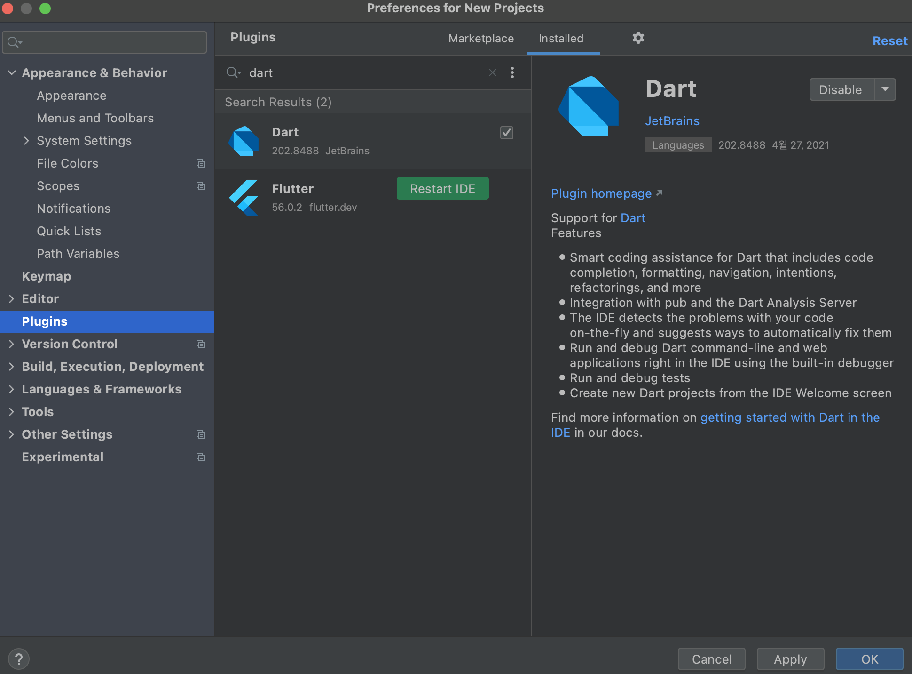
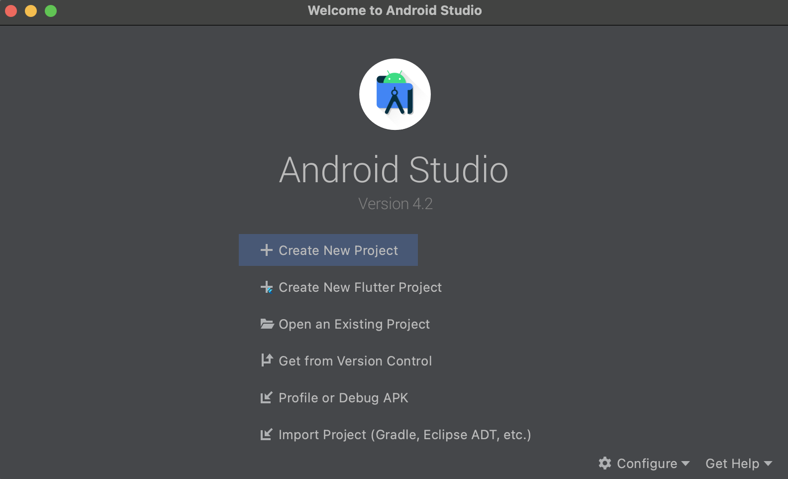

Hybrid Mobile App Framework인 Google의 최신 Flutter SDK를 설치해본다.

> 본 블로그의 모든 포스트는 **macOS** 환경에서 테스트 및 작성되었습니다.  

### Flutter SDK 다운로드 및 설치
아래 URL에 접속한 후 본인의 운영체제에 맞는 최신 Stable 버전으로 다운로드한다.

> https://flutter.dev/docs/development/tools/sdk/releases?tab=macos

다운로드 받은 zip 파일을 설치할 폴더로 이동 후 압축해제
```
$ mv flutter_macos_2.0.6-stable.zip ~/Software/sdks

$ unzip flutter_macos_2.0.6-stable.zip
```

Flutter HOME 설정 및 Path를 추가한다. 필자의 경우 zsh를 사용하고 있어서 .zshrc에 환경 변수 및 Path에 추가했다.

```
$ vi ~/.zshrc

FLUTTER_HOME="$HOME/Software/sdks/flutter"
export PATH=$HOME/bin:$JAVA_HOME/bin:$HOME/.jenv/bin:$FLUTTER_HOME/bin:$PATH
```

필요한 경우 플랫폼 별 개발 바이너리를 다운로드 받는데, 어떤 경우는 미리 iOS나 Android 바이너리들이 실행되기 전에 다운로드 받아야 하는 경우가 있기 때문에 아래와 같은 명령어로 미리 다운로드 받는다.

```
$ flutter precache
```

아직 설치 안된 의존성이 있는지 체크하기 위해서 아래 명령어를 실행하여 누락된 의존성이 있는지 확인한다. 만약 존재하면 설치 후 다시 아래 명령어를 실행하여 다시 확인한다.

```
$ flutter doctor                   
Doctor summary (to see all details, run flutter doctor -v):
[✓] Flutter (Channel stable, 2.0.6, on macOS 11.2.2 20D80 darwin-x64, locale ko-KR)
[!] Android toolchain - develop for Android devices (Android SDK version 29.0.3)
    ✗ Android license status unknown.
      Run `flutter doctor --android-licenses` to accept the SDK licenses.
      See https://flutter.dev/docs/get-started/install/macos#android-setup for more details.
[!] Xcode - develop for iOS and macOS
    ✗ CocoaPods not installed.
        CocoaPods is used to retrieve the iOS and macOS platform side's plugin code that responds to your plugin usage on the Dart
        side.
        Without CocoaPods, plugins will not work on iOS or macOS.
        For more info, see https://flutter.dev/platform-plugins
      To install see https://guides.cocoapods.org/using/getting-started.html#installation for instructions.
[✓] Chrome - develop for the web
[✓] Android Studio (version 4.2)
[✓] VS Code (version 1.56.0)
[✓] Connected device (1 available)

! Doctor found issues in 2 categories.
```

필자의 경우 두 건의 이슈가 발견되었다. 우선 Android SDK License를 허용해줘야 하는데, "flutter doctor --android-licenses" 명령어 실행 후 모두 Accept 해주면 된다. Flutter iOS 프로젝트의 경우 CocoaPods을 통해서 패키지를 관리하는 경우가 많기 때문에 Cocoapods도 같이 설치한다.

```
$ brew install cocoapods
```

설치를 완료하고 다시 doctor로 의존성체크를 해본다.
```
$ flutter doctor
Doctor summary (to see all details, run flutter doctor -v):
[✓] Flutter (Channel stable, 2.0.6, on macOS 11.2.2 20D80 darwin-x64, locale ko-KR)
[✓] Android toolchain - develop for Android devices (Android SDK version 29.0.3)
[✓] Xcode - develop for iOS and macOS
[✓] Chrome - develop for the web
[✓] Android Studio (version 4.2)
[✓] VS Code (version 1.56.0)
[✓] Connected device (1 available)

• No issues found!
```

마지막으로 Android Studio를 설치한 후 Flutter 및 Dart Plugin을 추가해준다.



Android Studio에 보면 "Create New Flutter Project"라는 메뉴가 생긴 것을 확인할 수 있다.


### 참고
* https://flutter.dev/docs/development/tools/sdk/releases?tab=macos
* https://flutter-ko.dev/docs/get-started/install/macos