Oracle Cloud Infrastructure(이하 OCI)에서 제공하는 보안 서비스중 하나인 Cloud Guard에 대해 간단히 소개한다.

> 본 블로그의 모든 포스트는 **macOS** 환경에서 테스트 및 작성되었습니다.  

### Cloud Guard란
OCI의 Cloud Guard는 OCI내의 Compartment라 불리는 특정 구역에 대한 보안 상태를 통합적으로 모니터링하고, 문제를 감지하여 제안 및 조치를 취할 수 있도록 해주는 보안 서비스이다.

### Cloud Guard Concepts
Cloud Guard를 사용하기 위해서는 간단히 아래 4개의 구성과 용어를 기억해 둘 필요가 있다.
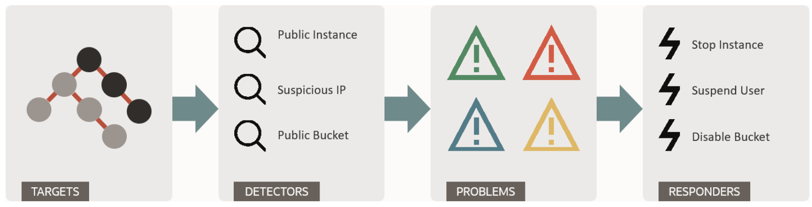

#### TARGET
Cloud Guard에서 모니터링 할 범위를 TARGET이라고 부른다. Oracle Cloud에서는 Compartment라고 부르는 여러 OCI의 리소스에 대한 그룹핑 및 접근관리등을 할 수있는 논리적인 개념의 구역이 존재하는데, 보통 Cloud Guard에서의 TARGET으로 특정 Compartment를 지정하게 된다.

#### DETECTORS
Detector는 TARGET의 특정 리소스 및 활동을 감지하기 위한 규칙의 모음(여기서는 이를 Recipe라고 부른다)이라고 보면 된다. Detector로 정의된 규칙에 의해 TARGET에서 발생할 수 있는 잠재적인 보안 문제를 감지하게 된다.

Detector는 OCI에서 기본적으로 제공하는 Recipe인 Oracle-managed detector recipe가 있고, 사용자가 직접 정의할 수 있는 User-managed detector recipe가 있는데, 보통은 Oracle-managed detector recipe를 활용하고, 이를 클론하여 사용자가 원하는 방향으로 수정하여 사용하는 것이 일반적이다.

Detector는 두 가지 유형의 Recipe가 존재하는데, OCI 구성에 대한 보안 문제를 감지하는 Configuration Detector recipe가 있고, 보안 문제를 야기하는 특정 행위를 감지하는 Activity Detector recipe가 있다.

Configuration Detector 예로 "Object Storage 의 Public Bucket 생성 불허용"과 같은 케이스가 있을 수 있다.

Activity Detector의 경우에는 "Database 인스턴스 삭제 불허용"을 예로 들 수 있겠다.

#### PROBLEM
Detector에서 감지된 결과, 즉 보안 문제들을 Problem이라고 한다. Problem 목록을 통해서 어떤 Problem들이 발생했는지 확인을 할 수 있으며, Problem 유형에 따라 관리자가 자동 혹은 수동으로 특정 액션을 수행할 수 있다.

#### RESPONDER
마지막으로 Responder는 Problem에 따라서 자동 혹은 수동으로 수행하는 규칙들의 모음(Recipe)을 의미한다. Detector와 마찬가지로 Oracle-managed와 User-managed recipe를 제공한다.

### Cloud Guard 활성화
기본은 비활성화 되어 있다. Cloud Guard를 활성화 하기 위해서는 OCI Console > Identity & Security > Cloud Guard 로 이동한 후 Enable 버튼을 클릭하여 활성화 하여야 한다. (기본으로 제공하는 무료 크래딧 300$이 있으면 체험해볼 수 있다. 단 Always Free에서는 사용할 수 없으며, 300$ 소진 후에는 유료 계정으로 업그레이드 해야 한다.)

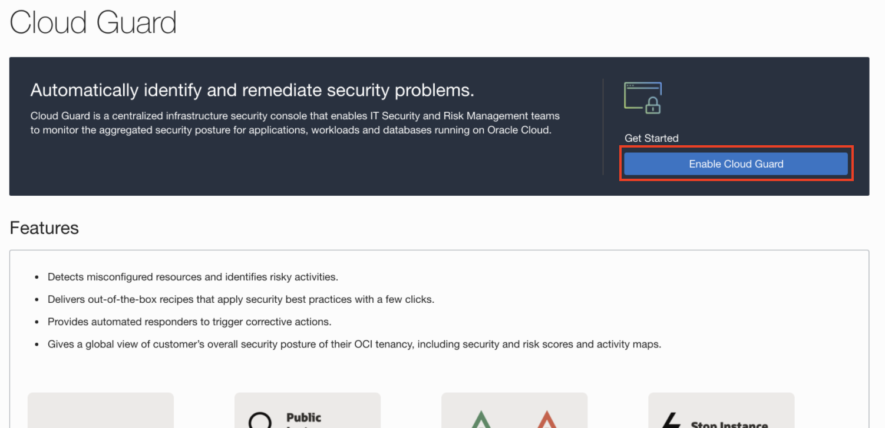

Cloud Guard에서 여러 OCI 리소스에 접근을 허락해줘야 하기 때문에 기본적으로 필요한 Policy를 추가해 줘야 하는데, 활성화 과정에서 친절하게 한번에 추가할 수 있는 기능을 제공해준다.
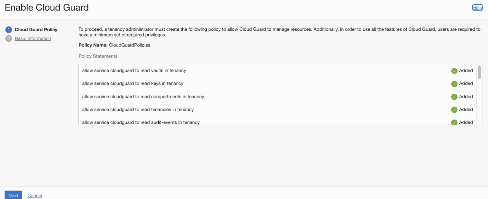

Cloud Guard에서 모니터링 할 TARGET을 지정한다. Detector recipe의 경우에는 이 단계에서 선택해줘도 되지만, 활성화 한 이후에 따로 지정해줘도 상관없다.
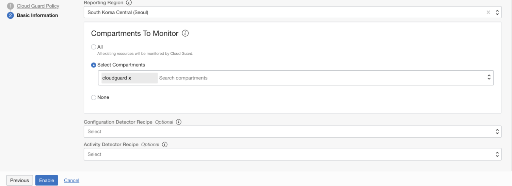

활성화 되면 다음과 같은 Cloud Guard 대시보드를 볼 수 있다.
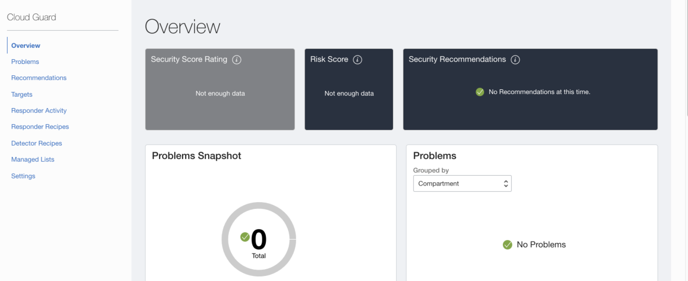

### User-managed detector, resopnder recipe
기본은 아래와 같이 Oracle-managed recipe를 사용하지만, 수정이 불가능하기 때문에, Clone 버튼을 활용하여 해당 Recipe를 클론한 후에 사용한다. 클론한 Recipe의 경우 사용자가 해당 규칙을 수정할 수 있게 된다.
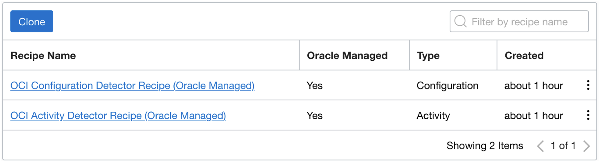

아래 그림은 Configuration detect recipe 목록으로, 현재 37개의 Rule을 제공하고 있다. 클론한 경우 Status(Disble, Enable), Risk Level (Minor, Low, Medium, High, Critical), Condition (발생 조건)등을 수정할 수 있다.
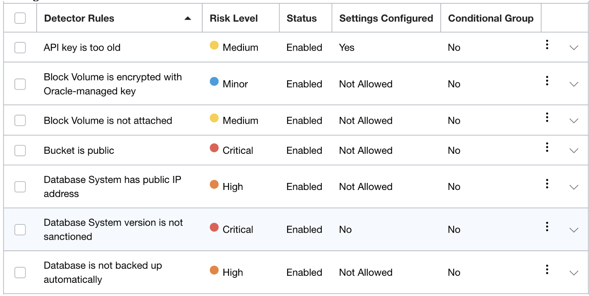

Responder recipe rule의 경우 아래와 같이 제공되는데, 클론을 하게 되면 사용자가 내용을 수정할 수 있다.
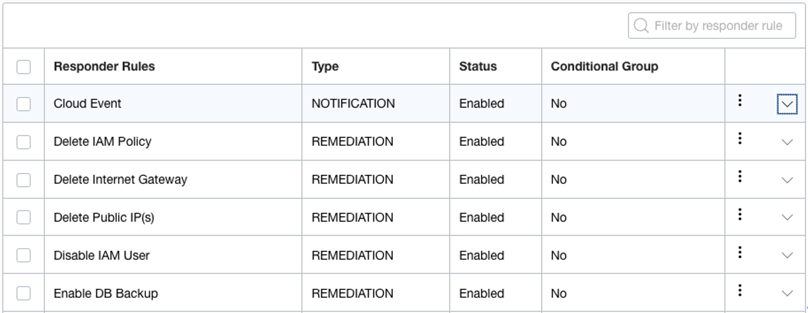

Responder Rule의 경우 Type이 NOTIFICATION과 REMEDIATION이 있는데, NOTIFICATION은 발생한 Problem을 OCI Notification 서비스등을 활용하여 알림을 발생시키는 유형이며, REMEDIATION은 Problem을 자동 혹은 관리자에 의해 수정을 보정할 수 있도록 해주는 유형으로, Responder Rules에 있는 내용에 따라서 관련 유형의 Respoder가 동작하게 된다.

NOTIFICATION 유형은 현재 Cloud Event Rule만 대상이며, 사용을 위해서는 OCI Event와 Notification 서비스를 구성하여 사용할 수 있다. 관련 가이드는 아래 링크에서 확인할 수 있다.

> https://docs.oracle.com/en-us/iaas/cloud-guard/using/export-notifs-config.htm

각 Responder Rule에는 Rule Trigger를 설정할 수 있는데, "Ask me before executing rule"의 경우 관리자가 Problem에서 내용을 확인 한 후 액션을 취할 수 있으며, "Execute automatically" 관리자 개입 없이 시스템이 자동으로 보정처리 하게 된다. 예를 들면 Private Bucket만 허용하는데, Public Bucket으로 생성하게 되면 자동으로 Private Bucket으로 변경이 된다.
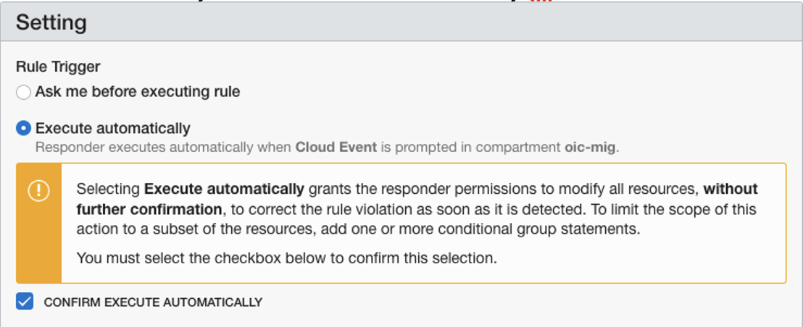

### 예시 - Cloud Guard 대상 (TARGET)에서 Public Bucket 생성
간단히 Cloud Guard가 적요된 대상에서 Public Bucket을 하나 생성해 보도록 하겠다. 아래와 같이 Object Storage에서 Bucket 생성 후 Visibility를 Public으로 변경한다.
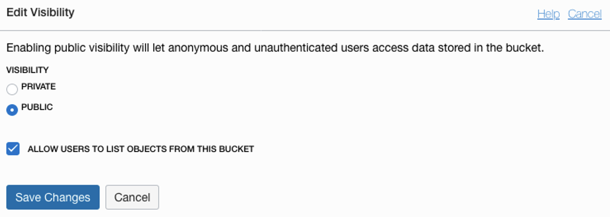

Cloud Guard 대시보드에서 Critical을 포함하여 Problem이 4개 생성된 것을 확인할 수 있다. Responder Status에도 1개의 Pending이 걸려 있는데, 앞서 관련된 Responder Rule의 Rule Trigger를 "Ask me before executing rule"로 설정해 놨기 때문에 관리자 액션이 있어야 하므로, Pending이 된 것이다.
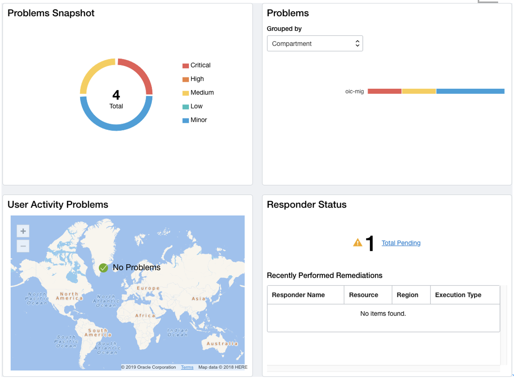

Responder Activity 메뉴에서 Private 으로 변경에 대한 확인 요청이 생성 된 것을 볼 수 있다.
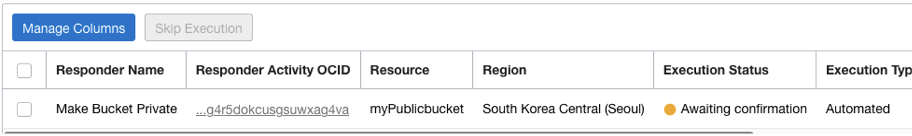

Skip Execute 를 선택 하면 해당 Remediation 은 취소 되는데,Execute 를 클릭 해본다.
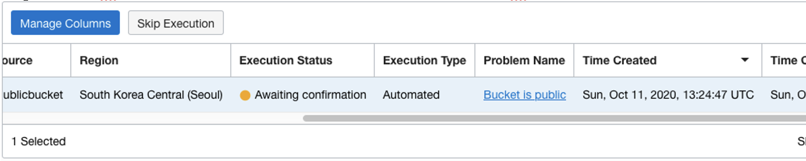

Bucket의 Visibility가 다시 Private으로 변경된 것을 확인할 수 있다.
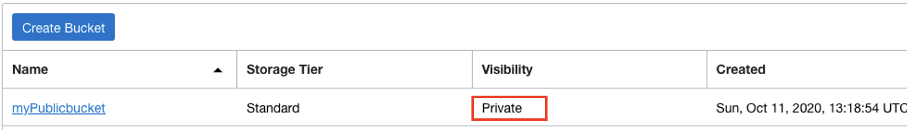

### 참고
* https://docs.oracle.com/en-us/iaas/cloud-guard/using/index.htm